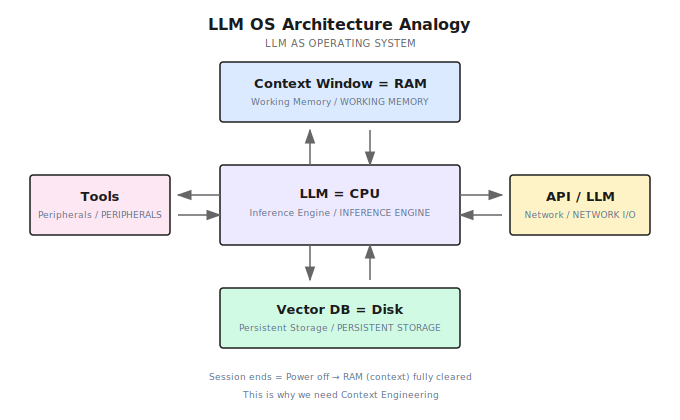
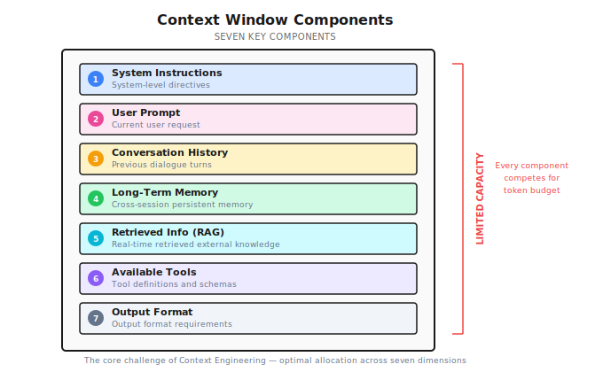
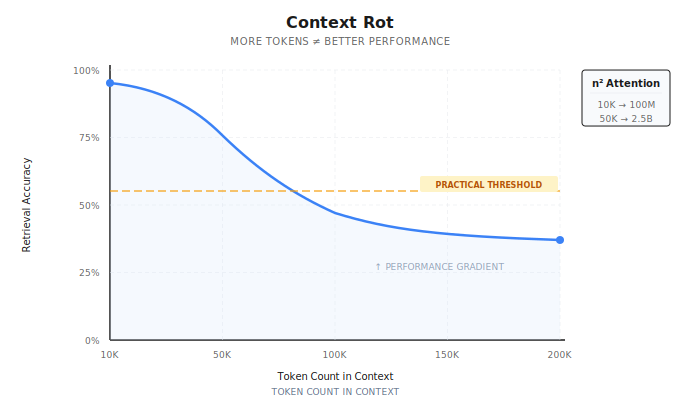
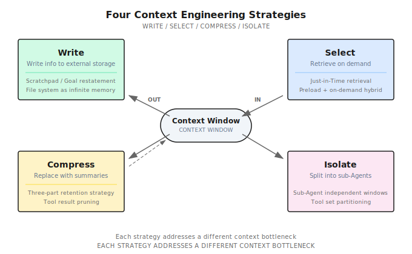
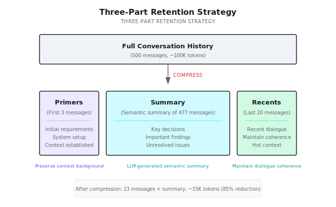
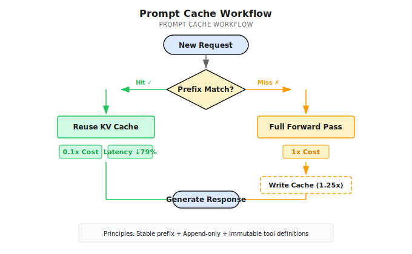

# Chapter 7: Context Engineering

> **The context window is the LLM's RAM — it determines what the Agent can "remember" at any given moment.**
> **Context engineering is the art and science of deciding what goes into that limited memory.**

---

You ask an Agent to help debug a production issue.

After 50 rounds of conversation, it finally tracks down the problem: the database connection pool configuration is wrong.

Then you ask: "What was that connection pool config you mentioned earlier?"

It replies: "Sorry, I don't remember."

**You're stunned.**

50 rounds of conversation, tens of thousands of tokens burned, and it forgot the critical piece of information?

It wasn't slacking off. It simply "forgot" — because that part of the conversation got pushed out of the context window. This isn't an intelligence problem. It's a **memory management problem**.

To understand why this is the most fundamental challenge in Agent systems, we need to zoom out.

---

## 7.1 LLM OS: Why Context Is Everything

In 2025, Andrej Karpathy proposed a remarkably insightful analogy: **the LLM is like an operating system**.

Not a metaphor — a structural parallel.



Compare it with a traditional computer:

| Traditional Computer | LLM OS | Description |
|---------------------|--------|-------------|
| CPU | LLM Model | Core reasoning engine, performs "computation" |
| RAM | Context Window | Limited, volatile working memory |
| Hard Disk | Vector Database / File System | Persistent storage, retained across sessions |
| Peripherals | Tools | Interfaces for interacting with the outside world |
| Network I/O | APIs / Other LLMs | Communication with external services and other models |

What's the core insight of this analogy?

**The context window is RAM.**

It has three key properties: it's limited — no matter how large the window a model claims to support, there's always an upper bound; it's volatile — ending a conversation is like pulling the power plug, everything in RAM gets wiped; and it's expensive — every additional token costs more compute and money.

Just as an operating system must manage RAM allocation and page swapping, an Agent system must manage what goes into the context window, what stays out, when to swap things out, and when to bring them back.

This is **context engineering** — the most critical engineering problem in Agent systems.

---

## 7.2 From Prompt Engineering to Context Engineering

You've probably heard of Prompt Engineering — spending time polishing the wording of prompts to get better responses from LLMs.

But in 2025, the industry's understanding underwent a key upgrade.

Shopify CEO Tobi Lutke said: "Context engineering is a more accurate description of this core skill than prompt engineering." Andrej Karpathy took it further: "In every industrial-grade LLM application, Context Engineering is the delicate art and science of filling the context window with just the right information to get the best next action." Anthropic called Context Engineering the "natural evolution" of Prompt Engineering.

One-line definition: **Context Engineering is the discipline of designing and building dynamic systems that provide the right information and the right tools to the LLM at the right time.**

How does it differ from Prompt Engineering?

| Dimension | Prompt Engineering | Context Engineering |
|-----------|-------------------|---------------------|
| Scope | Single interaction, optimizing wording | System-level, managing the entire information environment |
| Focus | "How to say it" — phrasing techniques | "What to provide" — information selection and orchestration |
| Use Case | Casual conversations, simple tasks | Production-grade Agent systems |
| Components | Prompt text only | System Prompt + RAG + Memory + Tools + State |
| Failure Mode | Poor wording causes misunderstanding | Context pollution, overload, or missing critical information |

In short: Prompt Engineering is about "how to talk to the model." Context Engineering is about "what the model gets to see."

So what's actually inside the context window?



DeepMind's Philipp Schmid summarized the seven components of context:

1. **System Instructions** — Define role and behavioral boundaries
2. **User Prompt** — The user's current request
3. **Conversation History** — Past exchanges
4. **Long-Term Memory** — Persistent memory across sessions
5. **Retrieved Information (RAG)** — External knowledge retrieved in real time
6. **Available Tools** — Tool definitions and schemas
7. **Output Format** — Output format requirements

Every one of these competes for space in the context window — that limited "RAM." The core challenge of context engineering is making optimal allocations across these seven dimensions.

Remember this: **"Agent failures are fundamentally context failures, not model failures."**

---

## 7.3 The Physical Limits of Context

The context window isn't infinite. Understanding its physical constraints is a prerequisite for good context engineering.

### Tokens: The LLM's Unit of Measurement

A Token is the smallest unit an LLM uses to process text — not a character, not a word, but a "fragment" the model's internal tokenizer produces. Different languages have different token efficiencies:

| Language | Average Efficiency | Notes |
|----------|-------------------|-------|
| English | ~4 characters/token | Split by word roots and common words |
| Chinese | ~1.5 characters/token | Each character is roughly 1-2 tokens |
| Code | ~3 characters/token | Symbols and keywords split independently |

This means the same semantic content consumes more tokens in Chinese.

> Note (2026-01): Token counting depends on the specific tokenizer. The conversions below are approximate. In practice, use the corresponding SDK's token counting API.

Precisely counting tokens requires calling a tokenizer, which is too slow for real-time use. Shannon uses an estimation method that's proven accurate enough in practice:

```go
// Simplified token estimation
func EstimateTokens(messages []Message) int {
    total := 0
    for _, msg := range messages {
        // Roughly 1 token per 4 characters
        total += len([]rune(msg.Content)) / 4
        // Each message has formatting overhead (role, content structure)
        total += 5
    }
    // Add 10% safety margin
    return int(float64(total) * 1.1)
}
```

| Component | Estimation Method | Notes |
|-----------|------------------|-------|
| Plain text | characters / 4 | Standard GPT estimation |
| Message format | +5 per message | role/content structure overhead |
| Code | characters / 3 | Higher token density in code |
| Safety margin | +10% | Prevent underestimation |

This estimation has an error margin of 10-15%, which is good enough for budget control.

### Context Rot: Why Bigger Windows Aren't a Silver Bullet

You might think: if window size is the problem, just use a bigger window, right?

Not so fast. Research from Chroma revealed a critical phenomenon — **Context Rot**: as the number of tokens in the context increases, the model's ability to accurately recall and utilize information degrades.



The root cause lies in the Transformer architecture itself. Self-Attention computation scales quadratically with token count: 10K tokens require roughly 100 million attention calculations; 50K tokens means about 2.5 billion. This computational explosion doesn't create a "hard cliff" but rather a **performance gradient** — information retrieval accuracy gradually declines as context length grows.

The key takeaway: **Context is a finite resource with diminishing marginal returns. Stuffing more information in doesn't necessarily make the model perform better.**

> Note (2026-01): Model context windows and pricing change frequently. The following are illustrative. Please check official documentation for the latest information.

| Model | Context Window | Approximate Word Count |
|-------|---------------|----------------------|
| GPT-4o | 128K tokens | ~500K words |
| Claude Sonnet 4 | 200K tokens | ~800K words |
| Gemini 2.5 Pro | 1M tokens | ~4M words |
| Common open-source models | 8K - 128K | ~30K-500K words |

The windows look huge, but real-world consumption is far greater than you'd expect. Context management must solve four core problems:

| Problem | Consequence | Strategy |
|---------|-------------|----------|
| **Overflow** | Request fails outright | Compress / Isolate |
| **Cost** | Longer history means higher costs | Compress + Prompt Cache |
| **Information Loss** | Critical context gets compressed away | Write + Select |
| **Noise Interference** | Irrelevant information degrades output quality | Select + Isolate |

These four problems are mutually contradictory. **There's no perfect solution, only trade-offs.**

The four-strategy framework in the next section is your tool for making these trade-offs systematically.

---

## 7.4 Four Strategies of Context Engineering: Write / Select / Compress / Isolate

In 2025, LangChain proposed an elegant framework that distills all context engineering operations into four strategies.



### 7.4.1 Write — Persist Information Outside the Context

Context window too small? Then don't cram everything into it.

The core of the Write strategy: **have the Agent proactively write information to external storage**, and read it back when needed.

The most common practice is the **Scratchpad pattern**. While executing complex tasks, the Agent maintains a `todo.md` or `NOTES.md` file, writing down task objectives, completed steps, and unresolved issues. This has two benefits:

First, **it avoids the "Lost-in-the-Middle" problem**. Research shows that LLMs pay the least attention to information in the middle of the context. By writing key information to a file and reading it back to the end of the context when needed, it lands right in the region where the model's attention is strongest.

Second, **the file system is unlimited memory**. The context window is limited "RAM," but the file system is unlimited "hard disk." When an Agent learns to write and read files on demand, it's essentially using disk to extend RAM.

Many AI coding assistants already practice this strategy. They maintain to-do lists to track task progress and use project-level configuration files to persist critical context — all Write strategy in action: persisting information outside the context to free up window space for content that actually needs reasoning.

Another key practice is **goal reiteration**: having the Agent restate the current global objective and plan at the end of the context. This isn't wasting tokens — it's manipulating the model's attention mechanism to ensure it always "remembers" what it's doing.

### 7.4.2 Select — Retrieve Relevant Information

Write pushes information out; Select is responsible for pulling the right information back at the right moment.

The core principle is **Just-in-Time context** — instead of preloading all information into the context, fetch it only when needed.

In practice, the most effective approach is a **hybrid strategy**: preload critical information by putting the most essential, always-needed information in the System Prompt; retrieve detailed content on demand, pulling in specific code, documentation, and data through tools (glob, grep, RAG) only when needed.

Modern AI coding assistants perfectly embody this hybrid strategy: project configuration files provide preloaded context (like coding standards and architectural decisions), while file search and code retrieval tools provide just-in-time retrieval capability. The Agent doesn't need to "read all the code" — it just needs to know "where to look."

Behind this is a design philosophy called **Progressive Disclosure**: the Agent discovers context through exploration, assembling understanding layer by layer. File sizes hint at complexity, names hint at purpose, timestamps hint at relevance — the Agent works like a detective, starting from clues and gradually piecing together the full picture.

System Prompt design needs to hit the **Goldilocks Zone**. Too specific means fragile — the slightest change in scenario breaks it. Too vague means insufficient signal — the model doesn't know what to do. The optimal System Prompt is specific enough to guide behavior, yet flexible enough to adapt to change.

### 7.4.3 Compress — Shrink the Context

When conversations grow long and the context window fills up, it's time to compress.

The core operation is called **Compaction**: use the LLM to compress lengthy conversation history into a concise summary, then replace the original content with the summary, effectively reinitializing the context window.

Shannon implements a battle-tested **three-part retention strategy**:



- **Primers (first 3 messages)**: Preserve the beginning of the conversation. The user's initial requirements and system setup are established here. Lose them, and the Agent might give completely irrelevant advice.
- **Summary (middle section)**: Use the LLM to compress hundreds of middle messages into a semantic summary. Retain key decisions, important discoveries, and unresolved issues.
- **Recents (last 20 messages)**: Preserve the most recent conversation to maintain coherence. When the user says "that approach from earlier," the Agent can find it in Recents.

Shannon calls the llm-service's `/context/compress` endpoint to generate summaries:

```python
# Compression implementation on llm-service side (conceptual example)
async def compress_context(messages: list, target_tokens: int = 400):
    prompt = f"""Compress this conversation into a factual summary.

Focus on:
- Key decisions made
- Important discoveries
- Unresolved questions
- Named entities and their relationships

Keep the summary under {target_tokens} tokens.
Use the SAME LANGUAGE as the conversation.

Conversation:
{format_messages(messages)}
"""

    result = await providers.generate_completion(
        messages=[{"role": "user", "content": prompt}],
        tier=ModelTier.SMALL,  # Use small model to save money
        max_tokens=target_tokens,
        temperature=0.2,  # Low temperature for accuracy
    )
    return result["output_text"]
```

A summary looks like this:

```
Previous context summary:
The user is debugging a Kubernetes network issue. Key findings:
- Pods cannot access external services
- CoreDNS configuration is normal
- NetworkPolicy has restrictions
To be resolved: Confirm specific NetworkPolicy rule configuration
```

When does compression trigger? Not every time — that would waste too many compute resources. Shannon's strategy: trigger when budget usage hits roughly 75%, with a target of compressing down to roughly 37.5%. For example, with a 50K token budget, compression starts at 37.5K and aims for around 18.75K. The 75% threshold leaves 25% headroom for the current round's input/output; the 37.5% target compresses to under half, leaving room for subsequent conversation.

Real-world compression results:

| Scenario | Original Tokens | After Compression | Compression Rate | Notes |
|----------|----------------|-------------------|-----------------|-------|
| 50 messages | ~10k | No compression | 0% | Threshold not triggered |
| 100 messages | ~25k | ~12k | 52% | Light compression |
| 500 messages | ~125k | ~15k | 88% | Heavy compression |
| 1000 messages | ~250k | ~15k | 94% | Maximum compression |

Summary generation is the slowest operation during compression (200-500ms), but it only runs when compression triggers, not on every request.

**Compression is lossy** — there's no getting around it. So what do you keep, and what do you drop?

Prioritize keeping: architectural decisions and key conclusions, unresolved bugs and pending items, core implementation details and file paths. Safe to drop: redundant tool outputs (large JSON return values), repetitive trial-and-error messages, confirmatory pleasantries.

**Tool result clearing** is the safest form of compression — a 5,000-token API response that the Agent has already extracted useful information from can be cleared without worry.

An important principle: **recoverable compression**. During compression, preserve URLs and file paths; don't make irreversible discards. That way, even if the summary loses some details, the Agent can re-read the original source.

And there's a counterintuitive practice: **preserve error context**. Don't clear the Agent's failed attempts — these errors are valuable learning signals. When the model sees previous failure paths, it implicitly updates its internal beliefs and avoids repeating the same mistakes. Erasing failure records is erasing experience.

### 7.4.4 Isolate — Separate Contexts

When a task is too complex for a single context window, **split it up**.

The core of the Isolate strategy is the **Sub-Agent Architecture**: decompose the task among specialized sub-Agents, each working in its own clean context window, returning only distilled results to the main Agent.

This yields enormous information compression ratios. A sub-Agent might explore tens of thousands of tokens' worth of information in its window — reading code, searching docs, trying approaches — but ultimately returns only 1,000-2,000 tokens of distilled findings to the main Agent.

Three effective isolation scenarios:

1. **Context isolation**: Sub-tasks generate large volumes of intermediate data (e.g., search results, debug logs), but the main task only needs the final conclusion.
2. **Parallelization**: Multiple sub-Agents explore different directions simultaneously, each working in independent windows without interference.
3. **Specialization**: When tool definitions exceed 20, with each definition consuming 200+ tokens, tools alone eat up 4,000+ tokens of context. Splitting into sub-Agents with at most 5 tools each lets them each specialize.

Token budgets also need layered management in isolated architectures. Shannon implements a **Session → Task → Agent** three-tier budget:

```go
func (bm *BudgetManager) CheckBudget(sessionID string, estimatedTokens int) *BudgetCheckResult {
    budget := bm.sessionBudgets[sessionID]
    result := &BudgetCheckResult{CanProceed: true}

    // Check for overflow
    if budget.TaskTokensUsed + estimatedTokens > budget.TaskBudget {
        if budget.HardLimit {
            result.CanProceed = false
            result.Reason = "Task budget exceeded"
        } else {
            result.RequireApproval = budget.RequireApproval
            result.Warnings = append(result.Warnings, "Will exceed budget")
        }
    }

    // Check warning threshold (e.g., warn at 80%)
    usagePercent := float64(budget.TaskTokensUsed) / float64(budget.TaskBudget)
    if usagePercent > budget.WarningThreshold {
        bm.emitWarningEvent(sessionID, usagePercent)
    }

    return result
}
```

Three budget enforcement modes — which one to pick depends on your scenario:

| Mode | Behavior | Use Case |
|------|----------|----------|
| **Hard Limit** | Reject when over budget | Cost-sensitive, external APIs |
| **Soft Limit** | Warn when over budget, continue execution | Task priority, internal tools |
| **Approval Mode** | Pause when over budget, wait for human confirmation | Critical tasks requiring human oversight |

When budget pressure increases, Shannon also implements a **backpressure mechanism** — instead of a sudden stop, it applies gradual throttling:

```go
func calculateBackpressureDelay(usagePercent float64) time.Duration {
    switch {
    case usagePercent >= 0.95:
        return 1500 * time.Millisecond  // Heavy throttling
    case usagePercent >= 0.9:
        return 750 * time.Millisecond
    case usagePercent >= 0.85:
        return 300 * time.Millisecond
    case usagePercent >= 0.8:
        return 50 * time.Millisecond    // Light throttling
    default:
        return 0                         // Normal execution
    }
}
```

Benefits of backpressure: slower responses signal to the user that "budget is being consumed"; it achieves smooth degradation instead of a sudden cutoff; and when usage drops, it automatically recovers to normal.

The Isolate strategy is closely related to Multi-Agent architectures covered later — Chapters 16-19 dive deep into this.

---

## 7.5 Prompt Cache: Making Context Engineering Affordable

Context engineering has a practical problem: **it's expensive**.

The input-to-output token ratio in Agent systems can be as high as 100:1 — for every token of response generated, the model may need to process 100 tokens of context. This means input costs far exceed output costs.

**Prompt Cache** is the key infrastructure for solving this problem.

### What Is Prompt Cache?

Every time an LLM processes input, it performs a forward pass over the token sequence, generating intermediate computation results — KV Cache (Key-Value cache matrices). The idea behind Prompt Cache is simple: **cache these intermediate results so that when the same prefix appears next time, it can be reused, skipping redundant computation.**



The key mechanism is **prefix matching**: as long as the request prefix matches what's in the cache, subsequent computation can continue from the cache instead of starting from scratch.

### Claude's Implementation and Pricing

Taking Claude as an example:

| Token Type | Relative Cost | Notes |
|-----------|--------------|-------|
| Standard input | 1x | Full computation every time |
| Cache write (5-minute TTL) | 1.25x | Slightly more expensive on first write |
| Cache read | 0.1x | **90% savings** |

According to Anthropic's official data: for a cached conversation of 100K tokens, costs drop by 90% and latency drops by 79%; in multi-turn conversation scenarios, costs drop by 53% and latency drops by 75%.

For Agent systems, this optimization is massive — because every round of an Agent sends the complete context history.

### Cache Optimization Principles for Agent Systems

To make Prompt Cache actually work, your context needs to meet a few conditions.

**Keep the prompt prefix stable.** Put the System Prompt at the very front, and don't change its content frequently. Don't put second-level timestamps or random IDs at the beginning — this makes every request's prefix different, driving cache hit rates to zero.

**Append-only context.** Append new messages to the end; don't modify or reorder historical messages. This ensures serialization determinism — the prefix stays consistent.

**Keep tool definitions stable.** Don't dynamically add or remove tool definitions at runtime. Tool definitions typically follow right after the System Prompt; if they change, all subsequent KV Cache entries are invalidated. When you need to control tool availability, use logit masking (suppress output probabilities for certain tools during decoding) instead of removing tool definitions — this way the cache isn't affected.

**Mind the TTL.** For high-frequency request scenarios, keep request intervals within the Cache TTL (5 minutes for Claude) to ensure the cache doesn't expire.

---

## 7.6 Common Pitfalls and Anti-patterns

When practicing context engineering, there are five common traps worth watching out for.

**1. Focusing only on prompt wording while ignoring the entire context system**

You spend a week fine-tuning your prompt wording, but the context is packed with irrelevant tool outputs and stale conversation history. A prompt with "perfect wording but wrong information" is worthless. Context engineering is about the information environment, not just those few lines of instructions.

**2. Over-aggressive compression with irreversible discards**

You throw away all intermediate steps and keep only the final conclusion. The problem: when the Agent needs to revisit a decision, there's no context left to work with. Always preserve recovery paths — URLs, file paths, key intermediate steps.

**3. Tool definition bloat**

20+ tools make the Agent hesitant — not because the model is dumb, but because too many options in the context create decision noise. Curate a minimal viable tool set. If you need many tools, use the Isolate strategy to split them across specialized sub-Agents.

**4. Ignoring Prompt Cache**

Computing the entire context from scratch on every request — in long conversation scenarios, over 90% of the computation is redundant. Ensure append-only + stable prefix, and let the cache save you money.

**5. Clearing error context**

Your intuition says: the Agent went down a wrong path, so you should delete the failed attempts and give it a "fresh start." But this is an anti-pattern — preserve failed attempts as learning signals. When the model sees previous failure paths, it avoids repeating the same mistakes.

---

## 7.7 Key Takeaways

1. **LLM OS analogy**: Context Window = RAM — managing it is the core engineering problem of Agent systems
2. **Context Engineering > Prompt Engineering**: Focus on the entire information system, not just wording
3. **Context Rot**: The longer the context, the lower the information utilization efficiency — bigger windows aren't a silver bullet
4. **Four-strategy framework**: Write (persist externally) / Select (retrieve back) / Compress (shrink) / Isolate (separate)
5. **Prompt Cache is the cost lifesaver in production**: Can save 90% of input costs

The core principle in one sentence:

> **"Find the smallest set of high-signal tokens that maximizes the probability of the desired outcome."**

Context engineering solves the "working memory" problem — information management within a single conversation. But how does an Agent gain "long-term memory" across sessions? Next chapter, we'll talk about **Memory Architecture** — how to make the Agent remember last session's conversation, last week's decisions, and last month's user preferences.

---

## Shannon Lab (10-Minute Quick Start)

### Required Reading (1 file)

- [`docs/context-window-management.md`](https://github.com/Kocoro-lab/Shannon/blob/main/docs/context-window-management.md) — Focus on the Sliding Window Compression and Token Budget Management sections to understand compression trigger conditions and multi-layer budgets

### Optional Deep Dive (2 files)

- [`activities/context_compress.go`](https://github.com/Kocoro-lab/Shannon/blob/main/go/orchestrator/internal/activities/context_compress.go) — Look at the `CompressAndStoreContext` function to understand the complete compression flow
- [`budget/manager.go`](https://github.com/Kocoro-lab/Shannon/blob/main/go/orchestrator/internal/budget/manager.go) — Look at the `CheckBudget` function to understand budget checking and layered control

---

## Further Reading

- [Anthropic: Effective Context Engineering for AI Agents (2025)](https://www.anthropic.com/engineering/context-engineering) — The most comprehensive engineering perspective on context engineering
- [LangChain: Context Engineering for Agents (2025)](https://blog.langchain.dev/context-engineering-for-agents/) — Original source for the Write/Select/Compress/Isolate framework
- [Karpathy: Software Is Changing (Again) — AI Startup School (2025)](https://www.youtube.com/watch?v=LpSo_jvJkCE) — The LLM OS analogy and Software 3.0 vision
- [Chroma: Context Rot Research](https://research.trychroma.com/) — Empirical research on context rot
- [Anthropic Prompt Caching Docs](https://docs.anthropic.com/en/docs/build-with-claude/prompt-caching) — Cache mechanics, pricing, and best practices
- [Philipp Schmid: The New Skill in AI is Context Engineering](https://www.philschmid.de/context-engineering) — The seven components of context
- [OpenAI Tokenizer](https://platform.openai.com/tokenizer) — Experience token segmentation online
