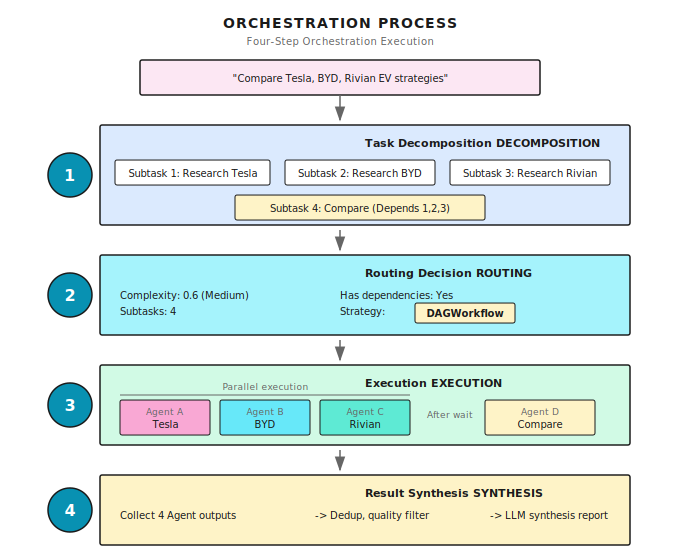

# Chapter 13: Orchestration Fundamentals

> **Multi-Agent orchestration isn't about having a bunch of Agents each doing their own thing -- it's about making them collaborate like a symphony orchestra -- with a conductor, division of labor, and coordination. But no matter how talented the conductor is, if the musicians can't play, it's all for nothing.**

---

> **Quick Track** (Master the core in 5 minutes)
>
> 1. Single Agent has hard limitations, but Multi-Agent isn't a silver bullet -- typically consumes 3-10x tokens
> 2. Three effective scenarios: context isolation, parallelization, specialization
> 3. Four elements of orchestration: Decompose -> Dispatch -> Coordinate -> Synthesize
> 4. Split Agents by context boundaries, not by roles
> 5. Model tiering for routing: small models for simple tasks, large models for complex reasoning
>
> **10-minute path**: 13.1-13.3 -> 13.6 -> Shannon Lab

---

## 13.1 Why Isn't a Single Agent Enough?

This chapter addresses one core question: **When a single Agent can't efficiently complete a task, how do you get multiple Agents to collaborate?**

Imagine you're managing a small research project -- you need to analyze the EV strategies of three competitors (Tesla, BYD, Rivian). If you're working alone, what would you do?

You'd process them serially: research Tesla today, BYD tomorrow, Rivian the day after. Three days later, you finally have all the information collected and can start writing the comparative analysis.

But what if you had three assistants? You'd have them work simultaneously: Alice researches Tesla, Bob researches BYD, Carol researches Rivian. One day later, all three reports arrive at once, and you just need to synthesize and compare.

3x efficiency gain.

**A single Agent is like working solo -- it can complete tasks, but it's inefficient and shallow. Multi-Agent orchestration is about building a team with division of labor and collaboration.**

But building a team isn't as simple as "hiring more people." You need to: assign tasks, coordinate progress, integrate results, and handle conflicts. The Orchestrator is what does this.

### Three Hard Limitations of a Single Agent

Let me cut to the chase: a single Agent has three hard limitations.

### Limitation One: Serial Execution, Too Inefficient

Searching three companies is completely independent -- there are no dependencies. But a single Agent can only do them one after another. What if we parallelize? The difference is obvious:


Saved 40 seconds. The more tasks, the bigger the gap.

### Limitation Two: Generalist Doing Specialist Work, Lacks Depth

"Design a business plan for an AI startup" -- what does this task require?

- Market analysis: industry size, growth trends, competitive landscape
- Technical architecture: technology selection, cost estimation, feasibility assessment
- Financial projections: revenue model, cost structure, profit/loss analysis
- Marketing strategy: target users, customer acquisition channels, brand positioning

Have one "generalist" Agent handle all four at once? It might know a bit about each, but not enough depth in any.

A better approach: 4 specialist Agents, each focused on their area.

### Limitation Three: Single Point of Failure, No Redundancy

When an Agent goes down -- network timeout, LLM error, tool call failure -- the entire task fails.

Multi-Agent systems can implement fault tolerance: if one fails, the others continue; critical tasks can have backups.

### Multi-Agent vs Single Agent

| Capability | Single Agent | Multi-Agent |
|------------|--------------|-------------|
| **Parallel capability** | Serial execution | Concurrent execution |
| **Professional depth** | Generalist, knows a bit of everything | Specialist division, each with strengths |
| **Fault tolerance** | Single point of failure | Redundant fault tolerance |
| **Cost control** | Unified model | Select model per task (cheaper models for simple tasks) |

> **Note**: Multi-Agent isn't a silver bullet. Multi-Agent systems typically consume **3-10x more tokens** than a single Agent -- copying context across Agents, coordination messages, and result aggregation all burn tokens.
>
> Research has shown that some teams spend months building elaborate Multi-Agent systems, only to find that optimizing a single Agent's prompt achieves the same results. The problem isn't Multi-Agent itself, but **misdiagnosis** -- poor decomposition and coordination overhead exceeding actual work.
>
> **Principle: Multi-Agent is a powerful architectural choice, but it needs to be used in the right scenarios.** The next section covers when to use it.

---

## 13.2 When Should You Use Multi-Agent?

The extra overhead of Multi-Agent is real, but in the right scenarios, the benefits far outweigh the costs.

In practice, Multi-Agent consistently outperforms single Agent in three scenarios:

### Scenario One: Context Isolation

Subtasks generate large amounts of intermediate data, but the main task only needs a small portion.

For example, a customer support Agent needs to look up order history to diagnose a technical issue. With a single Agent, 2000+ tokens of order details all pile into the context -- but diagnosing the technical issue doesn't need any of that. The context gets "polluted," and reasoning quality degrades.

The Multi-Agent solution: let a sub-agent handle the order lookup in an isolated context, filter, and return only a 50-100 token key summary. The main Agent's context stays clean, and reasoning quality doesn't degrade.

```python
# Single Agent: everything piled together
conversation = [
    # 2000+ token order history all stuffed into context
    # Subsequent reasoning drowned by irrelevant information
]

# Multi-Agent: context isolation
class OrderLookupAgent:
    def lookup(self, order_id):
        # Process full order history in isolated context
        # Return only key summary: 50-100 tokens
        return {"status": "shipped", "date": "March 5"}

class SupportAgent:
    def handle(self, user_message):
        summary = OrderLookupAgent().lookup(order_id)
        # Main Agent context stays clean
```

**Signal to look for**: A subtask generates over 1000 tokens of intermediate data, but the main task only needs a small portion.

### Scenario Two: Parallelization

This one is intuitively easy to understand -- multiple independent tasks running simultaneously. But there's a key insight that's often overlooked:

**The core value of parallelization is thoroughness, not speed.**

Parallelization lets you explore a larger information space simultaneously. While total token consumption is higher and total execution time might be longer, the result coverage far exceeds a single Agent.

Typical scenario: Deep Research -- decompose a query -> multiple sub-agents explore different aspects in parallel -> synthesize findings.

### Scenario Three: Specialization

Specialization has three dimensions:

- **Toolset specialization**: When an Agent has 20+ tools, selection accuracy drops significantly. Split 40 tools across 4 specialist Agents (5-10 each), and the selection problem disappears.
- **System prompt specialization**: Different tasks require conflicting behavior patterns. A customer service Agent needs to be "empathetic and soothing" while also "strictly enforcing refund policies" -- the same Agent develops a split personality.
- **Domain specialization**: Deep domain knowledge (legal precedents, medical protocols) drowns out a generalist Agent. Specialist Agents carrying focused domain context perform better.

### Decision Checklist

| Signal | Recommendation |
|--------|---------------|
| Subtasks generate lots of irrelevant context | Multi-Agent (context isolation) |
| Tasks decomposable into independent parts for parallel exploration | Multi-Agent (parallelization) |
| 20+ tools, or conflicting behavior patterns needed | Multi-Agent (specialization) |
| Simple task, optimizing prompt can solve it | Single Agent first |
| Subtasks are highly coupled, requiring frequent sync | Splitting actually makes it slower |

---

## 13.3 The Orchestrator: Conductor of Multi-Agent Systems

Multi-Agent systems need a "conductor" -- the Orchestrator.

It doesn't do the actual work, but it decides:
- How to decompose tasks
- Who does what
- Execution order
- How to integrate results

### Four Core Responsibilities


**Analogy**: The orchestrator is like a restaurant's head chef.

A customer says "I want a steak dinner." The head chef won't do everything alone -- they will:
1. **Decompose**: steak, sides, sauce, dessert
2. **Dispatch**: steak to the grill station, sides to the cold kitchen, sauce to the sauce chef
3. **Coordinate**: sauce goes on after the steak is ready, sides and steak come out together
4. **Synthesize**: plating, ensuring temperature and presentation are right

The head chef doesn't need to know how to make everything, but they need to know: who's good at what, what order makes sense, how to combine it all into one dish.

### Execution Flow



---

## 13.4 Routing Decisions: Which Strategy to Use?

Not all tasks need multi-Agent. The orchestrator's first decision is: **What path should this task take?**

### Shannon's Routing Logic

Shannon's `OrchestratorWorkflow` makes this judgment:

```go
// Determine if it's a simple task
simpleByShape := len(decomp.Subtasks) == 0 ||
                 (len(decomp.Subtasks) == 1 && !needsTools)
isSimple := decomp.ComplexityScore < simpleThreshold && simpleByShape

// Check for dependencies
hasDeps := false
for _, st := range decomp.Subtasks {
    if len(st.Dependencies) > 0 || len(st.Consumes) > 0 {
        hasDeps = true
        break
    }
}

switch {
case isSimple:
    // Simple task → Single Agent direct execution
    return SimpleTaskWorkflow(input)

case forceSwarm || needsDynamicCoordination:
    // Complex collaboration or explicitly specified → Swarm pattern
    return SwarmWorkflow(input)

default:
    // Standard task → DAG workflow
    return DAGWorkflow(input)
}
```

**Implementation reference (Shannon)**: [`go/orchestrator/internal/workflows/orchestrator_router.go`](https://github.com/Kocoro-lab/Shannon/blob/main/go/orchestrator/internal/workflows/orchestrator_router.go) - OrchestratorWorkflow function

### Decision Tree

```
Task enters
    │
    ▼
Complexity < 0.3 AND single subtask AND no tools? ──Yes──► SimpleTaskWorkflow
    │                                                      (Single Agent direct execution)
    No
    │
    ▼
force_swarm OR needs dynamic collaboration? ──Yes──► SwarmWorkflow
    │                                                (Lead Agent drives collaboration)
    No
    │
    ▼
DAGWorkflow (default)
(Standard multi-Agent parallel/serial)
```

### Three Strategy Comparison

| Strategy | Use Case | Characteristics |
|----------|----------|-----------------|
| **SimpleTask** | Simple Q&A, single-step tasks | Lightest weight, single Agent |
| **DAGWorkflow** | 2-5 subtasks, possibly simple dependencies | Parallel/serial/hybrid execution |
| **Swarm** | Complex collaboration, dynamic adjustment, needs human feedback | Lead event loop, Workspace collaboration |

These three strategies will be covered in detail in the following chapters. For now, remember: **The orchestrator automatically selects a strategy based on task complexity**.

---

## 13.5 How to Split Agents?

Routing decides "which path to take," but there's a more fundamental question: **How do you divide work among different Agents?**

This is the make-or-break factor for Multi-Agent systems. Split well and you get multiplied efficiency; split poorly and you're worse off than a single Agent.

### Anti-pattern: Splitting by Roles (The "Telephone Game")

The most intuitive split: one Agent for planning, one for implementation, one for testing, one for review.

```
Planner Agent → Implementer Agent → Tester Agent → Reviewer Agent
      ↓ handoff          ↓ handoff          ↓ handoff
   (loses context)    (loses context)    (loses context)
```

Sounds reasonable, but it's actually a disaster. Each handoff is like "the telephone game" -- a bit of information is lost with each pass. The Tester doesn't know why the Implementer made certain design decisions, and the Reviewer doesn't understand the tradeoffs made during iteration.

The result: **more tokens spent on coordination than on actual work**.

### The Right Approach: Split by Context Boundaries

The Agent handling a feature should also be responsible for testing that feature -- because it already has the implementation context. Only when context can be **truly isolated** is splitting worthwhile.

**Good split boundaries**:

- **Independent research paths**: Researching the Asian market vs. the European market -- mutually independent, completely isolated contexts
- **Components with clear interfaces**: When API contracts are well-defined, frontend and backend can be developed in parallel
- **Black-box verification**: Verifiers only need to run tests and report results -- they don't need to know implementation details

**Problematic split boundaries**:

- **Different phases of the same feature**: Planning, implementation, and testing share too much context -- splitting actually reduces efficiency
- **Tightly coupled components**: Parts that require frequent back-and-forth communication should be in the same Agent
- **Work requiring shared state**: Agents that need to frequently synchronize understanding should be merged

### The Verification Sub-Agent Pattern

One type of split that works across scenarios: **a dedicated Agent solely responsible for verification**.

Why does it work? Because verification naturally requires minimal context -- the verifier doesn't need to know how the system was built, just what criteria it should meet, then run the tests. This perfectly avoids the "telephone game" problem.

```python
# Verification sub-agent only needs: artifact to verify + criteria + test tools
class VerificationAgent:
    def verify(self, artifact, criteria):
        # Black-box verification: no implementation context needed
        results = run_tests(artifact)
        return {"passed": all_pass(results), "issues": extract_issues(results)}
```

> **Watch out for Early Victory**: The most common failure mode of verification Agents is running one or two tests and declaring success. Make it explicit in the prompt: "You must run the complete test suite, and only mark as PASSED when everything passes."

---

## 13.6 Three Execution Modes

Regardless of which strategy is chosen, Agents ultimately need to be executed. There are three execution modes:

### Mode One: Parallel Execution

Use case: Subtasks are mutually independent with no dependencies.


The core is **semaphore control** -- limiting the number of Agents executing simultaneously to prevent resource exhaustion.

```go
type ParallelConfig struct {
    MaxConcurrency int  // Maximum concurrency, default 5
}

func ExecuteParallel(ctx workflow.Context, tasks []ParallelTask, config ParallelConfig) {
    // Semaphore to control concurrency
    semaphore := workflow.NewSemaphore(ctx, int64(config.MaxConcurrency))

    for i, task := range tasks {
        workflow.Go(ctx, func(ctx workflow.Context) {
            // Acquire semaphore (blocks if over concurrency limit)
            semaphore.Acquire(ctx, 1)
            defer semaphore.Release(1)

            // Execute task
            executeTask(task)
        })
    }
}
```

**Implementation reference (Shannon)**: [`go/orchestrator/internal/workflows/patterns/execution/parallel.go`](https://github.com/Kocoro-lab/Shannon/blob/main/go/orchestrator/internal/workflows/patterns/execution/parallel.go) - ExecuteParallel function

Why limit concurrency?

Say you have 10 search tasks, MaxConcurrency = 3:

```
t0: [Task 1] [Task 2] [Task 3]  ← 3 start simultaneously
t1: [1 done] [Task 4 starts]    ← 1 completes, 4 immediately fills in
t2: [2 done] [Task 5 starts]    ← 2 completes, 5 fills in
...
```

Without limits, 10 Agents calling the LLM API simultaneously would likely trigger rate limiting, making it slower instead.

### Mode Two: Sequential Execution

Use case: Tasks have implicit dependencies where the next one needs the previous one's result.


```go
type SequentialConfig struct {
    PassPreviousResults bool  // Whether to pass previous results to the next task
}

func ExecuteSequential(ctx workflow.Context, tasks []Task, config SequentialConfig) {
    var results []Result

    for i, task := range tasks {
        // Inject previous results into context
        if config.PassPreviousResults && len(results) > 0 {
            task.Context["previous_results"] = results
        }

        result := executeTask(task)
        results = append(results, result)
    }
}
```

The key is **result passing**. For example:

```
Task 1: "Get Tesla stock price"
        → Response: "$250"
        ↓
Task 2: "Calculate year-over-year growth"
        Context: {
          previous_results: [
            { response: "$250", numeric_value: 250 }
          ]
        }
        → Can directly use 250 for calculation
```

### Mode Three: Hybrid Execution (Hybrid/DAG)

Use case: Some tasks can run in parallel, some have dependencies.


The core is **dependency waiting** -- tasks can only start after all their dependencies are complete.

```go
func waitForDependencies(
    ctx workflow.Context,
    dependencies []string,
    completedTasks map[string]bool,
    timeout time.Duration,
) bool {
    startTime := workflow.Now(ctx)
    deadline := startTime.Add(timeout)

    for workflow.Now(ctx).Before(deadline) {
        // Check if all dependencies are complete
        allDone := true
        for _, depID := range dependencies {
            if !completedTasks[depID] {
                allDone = false
                break
            }
        }
        if allDone {
            return true
        }

        // Wait 30 seconds before checking again
        workflow.AwaitWithTimeout(ctx, 30*time.Second, func() bool {
            // Condition check
            for _, depID := range dependencies {
                if !completedTasks[depID] {
                    return false
                }
            }
            return true
        })
    }

    return false  // Timeout
}
```

**Implementation reference (Shannon)**: [`go/orchestrator/internal/workflows/patterns/execution/hybrid.go`](https://github.com/Kocoro-lab/Shannon/blob/main/go/orchestrator/internal/workflows/patterns/execution/hybrid.go) - waitForDependencies function

---

## 13.7 Result Synthesis

Multiple Agents have finished running -- how do you integrate the results?

### The Problem

Raw Agent output is typically:

1. **Redundant**: Different Agents may provide similar information
2. **Inconsistent format**: Each Agent has its own output style
3. **Variable quality**: Some succeed, some fail, some are half-baked

Users expect: a unified, complete, high-quality answer.

### Three-Step Preprocessing

Before synthesis, do three preprocessing steps:

1. **Exact deduplication**: Hash comparison, remove completely identical results
2. **Similarity deduplication**: Keep only one result when text similarity exceeds a threshold (e.g., Jaccard > 0.85)
3. **Quality filtering**: Remove failed results and invalid responses ("unable to retrieve", "not found", etc.)

### Synthesis Methods

**Simple synthesis**: Direct concatenation. Suitable when results are already well-formatted.

**LLM synthesis**: Suitable when you need a unified perspective, conflict resolution, and insight generation:

```go
func llmSynthesis(query string, results []AgentResult) string {
    prompt := fmt.Sprintf(`Synthesize the following research results to answer the question: %s

Requirements:
1. Eliminate duplicate information
2. Resolve contradictions (if any)
3. Highlight key insights
4. Present in a unified format

`, query)

    for i, r := range results {
        prompt += fmt.Sprintf("=== Source %d ===\n%s\n\n", i+1, r.Response)
    }

    return callLLM(prompt)
}
```

---

## 13.8 Cost Control and Model Tiering

In multi-Agent scenarios, cost control is even more important. A single Agent burns 1000 tokens, multi-Agent might burn 5000.

### Budget Allocation Strategies

**Simple strategy: Equal distribution**

```go
func allocateBudgetSimple(totalBudget int, numAgents int) int {
    return totalBudget / numAgents
}

// Example: Total budget 10000, 5 Agents → 2000 each
```

**Advanced strategy: Allocate by complexity**

```go
func allocateBudgetByComplexity(totalBudget int, subtasks []Subtask) map[string]int {
    budgets := make(map[string]int)

    // Calculate total complexity
    totalComplexity := 0.0
    for _, st := range subtasks {
        totalComplexity += st.Complexity
    }

    // Allocate proportionally
    for _, st := range subtasks {
        budgets[st.ID] = int(float64(totalBudget) * st.Complexity / totalComplexity)
    }

    return budgets
}

// Example: Total budget 10000
//     Task A (complexity 0.5) → 5000
//     Task B (complexity 0.3) → 3000
//     Task C (complexity 0.2) → 2000
```

### Model Tiering: Not Every Task Needs the Most Expensive Model

A more effective cost-saving approach than budget allocation is **Model Tiering** -- using different tiers of models for tasks of different complexity.

| Tier | Suitable Tasks | Characteristics |
|------|---------------|-----------------|
| **Small** | Translation, summarization, classification, data extraction | Pattern matching tasks, no deep reasoning chain needed |
| **Medium** | Analysis, generation, multi-turn conversation | Requires some reasoning capability |
| **Large** | Complex reasoning, architecture decisions, research analysis | Requires multi-step reasoning chains, handling ambiguous requirements |

The key distinction isn't whether a model is "smart" -- it's whether the task requires **deep reasoning chains**. Translation and classification have bounded answer spaces; a small model is sufficient. But "design a distributed system architecture" requires iterative weighing and backtracking -- that's when you need a large model.

Shannon's approach: use a lightweight model to quickly assess task complexity (latency <1s, cost <$0.01), then select the model tier based on the score. Roughly 50% of requests are handled by Small models, reducing overall cost by 60%+ with no quality loss.

```go
// Shannon's tiered routing (simplified)
func selectModelTier(complexityScore float64) string {
    switch {
    case complexityScore < 0.3:
        return "small"   // Translation/summarization/classification
    case complexityScore < 0.5:
        return "medium"  // Analysis/generation
    default:
        return "large"   // Complex reasoning/decisions
    }
}
```

---

## 13.9 Control Signals

During orchestration, users might want to: pause, resume, or cancel.

Shannon uses Temporal's Signal mechanism to implement this: at key checkpoints in the orchestration flow (before routing decision, after task decomposition, before entering DAG), it checks for control signals. Upon receiving a pause signal, it waits for resume; upon receiving a cancel signal, it terminates child workflows.

When the orchestrator launches child workflows, it registers their IDs so that pause/cancel signals can cascade to all running child workflows.

For the specific implementation, refer to Shannon's `ControlSignalHandler`. The core idea is inserting checkpoints at critical points rather than responding to interrupts at any time.

---

## 13.10 Complete Example

Let's tie together everything from above with a complete multi-Agent research task:

```go
func CompanyResearchWorkflow(ctx workflow.Context, query string) (string, error) {
    companies := []string{"Tesla", "BYD", "Rivian"}

    // 1. Build parallel tasks
    tasks := make([]ParallelTask, len(companies))
    for i, company := range companies {
        tasks[i] = ParallelTask{
            ID:          fmt.Sprintf("research-%s", strings.ToLower(company)),
            Description: fmt.Sprintf("Research %s's 2024 EV strategy", company),
            SuggestedTools: []string{"web_search"},
            Role:        "researcher",
        }
    }

    // 2. Execute in parallel
    config := ParallelConfig{
        MaxConcurrency: 3,
        EmitEvents:     true,
    }
    result, err := ExecuteParallel(ctx, tasks, sessionID, history, config, budgetPerAgent, userID, modelTier)
    if err != nil {
        return "", err
    }

    // 3. Preprocess results
    processed := preprocessResults(result.Results)

    // 4. LLM synthesis
    synthesis := llmSynthesis(query, processed)

    return synthesis, nil
}
```

Execution timeline:

```
0s   ┌─ Orchestrator starts
     ├─ Task decomposition: 3 research tasks + 1 synthesis task
     └─ Routing decision: DAGWorkflow

1s   ├─ Launch 3 research Agents in parallel
     │   ├─ Agent A (Tesla):  Searching...
     │   ├─ Agent B (BYD):    Searching...
     │   └─ Agent C (Rivian): Searching...

15s  ├─ Agent B completes
20s  ├─ Agent C completes
25s  ├─ Agent A completes (Tesla has the most info)

26s  ├─ Start result synthesis
     │   ├─ Dedup: Removed 2 duplicate items
     │   ├─ Filter: Removed 1 failed result
     │   └─ LLM synthesis analysis

45s  └─ Output final report

Total time: ~45 seconds (serial would take ~75 seconds)
```

---

## 13.11 Common Pitfalls

### Pitfall 1: Splitting Agents by Roles

The "telephone game" from section 13.5 is the most common pitfall. Many people intuitively split by responsibility (planner, coder, tester, reviewer), only to find that each handoff loses context, and coordination overhead exceeds actual work.

**Remember**: Split by context boundaries, not by roles.

### Pitfall 2: Over-parallelization

```go
// Dangerous: 100 concurrent, API will rate limit
config := ParallelConfig{MaxConcurrency: 100}

// Reasonable: Set based on API limits
config := ParallelConfig{MaxConcurrency: 5}
```

I've seen people set concurrency to 50, only to get a bunch of 429 Too Many Requests from the LLM API. Worse than serial execution.

### Pitfall 3: Ignoring Failed Tasks

```go
// Problem: Only process successes, failures are ignored
for _, r := range results {
    if r.Success {
        process(r)
    }
}

// Improvement: Monitor success rate
successRate := float64(successCount) / float64(total)
if successRate < 0.7 {
    logger.Warn("Low success rate", "rate", successRate)
    // May need retry or alerting
}
```

### Pitfall 4: Result Synthesis Loses Information

Simple concatenation can lead to:
- Duplicate information (two Agents both mention "Tesla market cap is $800 billion")
- Contradictory information (one says 15% growth, another says 12%)
- Lack of insights (just listing, no comparative analysis)

When using LLM synthesis, the prompt should explicitly require eliminating duplicates, flagging contradictions, and generating comparative analysis.

### Pitfall 5: Using the Same Model for All Tasks

Using the same large model for simple translation tasks and complex architecture design? 100x cost difference. Refer to the model tiering strategy in section 13.8.

---

## 13.12 Other Framework Implementations

Orchestration is the core problem of multi-Agent systems, and each framework has its own approach:

| Framework | Orchestration Method | Characteristics |
|-----------|---------------------|-----------------|
| **LangGraph** | Graph definition + node execution | Flexible, requires manual graph definition |
| **AutoGen** | GroupChat + Manager | Conversation-driven, automatic speaker selection |
| **CrewAI** | Crew + Process | Clear role definitions, supports sequential/hierarchical |
| **OpenAI Swarm** | handoff() | Lightweight, direct Agent-to-Agent handoff |

LangGraph example:

```python
from langgraph.graph import StateGraph

# Define state
class ResearchState(TypedDict):
    query: str
    tesla_data: str
    byd_data: str
    synthesis: str

# Define graph
graph = StateGraph(ResearchState)
graph.add_node("research_tesla", research_tesla_node)
graph.add_node("research_byd", research_byd_node)
graph.add_node("synthesize", synthesize_node)

# Define edges (dependencies)
graph.add_edge(START, "research_tesla")
graph.add_edge(START, "research_byd")
graph.add_edge("research_tesla", "synthesize")
graph.add_edge("research_byd", "synthesize")
```

---

## That's This Chapter

The core message is one sentence: **The Orchestrator is the conductor of multi-Agent systems -- decomposing tasks, dispatching execution, coordinating dependencies, synthesizing results**.

## Summary

1. **Ask whether you should first**: Multi-Agent consumes 3-10x tokens, optimize single Agent first
2. **Three effective scenarios**: Context isolation, parallelization, specialization
3. **Orchestrator's four responsibilities**: Decompose -> Dispatch -> Coordinate -> Synthesize
4. **Split by context boundaries**: Not by roles, avoid the "telephone game"
5. **Routing decisions**: Simple tasks use SimpleTask, standard tasks use DAG, complex collaboration uses Swarm
6. **Model tiering**: Small models for simple tasks, large models for complex reasoning, 60%+ cost reduction

---

## Shannon Lab (10-minute hands-on)

This section helps you map this chapter's concepts to Shannon source code in 10 minutes.

### Required Reading (1 file)

- [`orchestrator_router.go`](https://github.com/Kocoro-lab/Shannon/blob/main/go/orchestrator/internal/workflows/orchestrator_router.go): Find the OrchestratorWorkflow function's routing switch statement, understand how it determines "simple task", "needs Swarm", and how it delegates to child workflows

### Optional Deep Dives (2 files, pick based on interest)

- [`execution/parallel.go`](https://github.com/Kocoro-lab/Shannon/blob/main/go/orchestrator/internal/workflows/patterns/execution/parallel.go): Understand how semaphore control is implemented (workflow.NewSemaphore), why futuresChan + Selector is used to collect results
- [`execution/hybrid.go`](https://github.com/Kocoro-lab/Shannon/blob/main/go/orchestrator/internal/workflows/patterns/execution/hybrid.go): Understand waitForDependencies' incremental timeout checking, why workflow.AwaitWithTimeout is used instead of blocking indefinitely

---

## Exercises

### Exercise 1: Routing Decision Analysis

Analyze which path these tasks would take:

1. "What's the weather in Beijing today"
2. "Compare iPhone and Android market share"
3. "Design a complete e-commerce system architecture including frontend, backend, database, cache, and message queue"

For each task, explain:
- Expected complexity score range
- Which workflow it would use (SimpleTask / DAG / Swarm)
- Why

### Exercise 2: Split Decision

Evaluate whether the following split strategies are reasonable, and explain why:

1. One Agent writes code, one Agent writes tests, one Agent does code review
2. One Agent researches the Asian market, one Agent researches the European market, one Agent does synthesis analysis
3. One Agent handles CRM operations (10 tools), one Agent handles marketing automation (12 tools)

### Exercise 3 (Advanced): Design a Synthesis Prompt

Design an LLM synthesis prompt for a "multi-company financial report comparison analysis" task.

Requirements:
- How to handle duplicate information
- How to handle data contradictions
- Output format requirements (table + insights)
- Citation annotation requirements

---

## Want to Go Deeper?

- [Temporal Workflows](https://docs.temporal.io/develop/go/foundations) - Understanding the infrastructure for workflow orchestration
- [LangGraph Multi-Agent](https://python.langchain.com/docs/langgraph) - Python ecosystem's graph orchestration solution
- [AutoGen GroupChat](https://microsoft.github.io/autogen/) - Microsoft's conversational multi-Agent framework

---

## Next Chapter Preview

The orchestrator decides "who does what," but "how to do it" is still unresolved.

When tasks have complex dependencies -- A waits for B, B waits for C, C can run in parallel with D -- simple serial or parallel execution won't cut it.

The next chapter covers **DAG Workflows**: using directed acyclic graphs to model task dependencies and implement intelligent scheduling.

See you in the next chapter.
