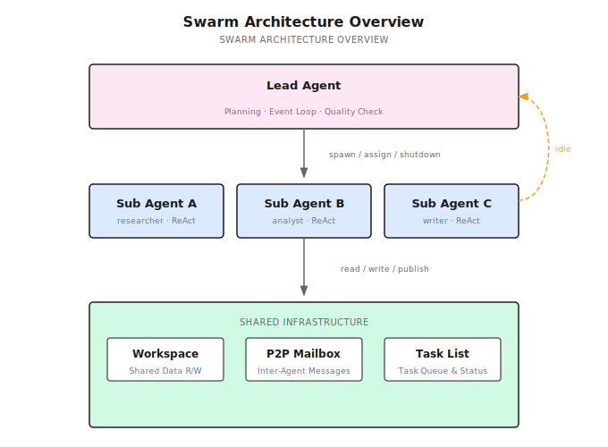
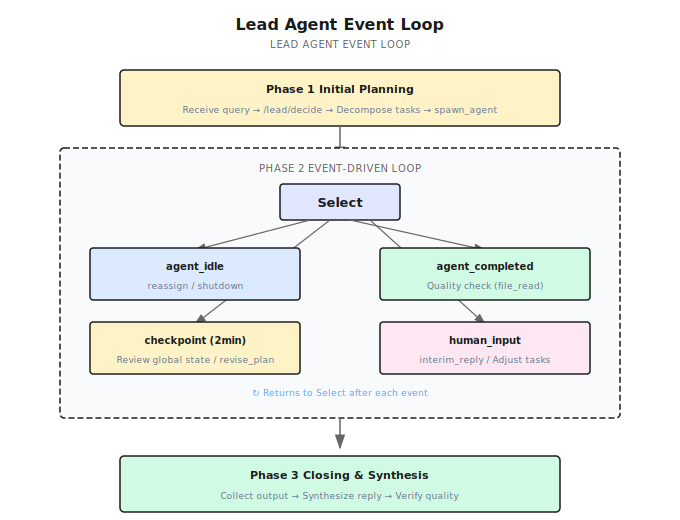
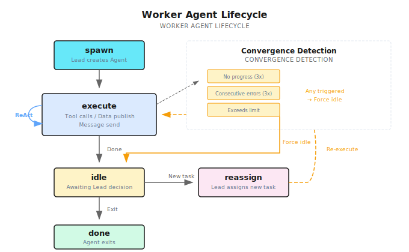

# Chapter 15: Swarm Pattern

> **Swarm lets multiple Agents collaborate like a team—a Lead Agent plans and coordinates, Worker Agents execute independently, and they share information through a common Workspace and P2P messaging. Individuals follow simple rules; the group exhibits complex intelligence.**

---

> **Quick Track** (Master the core in 5 minutes)
>
> 1. Swarm = Lead Agent (event-driven) + Worker Agents (independent ReAct loops)
> 2. Lead's three phases: Initial Planning → Event Loop (idle/completed/checkpoint/human_input) → Closing Synthesis
> 3. Workers enter idle after completing a task; Lead can reassign new tasks or shut them down
> 4. Shared Workspace + P2P Mailbox enable inter-Agent collaboration
> 5. Humans participate in real time via human_input events—no need to wait for the workflow to finish
> 6. Pure decentralization isn't good enough—Anthropic's C Compiler experiment proved it
>
> **10-minute path**: 15.1-15.3 → 15.4 → 15.8 → Shannon Lab

---

## 15.1 Opening: The Competitive Analysis Agent's Dilemma

In the previous chapter, we covered DAG workflows—scheduling tasks via dependency graphs, parallelizing what can be parallelized, waiting where waiting is required. DAGs are powerful, but they rest on one assumption: **the task structure is fixed**.

Last year I helped a consulting firm build a competitive analysis Agent. The requirements seemed straightforward: analyze 5 competitors' products, pricing, and market share. I designed a DAG with 5 parallel research tasks + 1 synthesis task—worked great.

Then the client added a new requirement: "If we discover one company is particularly important during analysis, can the system automatically deep-dive into their tech patents?"

That's beyond what DAGs can do. DAG tasks are fixed—you can't "add people" mid-run. You can't say during execution, "Hey, this company deserves a deeper look, let's spin up a patent analyst."

And it wasn't just about adding workers. The client also wanted to ask follow-up questions during analysis—"Can you pay more attention to Company XX's pricing strategy?" That means the system needs to **accept human input and dynamically adjust at runtime**.

DAGs can't do any of this. You need a more flexible orchestration pattern—one where Agents can collaborate autonomously, adjust dynamically, and respond to human feedback in real time.

That's the **Swarm pattern**.

---

## 15.2 What Is a Swarm?

### Origins: From Ants to AI

"Swarm" wasn't invented by the AI community—its roots are in nature.

In 1989, Belgian researcher Marco Dorigo studied ant foraging behavior and proposed Ant Colony Optimization. A single ant has virtually no intelligence—it can only do three things: follow pheromone trails, leave pheromones when food is found, and explore randomly. But thousands of ants collaborating through pheromones as a shared medium can find the shortest path from nest to food source. No individual ant knows the global map, yet the colony exhibits emergent path optimization.

This phenomenon shows up everywhere in nature: bee colonies use the waggle dance to communicate nectar locations, fish schools sense neighbors through their lateral line to achieve collective obstacle avoidance, and bird flocks follow three simple rules (separation, alignment, cohesion) to form spectacular murmuration formations.

Sociologists have found similar patterns in human organizations. James Surowiecki argued in *The Wisdom of Crowds* (2004) that **when diversity, independence, and decentralization are present, group decisions outperform individual experts**. In 2001, Eric Bonabeau et al. systematically abstracted these natural phenomena into engineering methodology in *Swarm Intelligence: From Natural to Artificial Systems*.

The core idea is always the same: **individuals following simple rules + communicating through a shared medium = complex emergent group behavior**.

In the AI Agent era, this maps directly:

| Natural/Social Swarm | AI Agent Swarm |
|----------------------|----------------|
| Ants / Bees / Team members | Worker Agent |
| Queen bee / Project manager | Lead Agent |
| Pheromones / Waggle dance / Kanban board | Workspace + P2P Messages |
| Nest / Hive / Office | Shared Infrastructure |
| Foraging / Nectar collecting / Project delivery | Executing User Tasks |

### One-Line Definition

**Swarm is an event-loop orchestration pattern driven by a Lead Agent—the Lead handles planning and coordination, Worker Agents each run independent ReAct loops, and they collaborate through a shared Workspace and P2P messaging.**

### Key Differences from DAG

| Dimension | DAG (Chapter 14) | Swarm (This Chapter) |
|-----------|-------------------|----------------------|
| Orchestration | Static dependency graph | Lead Agent event-driven |
| Agent creation | Fixed at decomposition time | Dynamic—Lead decides to spawn |
| Task adjustment | No mid-run modifications | Lead can revise_plan |
| Agent reuse | Exit on completion | idle → reassign new tasks |
| Quality control | None | Lead's zero-cost file_read verification |
| Human involvement | Wait until workflow ends | Real-time response via human_input events |

### From OpenAI Swarm to Lead-based Swarm

In October 2024, OpenAI open-sourced the Swarm framework—a minimalist Agent + Handoff + Routines design. It faithfully implemented the "pure decentralization" philosophy: no Lead Agent, no quality gates, Agents self-organize purely through Handoff. Elegant concept, but too bare-bones—it was superseded by the Agents SDK in March 2025.

Pure decentralization is like a colony of ants—stunningly efficient when tasks naturally decompose, but struggling when tasks require global coordination. Anthropic's experiment with 16 Agents writing a C compiler proved this point (details in 15.3): **modular tasks parallelized perfectly; monolithic tasks caused Agents to step on each other**.

Nature's bee colony actually provides the answer—it's not purely decentralized. The queen handles global coordination (laying eggs, secreting pheromones to regulate colony mood), while worker bees each handle specific tasks (foraging, building comb, defense). It's **distributed execution with centralized coordination**.

Shannon follows exactly this model: **Lead-based Swarm**. The Lead Agent handles global planning and quality control; Worker Agents maintain high autonomy. The Lead doesn't do the actual work, but it decides who does what, how well they did, and what comes next.



---

## 15.3 16 Agents Wrote a C Compiler

Enough theory—let's look at a real case. In February 2026, Anthropic published a post ("Building a C compiler with a team of parallel Claudes"): a group of parallel Claude Agents wrote a C compiler, producing 100,000 lines of Rust code at an API cost of roughly $20,000.

### Fully Decentralized Design

These 16 Agents **had no Lead**. The coordination mechanisms were:

- **Lock files**: An Agent acquires a lock before modifying a module
- **Git**: Agents work on their own branches, merging periodically
- **Shared test suite**: The sole standard for quality verification

This is exactly the logic of ant foraging—each Agent sees only local information (lock files, test results) and coordinates implicitly through a shared medium (the Git repo).

### Stunning Results on Modular Tasks

C has many independent features—arrays, pointers, structs, unions, enums... Each feature is largely independent. 16 Agents each implemented their own C features, working in parallel with remarkable efficiency.

This is the sweet spot for decentralized Swarms: **naturally decomposable tasks with low inter-module coupling**—like ants hauling different food fragments.

### Collapse on Monolithic Tasks

When the task became "compile the Linux kernel," things fell apart. All 16 Agents hit the same bug—ABI compatibility issues. Each Agent tried to fix it independently, producing different versions that overwrote each other.

This is also consistent with nature—when ants try to carry a large leaf without coordination, they pull in all directions and go nowhere.

Anthropic's solution: introduce GCC as an Oracle (reference compiler) and re-decompose the monolithic task "make the Linux kernel compile" into parallelizable subtasks (comparing each C feature's output against GCC).

**In essence, they filled the Lead Agent vacancy**—except this "Lead" was the combination of human engineers + the GCC test suite.

### Three Core Lessons

**1. Verifier quality matters more than prompts.**

> "Claude will solve whatever problem I give it, so the verifier must be nearly perfect."

Agents are great at solving well-defined problems. The bottleneck isn't Agent capability—it's whether you can precisely define what "done right" means.

**2. Environment design matters as much as prompts.**

Test output formatting, a `--fast` option (skip already-passed tests), progress docs... This "infrastructure" impacts Agent efficiency just as much as the prompt itself.

**3. Feeling "uneasy" about autonomously written code.**

A member of Anthropic's safety team participated in this project. They admitted: having AI autonomously write 100,000 lines of code was unsettling—not because the code quality was poor, but because **no one fully understood the code**.

### From Experiment to Product: Claude Code's Choice

The C Compiler wasn't just an experiment—it directly influenced Anthropic's product design.

Anthropic later published their multi-Agent research system architecture ("How we built our multi-agent research system"), which eventually evolved into Claude Code's agent team capability. The key architectural decision: **no more pure decentralization**. Claude Code's multi-Agent mode uses a primary Agent coordinating multiple sub-Agents—the primary Agent handles task decomposition, assignment, and result synthesis, while sub-Agents execute independently.

From C Compiler experiment to Claude Code product, Anthropic's path is clear:

1. **Pure decentralization** (C Compiler) → Brilliant on modular tasks, collapsed on coordination
2. **Add a coordination layer** (Research System) → Lead Agent + Worker Agents
3. **Productionize** (Claude Code agent team) → Primary Agent-driven multi-Agent collaboration

This perfectly matches natural patterns—bee colonies aren't purely decentralized (the queen provides global coordination), wolf packs have an alpha for decision-making, and human teams have project managers. **Effective group collaboration requires some form of coordination center**.

Shannon's design follows the same principle: **Lead-based Swarm**—use a Lead Agent to fill the coordination gap while keeping Workers highly autonomous.

Let's see how Shannon implements this.

---

## 15.4 Shannon's Swarm Architecture

Shannon's SwarmWorkflow has three phases:



### Phase 1: Lead Initial Planning

The Lead Agent receives the user query and calls `/lead/decide` to generate an initial plan:

```
User: "Analyze the top 5 companies in the AI Agent market"

Lead decision:
  → create task T1: "Research Company A's product line and tech stack"
  → create task T2: "Research Company B's market strategy and funding"
  → create task T3: "Research Company C's open-source ecosystem"
  → spawn_agent: Sub Agent A (researcher, T1)
  → spawn_agent: Sub Agent B (analyst, T2)
  → spawn_agent: Sub Agent C (researcher, T3)
```

The Lead can execute multiple Actions at once. Shannon defines 12 Action types:

| Action | Description |
|--------|-------------|
| `spawn_agent` | Create a new Worker Agent |
| `assign_task` | Assign a new task to an idle Agent |
| `create_task` | Create a new task (without assigning it immediately) |
| `cancel_task` | Cancel a task |
| `file_read` | Directly read a file written by an Agent (no LLM call) |
| `revise_plan` | Dynamically adjust the task plan |
| `send_message` | Send a P2P message to an Agent |
| `shutdown_agent` | Shut down an Agent |
| `interim_reply` | Send an interim reply to the user |
| `final_reply` | Send the final reply |
| `synthesize` | Trigger final synthesis |
| `done` | Mark the Lead workflow as complete |

**Code reference**: [`swarm_workflow.go:1676-1760`](https://github.com/Kocoro-lab/Shannon/blob/main/go/orchestrator/internal/workflows/swarm_workflow.go#L1676-L1760) — Lead initial planning

### Phase 2: Event-Driven Loop

After the initial Agents launch, the Lead enters an event loop. It uses Go's `workflow.Selector` to multiplex across four event types:

```go
// Conceptually simplified
for {
    sel := workflow.NewSelector(ctx)

    sel.AddReceive(agentIdleCh, func(ch workflow.ReceiveChannel, more bool) {
        // Agent finished its task, reporting idle
        // → Lead decides: assign_task / shutdown_agent
    })

    sel.AddReceive(agentCompletedCh, func(ch workflow.ReceiveChannel, more bool) {
        // Agent fully completed, exiting its loop
        // → Lead evaluates quality: file_read → ACCEPT / RETRY
    })

    sel.AddReceive(checkpointTimer, func(f workflow.Future) {
        // Fires every 2 minutes
        // → Lead reviews global state: revise_plan / interim_reply
    })

    sel.AddReceive(humanInputCh, func(ch workflow.ReceiveChannel, more bool) {
        // User sent a new instruction
        // → Lead responds: adjust tasks + interim_reply
    })

    sel.Select(ctx)

    if allDone { break }
}
```

This is the core of Swarm—**the Lead isn't polling; it's event-driven**. It only processes when events arrive; otherwise, it waits.

### Phase 3: Closing Synthesis

After all Worker Agents finish, the Lead enters the closing phase:

1. Collect all Agents' outputs and Workspace data
2. Synthesize the final reply (re-synthesize with LLM if quality isn't up to par)
3. Return the result

**Code reference**: [`swarm_closing.go`](https://github.com/Kocoro-lab/Shannon/blob/main/go/orchestrator/internal/workflows/swarm_closing.go) — Closing synthesis logic

---

## 15.5 Worker Agent's ReAct Loop

Each Worker Agent runs an independent AgentLoop—essentially an enhanced ReAct loop.



### Each Iteration's Flow

1. **Shutdown check**: Non-blocking check for a shutdown signal from the Lead
2. **Context injection**: Task description + Team Roster + Running Notes + Task Board + Workspace data + P2P inbox
3. **LLM call**: Returns a single Action (tool_call / publish_data / send_message / idle / done)
4. **Execute Action**: Call tools, write to Workspace, send P2P messages
5. **Convergence detection**: Check if the Agent is stuck in a loop

### Reassignment After idle

When a Worker finishes its current task, it doesn't exit—it reports idle:

```
Sub Agent A:
  "Research complete, Company A product line analysis written to workspace."
  → signal: agent_idle (with summary)

Lead receives idle signal:
  → file_read: Check the file Sub Agent A wrote
  → Quality verdict: ACCEPT
  → Any unassigned tasks like T4?
    → Yes: assign_task(Sub Agent A, T4)  // Keep working
    → No: shutdown_agent(Sub Agent A)    // No more work, shut down
```

This idle → reassign loop is a key advantage of Swarm: **Agents aren't disposable—they're reusable**. After Sub Agent A finishes research, it can be reassigned to analysis without spawning a new Agent. The Agent's Running Notes and Workspace files are preserved, eliminating redundant context construction.

**Code reference**: [`swarm_workflow.go:1125-1230`](https://github.com/Kocoro-lab/Shannon/blob/main/go/orchestrator/internal/workflows/swarm_workflow.go#L1125-L1230) — idle/reassign loop

### Convergence Detection

Agents can get stuck in loops—going several rounds without calling tools, repeatedly erroring, or exceeding the iteration limit. Shannon detects this at three levels; once triggered, the Agent is forced into idle, and the Lead decides the next step.

---

## 15.6 Workspace and P2P Communication

Multi-Agent collaboration needs two things: shared data and direct communication. These correspond to two coordination mechanisms in nature—ant pheromones (indirect communication) and the bee waggle dance (direct communication).

### Workspace (Shared Work Area)

The Workspace is a data layer shared by all Agents, similar to ant pheromones—Agents leave data traces here, and other Agents read them to make decisions.

#### The Fundamental Difference from DAG Data Passing

The DAG workflow from the previous chapter also passes data, but the mechanism is completely different. DAGs use **explicit dependencies**—Task A's output is Task B's input, and you define how data flows when you define the DAG. It's like passing a note with a named recipient—the note only goes to that person.

Workspace uses **implicit sharing**—any data published by any Agent is visible to all Agents. It's more like a shared whiteboard in the office: you write a finding on the board, and any colleague who walks by can see and use it. There's no predefined data flow direction; data consumers are determined at runtime.

This distinction drives different use cases. DAGs work for "I know who needs this data"; Workspace works for "I don't know who'll need it, but this finding might be useful to the team." In a competitive analysis scenario, Sub Agent A discovers "Company X just closed a funding round"—that information could be valuable to the pricing analyst Agent, the market strategy Agent, and others. You can't draw those dependency lines in advance.

#### Read/Write Model

Agents write to the Workspace via the `publish_data` Action, specifying a **topic** like `market_findings` or `pricing_data`. At the start of each ReAct iteration, the system automatically checks the Workspace for new data and injects it into the Agent's context.

Key design: reads are **incremental**. Agents only pull data published since their last read—they don't re-fetch the entire Workspace every time. This is critical: if 5 Agents each publish 10 entries and every Agent reads the full history each round, the context would explode.

Here's a concrete data flow:

```
Iteration 1:
  Sub Agent A (research): Searches and discovers "Company X just raised $500M"
    → publish_data(topic="market_findings", data="Company X closed $500M round...")

Iteration 2:
  Sub Agent B (pricing analysis): Starts a new reasoning cycle
    → System auto-injects: [Workspace new data] market_findings: "Company X closed $500M round..."
    → Sub Agent B reads this and adjusts analysis: "Given Company X's new funding, their pricing strategy may become more aggressive..."
    → publish_data(topic="pricing_data", data="Company X may initiate a price war...")

Iteration 3:
  Sub Agent A: Continues research
    → System auto-injects: [Workspace new data] pricing_data: "Company X may initiate a price war..."
    → Sub Agent A uses this to dig deeper into Company X's competitive strategy
```

Notice that no Agent explicitly "sent a message to someone"—data spreads like pheromones. When Sub Agent A published, it had no idea Sub Agent B would read it—but Sub Agent B did, and it influenced their analysis direction.

#### Workspace vs P2P: Broadcast vs Point-to-Point

This naturally raises a question: if we have Workspace, why do we also need the P2P messaging described below?

Because they solve different problems. Workspace is **broadcast**—one-to-many, ideal for "I have a finding that might be useful to everyone." P2P is **point-to-point**—one-to-one, ideal for "Sub Agent A, I need you to look into something specific."

A real-life analogy: Workspace is like a public Slack channel—you post a message and everyone can see it. P2P is like a direct message—only the recipient sees it. You wouldn't ask "Hey Bob, can you check that contract?" in a public channel, and you wouldn't announce "Breaking: competitor just cut prices!" via DM. The two communication modes are complementary—you need both.

### P2P Mailbox (Point-to-Point Messaging)

Direct communication between Agents—like the bee waggle dance, conveying precise information one-to-one. Five message types are supported:

| Type | Usage |
|------|-------|
| Request | "Sub Agent A, can you look up Company A's patent data?" |
| Offer | "I have Company B's pricing data here—do you need it?" |
| Accept | "Yes, please send it over" |
| Delegation | Lead delegates a task |
| Info | Informational message, no reply needed |

Messages are delivered asynchronously; the receiver reads them on their next ReAct iteration—non-blocking for the sender.

**Code reference**: [`p2p.go`](https://github.com/Kocoro-lab/Shannon/blob/main/go/orchestrator/internal/activities/p2p.go) — WorkspaceAppend / SendAgentMessage

> **Connection to Chapter 16**: This section explains **why** these collaboration mechanisms are needed within Swarm. Chapter 16 will dive into **how** Handoff is implemented—the task handover protocol between Agents.

---

## 15.7 Lead's Quality Control

The Lead Agent doesn't just assign tasks—it also verifies quality. But verification can't be expensive—you can't call the LLM every time just to judge.

### Zero-Cost file_read Verification

The Lead can directly read files written by Workers—**without calling the LLM**:

```
Sub Agent A reports idle, claiming Company A analysis is complete.

Lead decision:
  → file_read: "workspace/company_a_analysis.md"  (0 tokens)
  → File content covers product/pricing/tech → ACCEPT
  → file_read: "workspace/company_a_patents.md"    (0 tokens)
  → File only has 3 lines → RETRY, with instruction: "Patent section needs more detail"
```

This is a direct lesson from the C Compiler—verifier quality determines system quality. file_read lets the Lead perform basic quality checks at zero token cost, catching issues and sending work back immediately.

### Preventing Infinite Loops

Two layers of protection:

- **Convergence detection**: When a Worker goes several rounds without meaningful output, it's forced into idle; the Lead decides whether to retry or give up
- **Global termination**: When all Agents are idle and no tasks remain unassigned, the Lead automatically enters the closing phase

---

## 15.8 HITL: Human-Agent Collaboration in Swarm

HITL (Human-in-the-Loop) means letting humans participate in an AI system's decision-making, feedback, and course correction in real time—rather than waiting until the system finishes.

In traditional orchestration patterns, human involvement is "post-hoc approval"—the Agent finishes, a human glances at the result, approves or rejects.

Swarm's HITL is different: **humans are part of the event loop**.

### human_input Events

Users can send messages to the Lead at any time via Signal:

```
User (t=3min): "Pay more attention to Company C's open-source strategy"

Lead receives human_input event:
  → interim_reply: "Got it, I'm having Sub Agent C focus on open-source strategy"
  → revise_plan: Add task for Sub Agent C
  → assign_task(Sub Agent C, "Deep-dive into Company C's open-source ecosystem and community activity")
```

No pausing, no waiting for the current round to finish—the Lead handles it on the next Select iteration.

### 2-Minute Checkpoints

The Lead auto-triggers a checkpoint every 2 minutes to review global state:

- Any Agents stuck? → Send a hint or reassign
- Is progress on track? → Report to the user
- Need to adjust the plan? → revise_plan

### SSE Real-Time Stream

The frontend receives real-time updates via Server-Sent Events:

| Event Type | Content |
|-----------|---------|
| `LEAD_DECISION` | What decision the Lead made |
| `AGENT_STARTED` | A Worker launched |
| `AGENT_COMPLETED` | A Worker finished |
| `INTERIM_REPLY` | Lead's interim reply |

Users can watch the Agent team collaborate in real time and intervene at any point.

### Core Philosophy

**The human is the ultimate Lead Agent.** In Shannon's Swarm design, the Lead Agent is the human's proxy—it handles most coordination work on the human's behalf, but the human can override the Lead's decisions at any time via human_input. This isn't "manual approval"—it's "human-agent collaboration."

---

## 15.9 Orchestration Pattern Spectrum

| Dimension | DAG (Chapter 14) | Swarm (This Chapter) |
|-----------|-------------------|----------------------|
| Orchestration | Static dependency graph | Lead event-driven loop |
| Agent creation | Fixed | Dynamic spawn/reassign |
| Communication | Dependency passing | Workspace + P2P Mailbox |
| Quality control | None | Lead file_read verification |
| Human involvement | Post-hoc review | Real-time response within the event loop |
| Best for | Well-defined task structure, clear dependencies | Complex collaboration, dynamic adjustment, human feedback |

**Selection guide**:

- Task structure is completely fixed with clear dependencies → **DAG**
- Tasks need dynamic adjustment, Agents need to collaborate, human feedback is required → **Swarm**
- Not sure? Start with DAG. Upgrade to Swarm when you hit its limits.

---

## 15.10 Common Pitfalls

| Pitfall | Why It's Wrong | What to Do Instead |
|---------|---------------|-------------------|
| More Agents = better | Coordination cost grows exponentially | 3 focused Agents beat 5 scattered ones |
| No Lead needed at all | The C Compiler experiment disproved this | Lead's global coordination and quality gates are essential |
| Ignoring convergence detection | Agents can loop forever | Multi-layer detection; force stuck Agents back to the Lead |
| Ignoring token budgets | Swarm consumes far more tokens than a single Agent | Set Agent count limits and total token budgets |
| Using Workspace as a database | Workspace is a temporary collaboration area | Use Running Notes for persistent data |
| Lead micromanages everything | Too many Lead rounds waste tokens | Lead intervenes only on events; Workers execute autonomously |

---

## 15.11 Chapter Recap

1. **Swarm = Lead + Workers**: Lead Agent coordinates via event-driven loop; Worker Agents run independent ReAct loops
2. **Three phases**: Initial Planning → Event Loop (idle/completed/checkpoint/human_input) → Closing Synthesis
3. **idle → reassign**: Workers don't exit after completion; Lead can assign new tasks
4. **Workspace + P2P**: Shared work area (Redis + file system) + point-to-point messaging
5. **Zero-cost verification**: Lead reads files directly without calling the LLM
6. **HITL**: human_input events make the human part of the event loop
7. **The necessity of a Lead**: Pure decentralization loses control on coordination tasks (the C Compiler lesson)

---

## Shannon Lab (10-Minute Hands-On)

### Must-Read (1 file)

- [`swarm_workflow.go`](https://github.com/Kocoro-lab/Shannon/blob/main/go/orchestrator/internal/workflows/swarm_workflow.go) — The core Swarm implementation. Focus on: Lead initial planning (lines 1676-1760), AgentLoop's idle/reassign loop (lines 1125-1230), Lead event loop's Select branches, and convergence detection logic

### Deep Dive (2 files)

- [`p2p.go`](https://github.com/Kocoro-lab/Shannon/blob/main/go/orchestrator/internal/activities/p2p.go) — Workspace CRUD (`WorkspaceAppend` / `WorkspaceList`) and P2P messaging (`SendAgentMessage`)—understand the collaboration infrastructure between Agents
- [`roles/swarm/lead_protocol.py`](https://github.com/Kocoro-lab/Shannon/blob/main/python/llm-service/roles/swarm/lead_protocol.py) — Lead's system prompt and 12 Action type definitions—understand the Lead Agent's capability boundaries

---

## Further Reading

- [Building a C Compiler with Claude](https://www.anthropic.com/research/building-a-c-compiler-with-claude) — Anthropic's 16-Agent experiment and the lessons of pure decentralized Swarm
- [How we built our multi-agent research system](https://www.anthropic.com/engineering/built-multi-agent-research-system) — Anthropic's multi-Agent research system architecture
- [OpenAI Swarm](https://github.com/openai/swarm) → [Agents SDK](https://openai.github.io/openai-agents-python/) — The evolution from minimal Swarm to production-grade SDK
- [`docs/swarm-agents.md`](https://github.com/Kocoro-lab/Shannon/blob/main/docs/swarm-agents.md) — Shannon's complete Swarm design document (734 lines)

---

## Next Chapter Preview

Within Swarm, Agents collaborate through Workspace and P2P messaging. But there's an even more fundamental question:

**When one Agent needs to hand off a task to another Agent, how do you ensure the handover is complete?**

- Context transfer: What information gets passed? What doesn't?
- State preservation: Can the receiving Agent understand the full context?
- Protocol design: What's the standard handover process?

The next chapter covers **Handoff Mechanism**—the engineering implementation of task handovers between Agents.
