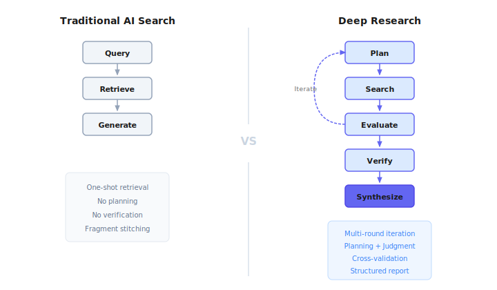
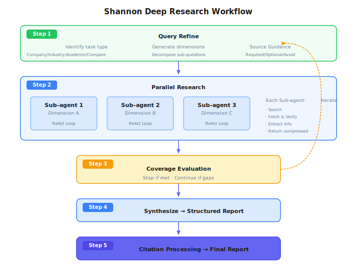

# Chapter 27: Deep Research

> **Deep Research upgrades "search it" to "research it"—not searching more, but thinking, planning, verifying, and synthesizing like a professional researcher.**

---

## 27.1 The Difference Between "Searching" and "Researching"

You ask AI for help:

> "Help me understand the current state of AI Agent adoption in enterprises."

**Traditional AI Search response**:
Search → Take top 5 results → Stitch summaries → Return.

**Deep Research response**:
"This question is quite broad, let me think about how to break it down..."
→ Technical challenges? Organizational challenges? Success stories? Lessons from failures?
→ First do a broad search to see what people are discussing
→ Discover "security" is frequently mentioned, dig deeper
→ Find several case studies, but data conflicts, cross-validate
→ Organize into a structured report, annotate sources for each conclusion

Where's the fundamental difference?

| | Traditional AI Search | Deep Research |
|---|-------------|---------------|
| Retrieval | One-shot | Multi-round iterative |
| Reasoning | Almost none | Planning, adaptation, judgment |
| Verification | None | Cross-validation, source quality assessment |
| Output | Fragment stitching | Structured report + citations |

**In one sentence**: Not "searching more," but "knowing how to think."



---

## 27.2 A Brief History of the Industry

From "search engine" to "Deep Research" wasn't a single leap, but three years of evolution.

### Late 2022: Birth of the Answer Engine

In August 2022, [Perplexity AI](https://en.wikipedia.org/wiki/Perplexity_AI) was founded. In December, they launched Perplexity Ask—a "conversational answer engine."

The founders' insight was simple: traditional search engines give you a bunch of links, and you have to click through to find answers. Why not just give the answer directly?

The key innovation was **citations**. CEO Aravind Srinivas said: "Citations are the best way to connect search and LLM." Perplexity uses RAG (Retrieval-Augmented Generation) to search the web in real-time, then has the LLM synthesize answers with source annotations.

Just a week earlier (November 30), ChatGPT had just been released, but it had no internet access—it could only answer using training data, unable to fetch real-time information. Perplexity chose a different path from the start: search + LLM.

### 2023: AI Search Battlefield

Competition intensified in early 2023:

- **January**: Microsoft announced an additional $10 billion investment in OpenAI (totaling $13 billion), integrating GPT-4 into Bing
- **March**: Google urgently launched Bard (later Gemini)
- **Mid-year**: Google launched SGE (Search Generative Experience), adding AI summaries at the top of search results

Perplexity grew rapidly—2 million users in February, daily queries grew from 2,000 to 4 million by year-end, a 1000x increase.

But AI search at this stage was essentially **Q&A**: users ask once, AI answers once. Complex questions required users to break them down, ask multiple times, and manually integrate results.

### 2024: From Q&A to Search Products

2024 was the year of AI search productization:

- **July**: OpenAI launched the [SearchGPT](https://openai.com/index/searchgpt-prototype/) prototype, first enabling ChatGPT to search the web
- **October**: OpenAI officially released ChatGPT Search, competing with Perplexity
- **December**: Google rolled out Deep Research to Gemini Advanced users

Google Deep Research brought a key change: after users ask, AI first shows a "research plan," then executes after user confirmation. The output is a "report" rather than an "answer."

This means a shift in approach:
- Before: AI is an "answer machine"—answer whatever is asked
- After: AI is a "research assistant"—helps you plan, execute, and synthesize

Perplexity grew 524% in 2024, reaching a valuation of over $9 billion.

### 2025: Year One of Deep Research

February 2025 was a product turning point:

- **February 2**: OpenAI released [Deep Research](https://openai.com/index/introducing-deep-research/) based on o3, capable of autonomous research planning, cross-domain analysis, and professional report generation
- **February 14**: Perplexity launched free [Deep Research](https://www.perplexity.ai/hub/blog/introducing-perplexity-deep-research), emphasizing speed and accessibility
- **April**: OpenAI released o3 and o4-mini, further enhancing Deep Research capabilities
- **June**: Anthropic published [complete technical details of their multi-agent research system](https://www.anthropic.com/engineering/multi-agent-research-system)

By mid-2025:
- AI search traffic share grew from 0.02% in 2024 to 0.15% (7x)
- ChatGPT exceeded 1 billion daily queries, with over 500 million weekly active users
- Perplexity reached 780 million monthly queries, valued at over $14 billion

Deep Research became standard, but with different technical approaches—that's what we'll cover next.

---

## 27.3 Two Architectural Approaches

> The following information is based on publicly available materials from mid-2025; products continue to evolve.

**Approach One: Single Agent + Strong Reasoning (OpenAI)**

Uses one powerful reasoning model to complete the entire research process. The model itself learns planning, searching, backtracking, and synthesis.

OpenAI's Deep Research is based on a specialized version of the o3 model. The core approach is **end-to-end reinforcement learning**—training the model in simulated research environments to learn the complete research workflow: how to plan multi-step searches, how to backtrack when stuck, how to adjust strategies based on real-time information. These capabilities aren't coded in—they're "learned" through training.

To support long-running research tasks (potentially 30 minutes), o3 extended its attention span, maintaining context through long reasoning chains. It also supports cross-modal analysis—not just reading text, but understanding images and extracting PDF data. While presented externally as a "single Agent," internally there's hierarchical scheduling: cheaper small models handle preprocessing and routing, expensive large models handle core reasoning, balancing cost and effectiveness.

In April 2025, o4-mini lightweight version was released, enabling free users to access a lightweight Deep Research.

**Approach Two: Multi-Agent Collaboration (Anthropic)**

Multiple specialized Agents working together. One Lead Agent handles planning and synthesis, multiple Sub-agents explore different dimensions in parallel.

Anthropic published complete technical details (we'll examine this in detail next section). The core advantage is **parallelization plus compression**. Each Sub-agent has its own context window, can focus on exploring one dimension without interference. After exploration, Sub-agents don't pass all raw information back—they compress it into key findings—avoiding context explosion. The cost is roughly 15x the Token consumption of a single Agent, but in return, over 90% performance improvement.

**Comparison**

| Dimension | Single Agent (OpenAI) | Multi-Agent (Anthropic) |
|-----|-------------------|---------------------|
| Core capability source | Model reasoning ability | Architecture design |
| Context management | Relies on model's long attention | Relies on compression and isolation |
| Parallelization | Limited (internal scheduling) | Native support |
| Explainability | Lower (end-to-end) | Higher (clear steps) |
| Engineering complexity | Low (single model) | High (multi-Agent coordination) |

Neither approach is absolutely superior. OpenAI's approach relies on model capability, Anthropic's relies on architecture design. In practice, both often blend—OpenAI internally has multi-model scheduling, Anthropic's Sub-agents run reasoning loops internally.

---

## 27.4 Anthropic's Multi-Agent Approach

> Source: [How we built our multi-agent research system](https://www.anthropic.com/engineering/multi-agent-research-system) (2025)

Let's examine their design in detail.

### Architecture


*Image source: [How we built our multi-agent research system](https://www.anthropic.com/engineering/multi-agent-research-system)*

### Why Multi-Agent?

The core insight is **compression**.

Each Sub-agent has its own context window and can independently explore a dimension—for example, one handles technical challenges, one handles success stories, one handles lessons from failures.

After exploration, Sub-agents don't pass all raw information to the Lead Agent—they "compress"—extracting key findings, discarding details. The Lead Agent only needs to integrate the essence, not process massive raw information.

The benefit is breaking through single context window limitations.

### How Many Agents?

More isn't always better. Anthropic's experience:

| Task Complexity | Recommended Agent Count |
|-----------|--------------|
| Simple fact queries | 1 is enough |
| Comparative analysis | 2-4 |
| Comprehensive research | 10 or more |

### Coordination Mechanisms

The biggest challenge with multi-Agent is coordination. Imagine: you send 10 researchers to investigate the same topic. Without clear division of labor, they might all search for the same content, or return information in different formats that the integrator can't use.

Anthropic put significant effort here.

**Task Assignment "Contract" Design**

What the Lead Agent gives each Sub-agent isn't a vague "go search for this," but a clear "task contract": what's the goal (not "research competitors," but "identify pricing strategies of 3-5 main competitors"), what's the output format (must be structured, like "Company Name | Product | Price Range"), which tools can be used, and what are the boundaries (what not to do).

This contract design makes each Agent's output predictable and composable. What the Lead Agent receives isn't a bunch of differently formatted text, but structured data that can be directly integrated.

**Information Passing "Compression" Problem**

A Sub-agent exploring one dimension might generate thousands of Tokens—search results, visited web pages, intermediate reasoning. If all passed to the Lead Agent, the context window quickly overflows.

Anthropic's approach: Sub-agents store complete output to the file system, passing only a "summary + reference" to the Lead Agent. The summary is compressed key findings, references are pointers to complete content. This is what "compression" means—not physical compression, but **semantic compression**: keeping conclusions, discarding process.

**Error Recovery for Long-Running Tasks**

Research tasks don't complete in seconds. A complete Deep Research might run 10-30 minutes, during which networks might fluctuate, APIs might timeout, a Sub-agent might get stuck.

The traditional approach is "start over on error," but rerunning a 30-minute task is too expensive. Anthropic's approach is **checkpoint recovery**: save state after each critical step, resume from the nearest checkpoint on error rather than restarting the entire task. Combined with AI's adaptability—if a search path doesn't work, try another path instead of persisting on one route.

### Performance Data

| Metric | Data |
|-----|------|
| Multi-Agent vs Single-Agent improvement | 90.2% |
| Token consumption multiple | ~15x |
| Token explains performance difference | 80% |

The last point is interesting: **Token usage explains 80% of the performance difference**.

In other words, multi-Agent works well largely because more Tokens are spent thinking and exploring. With limited budget, single-Agent + longer reasoning chains might achieve similar results.

---

## 27.5 Core Design Decisions

Regardless of which framework you use to implement Deep Research, several design decisions are unavoidable.

### Decision One: Architecture × Capability Source

Deep Research's design space can be understood along two dimensions:

**Dimension One: Architecture Choice**
- **Single Agent**: One model completes the entire process, relying on long-range reasoning capability
- **Multi-Agent**: Multiple specialized Agents divide labor, relying on architecture design for coordination

**Dimension Two: Capability Source**
- **Model Training**: Through RL, make the model "learn" research
- **Context Engineering**: Through Prompt design, "guide" the model to research

These two dimensions combine into four main approaches:

| Approach | Architecture | Capability Source | Representative |
|-----|------|---------|------|
| A | Single Agent | End-to-end RL | OpenAI Deep Research |
| B | Single Agent | Context Engineering | Early Perplexity |
| C | Multi-Agent | RL + Context | Anthropic approach |
| D | Multi-Agent | Context Engineering | Shannon, open-source solutions |

**OpenAI (Approach A)**: Uses end-to-end reinforcement learning to train the o3 model, making it learn planning, searching, backtracking, and synthesis in simulated research environments. The model itself has research capabilities; architecture is relatively simple.

**Anthropic (Approach C)**: Multi-Agent architecture + context engineering combination. Lead Agent and Sub-agent behavior is mainly guided by Prompts, but may also incorporate model fine-tuning.

**Shannon (Approach D)**: Multi-Agent architecture + pure context engineering. No model training, relying entirely on architecture design and Prompt engineering for research capabilities. This is the mainstream choice for startups and open-source projects—low cost, fast iteration.

**Deep Dive on Training Methods**

If you choose the training route, three methods are mainstream in 2025:

1. **End-to-end RL**: Put the model in a simulated research environment, give it a browser and tools, have it complete real tasks. OpenAI's approach. The cost is requiring extensive simulated environments and compute.

2. **RLVR (RL with Verifiable Rewards)**: Use verifiable signals as rewards—like code execution to verify if answers are correct. The benefit is objective, scalable rewards.

3. **SFT + Multi-stage RL**: First use supervised learning to teach basic capabilities, then use RL to gradually increase difficulty. Microsoft rStar2-Agent's approach. The benefit is more stable training.

**Deep Dive on Context Engineering**

If you choose not to train (or lack resources to train), context engineering is core:

- **Research strategy encoding**: Write time awareness, source quality judgment, citation tracking strategies into Prompts
- **Task contracts**: Define input/output formats, available tools, boundary constraints for each subtask
- **Dynamic context injection**: Inject different search strategies based on task type
- **ReAct loops**: Reasoning → Action → Observation iterative pattern

Multi-Agent architecture naturally requires context engineering—you need to tell each Agent its role and how to collaborate with others.

### Decision Two: When to Stop?

Search too little, incomplete answers; search too much, waste money. How to find this balance?

The simplest approach is **fixed rounds**—say, stop after 3 rounds. The benefit is controllability; the downside is one-size-fits-all: simple questions waste resources, complex questions aren't covered enough.

A smarter approach is **coverage assessment**—break the question into dimensions, assess coverage after each round, stop when coverage reaches threshold. The cost is extra reasoning calls for assessment, but you get "search more when needed, stop early when appropriate."

Another approach is **letting the model decide**—but this requires special training; regular models struggle with this judgment, either stopping too early or looping infinitely.

In practice, divide and conquer: simple fact queries use 2-3 round hard limits, complex comprehensive research uses coverage assessment with a maximum 5-round safety cap.

### Decision Three: How to Verify Citations?

Search engine summaries are a "promise"—they claim a webpage contains information you want. But this promise is often unreliable: summaries might be taken out of context, URLs might be dead, content might have been updated long ago.

So you **must actually visit URLs**, get complete content, then decide if it's usable. This step reveals many issues: 404s, paywalls, content not matching summaries. Though it adds network requests, it avoids "hallucinated citations"—reports showing sources that users click and find don't match.

Another key is **distinguishing source quality**. The same information from an official website versus some aggregator site has completely different credibility. Reports should prioritize high-quality sources; for conclusions supported only by low-quality sources, note "information may be inaccurate."

One more point: when multiple sources conflict, don't choose for the user. Present the conflict, let users judge themselves. A research report's value is providing comprehensive information, not making conclusions for users.

### Decision Four: How to Handle Failures?

Research tasks don't complete in seconds; they might run 10-30 minutes. During this time, networks might fluctuate, APIs might timeout, a search might return empty results. If you restart from scratch on every error, costs are too high.

A good approach is **async task management plus checkpoint recovery**. Save state after each critical step, continue from the nearest checkpoint on error rather than restarting the entire task. This requires designing tasks to be recoverable—state must be serializable, steps must be decoupled.

Another principle is **single step failures don't affect the whole**. Can't access a URL? Skip it, continue with others. A search returns empty? Try different keywords. AI has adaptability—let it adjust strategies on failure rather than persisting on one path.

---

## 27.6 Quality Assurance Mechanisms

Deep Research outputs "reports," not "chat replies." Report quality standards are higher—every conclusion needs sources, information must be comprehensive, no obvious omissions. This section covers several key quality assurance mechanisms.

### Citation Tracking: Every Conclusion Must Be Traceable

A major problem with traditional AI search is "hallucinated citations"—AI says "according to such-and-such report," you click through and find the content doesn't exist, or the link is fake.

Deep Research's approach is **full tracking**:

During research, every search tool call, every webpage visit is recorded. When generating reports, instead of letting the LLM make up citations, it matches from records—which search result did this conclusion come from? What was the original URL from that search?

In the final report, every key conclusion has [1] [2] [3] citation markers, with a complete source list at the bottom. Users can click through to verify.

This seems minor, but it fundamentally changes AI-generated content credibility.

### Coverage Assessment: Not "Done When Searched"

Searching 3 times versus 30 times—which is enough? There's no standard answer; it depends on research question complexity.

A simple fact query ("When was OpenAI founded?"), one search is enough. Comprehensive research ("State of AI Agent adoption in enterprises"), 30 searches might not be enough.

Deep Research uses **coverage assessment** to solve this:

1. At research start, break the question into dimensions (e.g., "technical challenges," "organizational challenges," "success stories," "lessons from failures")
2. After each search round, assess coverage for each dimension
3. If a dimension is still blank or information is scarce, do targeted supplementary searches
4. When all key dimensions have sufficient information, stop

This is much smarter than "fixed 5 searches"—simple questions don't waste resources, complex questions don't have omissions.

### Time Awareness: Information Gets Stale

Prices, team sizes, funding rounds, regulations—these can change in months. If a report says "Anthropic valued at $4 billion" but that's 2023 data and it's doubled since, the report is misleading.

Deep Research's time awareness appears in several places:

When searching, time-sensitive questions automatically add year constraints ("Anthropic valuation 2025" not "Anthropic valuation"). When ranking, prioritize newest content. When generating reports, explicitly note time context ("As of Q2 2025, Anthropic is valued at approximately $15 billion").

This lets users know information timeliness and reminds them some data might need updating.

### Multi-Language Search: Breaking the English Information Bubble

Researching a Chinese company using only English search—what happens?

You'll mainly find: English media's secondhand reports, the company website's English version (if any), some financial data aggregator sites. But you won't find: Tianyancha business registration info, 36Kr industry analysis, Baidu Baike company history, Zhihu employee feedback.

This local language information is often more firsthand, more detailed, more authentic.

Deep Research's multi-language support isn't simply "translate queries into multiple languages," but a smarter strategy:

First identify the research subject's "home turf"—a Chinese company's home is Chinese; a Japanese company's home is Japanese. Then search in home language for official information (business data, official website, local media), and in English for global perspective (international media, investment reports). Finally when synthesizing, prioritize firsthand sources in the official language.

This greatly improves information coverage for non-English entity research.

---

## 27.7 Shannon's Design Choices

As introduced in earlier chapters, Shannon itself is a multi-agent orchestration framework. Deep Research is one of Shannon's core application scenarios, naturally suited for multi-Agent architecture implementation of research task planning and synthesis, with multiple Sub-agents exploring different dimensions in parallel.

Shannon's Deep Research is implemented entirely with context engineering—no model training, relying on architecture design and Prompt engineering. This section goes deep into several core designs, showing how "good Deep Research without training" is achieved.



### Why Search Strategy is Core?

Deep Research quality ceiling largely depends on **search strategy design**, not how strong the LLM itself is.

This is because LLMs have two fundamental limitations:

**First, hallucination.** Even the strongest models, without external information support, will "confidently fabricate." Ask it a company's funding history, and it might give you a reasonable-looking but completely wrong answer. Deep Research's essence is using search to "anchor" the LLM—making it reason based on real information rather than generating from nothing.

**Second, training data timeliness.** Model knowledge has a cutoff date. A model trained in early 2025 doesn't know what happened in mid-2025. For time-sensitive questions (funding, personnel changes, regulations), the model's "memory" is unreliable—you must get current information through search.

Therefore, **search strategy determines what information the LLM sees, and information quality determines final report quality**. A carefully designed search strategy can make an average model produce high-quality reports; a rough strategy produces error-filled results even with the strongest model.

This is why Shannon puts massive engineering effort into search strategy—task classification, domain discovery, multi-language search, citation filtering—this "invisible" work determines the report quality users ultimately see.

### Shannon's Focus: Internet Search Scenario

Deep Research information sources can be many kinds: public internet, enterprise internal knowledge bases, proprietary databases, even multimodal content (images, PDFs, videos).

Shannon focuses on the **public internet search** scenario. The reason is simple: this is the most universal need and where technical challenges concentrate—you're dealing with globally heterogeneous information sources, no unified format, no stable API, wildly varying quality.

If your need is searching enterprise internal knowledge bases, RAG (Retrieval-Augmented Generation) systems are more suitable—controllable information sources, unified formats, no internet complexity to handle. If you need multimodal analysis (extracting tables from financial report PDFs, identifying information from product images), that needs specialized multimodal processing pipelines.

These are extension directions for Deep Research, but outside this chapter's scope. Next we focus on Shannon's core designs for the internet search scenario.

### Search and Verification Separation: Fighting "Hallucinated Citations"

Deep Research's most common error is **trusting search summaries**.

How do search engine summaries come about? They extract a seemingly relevant passage from a webpage, but this passage might be out of context, might be outdated, might not be what you want at all. If AI directly puts this summary in reports, users click through and—it's not that at all.

Shannon's approach strictly separates search and verification:

**Search phase** does only one thing: get URL lists. Summaries are only for initial filtering (is this link worth visiting), never directly cited.

**Verification phase** is where information is actually obtained. For each URL worth exploring, actually make HTTP requests, get complete webpage content, extract body text. This step reveals many issues: some URLs are dead (404), some pages have paywalls, some content doesn't match summaries at all.

**Confirmation phase** decides what can enter reports. Only verified, actually relevant, credibly sourced content can be cited.

This means more network requests and Token consumption. But in return: every citation in the report, when users click through, shows original content supporting the conclusion.

### Task Type Determines Search Strategy: Different Questions, Different Approaches

"Research a public company" and "How Transformer works" need completely different search strategies. The former needs business registration data, funding news, official website info; the latter needs papers, technical blogs, tutorials. Using the same strategy either loses efficiency or misses key information.

Shannon does something important during query refinement: identify task type, then inject corresponding search strategy.

| Type | Example | Strategy Differences |
|-----|------|---------|
| Company research | "Research ByteDance" | First discover official domain, scrape key pages from official site, then search business data sources and news |
| Industry analysis | "AI chip market" | Find report-type content, emphasize data and horizontal comparison, search multiple competitors |
| Academic research | "Transformer principles" | Prioritize papers and technical blogs, follow citation chains, find highly-cited key literature |
| Comparative analysis | "React vs Vue" | Deliberately search multiple viewpoints, stay neutral, don't only see one community's voice |

This "task type → search strategy" mapping is the core of context engineering. Don't let the LLM figure out how to search itself—directly tell it how to search based on task type.

### ReAct Loop: Adjusting While Searching Like a Human

When you research yourself, isn't it this process? First search a rough term, see results. Find results too broad, add qualifiers and search again. See an interesting result, follow terms it mentions and continue searching. Find one dimension has little information, try another angle.

This is the essence of ReAct (Reasoning + Action) loops: not planning all searches upfront, but **thinking while acting**, adjusting strategy based on observed results.

Shannon has each Sub-agent run this loop internally:

```
Think: What's the current question? What do I know? What's missing?
  ↓
Act: Execute one search or visit one webpage
  ↓
Observe: What did the search return? Did it answer the question?
  ↓
Think again: Enough? What's the next adjustment?
  ↓
Continue or stop
```

Key parameter controls:

- **Maximum iterations**: Usually 2-3 rounds, preventing infinite loops. Even if the problem isn't fully solved, must stop within limited steps
- **Maximum pages visited**: How many webpages can one Sub-agent visit—too few lacks information, too many wastes resources
- **Subpage exploration**: For important websites (like company official sites), don't just visit homepage, also visit key subpages (/about, /products, /team). Can use breadth-first traversal, or let LLM choose most relevant subpages

### Coverage-Driven Stopping: Smart "Enough Yet" Judgment

"Enough yet" is Deep Research's hardest question. Search too little, reports have obvious gaps; search too much, waste time and Tokens.

Shannon uses **coverage assessment** to solve this:

1. At research start, break the question into dimensions (e.g., "technical challenges," "success stories," "market size")
2. After each search round, assess coverage for each dimension—not simple counting, but semantic assessment
3. Coverage reaches threshold (e.g., 85%), stop
4. If a dimension is clearly blank, generate targeted sub-queries to fill gaps
5. Also has a hard limit—maximum 5 iterations, preventing extreme cases

Much smarter than "fixed 5 searches," much more controllable than "let LLM decide."

### Citation Filtering and Quality Grading

Searching "ByteDance" might return many irrelevant results containing "Byte" or "Dance"—some small company named "Byte," some news mentioning "Dance." Shannon implements a **citation filter** using a scoring system to judge if search results are truly relevant.

Filtering logic works like this: if the URL is an official domain (bytedance.com), pass directly, no other judgment needed. Otherwise, check if URL and title contain company name or variants (ByteDance, TikTok parent company), add points if present. Finally keep only results above threshold scores.

An important safety mechanism: regardless of how strict filtering is, at least keep a minimum number of citations. This prevents over-filtering—if too aggressive, might filter out all results, preventing research from continuing.

After filtering, there's **quality grading**:

**Primary sources** have highest priority: official websites, official documentation, SEC filings. These come directly from information sources, most trustworthy.

**Professional media** next: TechCrunch, 36Kr, Nikkei. Have editorial review, quality guaranteed.

**Aggregator sites** lowest: various data aggregation websites, wiki-type sites. Information might be outdated or inaccurate.

Synthesis phase prioritizes high-quality sources. If only low-quality sources exist, notes "information may be inaccurate."

### Smart Multi-Language Search Strategy

When researching non-English entities, Shannon doesn't simply "translate queries into multiple languages," but uses a smarter strategy:

**Identify "home turf"**: Determine entity's home language through company headquarters, main market, official website language. ByteDance's home is Chinese, Toyota's home is Japanese.

**Differentiated searching**: Home language searches official information (business data, local news, official website), English searches global perspective (international media, investment reports).

**Source priority**: Same information, home language official sources take precedence over English secondhand reports. ByteDance's employee count from Tianyancha is more trustworthy than TechCrunch.

---

## 27.8 Future Directions

Deep Research is still rapidly evolving. Several directions worth watching:

**Multimodal understanding**. Current Deep Research mainly handles text, but important information hides in images, PDFs, videos—tables in financial reports, product launch presentations, patent document diagrams. Next-generation Deep Research needs to "understand" this content, extracting structured data from it. OpenAI's o3 already supports image and PDF analysis; this capability will gradually become standard.

**Real-time collaboration**. Current Deep Research is a "user asks → AI completes → returns report" one-way process. But research is often exploratory—halfway through you discover a more valuable direction, want to shift focus; or seeing intermediate results, want to follow up on details. Future Deep Research should support user intervention during research, guiding direction, not just waiting for results.

**Continuous learning**. Starting from scratch each time is wasteful. If you researched "AI chip market" last week, researching "Nvidia competitive landscape" this week should reuse some previous results. Further, the system should learn user preferences—which information sources you follow, what report structure you prefer, which domains you're more familiar with. This requires long-term memory and personalization capabilities.

**Vertical specialization**. General Deep Research handles most scenarios, but specialized domains have specialized needs. Academic research needs citation chain tracking, journal impact factor assessment; financial analysis needs financial report interpretation, regulatory announcement tracking; legal research needs case understanding, statute correlation. These vertical scenarios need specialized tools, data sources, and evaluation criteria, spawning specialized research Agents.

---

## 27.9 Common Misconceptions

| Misconception | Reality |
|-----|------|
| More searches = Deep Research | Key is planning, adaptation, verification, synthesis |
| Multi-Agent always beats Single-Agent | Multi-Agent benefits largely come from more Tokens |
| More Tokens always better | Diminishing returns, need budget control |
| Found = usable | Must actually visit to verify, note source quality |
| English search is enough | Non-English entities need local language sources |

---

## 27.10 Key Takeaways

**Essence**: Thinking research, not searching more—Plan → Search → Evaluate → Verify → Synthesize

**Design space**: Two-dimensional combinations
  - Architecture: Single Agent vs Multi-Agent
  - Capability source: Model training vs Context engineering

**Shannon's position**: Multi-Agent architecture + pure context engineering, no model training, relying on architecture design and Prompt engineering

**Shannon's core designs**:
  - Search and verification separation, avoiding "hallucinated citations"
  - Task type determines search strategy
  - ReAct loops adjust while searching
  - Coverage-driven stopping (>=85%)
  - Citation quality grading

---

## 27.11 Further Reading

- [How we built our multi-agent research system](https://www.anthropic.com/engineering/multi-agent-research-system)
  Anthropic engineering blog, detailed introduction to multi-Agent architecture design considerations, understanding why "compression" is the core insight.

- [Introducing deep research](https://openai.com/index/introducing-deep-research/)
  OpenAI official blog, introducing Deep Research product design and user scenarios.

- [Deep Research: A new agentic capability in Gemini](https://blog.google/products/gemini/google-gemini-deep-research/)
  Google's Deep Research approach, emphasizing the "research plan" user confirmation flow.

---

## 27.12 Shannon Lab (10-Minute Quickstart)

### Must Read (2 files)

- [`workflows/strategies/research.go`](https://github.com/Kocoro-lab/Shannon/blob/main/go/orchestrator/internal/workflows/strategies/research.go)
  **Complete workflow orchestration**—Step 0 to Step 5 full process implementation, understand Refine → Research → Synthesize loop, coverage assessment and iteration control logic.

- [`roles/deep_research/deep_research_agent.py`](https://github.com/Kocoro-lab/Shannon/blob/main/python/llm-service/llm_service/roles/deep_research/deep_research_agent.py)
  **Researcher role definition**—Research strategy encoding, time awareness, regional sources, ReAct loop Prompt design.

### Optional Deep Dive (2 files)

- [`roles/deep_research/research_refiner.py`](https://github.com/Kocoro-lab/Shannon/blob/main/python/llm-service/llm_service/roles/deep_research/research_refiner.py)
  **Task classification and dimension decomposition**—See how Shannon identifies task types (company/industry/academic/comparative/exploratory), and Source Guidance generation logic.

- [`roles/deep_research/domain_discovery.py`](https://github.com/Kocoro-lab/Shannon/blob/main/python/llm-service/llm_service/roles/deep_research/domain_discovery.py) + [`domain_prefetch.py`](https://github.com/Kocoro-lab/Shannon/blob/main/python/llm-service/llm_service/roles/deep_research/domain_prefetch.py)
  **Official domain discovery and prefetching**—How to find entity official websites, extract structured information and inject into subsequent Agent context, understand why primary sources are more reliable than search engines.

### Quick Start Path

```
1. First read research.go to understand the full process (10 min)
   ↓
2. Read deep_research_agent.py to see Prompt design (5 min)
   ↓
3. Pick a module of interest to dive deeper
   - Interested in task classification → research_refiner.py
   - Interested in information retrieval → domain_discovery.py + domain_prefetch.py
```

---

## Next Chapter Preview

Chapter 28: Computer Use—When Agents get "eyes" and "hands," Computer Use lets AI operate real interfaces, opening entirely new capability frontiers.
