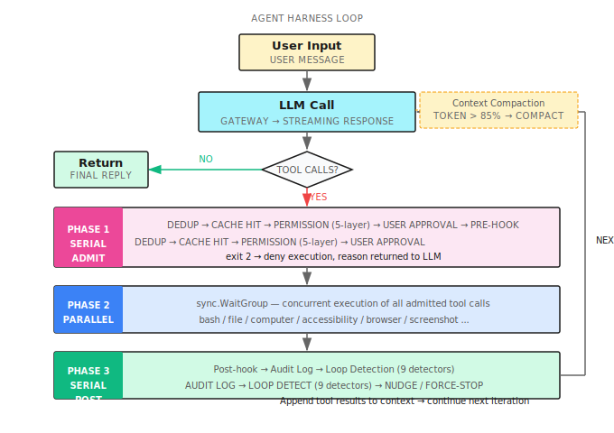

# Chapter 32: The OpenClaw Era

> **The heart of a local Agent Harness is not how powerful the tools are — it's how reliable the loop is. An Agent that runs 100 steps on your local machine without crashing is far more useful than one that runs 10 steps but hallucinates on step 11.**

---

> **Quick Track** (Master the core in 5 minutes)
>
> 1. The OpenClaw Era = local autonomous Agent + computer control + programmable hooks
> 2. Agent Harness = event-driven for loop: LLM call → tool execution → context append → loop detection
> 3. Computer control, two paths: Accessibility Tree (semantic, precise) vs coordinate clicking (universal but brittle)
> 4. Hooks = 4 event points (PreToolUse / PostToolUse / SessionStart / Stop), exit 2 blocks execution
> 5. Permission engine, 5 layers: hard block → config deny → composite command decomposition → config allow → user approval
> 6. 9 loop detectors: from duplicate calls to search escalation — prevents the Agent from spinning in place
>
> **10-Minute Path**: 32.1 → 32.3 → 32.4 → 32.5 → Shan Lab

---

## 32.1 The Day Claude Code Arrived

At the end of 2024, Anthropic released Claude Code.

I stared at that terminal interface for a long time. An AI autonomously reading files, editing code, and running tests — on my macOS, not in a cloud sandbox. Real projects. Real code. Real CI.

That same week, I watched an OpenClaw demo: AI taking over a browser, clicking through interfaces, filling out forms, confirming with screenshots.

This wasn't a remote API call. This was **AI running locally, controlling a local computer**.

That moment, I realized a new paradigm had begun — the **OpenClaw Era**.

OpenClaw doesn't refer to any specific product. It names an architectural pattern: an AI Agent runs a continuous loop on the user's local machine, completing tasks by calling local tools (filesystem, shell, GUI control), fully auditable, interruptible, and extensible.

This chapter is about how to build that.

---

## 32.2 What Is the OpenClaw Era?

### Three Representatives

In 2025, tools of this class arrived in a wave:

| Product | Vendor | Core Capability |
|---------|--------|-----------------|
| Claude Code | Anthropic | Terminal + code Agent, local file operations |
| Devin | Cognition | Cloud VM + full development environment |
| OpenClaw | Open-source community | Local browser + screen control Agent |
| shan | Kocoro | Local macOS Agent, Shannon ecosystem CLI |

What they share: **Agents don't just answer questions — they take action**.

### Why Local-First

Compared to cloud sandboxes, local Agents have three irreplaceable advantages:

**1. Access to local state**: Logged-in accounts, local databases, private certificates, internal services behind a corporate VPN — cloud Agents can't reach these; local Agents use them directly.

**2. Native GUI control**: The macOS Accessibility API exposes full application UI state (button labels, input field contents, menu hierarchies) with more precision than web DOM and more reliability than screenshots. Coordinate clicking is a last resort; semantic APIs are the right approach.

**3. Real-time user visibility**: The Agent operates on screen. The user can observe and interrupt at any point. Transparency is the prerequisite for trust.

### The Cost

Local Agents come with a cost: **complex security boundaries**.

Cloud sandbox security is simple — container isolation, destroy when done. Local Agents have no isolation boundary. A single `rm -rf ~` command causes irreversible loss. You have to build permission controls actively.

That's why a well-designed OpenClaw implementation isn't just about "what it can do" — it carefully engineers "what it must not do."

---

## 32.3 Agent Harness: The Skeleton of the Loop

The core technology of the OpenClaw Era is the **Agent Harness** — the execution framework that keeps an Agent running continuously.

At its core, it's a `for` loop:

```
for i := 0; i < maxIter; i++
    ├── Call LLM, get response
    ├── If no tool calls → return final text
    └── If tool calls → execute tools → append results → continue
```

But going from that skeleton to production-ready involves a lot of detail.



### Three-Phase Execution Model

Every iteration that includes tool calls is handled in three phases:

**Phase 1: Serial Admission** (each tool call checked in sequence)
- Deduplication: identical tool calls within the same response execute only once
- Cross-iteration cache: results from successful calls in the previous round are reused directly, not re-executed
- Permission check: 5-layer engine (see 32.5)
- User approval: tools requiring approval pause and wait
- Pre-hook: the hook can block execution here (see 32.4)

**Phase 2: Parallel Execution** (tools that passed admission run concurrently)

A single LLM response can contain multiple tool calls. Once admitted, they run concurrently with `sync.WaitGroup`, without blocking each other.

**Phase 3: Serial Post-processing** (results handled in sequence)
- Run Post-hook
- Write audit log
- Loop detection (9 detectors, see 32.6)
- Append tool results to the conversation context

The key design insight: **serial admission guarantees safety, parallel execution guarantees efficiency, serial post-processing guarantees consistency**.

### Context Compaction

Long tasks grow the context continuously until it exceeds the LLM's limit.

shan checks token estimates before each LLM call:

```
if current tokens > contextWindow * 0.85:
    call LLM to generate a conversation summary
    replace intermediate history with the summary
    retain: summary + recent turns + original task description
```

85% is not a precise value — it's an empirical one. It leaves 15% for tool results and the next response, avoiding truncation.

**Key detail**: The summary is itself an LLM call, which can fail. shan tracks consecutive failures. After more than 3 failures, it pauses compaction for 5 iterations and waits for the context to shrink naturally.

### Progress Checkpoints

Long tasks drift. The Agent keeps working and eventually forgets the original goal.

shan injects a self-check prompt into the context when the iteration count reaches 60% of the maximum:

```
Progress checkpoint: What task are you currently executing?
What steps have you already completed?
What should you do next?
Are you still moving toward the original goal?
```

This is not human-in-the-loop. It's **forced self-reflection by the Agent**.

### Anti-Hallucination Mechanism

Models sometimes "pretend to call tools" — they write the tool call format in their text response instead of actually triggering it.

shan detects this pattern and sends the model a corrective message:

```
You just wrote a tool call in plain text instead of actually invoking it.
Please regenerate using a real tool call.
```

This prevents the model from using "pretend I did it" to bypass actual execution.

---

## 32.4 The Local Tool Layer: Two Paths to Computer Control

shan supports two modes of local computer control, each suited to different scenarios.

### Path 1: Accessibility Tree (Recommended)

The macOS Accessibility API (AXUIElement) exposes the complete UI semantic tree of every application: button labels, input field contents, checkbox states, menu structure. Every UI element has a semantic identifier independent of screen coordinates.

The rough flow for reading the UI tree:

```
1. Find the target app's PID (via System Events AppleScript)
2. Get the app's root AXUIElement
3. Recursively traverse the UI tree, extracting element attributes
4. Return a JSON tree with reference IDs (e.g. "e14")
5. Subsequent operations (click/press/set_value) target elements by reference ID
```

Advantage: **semantically reliable, unaffected by resolution and display scaling**. A "Submit" button, regardless of screen resolution, points to the same button through its reference ID.

Disadvantage: **requires Accessibility permissions**, and not every app fully exposes its AX tree (Electron app support varies significantly).

Code reference: [`accessibility.go`](https://github.com/Kocoro-lab/shan)

### Path 2: Coordinate Control (Fallback)

Uses the macOS Quartz Event Services API to send mouse and keyboard events directly to screen coordinates.

```
click(x=450, y=320)
type(text="Hello")
hotkey(keys=["command", "s"])
```

After each operation, a screenshot is taken automatically (500ms delay) so the LLM can verify whether the action succeeded.

**Retina screen handling**: macOS logical resolution differs from physical resolution. shan automatically detects the scaling factor and converts coordinates, avoiding click offset.

**Text input**: Short text (20 characters or less) uses `osascript keystroke`; longer text is injected via clipboard (save original content → write new content → cmd+v paste → restore original), avoiding character loss from keyboard simulation.

### The Screenshot Feedback Loop

GUI operations inherently require "seeing" the result before deciding the next step. shan's screenshot tool:
- Supports three modes: full screen, specific window (by PID), and specific region
- Compresses to a maximum width of 1200px and passes to the LLM as base64 PNG
- Automatically cleans up old screenshots: keeps only the 5 most recent, preventing context explosion

Internally, GUI-intensive tasks (screenshot, computer, accessibility, browser) automatically receive a higher iteration limit — because operating a GUI inherently requires more steps.

### Browser Control

shan's browser tool has two backends:

| Backend | Mechanism | Use Case |
|---------|-----------|----------|
| Pinchtab | External browser service HTTP API | Preferred, more stable |
| chromedp | Embedded headless Chrome | Fallback when Pinchtab unavailable |

Key design: **an isolated browser profile**, completely separate from the user's own browser session. What the Agent browses does not affect the user's cookies or history.

The browser tool's `snapshot` operation also returns an AX tree (with reference IDs). Subsequent `click`/`type` operations work by reference rather than coordinates, significantly improving stability.

---

## 32.5 Hooks: Programmable Event Points

Hooks are the signature feature of the OpenClaw Era architecture — letting users inject custom logic at critical moments during Agent execution.

Chapter 6 covered Shannon's server-side Hooks design. This section covers **shan's local CLI hook system**: lighter weight, closer to the user.

### 4 Event Points

| Event | When It Fires | Can Block Execution? |
|-------|---------------|----------------------|
| `PreToolUse` | After permission check, before tool execution | **Yes** (exit 2) |
| `PostToolUse` | After tool execution completes | No |
| `SessionStart` | When a session begins | No |
| `Stop` | When a session ends | No |

### Configuration

Configure hooks in `.shannon/config.yaml`:

```yaml
hooks:
  PreToolUse:
    - matcher: "bash"
      command: ".shannon/hooks/check-bash.sh"
  PostToolUse:
    - matcher: "file_edit|file_write"
      command: ".shannon/hooks/post-edit.sh"
  SessionStart:
    - command: ".shannon/hooks/on-start.sh"
  Stop:
    - command: ".shannon/hooks/on-stop.sh"
```

`matcher` is a regular expression that matches against tool names. An empty matcher matches all tools.

### Hook Protocol

Hook scripts receive JSON on stdin:

```json
{
  "event":         "PreToolUse",
  "tool_name":     "bash",
  "tool_input":    {"command": "rm -rf ./tmp"},
  "tool_response": null,
  "session_id":    "sess_abc123"
}
```

Exit code conventions:
- `0` = allow
- `2` = **deny** (PreToolUse only; stderr content is returned to the LLM as the rejection reason)
- Any other non-zero = warning, but does not block

### A Real Example: Preventing Deletion of Production Config

```bash
#!/bin/bash
# .shannon/hooks/check-bash.sh

INPUT=$(cat)
COMMAND=$(echo "$INPUT" | python3 -c "import sys,json; d=json.load(sys.stdin); print(d['tool_input']['command'])")

if echo "$COMMAND" | grep -q "prod.*\.env\|\.env\.production"; then
    echo "Denied: operations on production environment config files are not permitted" >&2
    exit 2
fi

exit 0
```

When the LLM attempts to execute `cat .env.production`, this hook intercepts it and passes the rejection reason back to the LLM. The LLM knows why it was denied and can adjust its strategy.

### Security Constraints

Hook commands have strict path restrictions:
- Must use relative paths starting with `./`, or absolute paths under `~/.shannon/`
- Bare command names resolved via PATH (such as `python`) are rejected — preventing PATH hijacking attacks

Hooks time out after 10 seconds, with output capped at 10KB. On timeout, the entire process group is forcibly terminated.

---

## 32.6 Permission Engine: 5 Layers of Defense

A local Agent's security boundary is maintained by the permission engine. shan's design is **5 layers of serial decision-making**:

```
Tool call request
     │
     ▼
Layer 1: Hard-blocked constants
     │ rm -rf /, rm -rf ~, dd if=* of=/dev/*, curl * | sh...
     │ → Permanently denied, not overridable
     ▼
Layer 2: Config deny list
     │ permissions.denied_commands: ["git push --force", "*.prod.*"]
     │ → Denied
     ▼
Layer 3: Composite command decomposition
     │ cmd1 && cmd2 || cmd3 | cmd4
     │ Each sub-command checked independently; any denied → whole denied
     │ All explicitly allowed → whole allowed
     ▼
Layer 4: Config allow list
     │ permissions.allowed_commands: ["go test ./...", "npm run *"]
     │ → Auto-allowed
     ▼
Layer 5: User approval
       → Pause, wait for user y/n
```

### Safe Command Whitelist

Certain commands are marked as requiring no approval: `ls`, `pwd`, `git status`, `git diff`, `git log`, `go build`, `go test`, `make`, `cargo test`, and others.

But one rule **cannot be bypassed**: commands containing shell operators (`&&`, `|`, `>`, backticks, `$(...)`) never enter the whitelist. They must go through user approval or the config allow list.

```
ls -la ./          → auto-allowed (safe command)
ls -la | grep .go  → requires approval (contains pipe)
go test ./...      → auto-allowed
go test ./... && rm -rf ./tmp → requires approval (composite command)
```

### Additional Checks by Tool Type

Different tool types have their own dedicated checks:
- **bash**: command content check (the 5 layers above)
- **file_read/write/edit**: path check (symlink resolution, sensitive file pattern matching: `~/.ssh/*`, `*.pem`, `*credentials*`, etc.)
- **http**: network egress check (localhost always allowed; external domains require the allow list or user approval)

---

## 32.7 Loop Detection: 9 Detectors

An Agent getting stuck in a loop is one of the hardest problems in OpenClaw architecture.

Under certain conditions, models repeatedly try the same thing — not a bug, but the model's excessive optimism about "maybe it will work if I try again." You need to detect and intervene before the loop spirals out of control.

shan maintains a sliding window of the last 20 tool calls and analyzes it with 9 detectors in parallel. Each detector returns one of three results: `Continue` (normal), `Nudge` (send a warning to the LLM), or `ForceStop` (terminate the loop immediately).

| Detector | Trigger Condition | Result |
|----------|-------------------|--------|
| ConsecutiveDuplicate | Same tool + args called 2 times in a row | Nudge → ForceStop |
| ExactDuplicate | Same tool + args appears 3 times in the window | Nudge → ForceStop |
| SameToolError | Same tool errors 4 consecutive times | Nudge → ForceStop |
| FamilyNoProgress | Same tool family called 3/5/7 times on same topic | Nudge → ForceStop |
| SearchEscalation | 3 consecutive calls to search-type tools | Nudge (5 → ForceStop) |
| NoProgress | Any tool repeated 8+ times | Nudge → ForceStop |
| ToolModeSwitch | Visual tool called immediately after successful GUI op | Nudge |
| SuccessAfterError | Recovery op after a visual tool error | Nudge |
| Sleep | `sleep` called in bash (2/4 times) | Nudge → ForceStop |

### Nudge vs ForceStop

**Nudge**: Inject a prompt into the conversation context telling the LLM it has entered a repetitive pattern. The LLM gets a chance to adjust strategy.

**ForceStop**: Inject a prompt, then make one final LLM call without tools, letting the model summarize the current state, then exit the loop.

If Nudge triggers more than 3 consecutive times, it automatically escalates to ForceStop.

### Why So Many Detectors?

Because loops come in many patterns.

The simplest is ConsecutiveDuplicate: the Agent keeps calling `file_read("config.json")`.

More subtle is SearchEscalation: the Agent searches Google for "Python version," finds nothing, searches "Python3 version," finds nothing, searches "Python latest version" — when it clearly should try a different approach, it keeps spinning within the search family.

FamilyNoProgress catches the pattern of "same type of tool circling the same topic" — even when the parameters vary slightly each time.

The Sleep detector seems odd but has real value: models sometimes write `sleep 5 && retry`, which usually means they're waiting for an external state that will never change — a precursor to getting stuck in a waiting loop.

---

## 32.8 Putting It Together: A Complete Local Agent Execution

Now let's put all the components together and trace a complete local Agent execution:

```
User: Collect all TODO comments in the project into a single issues.md

── Iteration 1 ──────────────────────────────────────
  LLM call
  └→ tool: bash, args: {command: "grep -rn 'TODO' ./src"}

  Phase 1 (Admission):
    Dedup check: first call, pass
    Permission check: Layer 4 (grep is in safe command list) → auto-allowed
    Pre-hook: no matching hook, pass

  Phase 2 (Execution):
    bash.Run() → returns 47-line TODO list

  Phase 3 (Post-processing):
    Post-hook: no match
    Audit log: bash call recorded
    Loop detection: normal, Continue
    Append results to context

── Iteration 2 ──────────────────────────────────────
  LLM call
  └→ tool: file_write, args: {path: "issues.md", content: "..."}

  Phase 1 (Admission):
    Permission check: Layer 5 (file_write not in auto-allow list) → user approval
    User: y
    Pre-hook: matches "file_edit|file_write" → execute post-edit.sh
    Hook exit code: 0 → allow

  Phase 2 (Execution):
    file_write.Run() → file written successfully

  Phase 3 (Post-processing):
    Post-hook: execute post-edit.sh (records modified file)
    Audit log: file_write call recorded
    ReadTracker: notes issues.md was written (future reads bypass cache)

── Iteration 3 ──────────────────────────────────────
  LLM response contains no tool calls
  └→ "Organized 47 TODOs into issues.md, grouped by module."

  Check: no truncation, no hallucination, not a checkpoint follow-up
  Return final text
```

The full execution: 3 iterations, 1 user approval, complete audit log throughout.

---

## 32.9 Local-First, Cloud-Collaborative

shan makes one design choice worth calling out separately: **local tool execution + remote LLM inference**.

LLM calls go through Shannon Gateway (cloud). Tool execution stays local.

This matches Claude Code's model (model calls go through Anthropic's API; tools run locally).

This separation has three benefits:

1. **Compute separation**: LLM inference runs most efficiently on specialized hardware; local execution on user hardware has full permissions
2. **Data boundary**: Sensitive data like file contents and command output stays under your control — you decide what to send to the LLM
3. **Offline degradation**: In principle, you can swap in a local LLM (Ollama, etc.) and the tool layer doesn't need to change

But it also means: **shan is a thin client**. The core orchestration logic (Agent Harness) lives on the client, but the LLM's reasoning capability depends on the network.

For unstable network scenarios, shan implements exponential backoff retry, and on repeated failures exits gracefully with the best result available rather than crashing.

---

## 32.10 Three Design Principles for the OpenClaw Era

Looking back at everything in this chapter, three core principles emerge for building a local Agent Harness:

**Principle 1: Safety is an architectural constraint, not a feature**

The permission engine isn't a security feature bolted on afterward — it's a mandatory checkpoint in the entire tool call pipeline. Like a compiler's type system: you can't bypass it, and you shouldn't want to. The hard-blocked command list is non-configurable by design.

**Principle 2: Loop detection is the core of Agent reliability**

The best measure of an Agent Harness's quality isn't "how complex a task can it handle" — it's "does it exit gracefully when a task fails." The 9 detectors guard that baseline: they teach the Agent to know when to stop trying.

**Principle 3: Hooks are the user's control surface, not the AI's**

Hooks don't exist to make the Agent more powerful. They exist so **users** can inject their own business logic into the Agent's flow without touching the Agent's own code. This is user sovereignty — your Agent, your rules.

---

## Shan Lab (10-Minute Quickstart)

This chapter corresponds to the `shan` CLI tool in the Shannon ecosystem. Code and documentation live at [https://github.com/Kocoro-lab/shan](https://github.com/Kocoro-lab/shan).

### Required Reading (2 files)

- [`internal/agent/loop.go`](https://github.com/Kocoro-lab/shan) — The core implementation of the Agent Harness. Focus on: the three-phase execution model, context compaction trigger conditions (85% threshold), progress checkpoint logic, and anti-hallucination detection.

- [`internal/hooks/hooks.go`](https://github.com/Kocoro-lab/shan) — Implementation of the 4 event points. Focus on: the hook protocol (stdin JSON + exit code), the exit 2 denial mechanism, and recursive protection (the `inHook` mutex).

### Optional Deep Dives (2 files)

- [`internal/agent/loopdetect.go`](https://github.com/Kocoro-lab/shan) — The complete implementation of all 9 loop detectors. Understand the trigger conditions and escalation logic for Nudge and ForceStop.

- [`internal/permissions/permissions.go`](https://github.com/Kocoro-lab/shan) — The 5-layer permission engine. Focus on the hard-block list (the design decision to make it non-configurable) and the composite command decomposition logic.

---

## Further Reading

- [Claude Code Engineering Deep Dive](https://www.anthropic.com/engineering/claude-code-deep-dive) — Anthropic's official in-depth look at Claude Code's architecture
- [OpenClaw Project](https://github.com/opencolaw/opencolaw) — The community open-source OpenClaw implementation
- [macOS Accessibility API Guide](https://developer.apple.com/documentation/appkit/nsaccessibility) — Official AXUIElement API documentation
- [Anthropic Computer Use Documentation](https://docs.anthropic.com/en/docs/build-with-claude/computer-use) — Claude's native computer control capabilities

---

## Exercises

### Exercise 1: Design Your First Hook

You're building an Agent that helps process customer data. Design a hook configuration that:
- Prevents the Agent from reading files containing "private" or "secret" in their names
- Logs every bash command execution to a local log file after it runs
- Sends a desktop notification when the session ends

Write the configuration YAML and the corresponding hook script logic.

### Exercise 2: Extend the Loop Detectors

None of the 9 existing detectors specifically handles "network timeout retries" — an Agent repeatedly retrying the same URL after an http tool times out.

Design a 10th detector, `NetworkRetryStorm`:
- What are the trigger conditions?
- How would you write the Nudge message?
- Under what circumstances should it escalate to ForceStop?

### Exercise 3 (Advanced): Accessibility Tree Traversal

The macOS AXUIElement tree can be extremely deep, and naive recursive traversal can easily overflow the LLM's context limit.

Read the truncation logic in `accessibility.go` and answer:
1. How does it decide which elements to truncate?
2. Does the truncated output still support reference ID operations?
3. If you need to find a deeply nested element, what's the right approach?

---

## Key Takeaways

The OpenClaw Era is about: **placing reliable execution infrastructure in the hands of an autonomously running Agent**.

Core points:

1. **Agent Harness = three-phase loop**: serial admission → parallel execution → serial post-processing
2. **Computer control: prefer the AX Tree**: semantically reliable, immune to resolution changes
3. **Hooks are the user's control surface**: exit 2 is the most powerful single line of code
4. **5-layer permission engine**: safety is an architectural constraint, hard blocks cannot be bypassed
5. **9 loop detectors**: the core of reliability — graceful failure is worth more than infinite retry
6. **85% threshold triggers compaction**: the lifeline for long-running tasks

**The OpenClaw Era isn't stopping**. As local AI models grow stronger, local Agent Harnesses will only become more important — not just thin clients calling cloud LLMs, but genuine AI colleagues running autonomously on your machine.

See you in the next chapter.

---

## What's Next

This is the final main chapter of the book.

If you've made it this far — you've walked the complete path from Agent fundamentals to the OpenClaw Era.

Appendix A is the book's core glossary. Appendix B is the pattern selection decision tree. Appendix C answers 27 frequently asked questions.

One suggestion: put the book down and build something.

Any pattern from any chapter, turned into something that actually runs, is worth more than reading this book a second time.

See you out there.
