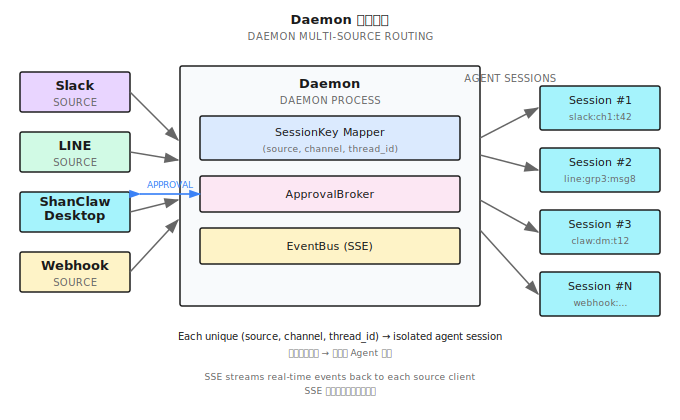

# Chapter 33: Building on the Harness — ShanClaw

> **A harness that only runs one agent in one session is a prototype. A platform runs many agents, remembers across sessions, and serves multiple channels.**

---

> **Quick Track** (Master the core in 5 minutes)
>
> 1. ShanClaw = Chapter 32's Harness + platform layer (Named Agents, Skills, Memory, Daemon, MCP)
> 2. Concentric ring model: who's running (Agents) → what they know (Skills/Memory/Sessions) → when and where they run (Daemon/Scheduler/Watcher) → how they connect (MCP/Cloud)
> 3. Named Agents = each Agent gets its own config (model, tools, MCP servers, Skills, Memory)
> 4. Memory = bounded append + automatic overflow + LLM-driven GC
> 5. Daemon mode = Agent-as-a-service, multi-source routing (Slack/LINE/webhook)
> 6. MCP = ecosystem interop (consumer + producer); Cloud Delegation = local-remote collaboration
>
> **10-Minute Path**: 33.1 → 33.2 → 33.4 → 33.6 → Shan Lab

---

## 33.1 From Harness to Platform

Chapter 32 showed the skeleton of an Agent Harness: a `for` loop driving LLM call → tool execution → context append → loop detection. Once that loop is running, you have a local Agent that can autonomously execute tasks.

But that Agent has three hard limits:

1. **Single persona**: One system prompt, one tool configuration. Switching between code review and literature research means manual reconfiguration.
2. **Single session, no memory**: Every launch is a blank slate. Last week's findings, yesterday's agreements — all gone.
3. **Single-user CLI**: Only the person at the terminal can trigger it. A Slack message comes in? It has no idea.

The question is: **what do you need to build on top of that loop to make it a real product?**

The answer is four concentric rings:


- **Ring 1**: Named Agents — who's running
- **Ring 2**: Skills / Memory / Sessions — what they know
- **Ring 3**: Daemon / Scheduler / Watcher — when and where they run
- **Ring 4**: MCP / Cloud — how they connect to the outside

Each ring extends the ones inside it without replacing them. Named Agents in Ring 1 still run Chapter 32's Harness loop. The Daemon in Ring 3 still uses Ring 1's Named Agents to handle each message. Concentric rings are additive, not a rebuild.

This chapter uses ShanClaw (open source) as the reference implementation, unpacking one ring at a time. All code lives at: https://github.com/Kocoro-lab/ShanClaw

---

## 33.2 Named Agents: One Harness, Multiple Personas (Ring 1)

Chapter 32's Harness ran an anonymous Agent — it loaded a default configuration at startup and left nothing behind when it finished. The core idea of Named Agents is: **one binary, multiple personas**.

### Directory Structure

Each Named Agent gets its own file directory:

```
~/.shannon/agents/
├── code-reviewer/
│   ├── AGENT.md            # System prompt (equivalent to CLAUDE.md)
│   ├── config.yaml         # Model, tools, MCP, iteration limit
│   ├── MEMORY.md           # Persistent memory
│   ├── commands/           # Agent-specific Skills
│   │   └── review.md
│   └── _attached.yaml      # Attached file list
├── research/
│   ├── AGENT.md
│   ├── config.yaml
│   ├── MEMORY.md
│   └── commands/
│       └── deep-dive.md
└── ops-bot/
    ├── AGENT.md
    ├── config.yaml
    └── MEMORY.md
```

### Configuration Differences

Different Agents have very different `config.yaml` files:

```yaml
# code-reviewer/config.yaml
model: claude-sonnet-4-20250514
max_iterations: 30
tools:
  allowed: ["bash", "file_read", "file_edit", "grep", "glob"]
  denied: ["file_write", "http"]     # Reviewer doesn't need to write files or make requests
mcp_servers: []
auto_approve: false

# research/config.yaml
model: claude-opus-4-20250514
max_iterations: 80
tools:
  allowed: ["bash", "http", "file_write", "file_read"]
  denied: ["file_edit"]              # Researcher doesn't modify code
mcp_servers:
  - name: "playwright"
    command: "npx"
    args: ["@anthropic-ai/mcp-playwright"]
auto_approve: true                   # Trusted background Agent
```

Same Harness loop, two completely different brains.

Key configuration fields:
- `model`: The LLM model the Agent uses. Research tasks get a high-reasoning model, code review gets a fast one — cost and latency can differ by 10x
- `max_iterations`: Maximum iterations for the Harness loop. GUI-intensive and research tasks need more steps
- `tools.allowed / denied`: Tool whitelist and blacklist. **Principle of least privilege** — the Agent only gets the tools it needs
- `auto_approve`: Skips the Layer 5 user approval prompt, but hard-blocks and `denied_commands` are still enforced. Only enable for fully trusted background Agents

### SwitchAgent: Runtime Switching

`SwitchAgent` is the core operation — switching the Harness from one Agent to another at runtime:

```
SwitchAgent("research")
├── Load research/AGENT.md → replace system prompt
├── Load research/config.yaml → replace model, iteration limit
├── Load research/MEMORY.md → inject persistent memory
├── Rebuild tool registry → register only tools in the allowed list
├── Connect MCP servers → start playwright
└── Load research/commands/ → register Agent-specific Skills
```

**Same loop, different brain.** The loop itself (three-phase execution, permission engine, loop detection) stays completely unchanged.


### Isolation Principles

Named Agents are strictly isolated from each other:

- **Session isolation**: Each Agent maintains its own conversation history
- **Memory isolation**: Separate MEMORY.md files, invisible to each other
- **MCP isolation**: Agent A's MCP servers don't appear in Agent B's tool list
- **Approval isolation**: An Agent with `auto_approve: true` doesn't affect other Agents' approval policies

One Harness binary, through Named Agents, becomes a runtime for an entire Agent team.

### Config Merge Strategy

Agent configuration doesn't exist in isolation — it merges with the global config (`~/.shannon/config.yaml`):

```
Global config.yaml         Agent config.yaml          Effective
├── model: haiku     ←── model: opus          →   opus (Agent overrides)
├── max_iterations: 50 ← (not specified)      →   50 (inherited from global)
├── tools.denied: [http] ← tools.denied: []   →   [] (Agent overrides)
└── mcp_servers: [fs]  ← mcp_servers: [pw]    →   [fs(_inherit), pw]
```

The rule: Agent-level config overrides global config, but global MCP servers marked with `_inherit: true` are always retained. This lets administrators force all Agents to share certain infrastructure tools.

---

## 33.3 Skills: Hot-Pluggable Capability Modules (Ring 2a)

Skills are the capability extension mechanism for Named Agents. Not functionality hardcoded in source, but Markdown files that can be added, removed, or replaced at any time.

### SKILL.md Format

Each Skill is a Markdown file with YAML frontmatter:

```markdown
---
name: "code-review"
description: "Review code changes, check for style, security, and performance issues"
allowed_tools: ["bash", "file_read", "grep", "glob"]
metadata:
  category: "development"
  version: "1.0"
---

# Code Review Skill

When the user asks for a code review, follow these steps:

1. Run `git diff` to see changes
2. Review each file, focusing on:
   - Security vulnerabilities (SQL injection, XSS, hardcoded keys)
   - Performance issues (N+1 queries, unnecessary loops)
   - Code style (naming, structure, comments)
3. Output a structured report

## Reference Script

Run `scripts/lint-check.sh` for static analysis results.
```

### Three Priority Levels

Skills are loaded from three locations, highest to lowest priority:

| Level | Location | Description |
|-------|----------|-------------|
| Agent-specific | `~/.shannon/agents/<name>/commands/*.md` | Only available to that Agent |
| Global shared | `~/.shannon/skills/*.md` | Shared across all Agents |
| Built-in | Embedded in binary | Default Skills shipped with ShanClaw |

Same-named Skills at a higher priority level override lower ones.

### Exposure Mechanism

Skills become visible to the LLM in two ways:

1. **Table of contents in the system prompt**: Names and descriptions of all available Skills, injected at the end of the system prompt
2. **`use_skill` tool**: When the LLM calls this tool, the full content of the corresponding Skill is injected into the conversation context

The design rationale: **Skills are not preloaded all at once**. Only when the LLM actively chooses to use a Skill does its full content get injected. This saves system prompt token budget.

### Skills vs. System Prompt

The difference between Skills and AGENT.md: AGENT.md defines the Agent's identity and general behavior guidelines ("you are a code review expert"), while Skills define specific operational procedures ("when reviewing code, follow these 3 steps").

AGENT.md is injected into the system prompt when the Agent starts. Skills are only injected when invoked via `use_skill` — this is **lazy loading**. An Agent might have 20 Skills configured, but a single session only uses 2-3, saving a significant amount of tokens.

### Path Rewriting

Relative paths referenced in Skill files (`scripts/lint-check.sh`, `references/style-guide.md`) are automatically rewritten to absolute paths — based on the directory containing the Skill file. This lets Skills be packaged as self-contained directories that work correctly when copied anywhere.

---

## 33.4 Memory: Persistence Across Sessions (Ring 2b)

Memory solves the Agent's "goldfish memory" problem — every time a session ends, all discoveries, decisions, and preferences disappear.

### The `memory_append` Tool

When an Agent discovers important information during a session (project conventions, user preferences, key decisions), it can call `memory_append` to write to MEMORY.md:

```
memory_append(content="User preference: Go projects use slog instead of logrus")
```

Write operations are protected by `flock` file locking — multiple sessions may concurrently write to the same Agent's MEMORY.md.

### Bounded Append

MEMORY.md doesn't grow without limit. ShanClaw sets a 150-line cap:

```
Write request arrives
     │
     ▼
Current lines + new content lines ≤ 150?
     ├── Yes → Append directly to end of MEMORY.md
     └── No  → Overflow procedure
              ├── Write the overflowing new content to auto-YYYY-MM-DD-<hex>.md detail file
              ├── Append a pointer line to the end of existing MEMORY.md:
              │   "- [2025-03-28] See [auto-2025-03-28-a1b2.md](auto-2025-03-28-a1b2.md) for details"
              └── MEMORY.md itself is never renamed or cleared — it accumulates pointer lines
```

Overflow files carry a timestamp and 6-char random suffix to avoid collisions. The pointer lines at the end of MEMORY.md tell the Agent: **there's more memory, in the detail files**.


### Write-Before-Compact

Chapter 32 mentioned that long tasks trigger context compaction — replacing intermediate history with a summary. But compaction loses detail.

ShanClaw runs a small model (typically Haiku) before each compaction to scan the context about to be compressed and extract persistent facts:

```
PersistLearnings flow:
1. Send the conversation segment about to be compressed to the small model
2. Prompt: extract user preferences, project conventions, key findings, to-dos
3. Small model returns a structured fact list
4. Call memory_append to write to MEMORY.md
5. Then execute normal context compaction
```

This ensures "save before you forget" — details lost to compaction are at least partially preserved in persistent memory.

Why a small model? Because PersistLearnings fires on every compaction, which can be frequent. Using the primary model (say, Opus) for this would be unreasonable in both cost and latency. A small model (like Haiku) performs well enough on simple tasks like "extract facts from a conversation" and is both fast and cheap.

### ConsolidateMemory

Overflow files accumulate over time. ShanClaw uses LLM-driven GC (garbage collection) to clean them up:

```
Trigger condition: auto-*.md files ≥ 12 AND ≥ 7 days since last consolidation (tracked via .memory_gc marker file)

ConsolidateMemory flow:
1. Read all auto-*.md files
2. Read current MEMORY.md
3. Call LLM: merge, deduplicate, remove outdated information
4. Preserve manually written memory entries (entries marked [user] are not deleted)
5. Write merged result back to MEMORY.md
6. Delete the merged auto-*.md files
```

This isn't simple file concatenation — the LLM understands semantics, removes duplicates ("user prefers slog" appearing 5 times becomes 1), and deletes stale temporary information ("meeting tomorrow" — if the date has passed, delete it).

### The Complete Memory Lifecycle

Putting these three mechanisms together:

```
During a session
├── Agent discovers important info → memory_append writes to MEMORY.md
├── Context getting full → PersistLearnings extracts facts → memory_append
│                          → then compact the context
├── MEMORY.md exceeds 150 lines → BoundedAppend overflows to auto-*.md
└── auto-*.md count ≥ 12 and oldest ≥ 7 days → ConsolidateMemory merges and cleans

Next session startup
└── Load MEMORY.md into system prompt → Agent remembers key info from last time
```

This cycle ensures: **short-term discoveries are saved promptly, long-term memory is periodically organized, and every startup carries context**.

---

## 33.5 Session Search: Queryable History (Ring 2c)

Memory stores distilled knowledge. But sometimes the Agent needs to search raw conversations — "last Thursday I asked you to analyze that performance issue, what was the conclusion?"

### Persistence Format

When each session ends, the complete conversation is persisted in JSON format:

```json
{
  "session_id": "sess_20250328_a1b2c3",
  "agent": "code-reviewer",
  "started_at": "2025-03-28T10:30:00Z",
  "messages": [...],
  "tool_calls": [...],
  "summary": "Reviewed the auth module PR #42, found 3 security issues"
}
```

### FTS5 Index

At persistence time, key fields are indexed into a SQLite FTS5 full-text search engine:

- Session summary
- User message content
- Agent final response
- Tool call commands and output (truncated to reasonable length)

### The `session_search` Tool

Agents can search their own session history:

```
session_search(query="performance analysis auth module")
```

This returns a list of matching session summaries, sorted by relevance. The Agent can then drill into a specific session's full content.

### Why FTS5 Instead of grep?

| Dimension | File grep | SQLite FTS5 |
|-----------|-----------|-------------|
| Search speed | O(n) full file scan | O(log n) inverted index |
| Fuzzy matching | Regex, manual | Automatic tokenization, prefix matching |
| Cross-file | Requires glob + grep combo | Single SQL query |
| Structured filtering | Difficult | WHERE agent = 'code-reviewer' AND date > '2025-03' |

Once session counts exceed a few hundred, FTS5's advantage becomes clear.

### Scheduled Execution Indexing

Results from scheduled tasks (33.7) and heartbeat checks (33.8) are also indexed into Session Search. This means an Agent can query "what did the CI check find last Friday" or "were there any anomalies in the last 3 heartbeat checks."

Automatically executed sessions are tagged with `source: schedule` or `source: heartbeat`, enabling filtering by origin.

### Isolation

Session Search follows the Named Agent isolation principle: each Agent can only search its own session history. `code-reviewer` cannot see `research`'s sessions.

---

## 33.6 Daemon Mode: Agent-as-a-Service (Ring 3a)

Up to this point, every feature assumed one prerequisite: someone is at the terminal running `shan`. Daemon mode breaks that assumption — **the Agent becomes a long-running service**.

### Architecture

```
shan --daemon
     │
     ├── WebSocket service (localhost:port)
     │   └── Bidirectional: message input + streaming output
     ├── HTTP API (localhost:port)
     │   └── RESTful interface: create sessions, send messages, query status
     └── SSE EventBus
         └── Real-time event stream: tool calls, approval requests, state changes
```



### Multi-Source Routing

The Daemon's core capability is **multi-source routing** — messages from different channels are routed into the same Harness:

```
Slack Bot ──────┐
                │
LINE Webhook ───┤
                ├──→ Daemon ──→ SessionRouter ──→ Harness
Desktop App ────┤         SessionKey = (source, channel, thread_id)
                │
HTTP API ───────┘
```

Each message carries a `SessionKey`, composed of three parts:

- **source**: Message origin (slack/line/desktop/api)
- **channel**: Channel or chat ID
- **thread_id**: Thread ID (different conversations within the same channel)

### SessionCache

The Daemon maintains a `SessionCache`, indexed by SessionKey:

The routing key is a formatted string computed by `ComputeRouteKey()`:

```go
// Conceptual pseudocode — see internal/daemon/router.go for actual implementation
func ComputeRouteKey(agentName, source, channel string) string {
    if agentName != "" {
        return "agent:" + agentName    // Route to a specific Agent
    }
    return "default:" + source + ":" + channel  // Route by source + channel
}

type SessionCache struct {
    mu       sync.Mutex
    routes   map[string]*routeEntry   // Key is the return value of ComputeRouteKey
    managers map[string]*session.Manager
}
```

Consecutive messages from the same source and channel hit the same `routeEntry` — conversation context stays continuous rather than starting from scratch each time.

### ApprovalBroker

When an Agent needs user approval (permission engine Layer 5), the Daemon can't block waiting for terminal input like the CLI does.

`ApprovalBroker` pushes approval requests to clients (ShanClaw Desktop, Slack Bot) via WebSocket and waits for an async response:

```
Agent needs approval
     │
     ▼
ApprovalBroker.Request()
     │
     ├──→ Push approval request to client via WebSocket
     ├──→ Set timeout timer (default: 5 minutes)
     └──→ Block and wait
              │
              ├── Client approves → continue execution
              ├── Client denies → rejection reason passed back to LLM
              └── Timeout → default deny
```

### Sticky Context

Messages from different sources carry different context. The Daemon injects source metadata into the system prompt:

```
Current conversation source: Slack
Channel: #ops-alerts
User: @alice
Thread: About production CPU alert
```

This lets the Agent know who it's talking to and in what setting — responding to a Slack alert and responding to a desktop code review request should differ in tone and strategy.

### SSE EventBus

The Daemon broadcasts real-time events to all connected clients via Server-Sent Events (SSE):

```
EventBus event types:
├── tool_call_start   — Agent begins a tool call (tool name, argument summary)
├── tool_call_end     — Tool execution complete (result summary, duration)
├── approval_request  — User approval needed
├── approval_response — User has responded to approval
├── text_delta        — LLM streaming text fragment
├── session_start     — New session started
├── session_end       — Session ended
└── error             — Error event
```

Clients (ShanClaw Desktop, Web UI) subscribing to the EventBus can render the Agent's execution in real time — the user sees not "waiting..." but what the Agent is doing, which tool it called, and what the result was.

This is fundamentally the same as terminal output in Chapter 32's CLI mode, just with the transport layer swapped from stdout to SSE.

---

## 33.7 Scheduled Tasks: The Agent's Cron (Ring 3b)

Agents don't only need to respond to messages reactively. Some tasks need to run on a schedule — check CI status every morning, generate a code quality report weekly, review dependency updates monthly.

### 4 Scheduling Tools

| Tool | Function |
|------|----------|
| `schedule_create` | Create a scheduled task |
| `schedule_list` | List all tasks |
| `schedule_update` | Modify task configuration |
| `schedule_remove` | Delete a task |

### Configuration Example

```yaml
# Created via tool call
schedule_create:
  name: "daily-ci-check"
  cron: "0 9 * * 1-5"        # Weekdays at 9 AM
  agent: "ops-bot"
  prompt: "Check CI status across all projects. If any builds failed, summarize the failure reasons."
```

Cron expressions use full syntax (parsed via adhocore/gronx), supporting the standard 5-field format. Notification routing is handled at the Daemon layer, not in individual schedule configs.

### macOS Integration

On macOS, scheduled tasks don't use crontab — ShanClaw generates `launchd` plist files and registers them via `launchctl`:

```xml
<!-- ~/Library/LaunchAgents/com.shannon.schedule.daily-ci-check.plist -->
<plist version="1.0">
<dict>
    <key>Label</key>
    <string>com.shannon.schedule.daily-ci-check</string>
    <key>ProgramArguments</key>
    <array>
        <string>/usr/local/bin/shan</string>
        <string>--agent</string>
        <string>ops-bot</string>
        <string>--prompt</string>
        <string>Check CI status across all projects...</string>
    </array>
    <key>StartCalendarInterval</key>
    <dict>
        <key>Hour</key><integer>9</integer>
        <key>Minute</key><integer>0</integer>
    </dict>
</dict>
</plist>
```

`launchd` is more reliable than crontab — it catches up on missed tasks after the system wakes from sleep. Plist files use atomic writes (write to temp file → rename) to prevent half-written states.

### Cloud Sync

Scheduled task configurations can sync to Shannon Cloud. This means even if the local machine is powered off, Cloud can take over execution (if the Agent's task doesn't depend on the local environment). Sync is one-way: local → Cloud. Cloud never modifies local configuration in reverse.

### Execution Logs

Each scheduled execution produces an independent log file, path format:

```
~/.shannon/schedules/<name>/logs/YYYY-MM-DD-HHmmss.log
```

These contain the complete Agent conversation and tool calls for post-hoc auditing. Scheduled execution sessions are also indexed into Session Search, so the Agent can query "last week's daily CI check results."

---

## 33.8 Heartbeats + File Watchers: Proactive Intelligence (Ring 3c)

Scheduled tasks are time-driven. But some scenarios need a different trigger mechanism.

### Heartbeat

A heartbeat is a lightweight periodic health check — not "execute a full task" but "see if there's anything that needs attention."

```yaml
# code-reviewer/config.yaml
heartbeat:
  every: "15m"                # Every 15 minutes
  prompt_file: "HEARTBEAT.md" # Heartbeat prompt file
  active_hours: "09:00-18:00" # Only during working hours
  overlap_prevention: true    # Skip if previous run hasn't finished
```

`HEARTBEAT.md` is a checklist:

```markdown
# Heartbeat Check

- [ ] Run `git status` — any uncommitted changes?
- [ ] Run `go build ./...` — does compilation pass?
- [ ] Run `go test ./...` — any failing tests?

If everything looks good, respond with HEARTBEAT_OK.
If you find an issue, describe it and suggest a fix.
```

**Silent OK protocol**: When the Agent responds with `HEARTBEAT_OK`, no notification is produced. Alerts fire only when something is wrong. This eliminates "all clear" notification noise.

### File Watcher

A file watcher is event-driven — it triggers the Agent when specific files change.

```yaml
# code-reviewer/config.yaml
watch:
  - path: "./src"
    glob: "*.go"
    debounce: "5s"           # Changes within 5 seconds are merged into a single trigger
    prompt: "Files {{.Files}} changed. Review the changes and check for obvious issues."
  - path: "./config"
    glob: "*.yaml"
    prompt: "Config files {{.Files}} were modified. Verify that the YAML syntax is correct."
```

Under the hood, `fsnotify` recursively watches directory changes with debounce to prevent a single file save from triggering multiple times.

Safety limits:
- Maximum 4096 watched directories
- Smart skip list: `.git/`, `node_modules/`, `vendor/`, `.build/`, `__pycache__/`

### Comparing the Three Trigger Types

| Dimension | Schedule | Heartbeat | Watcher |
|-----------|----------|-----------|---------|
| Trigger type | Time-driven (cron expression) | Interval-driven (fixed period) | Event-driven (file change) |
| Use case | Daily/weekly reports, routine checks | Continuous health monitoring | Auto-review on code save |
| Granularity | Minute-level | Minute-level | Second-level (with debounce) |
| Silent mode | No (always produces output) | Yes (HEARTBEAT_OK is silent) | No |
| Example | Check CI at 9 AM daily | Check compilation every 15 min | Lint after .go file save |

These three cover virtually every automation trigger scenario.

---

## 33.9 MCP Integration: Ecosystem Interop (Ring 4a)

MCP (Model Context Protocol) is the open protocol championed by Anthropic — letting Agents connect to external tool servers, and also expose their own tools to other systems.

ShanClaw supports both MCP **consumer mode** and **producer mode**.

### Consumer Mode (Connecting to External Tools)

Agents connect to external MCP servers via the `mcp_servers` config:

```yaml
# research/config.yaml
mcp_servers:
  - name: "playwright"
    command: "npx"
    args: ["@anthropic-ai/mcp-playwright"]
  - name: "github"
    command: "npx"
    args: ["@modelcontextprotocol/server-github"]
    env:
      GITHUB_TOKEN: "${GITHUB_TOKEN}"
```

`ClientManager` handles all MCP connections:

```
ClientManager
├── Start external MCP server processes
├── Discover exposed tools via JSON-RPC 2.0 (stdio)
├── Register external tools into the Agent's tool registry
└── Supervisor goroutine: monitor connection state, auto-reconnect + registry rebuild on disconnect
```

### Agent-Scoped Isolation

MCP servers are isolated per Agent. The `playwright` server configured for `research` won't appear in `code-reviewer`'s tool list.

There's one exception: the `_inherit` flag. MCP servers in the global config marked `_inherit: true` are inherited by all Agents:

```yaml
# ~/.shannon/config.yaml (global)
mcp_servers:
  - name: "filesystem"
    command: "npx"
    args: ["@modelcontextprotocol/server-filesystem"]
    _inherit: true    # Available to all Agents
```

### Playwright Special Handling

When a Playwright MCP server is active, ShanClaw automatically disables the built-in legacy browser tool (chromedp backend) to prevent two browser control systems from conflicting. This "retire old tool when new tool activates" pattern allows the tool ecosystem to upgrade smoothly.

### Producer Mode (Exposing Tools to Others)

```bash
shan --mcp-serve
```

This command starts ShanClaw in MCP server mode — exposing a JSON-RPC 2.0 interface over stdio and opening the local tool registry to external callers.

Use case: IDE plugins, other Agent frameworks, CI/CD pipelines can all use ShanClaw's tools (file operations, bash execution, browser control, etc.) via the MCP protocol, without implementing them from scratch.


Consumer mode lets ShanClaw plug into the ecosystem; producer mode lets ShanClaw become part of the ecosystem.

### Why MCP Matters

Before MCP, every Agent framework had to implement its own tool integrations — writing GitHub API wrappers, browser control, filesystem operations. That's a massive amount of duplicated work.

MCP turns tools into interchangeable modules: a single MCP server (say, `@modelcontextprotocol/server-github`) can be used by ShanClaw, Claude Code, or any MCP-compatible framework. Conversely, ShanClaw's local tools, exposed via `--mcp-serve`, can be reused by other frameworks.

This aligns with Unix philosophy: **do one thing well, compose through standard interfaces**. MCP is the standard interface for Agent tools.

---

## 33.10 Cloud Delegation: When Local Meets Remote (Ring 4b)

Some tasks exceed what a local Agent can handle — they need multi-Agent collaboration, long runtimes, or stronger models. The `cloud_delegate` tool dispatches these tasks to Shannon Cloud.

### Workflow

```
Local Agent determines task exceeds local capability
     │
     ▼
cloud_delegate(
  task: "Compare SSR performance across React, Vue, and Svelte",
  workflow: "research"
)
     │
     ▼
Shannon Cloud receives task
├── Assigns an Agent team (research workflow = multi-Agent investigation)
├── Executes task (may run minutes to hours)
└── Streams back progress events
     │
     ▼
Local Agent receives result, continues local flow
```


### Three Workflow Types

| Type | Description | Use Case |
|------|-------------|----------|
| `research` | Multi-Agent deep investigation | Technical comparisons, literature reviews |
| `swarm` | Lead Agent coordinates dynamic sub-agents (researcher, coder, analyst) with shared workspace | Complex research, large-scale code migrations |
| `auto` | Routes to a fixed DAG plan — good for structured tasks with clear subtask dependencies | Default choice when unsure |

### Security Constraints

- **Once-per-turn lock**: Each LLM call can trigger at most one `cloud_delegate`, preventing the Agent from chain-delegating and losing control
- **Cloud result bypass**: Results from Cloud are appended directly to context as tool results, bypassing the permission engine — because execution already completed on the Cloud side
- **Cloud struggle detection**: If Cloud returns consecutive errors or timeouts, the local Agent receives a prompt: "Cloud execution encountered difficulties, please consider a local alternative"

### Streaming Progress

Cloud tasks can run for minutes or even hours. The local Agent doesn't block waiting — it receives progress updates via event callbacks:

```
Cloud executing...
├── [00:05] 3 Agents assigned
├── [00:30] Agent-1 completed React SSR benchmark
├── [01:15] Agent-2 completed Vue SSR benchmark
├── [02:00] Agent-3 completed Svelte SSR benchmark
├── [02:30] Aggregation Agent merging results
└── [03:00] Complete, returning final report
```

These progress events are pushed to clients via EventBus, giving users real-time visibility into Cloud-side execution status.

Cloud Delegation isn't about "throwing work over the wall." It's collaborative division of labor between local and remote — local handles operations that need the local environment, Cloud handles tasks that need scale.

---

## Shan Lab (10-Minute Quickstart)

This chapter corresponds to the ShanClaw open-source project. Code lives at [https://github.com/Kocoro-lab/ShanClaw](https://github.com/Kocoro-lab/ShanClaw).

### Required Reading (3 files)

- [`internal/agent/loop.go`](https://github.com/Kocoro-lab/ShanClaw/blob/main/internal/agent/loop.go) — Agent Harness core loop, SwitchAgent implementation, Named Agent config merge logic, tool registry scope isolation. Focus on: what state gets replaced vs. preserved when switching Agents

- [`internal/context/persist.go`](https://github.com/Kocoro-lab/ShanClaw/blob/main/internal/context/persist.go) — BoundedAppend overflow logic, ConsolidateMemory GC flow, Write-Before-Compact call chain. Focus on: the 150-line threshold check and flock concurrency protection

- [`internal/daemon/server.go`](https://github.com/Kocoro-lab/ShanClaw/blob/main/internal/daemon/server.go) + [`router.go`](https://github.com/Kocoro-lab/ShanClaw/blob/main/internal/daemon/router.go) — Multi-source routing implementation, SessionCache/ComputeRouteKey lifecycle, ApprovalBroker WebSocket push. Focus on: the complete path from message arrival to Agent routing

### Optional Deep Dives (3 files)

- [`internal/mcp/client.go`](https://github.com/Kocoro-lab/ShanClaw/blob/main/internal/mcp/client.go) — ClientManager connection management, Supervisor auto-reconnect, Playwright special handling logic

- [`internal/schedule/schedule.go`](https://github.com/Kocoro-lab/ShanClaw/blob/main/internal/schedule/schedule.go) — Cron expression parsing (gronx), launchd plist generation, atomic file writes

- [`internal/session/index.go`](https://github.com/Kocoro-lab/ShanClaw/blob/main/internal/session/index.go) — FTS5 index construction, search query optimization, session persistence format

---

## Exercises

### Exercise 1: Design a Named Agent Team

You're building a documentation pipeline. Design three Named Agents:
- One that reviews Markdown for grammar and style
- One that generates diagrams from code
- One that publishes docs to a static site

For each Agent, write the `config.yaml` specifying: model, tools (allowed/denied), max_iterations, and auto_approve. Explain your choices for each field.

### Exercise 2: Memory Overflow Scenario

Suppose an Agent's MEMORY.md is at 140 lines and receives a 20-line write. Walk through:
1. What happens step by step (BoundedAppend)?
2. What does the new MEMORY.md look like?
3. If this happens 15 times over 2 weeks, what triggers ConsolidateMemory and what does it do?

### Exercise 3 (Advanced): Multi-Source Session Routing

The Daemon receives these messages in sequence:
1. Slack #ops-alerts, thread T1: "Is the API down?"
2. Desktop app: "Review this PR"
3. Slack #ops-alerts, thread T1: "Any update?"
4. Slack #ops-alerts, thread T2: "New deployment starting"

For each message, determine the SessionKey and explain whether it creates a new AgentSession or reuses an existing one.

---

## Key Takeaways

From Harness to platform, the core is four concentric rings stacked on top of each other.

Key points:

1. **Named Agents turn one Harness into multiple personas** — same loop, different brains
2. **Skills are hot-pluggable capability modules**, not hardcoded functionality
3. **Memory is bounded, auto-overflows, and self-consolidates** — "save before you forget"
4. **Daemon mode + multi-source routing turns a CLI into a service**
5. **Three trigger types cover every automation need**: scheduled (cron), health check (heartbeat), event-driven (watcher)
6. **MCP makes the Harness both a consumer and producer in the tool ecosystem**

Chapter 32 showed the Harness. This chapter showed the platform. The appendices that follow provide quick reference materials.
