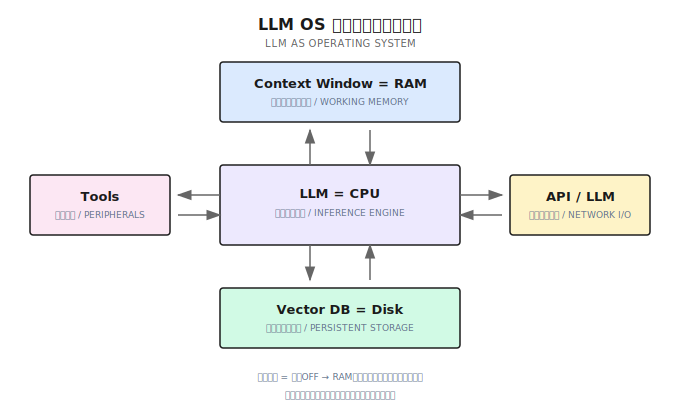
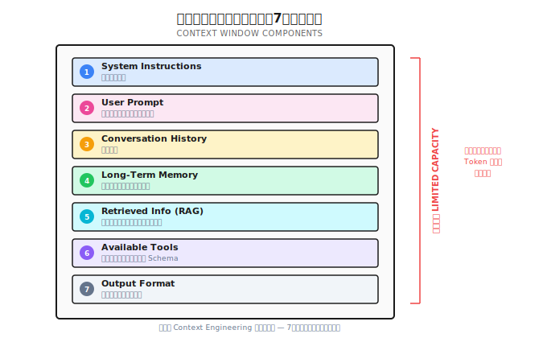
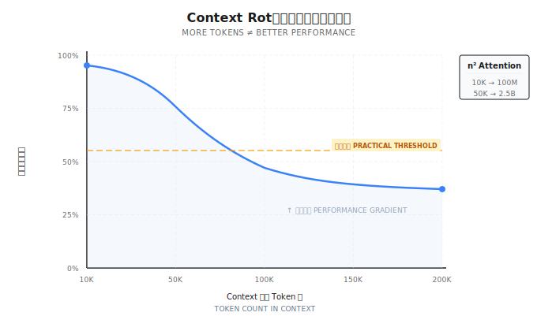
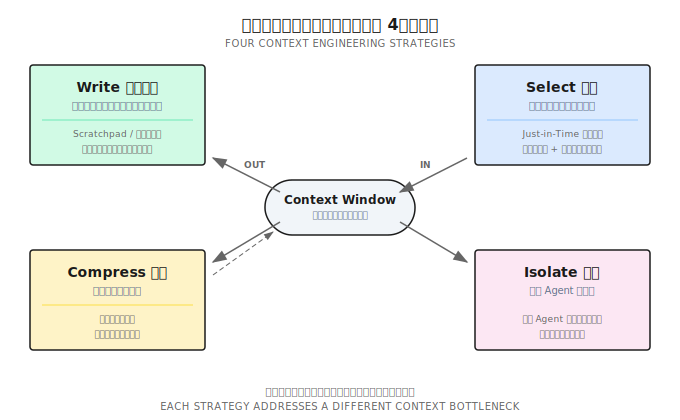
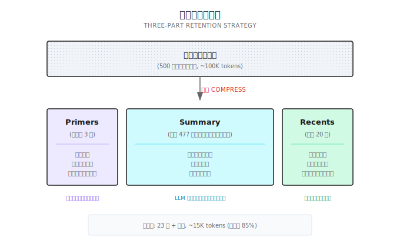
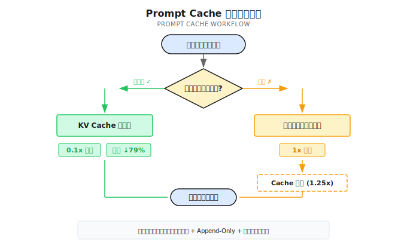

# 第 7 章：コンテキストエンジニアリング

> **コンテキストウィンドウはLLMのRAMだ——エージェントがその瞬間に何を「思い出せる」かを決める。**
> **コンテキストエンジニアリングとは、「この限られたメモリに何を入れるか」を決めるアートとサイエンスだ。**

---

エージェント（Agent）に本番環境の問題をデバッグしてもらったとする。

50ラウンドも会話して、やっとデータベースのコネクションプール設定がおかしいと特定できた。

で、聞いてみた。「さっき言ってたコネクションプールの設定って何だっけ？」

返ってきたのは「すみません、覚えていません」

**えっ、となるよね。**

50ラウンドも会話して、数万トークン使って、肝心な情報を忘れた？

サボったわけじゃない。重要な情報を「忘れた」んだ——その会話がコンテキストウィンドウから押し出されたから。これは知能の問題じゃない、**メモリ管理の問題**だ。

これがなぜエージェントシステムで最も根本的な課題なのか、もう一段高い視点から見てみよう。

---

## 7.1 LLM OS：なぜコンテキストが全てなのか

Andrej Karpathyが2025年に、非常に示唆的なアナロジーを提唱した：**LLMはオペレーティングシステムのようなものだ**。

比喩じゃない——構造的に似ているんだ。



従来のコンピュータと比べてみよう：

| 従来のコンピュータ | LLM OS | 説明 |
|-----------|--------|------|
| CPU | LLMモデル | コア推論エンジン、「計算」を実行する |
| RAM | コンテキストウィンドウ（Context Window） | 有限で揮発性のワーキングメモリ |
| ハードディスク | ベクトルデータベース / ファイルシステム | 永続ストレージ、セッションをまたいで保持 |
| 周辺機器 | ツール（Tools） | 外部世界とやり取りするインターフェース |
| ネットワーク I/O | API / 他のLLM | 外部サービスや他のモデルとの通信 |

このアナロジーの核心は何か？

**コンテキストウィンドウはRAMだ。**

3つの重要な特性がある：有限——モデルがどれだけ大きなウィンドウをサポートしてるとうたっても、結局上限がある。揮発性——会話が終わればそれは電源オフと同じ、RAMの中身は全てクリアされる。高コスト——トークンを1つ追加するたびに、計算とコストが増える。

OSがRAMの割り当てやページングを管理するように、エージェントシステムもコンテキストウィンドウに何を入れるか、何を入れないか、いつ退避するか、いつ戻すかを管理する必要がある。

これが**コンテキストエンジニアリング**——エージェントシステムにおける最も根本的なエンジニアリング課題だ。

---

## 7.2 Prompt EngineeringからContext Engineeringへ

Prompt Engineering（プロンプトエンジニアリング）って聞いたことあるよね？——プロンプトの言い回しを磨いて、LLMからより良い回答を引き出すやつだ。

でも2025年、業界の認識に重要なアップグレードがあった。

ShopifyのCEO Tobi Lutkeはこう言った：「Context engineeringはprompt engineeringよりも、このコアスキルを正確に表している」。Andrej Karpathyはさらに踏み込んで定義した：「あらゆる産業レベルのLLMアプリケーションにおいて、Context Engineeringとは、最適な次のアクションを得るために、コンテキストウィンドウに適切な情報を精巧に詰め込むアートとサイエンスだ」。Anthropicもまた、Context Engineering（コンテキストエンジニアリング）をPrompt Engineeringの「自然な進化」と呼んでいる。

一言で定義すると：**Context Engineering（コンテキストエンジニアリング）とは、正しいタイミングでLLMに正しい情報と正しいツールを提供する動的システムを設計・構築する学問分野だ。**

Prompt Engineeringと何が違うのか？

| 次元 | Prompt Engineering | Context Engineering |
|------|-------------------|---------------------|
| スコープ | 単一のやり取り、言い回しの最適化 | システムレベル、情報環境全体の管理 |
| 焦点 | 「どう言うか」——言い回しのテクニック | 「何を見せるか」——情報の選択と構成 |
| 適用場面 | 日常の会話、シンプルなタスク | 本番レベルのエージェントシステム |
| 構成要素 | プロンプトテキストのみ | System Prompt + RAG + Memory + Tools + 状態 |
| 失敗パターン | 言い回しの不備で誤解 | コンテキスト汚染、過負荷、重要情報の欠落 |

シンプルに言えば：Prompt Engineeringは「モデルへの話し方」に注目する。Context Engineeringは「モデルに何を見せるか」に注目する。

じゃあ、コンテキストウィンドウの中には実際何が入ってるのか？



DeepMindのPhilipp Schmidは、コンテキストの7大構成要素をまとめている：

1. **System Instructions** — システム指令、役割と行動の境界を定義する
2. **User Prompt** — ユーザーの現在のリクエスト
3. **Conversation History** — 会話履歴
4. **Long-Term Memory** — セッションをまたぐ永続的な記憶
5. **Retrieved Information (RAG)** — リアルタイムに検索した外部知識
6. **Available Tools** — 利用可能なツールの定義とスキーマ
7. **Output Format** — 出力フォーマットの要件

どれもがコンテキストウィンドウという限られた「RAM」空間を奪い合っている。コンテキストエンジニアリングの核心的な課題は、この7つの次元の間で最適な配分を行うことだ。

この一言を覚えておいてほしい：**「エージェントの失敗は、本質的にはコンテキストの失敗であり、モデルの失敗ではない。」**

---

## 7.3 コンテキストの物理的制約

コンテキストウィンドウは無限じゃない。その物理的な制約を理解することが、コンテキストエンジニアリングの前提だ。

### Token：LLMの計量単位

Token（トークン）はLLMがテキストを処理する最小単位——文字でも単語でもなく、モデルが内部的にテキストを分割した「断片」だ。言語によってトークン効率が違う：

| 言語 | 平均効率 | 説明 |
|------|---------|------|
| 英語 | 約4文字/token | 語根や一般的な単語で分割 |
| 中国語 | 約1.5文字/token | 漢字1字あたり約1-2 token |
| コード | 約3文字/token | 記号やキーワードが独立して分割される |

つまり、同じ意味の内容でも、中国語は英語よりトークンの消費が多い。

> ⚠️ **鮮度注意** (2026-01): トークンのカウントは具体的なtokenizerに依存する。以下の換算は概算。実際の使用では対応SDKのトークンカウントAPIを呼んでほしい。

正確なトークン計算にはtokenizerの呼び出しが必要だけど、遅すぎる。Shannonでは実測で十分正確な推定方法を使っている：

```go
// シンプル版トークン推定
func EstimateTokens(messages []Message) int {
    total := 0
    for _, msg := range messages {
        // 4文字で約1トークン
        total += len([]rune(msg.Content)) / 4
        // メッセージごとにフォーマットのオーバーヘッド（role, content構造）
        total += 5
    }
    // 10%の安全マージン
    return int(float64(total) * 1.1)
}
```

| 構成要素 | 推定方法 | 説明 |
|----------|----------|------|
| 普通のテキスト | 文字数 / 4 | 標準的なGPT推定 |
| メッセージフォーマット | 1件あたり +5 | role/content構造のオーバーヘッド |
| コード | 文字数 / 3 | コードはtoken密度が高い |
| 安全マージン | +10% | 推定が小さすぎるのを防ぐ |

この推定の誤差は10-15%以内で、予算管理には十分だ。

### Context Rot：なぜ大きなウィンドウが万能薬じゃないのか

こう思うかもしれない：ウィンドウサイズが問題なら、もっと大きなウィンドウを使えばいいじゃん？

そう簡単じゃない。Chromaの研究が重要な現象を明らかにした——**Context Rot（コンテキスト腐食）**：コンテキスト内のトークン数が増えるにつれて、モデルが情報を正確に想起・活用する能力が逓減していく。



原因はTransformerアーキテクチャ自体にある。Self-Attentionの計算量はトークン数のn²に比例する：10Kトークンなら約1億回のAttention計算が必要で、50Kトークンなら約25億回。計算量の爆発が生み出すのは「ハードな崖」ではなく、**性能の勾配**——情報検索の精度がコンテキストの長さに応じて徐々に低下していく。

核心的な結論：**コンテキストは有限のリソースであり、限界収益は逓減する。もっと情報を詰め込めば、モデルがもっと良くなるとは限らない。**

> ⚠️ **鮮度注意** (2026-01): モデルのコンテキストウィンドウと価格は頻繁に変わる。以下は目安程度に。最新情報は公式ドキュメントを確認してほしい。

| モデル | コンテキストウィンドウ | 文字数換算（ざっくり） |
|------|-----------|------------------|
| GPT-4o | 128K tokens | 約50万字 |
| Claude Sonnet 4 | 200K tokens | 約80万字 |
| Gemini 2.5 Pro | 1M tokens | 約400万字 |
| 一般的なOSSモデル | 8K - 128K | 約3-50万字 |

ウィンドウは大きく見えるけど、実際のシーンでの消費は想像以上だ。コンテキスト管理で解決すべき問題は4つ：

| 問題 | 結果 | 対応策 |
|------|------|----------|
| **上限超過** | リクエストが直接失敗する | Compress / Isolate |
| **コスト** | 履歴が長くなるほど高くなる | Compress + Prompt Cache |
| **情報損失** | 重要なコンテキストが圧縮で失われる | Write + Select |
| **ノイズ干渉** | 関係ない情報が回答の質を下げる | Select + Isolate |

この4つは互いに矛盾する。**完璧な解決策なんてない。トレードオフがあるだけだ。**

次のセクションの4つの戦略フレームワークが、これらのトレードオフを体系的に行うためのツールだ。

---

## 7.4 コンテキストエンジニアリングの4つの戦略：Write / Select / Compress / Isolate

LangChainが2025年に、シンプルなフレームワークを提唱した。コンテキストエンジニアリングの全ての操作を4つの戦略に集約している。



### 7.4.1 Write — 情報をコンテキストの外に書き出す

コンテキストウィンドウが小さい？なら全部詰め込もうとするのをやめよう。

Write戦略の核心は：**エージェントが情報を積極的に外部ストレージに書き出し**、必要な時に読み戻すこと。

最も典型的なプラクティスが**Scratchpad（メモ帳）パターン**だ。エージェントが複雑なタスクを実行する時、`todo.md` や `NOTES.md` ファイルを維持して、タスク目標、完了したステップ、未解決の問題を書き込む。これには2つのメリットがある：

第一に、**「Lost-in-the-Middle」問題の回避**。研究によると、LLMはコンテキストの中間位置にある情報への注意度が最も低い。重要な情報をファイルに書き出し、次に必要な時にコンテキストの末尾に読み戻す——するとちょうどモデルの注意力が最も強い領域に落ちる。

第二に、**ファイルシステムが無限のメモリになる**。コンテキストウィンドウは有限の「RAM」だが、ファイルシステムは無限の「ハードディスク」だ。エージェントがファイルへのオンデマンドな書き込み・読み出しを学ぶことは、本質的にハードディスクでRAMを拡張していることになる。

多くのAIコーディングアシスタントが既にこの戦略を実践している。タスクの進捗を追跡するためにToDoリストを維持したり、重要なコンテキストを永続化するためにプロジェクトレベルの設定ファイルを使ったり——本質的にはどれもWrite戦略の実践だ：永続化すべき情報をコンテキストの外に書き出し、ウィンドウの空間を本当に推論が必要なコンテンツに空けている。

もう一つの重要なプラクティスが**目標の復唱**：エージェントにコンテキストの末尾で現在のグローバル目標と計画を再度復唱させること。これはトークンの無駄遣いじゃない——モデルの注意機構を操って、自分が何をしているかを常に「覚えている」状態にしているんだ。

### 7.4.2 Select — 関連情報を検索して戻す

Writeで情報を外に書き出した。Selectは正しいタイミングで正しい情報を検索して戻す役割だ。

核心的な原則は**Just-in-Time（ジャストインタイム）コンテキスト**——全ての情報をあらかじめコンテキストにプリロードするのではなく、必要な時に取りに行く。

実践で最も効果的なのは**ハイブリッド戦略**だ：重要な情報をプリロードし、最も核心的な、毎回必要になる情報をSystem Promptに入れておく。詳細なコンテンツはオンデマンドで検索し、具体的なコード、ドキュメント、データはツール（glob、grep、RAG）を通じて必要な時にコンテキストに引き込む。

現代のAIコーディングアシスタントはこのハイブリッド戦略を見事に体現している：プロジェクト設定ファイルがプリロードされたコンテキスト（コード規約やアーキテクチャの決定など）を提供し、ファイル検索やコード検索ツールがジャストインタイムの検索能力を提供する。エージェントは「全てのコードを見た」必要はない。「どこで見つけるか」を知っていればいいんだ。

この背景にあるのは**プログレッシブ・ディスクロージャ（Progressive Disclosure）**というデザイン思想だ：エージェントが探索を通じてコンテキストを段階的に発見し、理解を層ごとに組み立てていく。ファイルサイズが複雑さを暗示し、命名が用途を暗示し、タイムスタンプが関連性を暗示する——エージェントは探偵のように、手がかりから出発して全体像を組み上げていく。

System Promptの設計では**Goldilocks Zone（ちょうどいい領域）**を意識する必要がある。具体的すぎると脆くなる——シーンが少し変わっただけで機能しなくなる。曖昧すぎるとシグナルが不足する——モデルが何をすべきか分からない。最適なSystem Promptは、行動を導くのに十分具体的でありながら、変化に対応できるだけの柔軟性を持っている。

### 7.4.3 Compress — コンテキストを圧縮する

会話が長くなり、コンテキストウィンドウが徐々に埋まってきたら、圧縮が必要になる。

圧縮の核心操作は**Compaction（コンパクション）**と呼ばれる：LLMを使って冗長な会話履歴を簡潔な要約に圧縮し、その要約で元の内容を置き換えて、コンテキストウィンドウを再初期化する。

Shannonは実戦で検証された**三段式保持戦略**を実装している：



- **Primers（最初の3件）**：会話の冒頭を保持する。ユーザーの最初の要求やシステムの設定はここで確立される。失われたら、エージェントは全く関係ない提案をする可能性がある。
- **Summary（中間の要約）**：LLMを使って中間の数百件のメッセージをセマンティックな要約に圧縮する。重要な意思決定、重要な発見、未解決の問題を保持する。
- **Recents（最新の20件）**：最近の会話を保持して一貫性を維持する。ユーザーが「さっきの案」と言った時、エージェントはRecentsで見つけられる。

Shannonはllm-serviceの `/context/compress` エンドポイントを呼び出して要約を生成する：

```python
# llm-service側の圧縮実装（概念例）
async def compress_context(messages: list, target_tokens: int = 400):
    prompt = f"""Compress this conversation into a factual summary.

Focus on:
- Key decisions made
- Important discoveries
- Unresolved questions
- Named entities and their relationships

Keep the summary under {target_tokens} tokens.
Use the SAME LANGUAGE as the conversation.

Conversation:
{format_messages(messages)}
"""

    result = await providers.generate_completion(
        messages=[{"role": "user", "content": prompt}],
        tier=ModelTier.SMALL,  # 小さいモデルを使って節約
        max_tokens=target_tokens,
        temperature=0.2,  # 低温度で正確性を確保
    )
    return result["output_text"]
```

要約はこんな感じになる：

```
Previous context summary:
ユーザーはKubernetesのネットワーク問題をデバッグ中。重要な発見：
- Podが外部サービスにアクセスできない
- CoreDNS設定は正常
- NetworkPolicyに制限がある
未解決：NetworkPolicyルールの具体的な設定を確認
```

いつ圧縮をトリガーするか？毎回圧縮するわけじゃない——それだと計算リソースの無駄だ。Shannonの戦略は：予算使用率が約75%に達したらトリガーし、約37.5%まで圧縮する。例えば予算が50Kトークンなら、37.5K使った時点で圧縮開始、18.75Kくらいまで圧縮する。75%は現在のラウンドの入出力用に25%の余裕を残すため、37.5%は半分以下に圧縮して後続の会話にもっとスペースを残すため。

実測の圧縮効果：

| シーン | 元のトークン | 圧縮後 | 圧縮率 | 説明 |
|------|-----------|--------|--------|------|
| 50件のメッセージ | 約10k | 圧縮なし | 0% | 閾値未達 |
| 100件のメッセージ | 約25k | 約12k | 52% | 軽い圧縮 |
| 500件のメッセージ | 約125k | 約15k | 88% | 重い圧縮 |
| 1000件のメッセージ | 約250k | 約15k | 94% | 極限圧縮 |

要約生成は圧縮の中で最も遅い操作（200-500ms）だが、圧縮がトリガーされた時だけ走り、毎回のリクエストで走るわけじゃない。

**圧縮は不可逆的な損失を伴う**——これは認めなきゃいけない。じゃあ何を残して、何を捨てるか？

優先的に残すもの：アーキテクチャの意思決定と重要な結論、未解決のバグと未処理のタスク、核心的な実装の詳細とファイルパス。捨てていいもの：冗長なツール出力（大量のJSONレスポンス）、繰り返しの試行錯誤メッセージ、確認の挨拶。

中でも**ツール結果の削除**は最も安全な圧縮形態だ——5000トークンのAPIレスポンスから、エージェントが有用な情報を既に抽出していれば、元のデータは削除できる。

重要な原則：**回復可能な圧縮**。圧縮時にURLやファイルパスを残し、不可逆な削除はしない。こうすれば、要約から詳細が失われても、エージェントは元のソースを再度読みに行ける。

もう一つ、直感に反するプラクティス：**エラーコンテキストの保持**。エージェントの失敗した試みを消去してはいけない——これらのエラーは貴重な学習シグナルだ。モデルは以前の失敗経路を見ることで、内部の信念を暗黙的に更新し、同じ間違いを繰り返すのを避ける。失敗記録を消去することは、経験を消去することに等しい。

### 7.4.4 Isolate — コンテキストを隔離する

タスクが複雑すぎて、一つのコンテキストウィンドウに収まらない場合は、**分割**する。

Isolate戦略の核心は**Sub-Agent Architecture（サブエージェントアーキテクチャ）**：タスクを専門のサブエージェントに分解し、各サブエージェントが自分のクリーンなコンテキストウィンドウで作業し、精華だけをメインエージェントに返す。

これは極めて高い情報圧縮比をもたらす。サブエージェントはそのウィンドウで数万トークンの情報を探索するかもしれない——コードを読み、ドキュメントを検索し、方針を試す——でも最終的にメインエージェントに返すのは1000-2000トークンの精華だけだ。

3つの効果的な隔離シーン：

1. **コンテキスト隔離**：サブタスクが大量の中間データ（検索結果、デバッグログなど）を生み出すが、メインタスクに必要なのは最終結論だけ。
2. **並列化**：複数のサブエージェントが同時に異なる方向を探索し、それぞれ独立したウィンドウで作業して互いに干渉しない。
3. **専門化**：ツール定義が20以上になると、各ツール定義が200+ トークンを占め、ツールだけで4000+トークンのコンテキストを消費する。各サブエージェントがツール最大5つになるよう分割すれば、それぞれが専門に集中できる。

トークン予算は隔離アーキテクチャにおいて階層管理が必要だ。Shannonは **Session → Task → Agent** の三段階予算を実装している：

```go
func (bm *BudgetManager) CheckBudget(sessionID string, estimatedTokens int) *BudgetCheckResult {
    budget := bm.sessionBudgets[sessionID]
    result := &BudgetCheckResult{CanProceed: true}

    // 超過チェック
    if budget.TaskTokensUsed + estimatedTokens > budget.TaskBudget {
        if budget.HardLimit {
            result.CanProceed = false
            result.Reason = "Task budget exceeded"
        } else {
            result.RequireApproval = budget.RequireApproval
            result.Warnings = append(result.Warnings, "Will exceed budget")
        }
    }

    // 警告閾値チェック（例えば80%で警告）
    usagePercent := float64(budget.TaskTokensUsed) / float64(budget.TaskBudget)
    if usagePercent > budget.WarningThreshold {
        bm.emitWarningEvent(sessionID, usagePercent)
    }

    return result
}
```

3つの予算実行モードがあり、どれを選ぶかはシーン次第：

| モード | 動作 | 適用シーン |
|------|------|----------|
| **ハードリミット** | 予算超過で即拒否 | コスト重視、外部向けAPI |
| **ソフトリミット** | 予算超過で警告、実行は継続 | タスク優先、社内ツール |
| **承認モード** | 予算超過で一時停止、人間の確認を待つ | 重要タスクで人間のチェックが必要 |

予算の圧力が高まった時、Shannonは**バックプレッシャー機構**も実装している——突然止めるんじゃなくて、段階的にスロットリングする：

```go
func calculateBackpressureDelay(usagePercent float64) time.Duration {
    switch {
    case usagePercent >= 0.95:
        return 1500 * time.Millisecond  // 強いスロットリング
    case usagePercent >= 0.9:
        return 750 * time.Millisecond
    case usagePercent >= 0.85:
        return 300 * time.Millisecond
    case usagePercent >= 0.8:
        return 50 * time.Millisecond    // 軽いスロットリング
    default:
        return 0                         // 通常実行
    }
}
```

バックプレッシャーのメリット：レスポンスが遅くなることでユーザーが「予算を消費している」と気づける、突然切れるのではなくなめらかに劣化する、使用量が下がれば自動的に正常に戻る。

隔離戦略は後続のMulti-Agentアーキテクチャと密接に関連している——第16-19章で詳しく展開する。

---

## 7.5 Prompt Cache：コンテキストエンジニアリングのコストを現実的に

コンテキストエンジニアリングには現実的な問題がある：**高い**。

エージェントシステムの入力トークンと出力トークンの比率は100:1にもなりうる——回答の1トークンを生成するために、100トークンのコンテキストを処理する必要があるかもしれない。つまり入力コストが出力コストを遥かに上回る。

**Prompt Cache**がこの問題を解決する重要なインフラだ。

### Prompt Cacheとは？

LLMが入力を処理するたびに、トークンのシーケンスに対してフォワードパスを行い、中間計算結果——KV Cache（Key-Valueキャッシュマトリクス）を生成する。Prompt Cacheの原理はシンプルだ：**これらの中間計算結果をキャッシュしておき、次に同じプレフィックスに遭遇した時に直接再利用して、重複計算をスキップする。**



重要な仕組みは**プレフィックスマッチング**だ：リクエストのプレフィックスがキャッシュ内のものと同じであれば、後続の計算はキャッシュから続行でき、最初からやり直す必要がない。

### Claudeの実装と価格

Claudeを例にとると：

| トークン種別 | 相対コスト | 説明 |
|-----------|---------|------|
| 標準入力 | 1x | 毎回フル計算 |
| Cache書き込み（5分TTL） | 1.25x | 初回書き込みはやや高い |
| Cache読み取り | 0.1x | **90%節約** |

Anthropicの公式データによると：100Kトークンのキャッシュされた会話では、コストが90%減少、レイテンシが79%減少。マルチターン会話シーンでは、コストが53%減少、レイテンシが75%減少。

エージェントシステムにとって、この最適化のインパクトは絶大だ——なぜならエージェントは毎ラウンド完全なコンテキスト履歴を送信するから。

### エージェントシステムのCache最適化原則

Prompt Cacheを本当に効かせるには、コンテキストがいくつかの条件を満たす必要がある。

**プロンプトのプレフィックスを安定させる**。System Promptを最前に置き、内容を頻繁に変えない。冒頭に秒単位のタイムスタンプやランダムIDを入れない——毎回リクエストのプレフィックスが変わってしまい、Cacheヒット率がゼロになる。

**コンテキストは追記のみ（Append-Only）**。新しいメッセージは末尾に追加し、過去のメッセージを修正したり並べ替えたりしない。これでシリアライゼーションの決定性が確保される——プレフィックスは常に一致する。

**ツール定義を安定させる**。実行時にツール定義を動的に追加・削除しない。ツール定義は通常System Promptの直後にあり、変更するとそれ以降の全てのKV Cacheが無効になる。ツールの利用可能性を制御したい場合は、ツール定義を削除するのではなくlogitマスク（デコード時に特定のツールの出力確率をマスクする）を使う——こうすればキャッシュは影響を受けない。

**TTLに注意する**。高頻度のリクエストシーンでは、リクエスト間隔をCache TTL以内（Claudeは5分）に保ち、キャッシュが期限切れにならないようにする。

---

## 7.6 よくある誤りとアンチパターン

コンテキストエンジニアリングの実践で、5つのよくあるハマりポイントがある。

**1. プロンプトの言い回しばかりに注目して、コンテキストシステム全体を無視する**

1週間かけてプロンプトの言い回しを磨いたのに、コンテキストには無関係なツール出力や期限切れの会話履歴がぎっしり。「言い回しは完璧だけど情報が間違っている」プロンプトには何の価値もない。コンテキストエンジニアリングが扱うのは情報環境であり、あの数行のプロンプトだけじゃない。

**2. 圧縮が攻撃的すぎて、不可逆な削除をする**

中間プロセスを全部捨てて、最終結論だけ残す。問題は：エージェントがある意思決定を振り返る必要がある時、コンテキストが何も残っていないこと。回復パスを残すべきだ——URL、ファイルパス、重要な中間ステップ。

**3. ツール定義の肥大化**

20以上のツールがあるとエージェントは迷いだす——モデルが頭悪いからじゃなく、コンテキスト内の選択肢が多すぎて意思決定ノイズになるから。最小限のツールセットを厳選しよう。大量のツールが必要な場合は、Isolate戦略で複数の専門サブエージェントに分割する。

**4. Prompt Cacheを無視する**

毎回のリクエストでコンテキスト全体を最初から計算している——長い会話シーンでは90%以上の計算が重複だ。append-only + プレフィックス安定を確保して、Cacheにコスト削減を任せよう。

**5. エラーコンテキストを消去する**

直感的には：エージェントが遠回りしたんだから、失敗した試みを消して「きれいなスタート」にすべきだ。でもこれはアンチパターン——失敗した試みを学習シグナルとして残そう。モデルは以前の失敗経路を見ることで、同じ間違いを繰り返すのを避ける。

---

## 7.7 本章のまとめ

1. **LLM OSアナロジー**：Context Window = RAM、その管理がエージェントシステムの核心的なエンジニアリング課題
2. **Context Engineering > Prompt Engineering**：情報システム全体に注目する、言い回しだけじゃない
3. **Context Rot**：コンテキストが長くなるほど情報活用の効率が下がる——大きなウィンドウは万能薬じゃない
4. **4つの戦略フレームワーク**：Write（書き出す）/ Select（検索して戻す）/ Compress（圧縮する）/ Isolate（隔離する）
5. **Prompt Cacheは本番環境のコスト救世主**：入力コストを90%節約できる

核心原則を一言でまとめると：

> **「最小の高シグナルなトークン集合を見つけ、期待される結果の可能性を最大化する。」**

コンテキストエンジニアリングは「ワーキングメモリ」の問題——単一の会話内での情報管理——を解決した。でもエージェントがセッションをまたいだ「長期記憶」を持つにはどうすればいい？次の章では**メモリアーキテクチャ**を話そう——前回の会話、先週の意思決定、先月のユーザーの好みをエージェントに覚えさせる方法だ。

---

## Shannon Lab（10分で入門）

### 必読（1ファイル）

- [`docs/context-window-management.md`](https://github.com/Kocoro-lab/Shannon/blob/main/docs/context-window-management.md) — 「Sliding Window Compression」と「Token Budget Management」のセクションを重点的に。圧縮トリガー条件と多層予算を理解しよう

### 選読・深掘り（2つ）

- [`activities/context_compress.go`](https://github.com/Kocoro-lab/Shannon/blob/main/go/orchestrator/internal/activities/context_compress.go) — `CompressAndStoreContext` 関数を見て、圧縮フローの全体像を理解
- [`budget/manager.go`](https://github.com/Kocoro-lab/Shannon/blob/main/go/orchestrator/internal/budget/manager.go) — `CheckBudget` 関数を見て、予算チェックと階層管理を理解

---

## 参考文献

- [Anthropic: Effective Context Engineering for AI Agents (2025)](https://www.anthropic.com/engineering/context-engineering) — コンテキストエンジニアリングの最も包括的なエンジニアリング視点
- [LangChain: Context Engineering for Agents (2025)](https://blog.langchain.dev/context-engineering-for-agents/) — Write/Select/Compress/Isolateフレームワークの原文
- [Karpathy: Software Is Changing (Again) — AI Startup School (2025)](https://www.youtube.com/watch?v=LpSo_jvJkCE) — LLM OSアナロジーとSoftware 3.0の思想
- [Chroma: Context Rot Research](https://research.trychroma.com/) — コンテキスト腐食の実証研究
- [Anthropic Prompt Caching 文档](https://docs.anthropic.com/en/docs/build-with-claude/prompt-caching) — Cache機構、価格、ベストプラクティス
- [Philipp Schmid: The New Skill in AI is Context Engineering](https://www.philschmid.de/context-engineering) — コンテキストの7大構成要素
- [OpenAI Tokenizer](https://platform.openai.com/tokenizer) — オンラインでトークン分割を体験
