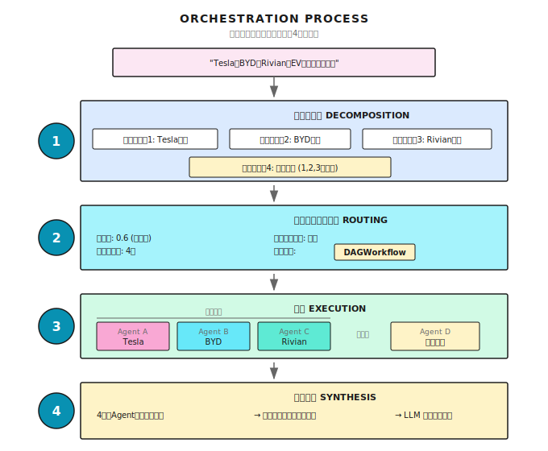

# 第 13 章：編成の基礎

> **マルチエージェント編成って、みんなが勝手に動くことじゃない。オーケストラみたいに、指揮者がいて、分担があって、息が合ってる状態のことさ。ただし、指揮者がいくら優秀でも、演奏者がダメなら意味ないけどね。**

---

> **⏱️ クイックパス**（5分で要点を掴む）
>
> 1. 単体エージェントには限界がある。でも Multi-Agent は銀の弾丸じゃない——通常 3-10 倍の token を消費する
> 2. 3つの有効なシーン：コンテキスト分離、並列化、専門化
> 3. 編成の4要素：Decompose → Dispatch → Coordinate → Synthesize
> 4. コンテキスト境界でエージェントを分割する。役割で分割しない
> 5. モデル階層ルーティング：簡単なタスクには小さいモデル、複雑な推論には大きいモデル
>
> **10分コース**：13.1-13.3 → 13.6 → Shannon Lab

---

## 13.1 なぜ単体エージェントじゃダメなのか？

この章で解決するのは1つの核心的な問題：**単体エージェント（Agent）で効率よく片付かないとき、複数のエージェントをどう協力させるか？**

ちょっと想像してみて。小さなリサーチプロジェクトを任されたとする——3社の競合（Tesla、BYD、Rivian）のEV戦略を分析してほしいと。一人でやるなら、どうする？

直列でやるよね。今日はTesla、明日はBYD、明後日はRivian。3日後にやっと情報が揃って、比較分析を書き始める。

でも、3人のアシスタントがいたら？同時にやらせるでしょ。AliceはTesla、BobはBYD、CarolはRivian。1日後には3つのレポートが揃って、あとは自分で統合するだけ。

効率3倍。

**単体エージェントは一人で戦うようなもの——タスクは完了できるけど、効率は悪いし、深掘りも浅い。マルチエージェント編成は、チームを組んで分業すること。**

ただ、チームを組むのは「人を増やす」だけじゃない。タスクの割り当て、進捗の調整、結果の統合、衝突の処理——全部必要になる。オーケストレーター（Orchestrator、編成器）がそれをやるんだ。

### 単体エージェントの3つの弱点

まず結論から。単体エージェントには3つの弱点がある。

### 弱点その1：直列実行、遅すぎる

3社の検索は完全に独立してる。依存関係なし。でも単体エージェントは1つずつしかできない。並列ならどうなる？差は歴然：


40秒の短縮。タスクが増えるほど差は開く。

### 弱点その2：ジェネラリストに専門家の仕事、深さが足りない

「AIスタートアップのビジネスプランを作って」——このタスクには何が必要？

- 市場分析：業界規模、成長トレンド、競合状況
- 技術アーキテクチャ：技術選定、コスト見積もり、実現可能性評価
- 財務予測：収益モデル、コスト構造、損益分析
- マーケティング戦略：ターゲットユーザー、獲得チャネル、ブランドポジショニング

「ジェネラリスト」のエージェント1つで4つ全部？どれもちょっとは分かるだろうけど、どれも深くない。

ベターな方法：4人の専門家エージェントで分担すること。

### 弱点その3：単一障害点、冗長性なし

1つのエージェントがダウンしたら——ネットワークタイムアウト、LLMエラー、ツール呼び出し失敗——タスク全体が終わる。

マルチエージェントシステムならフォールトトレラントにできる。1つ落ちても他は続行。重要なタスクにはバックアップを用意できる。

### マルチ vs 単体

| 能力 | 単体エージェント | マルチエージェント |
|------|------------------|-------------------|
| **並列能力** | 直列実行 | 並行実行 |
| **専門性** | ジェネラリスト、浅く広く | 専門家分業、それぞれの強み |
| **耐障害性** | 単一障害点 | 冗長性あり |
| **コスト制御** | 統一モデル | タスク別にモデル選択（簡単なタスクなら安いモデル） |

> **注意**：マルチエージェントは万能じゃない。Multi-Agent システムは単体エージェントの **3-10 倍の token** を消費するのが普通——エージェント間でのコンテキスト複製、協調メッセージ、結果統合、どれもコストがかかる。
>
> 実際に、何ヶ月もかけて精巧な Multi-Agent システムを構築したチームが、結局は単体エージェントの prompt を最適化するだけで同等の効果を達成できたという事例もある。問題は Multi-Agent そのものではなく、**的を射ていなかった**こと——分割が不適切で、協調オーバーヘッドが実際の作業を上回ってしまった。
>
> **原則：Multi-Agent は強力なアーキテクチャの選択肢だが、適切なシーンで使う必要がある。** 次のセクションで、いつ使うべきかを見てみよう。

---

## 13.2 いつ Multi-Agent を使うべきか？

Multi-Agent の追加オーバーヘッドは現実のもの。でも適切なシーンでは、リターンがコストを大きく上回る。

実践の中で、Multi-Agent が継続的に単体エージェントを上回る3つのシーンが見つかっている：

### シーン1：コンテキスト分離（Context Isolation）

サブタスクが大量の中間データを生成するが、メインタスクにはその一部しか必要ない場合。

例えば、カスタマーサポートのエージェントが技術問題を診断するために注文履歴を調べる必要があるとする。単体エージェントの場合、2000+ token の注文詳細がすべてコンテキストに積み上がる——でも技術問題の診断にはそんなの要らない。コンテキストが「汚染」されて、推論の質が下がる。

Multi-Agent の解法：独立したコンテキストで注文検索を処理する sub-agent を使い、フィルタリング後に 50-100 token のキーサマリーだけを返す。メインエージェントのコンテキストはクリーンなまま、推論の質も落ちない。

```python
# 単体エージェント：全情報が一緒くた
conversation = [
    # 2000+ token の注文履歴が全部コンテキストに入る
    # 後続の推論が無関係な情報に埋もれる
]

# Multi-Agent：コンテキスト分離
class OrderLookupAgent:
    def lookup(self, order_id):
        # 独立コンテキストで完全な注文履歴を処理
        # キーサマリーのみ返す：50-100 token
        return {"status": "発送済み", "date": "3月5日"}

class SupportAgent:
    def handle(self, user_message):
        summary = OrderLookupAgent().lookup(order_id)
        # メインエージェントのコンテキストはクリーンなまま
```

**適用シグナル**：サブタスクが 1000 token 超の中間データを生成するが、メインタスクにはその一部しか必要ない場合。

### シーン2：並列化（Parallelization）

これは直感的にわかりやすい——複数の独立タスクを同時に実行する。でも見落とされがちな重要な洞察がある：

**並列化の核心的な価値は、もっと全面的に（thoroughness）であって、もっと速く（speed）ではない。**

並列化によって、より広い情報空間を同時に探索できる。総 token 消費は多くなるし、総実行時間も長くなるかもしれないが、結果のカバレッジは単体エージェントをはるかに超える。

典型的なシーン：Deep Research——クエリを分解 → 複数の sub-agent が異なる側面を並列に探索 → 発見を統合。

### シーン3：専門化（Specialization）

専門化には3つの次元がある：

- **ツールセットの専門化**：エージェントが 20+ のツールを持つと、選択精度が大幅に下がる。40 のツールを 4 つの専門エージェントに分割（各 5-10 個）すれば、選択困難は解消される。
- **システムプロンプトの専門化**：異なるタスクが矛盾する行動パターンを必要とする。カスタマーサポートのエージェントが「共感して安心させる」と「返金規則を厳格に適用する」を同時にやるのは、同一エージェントの人格分裂だ。
- **ドメインの専門化**：深い専門知識（法律判例、医療方針）は汎用エージェントを圧倒する。専門エージェントが集中したドメインコンテキストを携えた方が効果的。

### 決定チェックリスト

| シグナル | 推奨 |
|------|------|
| サブタスクが大量の無関係なコンテキストを生成 | ✅ Multi-Agent（コンテキスト分離） |
| タスクを独立した部分に分解して並列探索できる | ✅ Multi-Agent（並列化） |
| ツールが 20+、または矛盾する行動パターンが必要 | ✅ Multi-Agent（専門化） |
| 簡単なタスク、prompt の最適化で解決できる | ❌ まず単体エージェントで |
| サブタスク間が高度に結合、頻繁な同期が必要 | ❌ 分割するとかえって遅くなる |

---

## 13.3 オーケストレーター：マルチエージェントの指揮者

マルチエージェントシステムには「指揮者」が必要——Orchestrator（オーケストレーター、編成器）。

自分では作業しないけど、こういうことを決める：
- タスクをどう分解するか
- 誰が何をやるか
- どの順序で実行するか
- 結果をどう統合するか

### 4つの責務


**例え話をしよう**：オーケストレーターはレストランの料理長みたいなもの。

お客さんが「ステーキセットを」と言う。料理長は一人で全部作らない。こうする：
1. **分解**：ステーキ、付け合わせ、ソース、デザート
2. **分発**：ステーキはグリル担当、付け合わせは冷菜担当、ソースはソーシエ
3. **協調**：ステーキができたらソースをかける、付け合わせとステーキは同時に出す
4. **統合**：盛り付け、温度と見た目をチェック

料理長は全部できる必要はない。でも、誰が何が得意か、どの順番が合理的か、どう一皿にまとめるか——それは知ってなきゃいけない。

### 実行フロー



---

## 13.4 ルーティング決定：どの戦略を使う？

全てのタスクにマルチエージェントが必要なわけじゃない。オーケストレーターの最初の判断は：**このタスクにどのパスを使うか？**

### Shannon のルーティングロジック

Shannon の `OrchestratorWorkflow` はこう判断する：

```go
// 単純タスクかどうかの判定
simpleByShape := len(decomp.Subtasks) == 0 ||
                 (len(decomp.Subtasks) == 1 && !needsTools)
isSimple := decomp.ComplexityScore < simpleThreshold && simpleByShape

// 依存関係のチェック
hasDeps := false
for _, st := range decomp.Subtasks {
    if len(st.Dependencies) > 0 || len(st.Consumes) > 0 {
        hasDeps = true
        break
    }
}

switch {
case isSimple:
    // 単純タスク → 単体エージェントで直接実行
    return SimpleTaskWorkflow(input)

case forceSwarm || needsDynamicCoordination:
    // 複雑な協調または明示的指定 → Swarm モード
    return SwarmWorkflow(input)

default:
    // 標準タスク → DAG ワークフロー
    return DAGWorkflow(input)
}
```

**実装参考 (Shannon)**: [`go/orchestrator/internal/workflows/orchestrator_router.go`](https://github.com/Kocoro-lab/Shannon/blob/main/go/orchestrator/internal/workflows/orchestrator_router.go) - OrchestratorWorkflow 関数

### 決定木

```
タスク到着
    │
    ▼
複雑度 < 0.3 かつ サブタスク1つ かつ ツール不要? ──はい──► SimpleTaskWorkflow
    │                                              (単体エージェントで直接実行)
    いいえ
    │
    ▼
force_swarm または動的協調が必要? ──はい──► SwarmWorkflow
    │                               (Lead Agent 駆動の協調)
    いいえ
    │
    ▼
DAGWorkflow（デフォルト）
(標準的なマルチエージェント並列/直列)
```

### 3つの戦略比較

| 戦略 | 適用シーン | 特徴 |
|------|-----------|------|
| **SimpleTask** | 単純なQ&A、単ステップタスク | 最軽量、単体エージェント |
| **DAGWorkflow** | 2-5個のサブタスク、簡単な依存あり | 並列/直列/ハイブリッド実行 |
| **Swarm** | 複雑な協調、動的調整、人間のフィードバックが必要 | Lead イベントループ、Workspace 協調 |

この3つの戦略は後の章で詳しくやる。ここでは覚えておいて：**オーケストレーターはタスクの複雑度に応じて自動的に戦略を選ぶ**。

---

## 13.5 エージェントをどう分割するか？

ルーティングは「どの道を行くか」を決めた。でももっと根本的な問題がある：**作業をどうやって異なるエージェントに振り分けるか？**

これが Multi-Agent システムの成否を分ける。うまく分割すれば半分の労力で倍の成果。まずく分割すれば、単体エージェントの方がまだマシ。

### アンチパターン：役割で分割する（「伝言ゲーム」）

最も直感的な分割：1つのエージェントが企画、1つが実装、1つがテスト、1つがレビュー。

```
Planner Agent → Implementer Agent → Tester Agent → Reviewer Agent
      ↓ handoff          ↓ handoff          ↓ handoff
   (コンテキスト喪失)   (コンテキスト喪失)   (コンテキスト喪失)
```

合理的に聞こえるけど、実際は災難。毎回の handoff が「伝言ゲーム」——伝えるたびに情報がちょっとずつ失われる。Tester は Implementer がなぜある設計判断をしたか知らないし、Reviewer はイテレーション中のトレードオフを理解していない。

結果：**協調に使う token が、実際の作業より多くなる**。

### 正しい方法：コンテキスト境界で分割する

ある機能を処理するエージェントは、その機能のテストも担当すべき——実装コンテキストをすでに持っているから。コンテキストが**本当に分離できる**場合にだけ、分割する価値がある。

**良い分割境界**：

- **独立したリサーチパス**：アジア市場の調査 vs ヨーロッパ市場の調査。相互依存なし、コンテキスト完全分離
- **明確なインターフェースを持つコンポーネント**：API 契約が明確なら、フロントエンドとバックエンドは並列開発可能
- **ブラックボックス検証**：検証者はテストを実行して結果を報告するだけ。実装の詳細を知る必要がない

**問題のある分割境界**：

- **同一機能の異なるフェーズ**：企画、実装、テストは共有するコンテキストが多すぎる。分割するとかえって効率が下がる
- **密結合なコンポーネント**：頻繁にやり取りが必要な部分は、同じエージェントにまとめるべき
- **共有状態が必要な作業**：頻繁に理解を同期するエージェントはマージすべき

### 検証サブエージェントパターン

シーン横断で有効な分割がある：**検証だけを担当する専門エージェントを用意する**。

なぜ有効か？検証は本質的に最小限のコンテキストしか必要としない——検証者はシステムがどう構築されたかを知る必要がなく、どの基準を満たすべきかを知ってテストを実行するだけ。これは「伝言ゲーム」の問題を完璧に回避する。

```python
# 検証サブエージェントに必要なのは：検証対象 + 検証基準 + テストツール
class VerificationAgent:
    def verify(self, artifact, criteria):
        # ブラックボックス検証：実装コンテキストは不要
        results = run_tests(artifact)
        return {"passed": all_pass(results), "issues": extract_issues(results)}
```

> **Early Victory に注意**：検証エージェントの最もよくある失敗パターンは、テストを1つ2つ実行しただけで合格と宣言すること。prompt で明確に指定する必要がある：「完全なテストスイートを実行し、全て合格した場合のみ PASSED とマークせよ」。

---

## 13.6 3つの実行モード

どの戦略を選んでも、最終的にはエージェントを実行する。実行方式は3つある：

### モード1：並列実行（Parallel）

適用シーン：サブタスクが互いに独立、依存関係なし。


コアは**セマフォ制御**——同時実行するエージェント数を制限して、リソース枯渇を防ぐ。

```go
type ParallelConfig struct {
    MaxConcurrency int  // 最大同時実行数、デフォルト5
}

func ExecuteParallel(ctx workflow.Context, tasks []ParallelTask, config ParallelConfig) {
    // セマフォで同時実行を制御
    semaphore := workflow.NewSemaphore(ctx, int64(config.MaxConcurrency))

    for i, task := range tasks {
        workflow.Go(ctx, func(ctx workflow.Context) {
            // セマフォ取得（同時実行数を超えるとブロック）
            semaphore.Acquire(ctx, 1)
            defer semaphore.Release(1)

            // タスク実行
            executeTask(task)
        })
    }
}
```

**実装参考 (Shannon)**: [`go/orchestrator/internal/workflows/patterns/execution/parallel.go`](https://github.com/Kocoro-lab/Shannon/blob/main/go/orchestrator/internal/workflows/patterns/execution/parallel.go) - ExecuteParallel 関数

なぜ同時実行数を制限するのか？

検索タスクが10個あって、MaxConcurrency = 3 だとする：

```
t0: [Task 1] [Task 2] [Task 3]  ← 3つ同時スタート
t1: [1 完了] [Task 4 開始]    ← 1が完了、4がすぐ補充
t2: [2 完了] [Task 5 開始]    ← 2が完了、5が補充
...
```

制限しないと、10個のエージェントが同時にLLM APIを叩いて、レート制限に引っかかる可能性が高い。かえって遅くなる。

### モード2：直列実行（Sequential）

適用シーン：タスクに暗黙の依存があり、後のタスクが前のタスクの結果を必要とする。


```go
type SequentialConfig struct {
    PassPreviousResults bool  // 前の結果を次に渡すか
}

func ExecuteSequential(ctx workflow.Context, tasks []Task, config SequentialConfig) {
    var results []Result

    for i, task := range tasks {
        // 前の結果をコンテキストに注入
        if config.PassPreviousResults && len(results) > 0 {
            task.Context["previous_results"] = results
        }

        result := executeTask(task)
        results = append(results, result)
    }
}
```

ポイントは**結果の引き継ぎ**。例えば：

```
Task 1: "Teslaの株価を取得"
        → Response: "$250"
        ↓
Task 2: "去年からの上昇率を計算"
        Context: {
          previous_results: [
            { response: "$250", numeric_value: 250 }
          ]
        }
        → 250を使って直接計算できる
```

### モード3：ハイブリッド実行（Hybrid/DAG）

適用シーン：一部のタスクは並列可能、一部に依存関係がある。


コアは**依存待ち**——タスクは全ての依存タスクが完了してから開始できる。

```go
func waitForDependencies(
    ctx workflow.Context,
    dependencies []string,
    completedTasks map[string]bool,
    timeout time.Duration,
) bool {
    startTime := workflow.Now(ctx)
    deadline := startTime.Add(timeout)

    for workflow.Now(ctx).Before(deadline) {
        // 全依存が完了したかチェック
        allDone := true
        for _, depID := range dependencies {
            if !completedTasks[depID] {
                allDone = false
                break
            }
        }
        if allDone {
            return true
        }

        // 30秒待ってから再チェック
        workflow.AwaitWithTimeout(ctx, 30*time.Second, func() bool {
            // 条件チェック
            for _, depID := range dependencies {
                if !completedTasks[depID] {
                    return false
                }
            }
            return true
        })
    }

    return false  // タイムアウト
}
```

**実装参考 (Shannon)**: [`go/orchestrator/internal/workflows/patterns/execution/hybrid.go`](https://github.com/Kocoro-lab/Shannon/blob/main/go/orchestrator/internal/workflows/patterns/execution/hybrid.go) - waitForDependencies 関数

---

## 13.7 結果統合

複数のエージェントが完了した。結果をどうまとめる？

### 問題

エージェントの生出力は大体こうなってる：

1. **冗長**：違うエージェントが似た情報を出すことがある
2. **フォーマットがバラバラ**：各エージェントに独自の出力スタイルがある
3. **品質にムラ**：成功したもの、失敗したもの、中途半端なもの

ユーザーが期待してるのは：統一された、完全で、高品質な回答。

### 前処理3ステップ

統合の前に、まず3ステップの前処理を行う：

1. **完全一致の重複除去**：Hash 比較で、完全に同じ結果を除去
2. **類似重複の除去**：テキスト類似度がしきい値を超えた（例：Jaccard > 0.85）結果は1つだけ残す
3. **品質フィルタリング**：失敗結果や無効な回答（「unable to retrieve」「見つかりません」など）を除去

### 統合方式

**シンプル統合**：直接結合。結果がすでに整理されている場合に適している。

**LLM 統合**：統一された視点、矛盾の解消、インサイト生成が必要な場合に適している：

```go
func llmSynthesis(query string, results []AgentResult) string {
    prompt := fmt.Sprintf(`以下のリサーチ結果を統合して、質問に回答してください：%s

要件：
1. 重複情報を除去
2. 矛盾があれば解決
3. 重要なインサイトを強調
4. 統一フォーマットで提示

`, query)

    for i, r := range results {
        prompt += fmt.Sprintf("=== ソース %d ===\n%s\n\n", i+1, r.Response)
    }

    return callLLM(prompt)
}
```

---

## 13.8 コスト制御とモデル階層化

マルチエージェントシナリオでは、コスト制御がもっと重要になる。単体エージェントで 1000 token 使うところ、マルチエージェントだと 5000 token になることも。

### 予算配分戦略

**シンプル戦略：均等配分**

```go
func allocateBudgetSimple(totalBudget int, numAgents int) int {
    return totalBudget / numAgents
}

// 例：総予算 10000、5エージェント → 各2000
```

**アドバンス戦略：複雑度ベース配分**

```go
func allocateBudgetByComplexity(totalBudget int, subtasks []Subtask) map[string]int {
    budgets := make(map[string]int)

    // 総複雑度を計算
    totalComplexity := 0.0
    for _, st := range subtasks {
        totalComplexity += st.Complexity
    }

    // 比率で配分
    for _, st := range subtasks {
        budgets[st.ID] = int(float64(totalBudget) * st.Complexity / totalComplexity)
    }

    return budgets
}

// 例：総予算 10000
//     Task A (複雑度 0.5) → 5000
//     Task B (複雑度 0.3) → 3000
//     Task C (複雑度 0.2) → 2000
```

### モデル階層化：全てのタスクに最も高いモデルが必要なわけじゃない

予算配分より効果的なコスト削減は**モデル階層化（Model Tiering）**——タスクの複雑度に応じて異なるグレードのモデルを使う。

| 階層 | 適用タスク | 特徴 |
|------|----------|------|
| **Small** | 翻訳、要約、分類、データ抽出 | パターンマッチングタスク、深い推論チェーンは不要 |
| **Medium** | 分析、生成、マルチターン対話 | ある程度の推論能力が必要 |
| **Large** | 複雑な推論、アーキテクチャ決定、リサーチ分析 | 多段階の推論チェーン、曖昧な要件の処理が必要 |

キーとなる違いはモデルが「賢いかどうか」ではなく、タスクが**深い推論チェーン**を必要とするかどうか。翻訳や分類の答えの空間は限られているので、小さいモデルで十分。でも「分散システムのアーキテクチャを設計する」には繰り返しのトレードオフや修正が必要——これには大きいモデルが必要。

Shannon のやり方：軽量モデルでタスクの複雑度を素早く評価（レイテンシ <1s、コスト <$0.01）し、スコアに基づいてモデル階層を選択する。リクエストの約 50% は Small モデルで処理され、全体コストは 60% 以上削減、品質の低下はない。

```go
// Shannon の階層ルーティング（簡略版）
func selectModelTier(complexityScore float64) string {
    switch {
    case complexityScore < 0.3:
        return "small"   // 翻訳/要約/分類
    case complexityScore < 0.5:
        return "medium"  // 分析/生成
    default:
        return "large"   // 複雑な推論/意思決定
    }
}
```

---

## 13.9 制御シグナル

編成プロセス中に、ユーザーがこういうことをしたくなるかもしれない：一時停止、再開、キャンセル。

Shannon は Temporal の Signal 機構で実装している：編成フローの重要なチェックポイント（ルーティング決定前、タスク分解後、DAG 開始前）でコントロールシグナルをチェックし、一時停止シグナルを受け取ったら再開を待ち、キャンセルシグナルを受け取ったら子ワークフローを終了する。

オーケストレーターが子ワークフローを起動するとき、その ID を登録する。これにより、一時停止/キャンセルシグナルが実行中の全ての子ワークフローにカスケード伝播できる。

具体的な実装は Shannon の `ControlSignalHandler` を参照。核心的な考え方は、随時中断に応答するのではなく、重要なポイントに checkpoint を挿入すること。

---

## 13.10 完全な例

ここまでの内容を繋げて、完全なマルチエージェントリサーチタスクを見てみよう：

```go
func CompanyResearchWorkflow(ctx workflow.Context, query string) (string, error) {
    companies := []string{"Tesla", "BYD", "Rivian"}

    // 1. 並列タスクを構築
    tasks := make([]ParallelTask, len(companies))
    for i, company := range companies {
        tasks[i] = ParallelTask{
            ID:          fmt.Sprintf("research-%s", strings.ToLower(company)),
            Description: fmt.Sprintf("Research %s's 2024 EV strategy", company),
            SuggestedTools: []string{"web_search"},
            Role:        "researcher",
        }
    }

    // 2. 並列実行
    config := ParallelConfig{
        MaxConcurrency: 3,
        EmitEvents:     true,
    }
    result, err := ExecuteParallel(ctx, tasks, sessionID, history, config, budgetPerAgent, userID, modelTier)
    if err != nil {
        return "", err
    }

    // 3. 結果の前処理
    processed := preprocessResults(result.Results)

    // 4. LLM 統合
    synthesis := llmSynthesis(query, processed)

    return synthesis, nil
}
```

実行タイムライン：

```
0秒   ┌─ オーケストレーター起動
      ├─ タスク分解: 3つのリサーチタスク + 1つの統合タスク
      └─ ルーティング決定: DAGWorkflow

1秒   ├─ 3つのリサーチエージェントを並列起動
      │   ├─ Agent A (Tesla):  検索中...
      │   ├─ Agent B (BYD):    検索中...
      │   └─ Agent C (Rivian): 検索中...

15秒  ├─ Agent B 完了
20秒  ├─ Agent C 完了
25秒  ├─ Agent A 完了 (Teslaの情報が一番多い)

26秒  ├─ 結果統合開始
      │   ├─ 重複除去: 2件の重複情報を削除
      │   ├─ フィルタ: 1件の失敗結果を削除
      │   └─ LLM 統合分析

45秒  └─ 最終レポート出力

合計: 約45秒 (直列だと約75秒)
```

---

## 13.11 よくある落とし穴

### 落とし穴1：役割でエージェントを分割する

前の 13.5 で述べた「伝言ゲーム」が最もよくある落とし穴。多くの人が直感的に職責で分割（planner、coder、tester、reviewer）するが、毎回の handoff でコンテキストが失われ、協調オーバーヘッドが実際の作業を上回る。

**覚えておいて**：コンテキスト境界で分割する、役割で分割しない。

### 落とし穴2：過度な並列化

```go
// 危険：同時実行100、APIがレート制限に引っかかる
config := ParallelConfig{MaxConcurrency: 100}

// 適切：APIの制限に合わせて設定
config := ParallelConfig{MaxConcurrency: 5}
```

同時実行数を50に設定した人を見たことがある。結果、LLM APIから429 Too Many Requestsの嵐。直列実行の方がマシだった。

### 落とし穴3：失敗タスクの無視

```go
// 問題：成功したものだけ処理、失敗は無視
for _, r := range results {
    if r.Success {
        process(r)
    }
}

// 改善：成功率を監視
successRate := float64(successCount) / float64(total)
if successRate < 0.7 {
    logger.Warn("Low success rate", "rate", successRate)
    // リトライやアラートが必要かも
}
```

### 落とし穴4：結果統合で情報ロス

単純な結合だと：
- 情報の重複（2つのエージェントが両方「Teslaの時価総額は8000億ドル」と言う）
- 情報の矛盾（1つは成長15%、もう1つは成長12%と言う）
- インサイトの欠如（羅列するだけで、比較分析がない）

LLM 統合するとき、prompt で明確に要求する：重複を除去、矛盾を明記、比較分析を生成。

### 落とし穴5：全てのタスクに同じモデルを使う

簡単な翻訳タスクと複雑なアーキテクチャ設計に同じ大型モデルを使う？コスト差100倍。13.8 のモデル階層化戦略を参照。

---

## 13.12 他のフレームワークでの実装

編成はマルチエージェントの核心的な問題。各フレームワークに独自のアプローチがある：

| フレームワーク | 編成方式 | 特徴 |
|--------------|---------|------|
| **LangGraph** | グラフ定義 + ノード実行 | 柔軟、手動でグラフを定義する必要あり |
| **AutoGen** | GroupChat + Manager | 会話駆動、自動で発言者を選択 |
| **CrewAI** | Crew + Process | ロール定義が明確、順序/階層をサポート |
| **OpenAI Swarm** | handoff() | 軽量、エージェント間で直接ハンドオフ |

LangGraph の例：

```python
from langgraph.graph import StateGraph

# 状態を定義
class ResearchState(TypedDict):
    query: str
    tesla_data: str
    byd_data: str
    synthesis: str

# グラフを定義
graph = StateGraph(ResearchState)
graph.add_node("research_tesla", research_tesla_node)
graph.add_node("research_byd", research_byd_node)
graph.add_node("synthesize", synthesize_node)

# エッジを定義（依存関係）
graph.add_edge(START, "research_tesla")
graph.add_edge(START, "research_byd")
graph.add_edge("research_tesla", "synthesize")
graph.add_edge("research_byd", "synthesize")
```

---

## この章はここまで

核心は一言で言える：**Orchestrator はマルチエージェントの指揮者——タスクを分解し、実行を分発し、依存を協調し、結果を統合する**。

## まとめ

1. **まず使うべきか問う**：Multi-Agent は 3-10 倍の token を消費する。まず単体エージェントの最適化を
2. **3つの有効なシーン**：コンテキスト分離、並列化、専門化
3. **Orchestrator の4つの責務**：Decompose → Dispatch → Coordinate → Synthesize
4. **コンテキスト境界で分割**：役割で分割しない、「伝言ゲーム」を避ける
5. **ルーティング決定**：簡単なタスクは SimpleTask、標準タスクは DAG、複雑な協調は Swarm
6. **モデル階層化**：簡単なタスクには小さいモデル、複雑な推論には大きいモデル、コスト 60%+ 削減

---

## Shannon Lab（10分でハンズオン）

このセクションで、この章のコンセプトを Shannon のソースコードにマッピングする。

### 必読（1ファイル）

- [`orchestrator_router.go`](https://github.com/Kocoro-lab/Shannon/blob/main/go/orchestrator/internal/workflows/orchestrator_router.go)：OrchestratorWorkflow 関数のルーティング switch 文を探して、「単純タスク」や「Swarm が必要」の判定方法、子ワークフローへの委譲を理解する

### 選択深掘り（2つ、興味に応じて）

- [`execution/parallel.go`](https://github.com/Kocoro-lab/Shannon/blob/main/go/orchestrator/internal/workflows/patterns/execution/parallel.go)：セマフォ制御の実装方法（workflow.NewSemaphore）、なぜ futuresChan + Selector で結果を収集するかを理解
- [`execution/hybrid.go`](https://github.com/Kocoro-lab/Shannon/blob/main/go/orchestrator/internal/workflows/patterns/execution/hybrid.go)：waitForDependencies のインクリメンタルタイムアウトチェック、なぜ workflow.AwaitWithTimeout を使って無限待ちを避けるかを理解

---

## 練習問題

### 練習1：ルーティング決定の分析

以下のタスクがどのパスを通るか分析してみて：

1. 「今日の東京の天気は？」
2. 「iPhoneとAndroidの市場シェアを比較して」
3. 「ECシステムの完全なアーキテクチャを設計して。フロントエンド、バックエンド、データベース、キャッシュ、メッセージキューを含めて」

各タスクについて：
- 予想される複雑度スコアの範囲
- どのワークフローを通るか（SimpleTask / DAG / Swarm）
- なぜそうなるか

### 練習2：分割の判断

以下の分割方針が合理的かどうか判断し、理由を述べてみて：

1. 1つのエージェントがコードを書き、1つがテストを書き、1つがコードレビューを行う
2. 1つのエージェントがアジア市場を調査し、1つがヨーロッパ市場を調査し、1つが統合分析を行う
3. 1つのエージェントが CRM 操作（10 ツール）を担当し、1つがマーケティング自動化（12 ツール）を担当する

### 練習3（応用）：統合プロンプトの設計

「複数企業の決算比較分析」タスク用のLLM統合プロンプトを設計してみて。

含めるべき内容：
- 情報重複の処理方法
- データ矛盾の処理方法
- 出力フォーマット要件（テーブル + インサイト）
- 引用表記の要件

---

## もっと深く学ぶなら

- [Temporal Workflows](https://docs.temporal.io/develop/go/foundations) - ワークフロー編成の基盤インフラを理解
- [LangGraph Multi-Agent](https://python.langchain.com/docs/langgraph) - Pythonエコシステムのグラフ編成アプローチ
- [AutoGen GroupChat](https://microsoft.github.io/autogen/) - Microsoftの会話型マルチエージェントフレームワーク

---

## 次章の予告

オーケストレーターは「誰がやるか」を決めた。でも「どうやるか」はまだ解決してない。

タスク間に複雑な依存関係があるとき——AがBを待ち、BがCを待ち、CはDと並列可能——単純な直列や並列じゃ対処できない。

次章は**DAGワークフロー**：有向非巡回グラフでタスク依存をモデリングし、インテリジェントなスケジューリングを実現する。

次章で続きをやろう。
