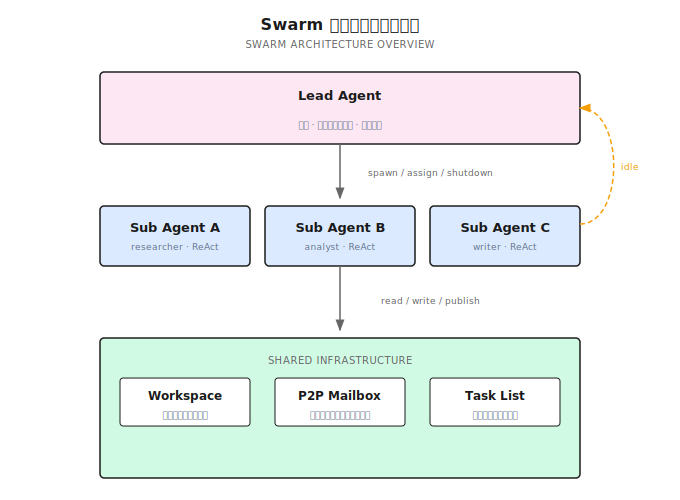
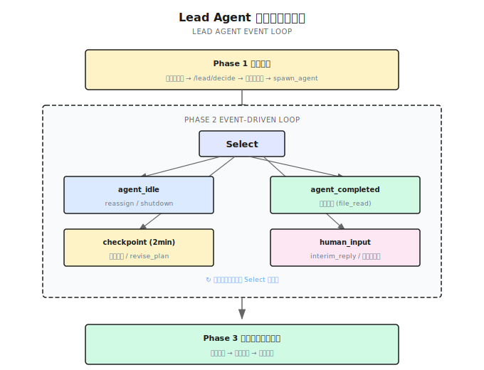
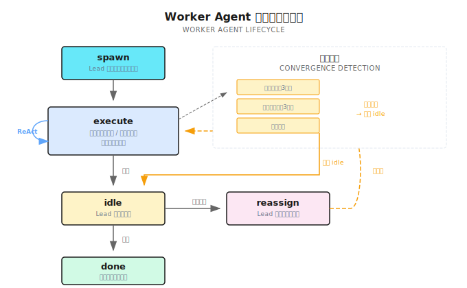

# 第 15 章：Swarm パターン

> **Swarm（スウォーム）とは、複数のエージェントをチームのように協働させること——Lead Agent が計画と調整を担い、Worker Agent がそれぞれ独立して実行し、共有 Workspace と P2P メッセージでお互いの情報をやり取りする。個体はシンプルなルールに従い、群体として複雑な知性が創発する。**

---

> **⏱️ 5分で核心を掴む**
>
> 1. Swarm = Lead Agent（イベント駆動） + Worker Agent（独立した ReAct ループ）
> 2. Lead の3フェーズ：初期計画 → イベントループ（idle/completed/checkpoint/human_input）→ クロージング合成
> 3. Worker はタスク完了後 idle 状態に入り、Lead は reassign で新しいタスクを割り当てるか shutdown する
> 4. 共有 Workspace + P2P Mailbox でエージェント間の協働を実現
> 5. 人間は human_input イベントでリアルタイムに参加できる。プロセスの終了を待つ必要はない
> 6. 純粋な分散型では不十分——Anthropic の C Compiler 実験がそれを証明した
>
> **10分コース**：15.1-15.3 → 15.4 → 15.8 → Shannon Lab

---

## 15.1 オープニング：競合分析エージェントの壁

前章では DAG ワークフローを解説した——依存関係グラフでタスクをスケジューリングし、並列化すべきものは並列化し、待つべきものは待つ。DAG は強力だが、ある前提がある：**タスク構造が固定であること**。

去年、あるコンサルティング会社の競合分析エージェントを手伝った。最初の要件は明確だった：5社の競合他社の製品、価格設定、市場シェアを分析する。DAG で5つの並列リサーチタスク + 1つの統合タスクを設計して、うまくいっていた。

ところが、クライアントから新しい要件が出てきた：「分析中に、ある会社が特に重要だとわかったら、自動的にその会社の技術特許を深掘りできないか？」

これは DAG の能力を超えている。DAG のタスクは固定であり、途中で「人を追加する」ことはできない。実行中に「この会社は深掘りする価値がある、もう一人特許アナリストを送り込もう」とは言えないのだ。

人の追加だけの問題ではない。クライアントは分析中にいつでも追加質問をしたがった——「XX社の価格戦略にもっと注目してくれないか？」。これはシステムが**実行中に人間の入力を受け付けて動的に調整する**必要があることを意味する。

DAG ではこれらができない。もっと柔軟なオーケストレーションパターンが必要だ——エージェントが自律的に協働し、動的に調整し、人間のフィードバックにリアルタイムで応答できるもの。

それが **Swarm パターン** だ。

---

## 15.2 Swarm とは何か？

### Swarm の起源：アリから AI へ

Swarm（群体）という概念は AI 領域で生まれたものではない。その根源は自然界にある。

1989年、ベルギーの研究者 Marco Dorigo がアリの採餌行動を観察し、蟻コロニー最適化アルゴリズム（Ant Colony Optimization）を提案した。1匹のアリにはほとんど知性がない——できることはたった3つ：フェロモンに沿って歩く、食料を見つけたらフェロモンを残す、ランダムに探索する。しかし数千匹のアリがフェロモンという「共有媒体」を通じて協働することで、巣から食料源への最短経路を発見できる。全体の地図を知っているアリは一匹もいないが、群体として経路最適化能力が創発するのだ。

この現象は自然界のあらゆる場所で見られる：ミツバチの群れは8の字ダンスで蜜源の位置を伝達し、魚の群れは側線で隣の個体の動きを感知して全体として障害物を回避し、鳥の群れは3つのシンプルなルール（分離、整列、凝集）で壮観な murmuration の飛行フォーメーションを形成する。

社会学者も人間の組織に同様のパターンを発見している。社会学者 James Surowiecki は『群衆の知恵』（The Wisdom of Crowds, 2004）で論じた：**多様性、独立性、分散化の3条件が満たされるとき、群体の意思決定は個人の専門家を上回る**。2001年に Eric Bonabeau らは『Swarm Intelligence: From Natural to Artificial Systems』で、これらの自然現象を体系的にエンジニアリング手法へと抽象化した。

コアのアイデアは常に一貫している：**個体がシンプルなルールに従う + 共有媒体を通じてコミュニケーション = 群体として複雑な行動が創発する**。

AI エージェントの時代になって、この考え方はそのままマッピングされる：

| 自然/社会の Swarm | AI Agent Swarm |
|----------------|----------------|
| アリ / ミツバチ / チームメンバー | Worker Agent |
| 女王蜂 / プロジェクトマネージャー | Lead Agent |
| フェロモン / 8の字ダンス / カンバン | Workspace + P2P メッセージ |
| 巣 / 蜂の巣 / オフィス | 共有インフラ |
| 採餌 / 採蜜 / プロジェクト完遂 | ユーザータスクの実行 |

### 一言で定義

**Swarm とは Lead Agent 駆動のイベントループ型オーケストレーションパターンだ——Lead が計画と調整を担い、Worker Agent がそれぞれ独立した ReAct ループを実行し、共有 Workspace と P2P メッセージで協働する。**

### DAG との根本的な違い

| 次元 | DAG（第 14 章） | Swarm（本章） |
|------|----------------|--------------|
| オーケストレーション方式 | 静的な依存関係グラフ | Lead Agent のイベント駆動 |
| エージェント生成 | 固定、分解フェーズで確定 | 動的、Lead が spawn を判断 |
| タスク調整 | 途中変更不可 | Lead が revise_plan 可能 |
| エージェント再利用 | 完了したら終了 | idle → reassign で新タスク |
| 品質チェック | なし | Lead がゼロコスト file_read で検証 |
| 人間の参加 | プロセス終了後 | human_input イベントでリアルタイム応答 |

### OpenAI Swarm から Lead-based Swarm へ

2024年10月、OpenAI が Swarm フレームワークをオープンソース化した——極めてシンプルな Agent + Handoff + Routines の設計だ。「純粋な分散型」の理念に忠実で、Lead Agent なし、品質チェックなし、エージェント間は純粋に Handoff で自己組織化する。コンセプトはエレガントだが、あまりにもシンプルすぎて、2025年3月に Agents SDK に置き換えられた。

純粋な分散型はアリの群れのようなもの——タスクが自然に分解可能なときは驚異的な効率だが、タスクにグローバルな調整が必要なときは力不足になる。Anthropic が16個のエージェントで C コンパイラを書いた実験がそれを証明した（15.7 で詳述）：**モジュール化されたタスクでは完璧な並列化、モノリシックなタスクでは互いに踏み合い**。

実は自然界のミツバチの群れが答えを出している——純粋な分散型ではないのだ。女王蜂がグローバルな調整を担い（産卵、フェロモン分泌で群体の気分をコントロール）、働き蜂がそれぞれ具体的なタスクを実行する（採蜜、巣作り、防御）。これは**中央調整ありの分散実行**だ。

Shannon はまさにこのモデルに沿っている：**Lead-based Swarm**。Lead Agent がグローバルな計画と品質チェックを担い、Worker Agent は高い自律性を維持する。Lead は具体的な作業をしないが、誰がやるか、出来はどうか、次に何をするかを決定する。



---

## 15.3 16個のエージェントで C コンパイラを書いた

コンセプトの話は終わったので、実際のケースを見てみよう。Anthropic が2026年2月に発表した記事（"Building a C compiler with a team of parallel Claudes"）では、並列な Claude エージェントのチームで C コンパイラを書き、最終的に10万行の Rust コードを生成、API コストは約 $2万だった。

### 完全に分散型の設計

この16個のエージェントには **Lead がいない**。調整メカニズムは：

- **ロックファイル**：エージェントがモジュールを修正する前にロックを取得
- **Git**：エージェントがそれぞれブランチで作業し、定期的にマージ
- **共有テストスイート**：品質検証の唯一の基準

これはアリの採餌と全く同じロジックだ——各エージェントはローカルな情報（ロックファイル、テスト結果）だけを見て、共有媒体（Git リポジトリ）を通じて暗黙的に調整する。

### モジュール化されたタスクでは驚異的な効果

C 言語には多くの独立した機能がある——配列、ポインタ、struct、union、enum……各機能はほぼ互いに干渉しない。16個のエージェントがそれぞれの C 機能を分担して実装し、並列に推進して、効率は極めて高かった。

これこそ分散型 Swarm のスイートスポットだ：**タスクが自然に分解可能で、モジュール間の結合度が低い**——アリが異なる食料の断片を分担して運ぶようなものだ。

### モノリシックなタスクでは崩壊

タスクが「Linux カーネルをコンパイルする」に変わると、問題が出てきた。16個のエージェントが同じバグに衝突した——ABI 互換性の問題だ。各エージェントが修正を試み、それぞれ異なるバージョンを作り出し、互いに上書きし合った。

これも自然界と一致している——アリが大きな葉っぱを運ぶとき、調整がなければ、四方八方に同時に力を入れてその場でグルグル回ることになる。

Anthropic チームの解決策：GCC を Oracle（参照コンパイラ）として導入し、「Linux カーネルのコンパイルを通す」というモノリシックなタスクを、並列化可能な複数のサブタスクに再分解した（各 C 機能ごとに GCC の出力と比較）。

**本質的に、彼らは Lead Agent の空白を埋めたのだ**——ただしこの "Lead" は人間のエンジニア + GCC テストスイートの組み合わせだった。

### 3つの核心的な教訓

**1. タスクバリデーターの品質は Prompt より重要。**

> "Claude will solve whatever problem I give it, so the verifier must be nearly perfect."

エージェントは明確に定義された問題を解くのが得意だ。ボトルネックはエージェントの能力ではなく、「正しくできた」とは何を意味するかを正確に定義できるかどうかにある。

**2. 環境設計は Prompt と同等に重要。**

テスト出力のフォーマット、`--fast` オプション（通過済みテストのスキップ）、進捗ドキュメント……これらの「インフラ」がエージェントの効率に与える影響は、Prompt そのものに劣らない。

**3. 自律的に書かれたコードに「不安」を感じる。**

Anthropic の安全チームのメンバーがこのプロジェクトに参加した。彼は率直に語った：AI に自律的に10万行のコードを書かせる体験は不安だと——コードの品質が悪いからではなく、**誰もこれらのコードを完全に理解していない**からだ。

### 実験からプロダクトへ：Claude Code の選択

C Compiler は単なる実験ではなかった——Anthropic のプロダクト設計に直接影響を与えた。

Anthropic はその後、Multi-Agent リサーチシステムのアーキテクチャを公開した（"How we built our multi-agent research system"）。このシステムは最終的に Claude Code の agent team 機能へと進化した。重要なアーキテクチャ上の決定は：**純粋な分散型をやめた**こと。Claude Code の Multi-Agent モードは、メインのエージェントが複数のサブエージェントを調整する構造を採用している——メインエージェントがタスクの分解、割り当て、結果の統合を担い、サブエージェントがそれぞれ独立して実行する。

C Compiler 実験から Claude Code プロダクトまで、Anthropic が歩んだ道筋は明確だ：

1. **純粋な分散型**（C Compiler）→ モジュール化時は驚異的、調整時は崩壊
2. **調整レイヤーの導入**（Research System）→ Lead Agent + Worker Agent
3. **プロダクト化**（Claude Code agent team）→ メインエージェント駆動の Multi-Agent 協働

これは自然界の法則と完全に合致している——ミツバチの群れは純粋な分散型ではなく、女王蜂がグローバルな調整を提供する。オオカミの群れにはアルファが意思決定を担い、人間のチームにはプロジェクトマネージャーがいる。**効果的な群体の協働には、何らかの形の調整センターが必要だ**。

Shannon の設計も同じ考え方に沿っている：**Lead-based Swarm**——Lead Agent で調整の空白を埋めつつ、Worker の高い自律性を維持する。

次に Shannon の具体的な実装を見ていこう。

---

## 15.4 Shannon の Swarm アーキテクチャ

Shannon の SwarmWorkflow は3つのフェーズに分かれる：



### フェーズ1：Lead の初期計画

Lead Agent がユーザーのクエリを受け取り、`/lead/decide` を呼び出して初期計画を生成する：

```
用户："分析 AI Agent 市场的 5 家头部公司"

Lead 決策：
  → 创建任务 T1: "调研公司A的产品线和技术栈"
  → 创建任务 T2: "调研公司B的市场策略和融资"
  → 创建任务 T3: "调研公司C的开源生态"
  → spawn_agent: Sub Agent A (researcher, T1)
  → spawn_agent: Sub Agent B (analyst, T2)
  → spawn_agent: Sub Agent C (researcher, T3)
```

Lead は一度に複数の Action を実行できる。Shannon は12種類の Action タイプを定義している：

| Action | 説明 |
|--------|------|
| `spawn_agent` | 新しい Worker Agent を生成 |
| `assign_task` | idle 状態のエージェントに新タスクを割り当て |
| `create_task` | 新タスクを作成（すぐには割り当てない） |
| `cancel_task` | タスクをキャンセル |
| `file_read` | エージェントが書いたファイルを直接読み取り（LLM 呼び出しなし） |
| `revise_plan` | タスク計画を動的に調整 |
| `send_message` | P2P でエージェントにメッセージを送信 |
| `shutdown_agent` | エージェントをシャットダウン |
| `interim_reply` | ユーザーに中間応答を送信 |
| `final_reply` | 最終応答を送信 |
| `synthesize` | 最終合成をトリガー |
| `done` | Lead プロセスの終了をマーク |

**コード参照**：[`swarm_workflow.go:1676-1760`](https://github.com/Kocoro-lab/Shannon/blob/main/go/orchestrator/internal/workflows/swarm_workflow.go#L1676-L1760) — Lead の初期計画

### フェーズ2：イベント駆動ループ

初期エージェントが起動した後、Lead はイベントループに入る。Go の `workflow.Selector` で多重化し、4種類のイベントをリッスンする：

```go
// 概念简化版
for {
    sel := workflow.NewSelector(ctx)

    sel.AddReceive(agentIdleCh, func(ch workflow.ReceiveChannel, more bool) {
        // Agent 完成任务，报告 idle
        // → Lead 决策：assign_task / shutdown_agent
    })

    sel.AddReceive(agentCompletedCh, func(ch workflow.ReceiveChannel, more bool) {
        // Agent 彻底完成，退出循环
        // → Lead 评估质量：file_read → ACCEPT / RETRY
    })

    sel.AddReceive(checkpointTimer, func(f workflow.Future) {
        // 每 2 分钟触发
        // → Lead 审视全局：revise_plan / interim_reply
    })

    sel.AddReceive(humanInputCh, func(ch workflow.ReceiveChannel, more bool) {
        // 用户发来新指令
        // → Lead 响应：调整任务 + interim_reply
    })

    sel.Select(ctx)

    if allDone { break }
}
```

これが Swarm のコアだ——**Lead はポーリングではなく、イベント駆動**。イベントが来たら処理し、来なければ待つ。

### フェーズ3：クロージング合成

すべての Worker Agent が完了した後、Lead はクロージングフェーズに入る：

1. すべてのエージェントの出力と Workspace データを収集
2. 最終応答を合成（品質が基準に達しない場合は LLM で再合成）
3. 結果を返す

**コード参照**：[`swarm_closing.go`](https://github.com/Kocoro-lab/Shannon/blob/main/go/orchestrator/internal/workflows/swarm_closing.go) — クロージング・まとめロジック

---

## 15.5 Worker Agent の ReAct ループ

各 Worker Agent は独立した AgentLoop を実行する——本質的には強化版の ReAct ループだ。



### 各イテレーションのフロー

1. **Shutdown チェック**：ノンブロッキングで Lead からの shutdown シグナルを確認
2. **コンテキスト注入**：タスク記述 + Team Roster + Running Notes + Task Board + Workspace データ + P2P 受信箱
3. **LLM 呼び出し**：単一 Action を返す（tool_call / publish_data / send_message / idle / done）
4. **Action 実行**：ツール呼び出し、Workspace への書き込み、P2P メッセージ送信
5. **収束検知**：ループに陥っていないかチェック

### idle 後の Reassign

Worker は現在のタスク完了後にすぐ終了するのではなく、idle を報告する：

```
Sub Agent A:
  "调研完成，公司A的产品线分析已写入 workspace。"
  → signal: agent_idle (附带 summary)

Lead 收到 idle 信号：
  → file_read: 检查 Sub Agent A 写的文件
  → 质量判定: ACCEPT
  → 还有未分配的任务 T4?
    → 是: assign_task(Sub Agent A, T4)  // 继续干
    → 否: shutdown_agent(Sub Agent A)    // 没活了，关掉
```

この idle → reassign ループが Swarm の重要な強みだ：**エージェントは使い捨てではなく、再利用可能**。Sub Agent A がリサーチを完了した後、新たに spawn せずに分析タスクに割り当てることができる。エージェントの Running Notes と Workspace ファイルはそのまま残るので、コンテキストの再構築が不要になる。

**コード参照**：[`swarm_workflow.go:1125-1230`](https://github.com/Kocoro-lab/Shannon/blob/main/go/orchestrator/internal/workflows/swarm_workflow.go#L1125-L1230) — idle/reassign ループ

### 収束検知

エージェントがループに陥る可能性がある——数ラウンド連続でツールを呼び出さない、繰り返しエラーになる、イテレーション上限を超えるなど。Shannon は3つのレイヤーで検知しており、トリガーされるとエージェントを強制的に idle にし、Lead が次のステップを決定する。

---

## 15.6 Workspace と P2P 通信

Multi-Agent の協働には2つのものが必要だ：共有データと直接通信。自然界の2つの調整方法に対応している——アリのフェロモン（間接通信）とミツバチの8の字ダンス（直接通信）。

### Workspace（共有ワークスペース）

Workspace はすべてのエージェントが共有するデータレイヤーで、アリのフェロモンに似ている——エージェントがここにデータの痕跡を残し、他のエージェントがそれを読み取って意思決定を行う。

#### DAG のデータ受け渡しとの本質的な違い

前章で解説した DAG ワークフローにもデータ受け渡しがあるが、メカニズムは全く異なる。DAG は**明示的な依存関係**だ——タスク A の出力がタスク B の入力になることを、DAG の定義時に決めている。メモを渡すように、宛先を書いておけばその人にだけ届く。

Workspace は**暗黙的な共有**だ——どのエージェントが公開したデータも、すべてのエージェントが見える。会社の共有ホワイトボードに近い：あなたがホワイトボードに発見を書くと、通りかかったすべての同僚がそれを見て活用できる。事前定義のデータフローはなく、情報の消費者は実行時に初めて確定する。

この違いが適用シーンを決定する。DAG は「誰がこのデータを必要とするかわかっている」場合に適している。Workspace は「誰が必要とするかわからないが、この発見はチームにとって有用かもしれない」場合に適している。競合分析のシナリオでは、Sub Agent A が「X社が新たな資金調達を完了した」と発見したとき、この情報は価格分析のエージェントにも、市場戦略分析のエージェントにも価値があるかもしれない——事前に依存関係の線を引くことはできない。

#### 読み書きモデル

エージェントは `publish_data` Action で Workspace に書き込む。書き込み時には **topic**（トピック）を指定する必要があり、たとえば `market_findings` や `pricing_data` といった具合だ。他のエージェントは各 ReAct イテレーションの開始時に、システムが自動的に Workspace の新しいデータを確認し、エージェントのコンテキストに注入する。

重要な設計：読み取りは**差分方式**だ。エージェントは前回の読み取り以降の新しいデータだけを取得し、毎回 Workspace 全体をコンテキストに詰め込むことはない。これは極めて重要だ——5つのエージェントがそれぞれ10件のデータを公開し、各エージェントが毎ラウンド全量を読むと、コンテキストがあっという間に爆発する。

具体的なデータの流れを見てみよう：

```
第 1 轮迭代：
  Sub Agent A（调研）：搜索发现"公司X刚融资5亿"
    → publish_data(topic="market_findings", data="公司X完成5亿融资...")

第 2 轮迭代：
  Sub Agent B（定价分析）：开始新一轮思考
    → 系统自动注入：[Workspace 新数据] market_findings: "公司X完成5亿融资..."
    → Sub Agent B 读到后调整分析："考虑到公司X的新融资，其定价策略可能趋于激进..."
    → publish_data(topic="pricing_data", data="公司X可能发起价格战...")

第 3 轮迭代：
  Sub Agent A：继续调研
    → 系统自动注入：[Workspace 新数据] pricing_data: "公司X可能发起价格战..."
    → Sub Agent A 据此深挖公司X的竞争策略
```

ここでは、どのエージェントも明示的に「誰かにメッセージを送る」ことをしていない。データはフェロモンのように拡散していく。Sub Agent A は公開するときに Sub Agent B が読むことを全く知らない——しかし実際に読み取られ、分析の方向に影響を与えた。

#### Workspace vs P2P：ブロードキャストとポイントツーポイント

ここで自然な疑問が出てくる：Workspace があるのに、なぜ次に説明する P2P メッセージも必要なのか？

それは、この2つが異なる問題を解決するからだ。Workspace は**ブロードキャスト**——1対多で、「発見があった、みんなに役立つかもしれない」に適している。P2P は**ポイントツーポイント**——1対1で、「Sub Agent A、具体的な問題を調べてほしい」に適している。

日常生活でのたとえ：Workspace は Slack のパブリックチャンネルのように、メッセージを投稿すると全員が見える。P2P はダイレクトメッセージのように、受信者だけが見る。パブリックチャンネルで「田中さん、あの契約を調べてくれ」とは言わないし、ダイレクトメッセージで「重大発見：競合が値下げした」と発信することもない。2つの通信方式は相互補完的で、どちらも欠かせない。

### P2P Mailbox（ポイントツーポイントメッセージ）

エージェント間の直接通信——ミツバチの8の字ダンスに似た、1対1の正確な情報伝達だ。5種類のメッセージタイプをサポートする：

| タイプ | 用途 |
|------|------|
| Request | 「Sub Agent A、A社の特許データを調べてくれ」 |
| Offer | 「B社の価格データがあるけど、必要？」 |
| Accept | 「OK、送ってくれ」 |
| Delegation | Lead がタスクを委任 |
| Info | 通知メッセージ、返信不要 |

メッセージは非同期で配信され、受信側は次の ReAct イテレーション時に読み取る——送信側をブロックしない。

**コード参照**：[`p2p.go`](https://github.com/Kocoro-lab/Shannon/blob/main/go/orchestrator/internal/activities/p2p.go) — WorkspaceAppend / SendAgentMessage

> **第 16 章への接続**：本節では Swarm の中で**なぜ**これらの協働メカニズムが必要なのかを解説した。第 16 章では**どう実装するか**——エージェント間のタスク引き継ぎプロトコルである Handoff を深く掘り下げる。

---

## 15.7 Lead の品質チェック

Lead Agent はタスクを割り当てるだけでなく、品質の検証も担う。ただし、検証コストが高すぎてはいけない——毎回 LLM を呼んで判断するわけにはいかない。

### ゼロコスト file_read 検証

Lead は Worker が書いたファイルを直接読み取ることができ、**LLM を呼び出さない**：

```
Sub Agent A 报告 idle，声称完成了公司A分析。

Lead 决策：
  → file_read: "workspace/company_a_analysis.md"  (0 token)
  → 文件内容覆盖了产品/定价/技术 → ACCEPT
  → file_read: "workspace/company_a_patents.md"    (0 token)
  → 文件只有 3 行 → RETRY，附加指示："专利部分需要更详细"
```

これは C Compiler の教訓が直接反映されている——バリデーターの品質がシステムの品質を決定する。file_read によって Lead はゼロ Token コストで基本的な品質チェックを行い、問題を発見したらすぐにリトライさせる。

### デッドループの防止

2つのレイヤーで保護する：

- **収束検知**：Worker が数ラウンド連続で実質的な成果がない場合、強制的に idle にし、Lead がリトライするか諦めるかを判断
- **グローバル終了**：すべてのエージェントが idle で、割り当て待ちのタスクもない場合、Lead は自動的にクロージングフェーズに入る

---

## 15.8 HITL：Swarm における人間と AI の協働

HITL（Human-in-the-Loop）とは、AI システムの実行中に人間がリアルタイムで意思決定、フィードバック、軌道修正に参加することだ。システムが完了してから結果を見るのではない。

従来のオーケストレーションパターンでは、人間の参加は「事後承認」だった——エージェントが完了したら、人がチェックして、承認か差し戻し。

Swarm の HITL は違う：**人間はイベントループの一部だ**。

### human_input イベント

ユーザーはいつでも Signal を通じて Lead にメッセージを送れる：

```
用户 (t=3min): "多关注一下公司C的开源策略"

Lead 收到 human_input 事件：
  → interim_reply: "收到，我让 Sub Agent C 重点关注开源策略"
  → revise_plan: 给 Sub Agent C 追加任务
  → assign_task(Sub Agent C, "深入分析公司C的开源生态和社区活跃度")
```

一時停止も不要、現在のラウンドの終了を待つ必要もない——Lead はイベントループの次の Select で処理できる。

### 2分ごとの checkpoint

Lead は2分ごとに自動的に checkpoint をトリガーし、グローバルな状態を確認する：

- エージェントが詰まっていないか？ → ヒントを送るか reassign
- 進捗は予定通りか？ → ユーザーに報告
- 計画の調整が必要か？ → revise_plan

### SSE リアルタイムストリーム

フロントエンドは Server-Sent Events でリアルタイム更新を受け取る：

| イベントタイプ | 内容 |
|---------|------|
| `LEAD_DECISION` | Lead がどの決定をしたか |
| `AGENT_STARTED` | Worker が起動した |
| `AGENT_COMPLETED` | Worker が完了した |
| `INTERIM_REPLY` | Lead の中間応答 |

ユーザーはエージェントチームのリアルタイムな協働プロセスを見ることができ、いつでも介入できる。

### コア理念

**人間こそが究極の Lead Agent だ。** Shannon の Swarm 設計において、Lead Agent は人間の代理——人間の代わりに大部分の調整作業を行うが、人間はいつでも human_input を通じて Lead の判断を上書きできる。これは「人手による承認」ではなく、「人間と AI の協働」だ。

---

## 15.9 オーケストレーションパターンのスペクトラム

| 次元 | DAG（第 14 章） | Swarm（本章） |
|------|----------------|--------------|
| オーケストレーション方式 | 静的な依存関係グラフ | Lead のイベント駆動ループ |
| エージェント生成 | 固定 | 動的 spawn/reassign |
| 通信メカニズム | 依存関係による受け渡し | Workspace + P2P Mailbox |
| 品質チェック | なし | Lead の file_read 検証 |
| 人間の参加 | 事後確認 | イベントループ内でリアルタイム応答 |
| 適用シーン | タスク構造が明確、依存関係がクリア | 複雑な協働、動的調整、人間のフィードバックが必要 |

**選択ガイド**：

- タスク構造が完全に固定、依存関係が明確 → **DAG**
- タスクの動的調整が必要、エージェントの協働が必要、人間のフィードバックが必要 → **Swarm**
- 迷ったら？DAG から始めて、不十分だとわかったら Swarm にアップグレード

---

## 15.10 よくある誤解

| 誤解 | なぜ間違いか | 正しいアプローチ |
|------|---------|---------|
| エージェントは多ければ多いほど良い | 調整コストが指数的に増大する | 集中した3つのエージェントの方が分散した5つより優れている |
| Lead は全く不要 | C Compiler 実験が反証した | Lead のグローバル調整と品質チェックは不可欠 |
| 収束検知を無視する | エージェントが無限ループに陥る可能性がある | 多層の検知メカニズム、詰まったら強制的に Lead に戻す |
| Token 予算を無視する | Swarm の Token 消費は単一エージェントを大幅に超える | エージェント数の上限と総 Token 予算を設定する |
| Workspace をデータベースとして使う | Workspace は一時的な協働エリア | 永続データには Running Notes を使う |
| Lead が何にでも口を出す | Lead のラウンドが多すぎると Token を浪費する | Lead はイベントがトリガーされたときだけ介入、Worker は自律的に実行 |

---

## 15.11 本章のまとめ

1. **Swarm = Lead + Workers**：Lead Agent がイベント駆動で調整、Worker Agent が独立した ReAct ループを実行
2. **3フェーズ**：初期計画 → イベントループ（idle/completed/checkpoint/human_input）→ クロージング合成
3. **idle → reassign**：Worker は完了後に終了せず、Lead が新タスクを割り当てられる
4. **Workspace + P2P**：共有ワークスペース（Redis + ファイルシステム）+ ポイントツーポイントメッセージ
5. **ゼロコスト検証**：Lead がファイルを直接読み取り、LLM を呼び出さない
6. **HITL**：human_input イベントで人間がイベントループの一部になる
7. **Lead の必要性**：純粋な分散型は調整タスクで制御不能になる（C Compiler の教訓）

---

## Shannon Lab（10分で体験）

### 必読（1ファイル）

- [`swarm_workflow.go`](https://github.com/Kocoro-lab/Shannon/blob/main/go/orchestrator/internal/workflows/swarm_workflow.go) — Swarm 全体のコア実装。注目ポイント：Lead の初期計画（行 1676-1760）、AgentLoop の idle/reassign ループ（行 1125-1230）、Lead イベントループの Select 分岐、収束検知ロジック

### 選読・深掘り（2ファイル）

- [`p2p.go`](https://github.com/Kocoro-lab/Shannon/blob/main/go/orchestrator/internal/activities/p2p.go) — Workspace CRUD（`WorkspaceAppend` / `WorkspaceList`）と P2P メッセージ（`SendAgentMessage`）、エージェント間の協働インフラを理解する
- [`roles/swarm/lead_protocol.py`](https://github.com/Kocoro-lab/Shannon/blob/main/python/llm-service/roles/swarm/lead_protocol.py) — Lead の system prompt と12種類の Action 定義、Lead Agent の「能力の境界」を理解する

---

## 延伸読書

- [Building a C Compiler with Claude](https://www.anthropic.com/research/building-a-c-compiler-with-claude) — Anthropic の16エージェント実験、純粋な分散型 Swarm の教訓
- [How we built our multi-agent research system](https://www.anthropic.com/engineering/built-multi-agent-research-system) — Anthropic の Multi-Agent リサーチシステムアーキテクチャ
- [OpenAI Swarm](https://github.com/openai/swarm) → [Agents SDK](https://openai.github.io/openai-agents-python/) — 極小 Swarm から本番レベル SDK への進化
- [`docs/swarm-agents.md`](https://github.com/Kocoro-lab/Shannon/blob/main/docs/swarm-agents.md) — Shannon の Swarm 完全設計ドキュメント（734行）

---

## 次章予告

Swarm ではエージェント間が Workspace と P2P メッセージで協働する。しかし、もっと根本的な問題がある：

**あるエージェントがタスクを別のエージェントに引き継ぐとき、引き継ぎの完全性をどう保証するのか？**

- コンテキストの受け渡し：どの情報を渡して、どれを渡さないのか？
- 状態の維持：引き継ぐエージェントは前後の文脈を理解できるのか？
- プロトコル設計：引き継ぎの標準プロセスとは？

次章では **Handoff メカニズム**——エージェント間のタスク引き継ぎのエンジニアリング実装を解説する。
