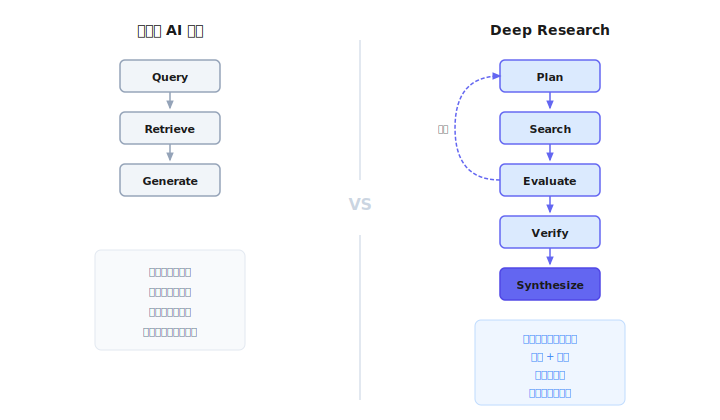
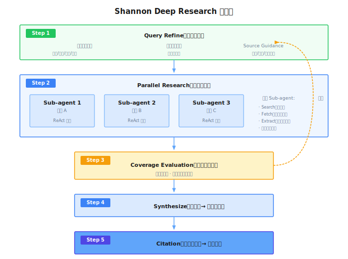

# 第 27 章：Deep Research

> **Deep Research は「ちょっと検索して」を「ちゃんと調べて」にアップグレードする——多く検索するのではなく、専門の研究員のように思考し、計画し、検証し、統合する。**

---

## 27.1 「検索」と「リサーチ」の違い

AI に手伝ってもらうとする：

> 「AI エージェント（Agent）の企業導入状況について調べてほしい。」

**従来の AI 検索の反応**：
検索 → 上位 5 件を取得 → 要約を組み合わせる → 返す。

**Deep Research の反応**：
「この質問はちょっと大きいな、どう分解しようか...」
→ 技術的課題？組織的課題？成功事例？失敗の教訓？
→ まず広く検索して、みんなが何を議論しているか見てみよう
→ 「セキュリティ」が頻繁に言及されている、深掘りしよう
→ いくつかの事例を見つけたが、データに矛盾がある、クロスチェックしよう
→ 構造化されたレポートにまとめ、各結論の出典を明記する

本質的な違いは何か？

| | 従来の AI 検索 | Deep Research |
|---|-------------|---------------|
| 検索 | 一度きり | 複数ラウンドの反復 |
| 推論 | ほぼなし | 計画、適応、判断 |
| 検証 | 検証しない | クロス検証、ソース品質評価 |
| 出力 | 断片的な組み合わせ | 構造化レポート + 引用 |

**一言でまとめると**：「多く検索する」のではなく、「考えることができる」。



---

## 27.2 業界発展の略史

「検索エンジン」から「Deep Research」へ、一足飛びではなく、3 年かけた進化だ。

### 2022 年末：Answer Engine の誕生

2022 年 8 月、[Perplexity AI](https://en.wikipedia.org/wiki/Perplexity_AI) が設立された。12 月、彼らは Perplexity Ask——「対話型回答エンジン」をリリースした。

創業者の洞察はシンプルだ：従来の検索エンジンはリンクの束を返し、ユーザーは自分でクリックして答えを探す必要がある。なぜ直接答えを出さないのか？

重要なイノベーションは**引用**だ。CEO の Aravind Srinivas は言った：「引用は検索と LLM をつなぐ最良の方法だ。」Perplexity は RAG（Retrieval-Augmented Generation、検索拡張生成）でリアルタイムにウェブを検索し、LLM に答えを統合させ、出典を明記させた。

同月、ChatGPT がリリースされたが、インターネット接続機能がなかった——訓練データでしか答えられず、リアルタイム情報を取得できなかった。

### 2023 年：AI 検索の混戦

2023 年初頭、競争が激化した：

- **1 月**：Microsoft が OpenAI への追加投資 100 億ドルを発表（累計 130 億ドル）、GPT-4 を Bing に統合
- **3 月**：Google が緊急で Bard（後の Gemini）をリリース
- **年中**：Google が SGE（Search Generative Experience）をリリース、検索結果の上部に AI 要約を追加

Perplexity は急成長した——2 月には 200 万ユーザー、年末には日間クエリ数が 2000 から 400 万に増加、1000 倍の成長だ。

しかしこの段階の AI 検索は本質的に**問答**だった：ユーザーが一言聞いて、AI が一言答える。複雑な問題はユーザー自身が分解し、何度も質問し、手動で統合する必要があった。

### 2024 年：問答から検索製品へ

2024 年は AI 検索の製品化の年だった：

- **7 月**：OpenAI が [SearchGPT](https://openai.com/index/searchgpt-prototype/) プロトタイプをリリース、ChatGPT が初めてウェブ検索可能に
- **10 月**：OpenAI が正式に ChatGPT Search をリリース、Perplexity に対抗
- **12 月**：Google が Gemini Advanced ユーザーに Deep Research を展開

Google Deep Research は重要な変化をもたらした：ユーザーが質問した後、AI がまず「研究計画」を提示し、ユーザーの確認後に実行する。出力は「回答」ではなく「レポート」だ。

これは考え方が変わったことを意味する：
- 以前：AI は「回答マシン」——聞かれたことに答える
- 以後：AI は「研究アシスタント」——計画、実行、統合を手伝う

Perplexity は 2024 年に 524% 成長し、評価額が 90 億ドルを突破した。

### 2025 年：Deep Research 元年

2025 年 2 月が製品の転換点だった：

- **2 月 2 日**：OpenAI が o3 ベースの [Deep Research](https://openai.com/index/introducing-deep-research/) をリリース、自律的な研究計画、分野横断分析、専門レポート生成が可能に
- **2 月 14 日**：Perplexity が無料の [Deep Research](https://www.perplexity.ai/hub/blog/introducing-perplexity-deep-research) をリリース、スピードとアクセシビリティを強調
- **4 月**：OpenAI が o3 と o4-mini をリリース、Deep Research 能力がさらに向上
- **6 月**：Anthropic が[マルチエージェント研究システムの完全な技術詳細](https://www.anthropic.com/engineering/multi-agent-research-system)を公開

2025 年中期までに：
- AI 検索トラフィックの割合が 2024 年の 0.02% から 0.15% に成長（7 倍）
- ChatGPT の日間クエリが 10 億回を超え、週間アクティブユーザーが 5 億人を突破
- Perplexity の月間クエリが 7.8 億回、評価額が 140 億ドルを超える

Deep Research は標準機能となったが、各社の技術ルートは異なる——次のセクションで説明する。

---

## 27.3 2 つのアーキテクチャルート

> 以下の情報は 2025 年中期の公開資料に基づいており、各社の製品は継続的に進化している。

**ルート 1：単一エージェント + 強力な推論（OpenAI）**

一つの強力な推論モデルで研究プロセス全体を完了する。モデル自体が計画、検索、バックトラック、統合を学習する。

OpenAI の Deep Research は o3 モデルの特化版に基づいている。コアアイデアは**エンドツーエンドの強化学習**——シミュレートされた研究環境でモデルを訓練し、完全な研究プロセスを学ばせる：複数ステップの検索をどう計画するか、行き詰まったらどうバックトラックするか、リアルタイム情報に基づいてどう戦略を調整するか。これらの能力はコードに書かれているのではなく、モデルが訓練を通じて「学んだ」ものだ。

長時間の研究タスク（30 分かかる可能性がある）をサポートするため、o3 は注意範囲を拡張し、長い推論チェーンでコンテキストを維持できる。また、クロスモーダル分析もサポート——テキストだけでなく、画像を理解し、PDF データを抽出できる。外部には「単一エージェント」として見えるが、内部には実際に階層的なスケジューリングがある：安価な小型モデルが前処理と振り分けを行い、高価な大型モデルがコア推論を行い、コストと効果のバランスを取る。

2025 年 4 月に o4-mini 軽量版がリリースされ、無料ユーザーも軽量版 Deep Research を使用できるようになった。

**ルート 2：マルチエージェント協調（Anthropic）**

複数の専門化されたエージェントが分業して協力する。一つの Lead Agent が計画と統合を担当し、複数の Sub-agent が異なる次元を並行して探索する。

Anthropic は完全な技術詳細を公開した（次のセクションで詳しく見る）。コアの利点は**並列と圧縮**だ。各 Sub-agent には独立したコンテキストウィンドウがあり、一つの次元に集中して探索でき、互いに干渉しない。探索完了後、Sub-agent はすべての生情報を返すのではなく、重要な発見に圧縮する——これによりコンテキストの爆発を避ける。コストは Token 消費が単一エージェントの約 15 倍だが、引き換えに 90% 以上の性能向上がある。

**比較**

| 次元 | 単一エージェント（OpenAI） | マルチエージェント（Anthropic） |
|-----|-------------------|---------------------|
| コア能力の源泉 | モデルの推論能力 | アーキテクチャ設計 |
| コンテキスト管理 | モデルの長い注意範囲に依存 | 圧縮と分離に依存 |
| 並列能力 | 限定的（内部スケジューリング） | ネイティブサポート |
| 解釈可能性 | 低い（エンドツーエンド） | 高い（ステップが明確） |
| エンジニアリング複雑度 | 低い（単一モデル） | 高い（マルチエージェント協調） |

2 つのルートに絶対的な優劣はない。OpenAI ルートはモデル能力に依存し、Anthropic ルートはアーキテクチャ設計に依存する。実際の製品では、両者がしばしば融合する——OpenAI 内部にもマルチモデルスケジューリングがあり、Anthropic の Sub-agent 内部でも推論ループが走る。

---

## 27.4 Anthropic のマルチエージェント方式

> 出典：[How we built our multi-agent research system](https://www.anthropic.com/engineering/multi-agent-research-system)（2025 年）

彼らの設計を重点的に見てみよう。

### アーキテクチャ


*画像出典：[How we built our multi-agent research system](https://www.anthropic.com/engineering/multi-agent-research-system)*

### なぜマルチエージェントを選んだのか？

コアの洞察は**圧縮**だ。

各 Sub-agent には独自のコンテキストウィンドウがあり、ある次元を独立して探索できる——例えば、一つは技術課題を検索し、一つは成功事例を検索し、一つは失敗の教訓を検索する。

探索完了後、Sub-agent はすべての生情報を Lead Agent に渡すのではなく、「圧縮」する——重要な発見を抽出し、詳細を破棄する。Lead Agent はエッセンスを統合するだけで、大量の生情報を処理する必要がない。

このようにする利点は、単一のコンテキストウィンドウの制限を突破できることだ。

### エージェント数はどう決める？

多ければ多いほど良いわけではない。Anthropic の経験：

| タスク複雑度 | 推奨エージェント数 |
|-----------|--------------|
| 単純な事実クエリ | 1 つで十分 |
| 比較分析 | 2-4 つ |
| 総合調査 | 10 以上 |

### 協調メカニズム

マルチエージェントの最大の課題は協調だ。想像してほしい：同じトピックを調査するために 10 人の研究員を派遣したが、明確な役割分担がなければ、同じ内容を検索するかもしれないし、検索してきた情報のフォーマットがバラバラで、最後に統合する人が使えない。

Anthropic はここに多大な労力を注いだ。

**タスク割り当ての「契約」設計**

Lead Agent が各 Sub-agent に渡すのは曖昧な「これを調べて」ではなく、明確な「タスク契約」だ：目標は何か（「競合他社を調査して」ではなく、「3-5 社の主要競合他社の製品価格戦略を見つける」）、出力フォーマットは何か（構造化されている必要がある、例えば「会社名 | 製品 | 価格帯」）、どのツールが使えるか、境界はどこか（何をすべきでないか）。

この契約設計により、各エージェントの出力が予測可能で、組み合わせ可能になる。Lead Agent が受け取るのはフォーマットがバラバラなテキストの束ではなく、直接統合できる構造化データだ。

**情報伝達の「圧縮」問題**

Sub-agent がある次元を探索すると、数千 Token のコンテンツが生成される可能性がある——検索結果、訪問したウェブページ、中間の推論プロセス。すべてを Lead Agent に渡すと、コンテキストウィンドウがすぐに溢れる。

Anthropic のやり方は：Sub-agent が完全な出力をファイルシステムに保存し、「要約 + 参照」だけを Lead Agent に渡す。要約は圧縮された重要な発見であり、参照は完全なコンテンツへのポインタだ。これが「圧縮」の意味だ——物理的な圧縮ではなく、**意味論的な圧縮**：結論を保持し、プロセスを破棄する。

**長時間タスクのエラー回復**

研究タスクは秒単位で完了しない。完全な Deep Research は 10-30 分かかる可能性があり、その間にネットワークが不安定になったり、API がタイムアウトしたり、ある Sub-agent がスタックしたりする可能性がある。

従来のやり方は「エラーが出たら最初からやり直し」だが、30 分のタスクをやり直すにはコストがかかりすぎる。Anthropic のやり方は**チェックポイント回復**：重要なステップが完了するたびに状態を保存し、エラー時には最新のチェックポイントから再開する。AI の適応能力と組み合わせて——ある検索パスが行き詰まったら、別のパスに切り替えて続行し、一つの道に固執しない。

### 性能データ

| 指標 | データ |
|-----|------|
| マルチエージェント vs 単一エージェントの向上 | 90.2% |
| Token 消費倍率 | 約 15 倍 |
| Token で説明される性能差 | 80% |

最後の一つが興味深い：**Token 使用が性能差の 80% を説明する**。

言い換えれば、マルチエージェントの効果が良いのは、大部分がより多くの Token を思考と探索に費やしているからだ。予算が限られている場合、単一エージェント + より長い推論チェーンでも同様の効果が得られる可能性がある。

---

## 27.5 コア設計決定

どのフレームワークを使って Deep Research を実装しても、いくつかの設計決定は避けられない。

### 決定 1：アーキテクチャ × 能力の源泉

Deep Research の設計空間は 2 つの次元で理解できる：

**次元 1：アーキテクチャ選択**
- **単一エージェント**：一つのモデルが全プロセスを完了、長距離推論能力に依存
- **マルチエージェント**：複数の専門化されたエージェントが分業、アーキテクチャ設計で協調

**次元 2：能力の源泉**
- **モデル訓練**：RL でモデルに研究を「学ばせる」
- **コンテキストエンジニアリング**：プロンプト設計でモデルに研究を「誘導する」

これら 2 つの次元が 4 つの主要な方式を組み合わせる：

| 方式 | アーキテクチャ | 能力の源泉 | 代表 |
|-----|------|---------|------|
| A | 単一エージェント | エンドツーエンド RL | OpenAI Deep Research |
| B | 単一エージェント | コンテキストエンジニアリング | 初期の Perplexity |
| C | マルチエージェント | RL + コンテキスト | Anthropic 方式 |
| D | マルチエージェント | コンテキストエンジニアリング | Shannon、オープンソース方式 |

**OpenAI（方式 A）**：エンドツーエンドの強化学習で o3 モデルを訓練し、シミュレートされた研究環境で計画、検索、バックトラック、統合を学ばせる。モデル自体が研究能力を持ち、アーキテクチャは比較的シンプル。

**Anthropic（方式 C）**：マルチエージェントアーキテクチャ + コンテキストエンジニアリングの組み合わせ。Lead Agent と Sub-agent の動作は主にプロンプトで誘導されるが、モデルの微調整も組み合わせている可能性がある。

**Shannon（方式 D）**：マルチエージェントアーキテクチャ + 純粋なコンテキストエンジニアリング。モデルを訓練せず、完全にアーキテクチャ設計とプロンプトエンジニアリングで研究能力を実現。これがスタートアップやオープンソースプロジェクトの主流選択——コストが低く、イテレーションが速い。

**訓練方法の詳細**

訓練ルートを選択する場合、2025 年の主流には 3 つの方法がある：

1. **エンドツーエンド RL**：モデルをシミュレートされた研究環境に置き、ブラウザとツールを与え、実際のタスクを完了させる。OpenAI のやり方だ。代償として、大量のシミュレーション環境と計算リソースが必要。

2. **RLVR（検証可能な報酬の RL）**：検証可能なシグナルを報酬として使用——例えばコード実行で答えが正しいか検証する。利点は報酬が客観的でスケーラブル。

3. **SFT + マルチステージ RL**：まず教師あり学習で基本能力を教え、次に RL で徐々に難易度を上げる。Microsoft の rStar2-Agent のやり方だ。利点は訓練がより安定。

**コンテキストエンジニアリングの詳細**

訓練しないことを選択した場合（または訓練するリソースがない場合）、コンテキストエンジニアリングがコアになる：

- **研究戦略のエンコード**：時間認識、ソース品質判断、引用追跡などの戦略をプロンプトに書き込む
- **タスク契約**：各サブタスクの入出力フォーマット、使用可能なツール、境界制約を明確にする
- **動的コンテキスト注入**：タスクタイプに応じて異なる検索戦略を注入
- **ReAct ループ**：Reasoning → Action → Observation の反復パターン

マルチエージェントアーキテクチャは本質的にコンテキストエンジニアリングを必要とする——各エージェントにその役割は何か、他のエージェントとどう協力するかを伝える必要がある。

### 決定 2：いつ停止するか？

検索が少なすぎると、答えが不完全になる；検索が多すぎると、お金の無駄遣いになる。このバランスポイントをどう見つけるか？

最もシンプルなやり方は**固定ラウンド数**——例えば 3 ラウンド検索したら停止と決める。利点はコントロールしやすいこと、欠点は画一的：単純な問題はリソースの無駄、複雑な問題は足りない。

よりスマートなやり方は**カバレッジ評価**——問題を複数の次元に分解し、各検索ラウンド後に各次元がどれくらいカバーされたか評価し、カバレッジが閾値に達したら停止する。代償として評価のための追加の推論呼び出しが必要だが、引き換えに「多く検索すべきものは多く検索し、早く停止すべきものは早く停止する」。

もう一つは**モデル自身に判断させる**——しかしこれには専門的な訓練が必要で、普通のモデルはこの判断がうまくできず、早すぎる停止か無限ループになりがち。

実践では、分割統治をお勧めする：単純な事実クエリは 2-3 ラウンドのハードリミット、複雑な総合調査はカバレッジ評価 + 最大 5 ラウンドの安全上限。

### 決定 3：引用をどう検証するか？

検索エンジンが返す要約は「約束」だ——このウェブページに欲しい情報があると言っている。しかしこの約束はしばしば信頼できない：要約が文脈を無視していたり、URL がすでに無効だったり、コンテンツがとっくに更新されていたり。

だから、**実際に URL にアクセス**し、完全なコンテンツを取得してから使えるかどうかを判断する必要がある。このステップで多くの問題が発見される：404、ペイウォール、コンテンツと要約の不一致。ネットワークリクエストが増えるが、「幻覚的引用」を避けられる——レポートにソースを書いたのに、ユーザーがクリックしたら全然違う。

もう一つの鍵は**ソース品質を区別する**こと。同じ情報でも、公式サイトが言っていることと、どこかの集約サイトが言っていることでは、信頼度が全く異なる。レポートは高品質なソースを優先的に引用し、低品質なソースしかない結論には「情報が不正確な可能性がある」と注記すべきだ。

もう一点：複数のソースが矛盾する場合、ユーザーに代わって選ばない。矛盾を提示し、ユーザー自身に判断させる。研究レポートの価値は包括的な情報を提供することであり、ユーザーに代わって結論を出すことではない。

### 決定 4：失敗をどう処理するか？

研究タスクは秒単位で完了しない、10-30 分かかる可能性がある。この間にネットワークが不安定になったり、API がタイムアウトしたり、ある検索が空の結果を返したりする可能性がある。毎回エラーが出るたびに最初からやり直すと、コストが高すぎる。

良いやり方は**非同期タスク管理 + チェックポイント回復**だ。重要なステップが完了するたびに状態を保存し、エラー時には最新のチェックポイントから続行し、タスク全体を再起動しない。これにはタスクを回復可能に設計する必要がある——状態がシリアライズ可能で、ステップ間が疎結合である必要がある。

もう一つの原則は**単一ステップの失敗が全体に影響しない**ことだ。ある URL にアクセスできない？スキップして、他にアクセスを続ける。ある検索が空の結果を返す？別のキーワードで再試行。AI 自体に適応能力があり、失敗時に戦略を調整させ、一つの道に固執させない。

---

## 27.6 品質保証メカニズム

Deep Research が出力するのは「レポート」であり、「チャットの返信」ではない。レポートの品質基準はより高い——各結論にソースが必要、情報が包括的であること、明らかな漏れがないこと。このセクションではいくつかの重要な品質保証メカニズムを説明する。

### 引用追跡：各結論が追跡可能であること

従来の AI 検索の大きな問題は「幻覚的引用」だ——AI が「某某レポートによると」と言うが、クリックしてみるとそんな内容がない、リンクすら偽物だったりする。

Deep Research のやり方は**全行程追跡**だ：

研究プロセス中、検索ツールを呼び出すたびに、ウェブページにアクセスするたびに、記録を残す。レポート生成時、LLM に適当な引用を作らせるのではなく、記録からマッチングする——この結論はどの検索のどの結果から来たか？その検索の元の URL は何か？

最終出力されるレポートでは、各重要な結論の後に [1] [2] [3] のような引用マークがあり、末尾に完全なソースリストがある。ユーザーはクリックして検証できる。

これは小さなことに見えるが、AI 生成コンテンツの信頼性を根本的に変える。

### カバレッジ評価：「検索が終わったらおしまい」ではない

3 回検索と 30 回検索、どちらで十分か？この質問に標準的な答えはなく、研究問題の複雑さによる。

単純な事実クエリ（「OpenAI はいつ設立されたか」）は、1 回の検索で十分。総合的な調査（「AI エージェントの企業導入状況」）は、30 回でもまだ足りないかもしれない。

Deep Research は**カバレッジ評価**でこの問題を解決する。具体的なやり方は：

1. 研究開始時に、問題を複数の次元に分解（例えば「技術課題」「組織課題」「成功事例」「失敗の教訓」）
2. 各検索ラウンド後に、各次元がどれくらいカバーされたか評価
3. ある次元がまだ空白か情報が少なすぎる場合、ターゲットを絞った補充検索
4. すべての重要な次元に十分な情報がある場合、停止

これは「固定で 5 回検索」よりずっとスマートだ——単純な問題はリソースを無駄にせず、複雑な問題は漏れがない。

### 時間認識：情報は古くなる

価格、チーム規模、資金調達ラウンド、政策法規——これらの情報は数ヶ月で変わる可能性がある。レポートに「Anthropic の評価額は 40 億ドル」と書いても、これが 2023 年のデータで、今はとっくに倍になっていたら、そのレポートは誤解を招く。

Deep Research の時間認識はいくつかの場所に現れる：

検索時、時間に敏感な問題には自動的に年の限定を追加する（「Anthropic valuation」ではなく「Anthropic valuation 2025」）。ソート時、最新のコンテンツを優先する。レポート生成時、時間コンテキストを明確に注記する（「2025 年 Q2 時点で、Anthropic の評価額は約 150 億ドル」）。

これによりユーザーは情報の時効性を知り、一部のデータは更新が必要かもしれないことを認識する。

### 多言語検索：英語の情報繭を破る

中国企業を調査するのに、英語だけで検索したらどうなるか？

見つかるのは主に：英語メディアの二次報道、会社公式サイトの英語版（あれば）、いくつかの財務データ集約サイト。しかし見つからないのは：天眼査の工商情報、36氪の業界分析、百度百科の会社沿革、知乎の社員の愚痴。

これらの現地語の情報はしばしばより一次的で、より詳細で、より真実だ。

Deep Research の多言語サポートは単に「クエリを複数の言語に翻訳する」のではなく、よりスマートな戦略だ：

まず調査対象の「ホームグラウンド」を特定——中国企業ならホームグラウンドは中国語；日本企業ならホームグラウンドは日本語。次にホームグラウンド言語で公式情報を検索（工商データ、公式サイト、現地メディア）、英語でグローバルな視点の情報を検索（国際メディア、投資機関レポート）。最後に統合時、公式言語の一次ソースを優先する。

これにより非英語エンティティ調査の情報カバレッジが大幅に向上する。

---

## 27.7 Shannon の設計選択

前の章で紹介したように、Shannon 自体がマルチエージェントオーケストレーションフレームワークだ。Deep Research は Shannon のコアアプリケーションシナリオの一つで、研究タスクの計画と統合、複数の Sub-agent による異なる次元の並行探索を実装するのにマルチエージェントアーキテクチャが自然に適している。

Shannon の Deep Research は完全にコンテキストエンジニアリングで実装されている——モデルを訓練せず、アーキテクチャ設計とプロンプトエンジニアリングに依存する。このセクションでは、いくつかのコア設計を深く紹介する。「訓練しなくても Deep Research がうまくできる」がどう実現されているかがわかるだろう。



### なぜ検索戦略がコアなのか？

Deep Research の品質上限は、大部分が **検索戦略の設計** に依存しており、LLM 自体の強さではない。

これは LLM に 2 つの根本的な制限があるからだ：

**第一に、幻覚問題。** 最強のモデルでも、外部情報のサポートがない状況では、「自信を持ってでっち上げる」。ある会社の資金調達履歴を聞くと、もっともらしく見えるが完全に間違った答えを返すかもしれない。Deep Research の本質は検索で LLM を「アンカリング」すること——実際の情報に基づいて推論させ、憑空から生成させない。

**第二に、訓練データの時効性。** モデルの知識にはカットオフ日がある。2025 年初頭に訓練されたモデルは、2025 年中期に起きたことを知らない。時効性の強い問題（資金調達、人事異動、政策法規）には、モデルの「記憶」は頼りにならず、検索で最新情報を取得する必要がある。

だから、**検索戦略が LLM にどの情報を見せるかを決め、情報の品質が最終レポートの品質を決める**。慎重に設計された検索戦略は、普通のモデルでも高品質なレポートを生み出せる；粗雑な戦略では、最強のモデルを使っても誤りだらけの結果になる。

これが Shannon が検索戦略に多大なエンジニアリング努力を注ぐ理由だ——タスク分類、ドメイン発見、多言語検索、引用フィルタリング——これらの「見えない」仕事が、最終的にユーザーが見るレポートの品質を決める。

### Shannon の位置づけ：インターネット検索シナリオ

Deep Research の情報源は多種多様だ：公開インターネット、企業内部のナレッジベース、専有データベース、さらにはマルチモーダルコンテンツ（画像、PDF、動画）。

Shannon は**公開インターネット検索**というシナリオに焦点を当てている。理由はシンプル：これが最も汎用的なニーズであり、技術的課題が最も集中する場所でもある——グローバル範囲の異種情報源を処理する必要があり、統一されたフォーマットがなく、安定した API がなく、品質がまちまちだ。

企業内部のナレッジベースを検索する必要があるなら、より適した方式は RAG（Retrieval-Augmented Generation、検索拡張生成）システムだ——情報源がコントロール可能で、フォーマットが統一されていて、インターネットの複雑さを処理する必要がない。マルチモーダル分析が必要なら（財務報告の PDF からテーブルを抽出、製品画像から情報を識別）、専用のマルチモーダル処理パイプラインが必要だ。

これらはすべて Deep Research の拡張方向だが、本章の議論範囲外だ。以下では Shannon がインターネット検索シナリオで行うコア設計に焦点を当てる。

### 検索と検証の分離：「幻覚的引用」への対抗

Deep Research で最もよくある間違いは**検索要約を信頼する**ことだ。

検索エンジンが返す要約はどうやって作られるか？ウェブページから関連がありそうなテキストの一部を抽出するが、このテキストは文脈を無視していたり、古かったり、全く欲しい内容でなかったりする。AI がこの要約を直接レポートに書き込むと、ユーザーがクリックしてみたら——全然違う。

Shannon のやり方は検索と検証を厳密に分離する：

**検索フェーズ**は一つのことだけする：URL リストを取得する。要約は初期スクリーニング（このリンクは訪問する価値があるか）にのみ使い、絶対に直接引用しない。

**検証フェーズ**が実際に情報を取得する場所だ。深掘りする価値のある各 URL に対して、実際に HTTP リクエストを発行し、完全なウェブページコンテンツを取得し、本文を抽出する。このステップで多くの問題が発見される：URL がすでに無効（404）、ウェブページがペイウォール、コンテンツが要約と全く違う。

**確認フェーズ**がどのコンテンツをレポートに入れるかを決める。検証済みで、コンテンツが本当に関連していて、ソースが信頼できるものだけが引用される。

これはより多くのネットワークリクエストと Token 消費を意味する。しかし引き換えに：レポートの各引用について、ユーザーがクリックすれば結論を裏付ける元のコンテンツを見ることができる。

### タスクタイプが検索戦略を決める：異なる問題、異なる打ち方

「上場企業を調査して」と「Transformer の動作原理」では、必要な検索戦略が全く異なる。前者は工商データ、資金調達ニュース、公式サイト情報を探す必要がある；後者は論文、技術ブログ、チュートリアルを探す必要がある。同じ戦略を使うと、効率が悪いか、重要な情報を見逃す。

Shannon はクエリ細分化フェーズで重要なことをする：タスクタイプを識別し、対応する検索戦略を注入する。

| タイプ | 例 | 戦略の違い |
|-----|------|---------|
| 企業調査 | 「ByteDance を調査して」 | まず公式ドメインを発見、公式サイトの重要ページをクロール、次に工商データソースとニュースを検索 |
| 業界分析 | 「AI チップ市場」 | レポート系コンテンツを探す、データと横断比較を重視、複数の競合他社を検索 |
| 学術研究 | 「Transformer の原理」 | 論文と技術ブログを優先、引用チェーンを追跡、多く引用されている重要文献を探す |
| 比較分析 | 「React vs Vue」 | 意図的に複数の観点を検索、中立を保つ、一方のコミュニティの声だけを見ない |

この「タスクタイプ → 検索戦略」のマッピングがコンテキストエンジニアリングのコアだ。LLM に自分でどう検索するか考えさせるのではなく、タスクタイプに応じてどう検索すべきか直接伝える。

### ReAct ループ：人間のように検索しながら調整

自分で研究するとき、こんなプロセスではないか？まず大まかなワードで検索して、結果を見る。結果が広すぎたら、いくつかの限定ワードを追加して再検索。興味深い結果を見つけたら、そこで言及されている名詞を追って検索を続ける。ある次元の情報が少ないと気づいたら、角度を変えてもう一度探す。

これが ReAct（Reasoning + Action）ループの本質だ：すべての検索を一度に計画するのではなく、**考えながら行動し**、観察した結果に応じて戦略を調整する。

Shannon は各 Sub-agent 内部でこのようなループを実行させる：

```
思考：現在の問題は何か？すでに何を知っているか？まだ何が足りないか？
  ↓
行動：検索を実行するか、ウェブページにアクセス
  ↓
観察：検索は何を返したか？問題に答えたか？
  ↓
再思考：十分か？次のステップはどう調整するか？
  ↓
続行または停止
```

重要なパラメータ制御：

- **最大イテレーション数**：通常 2-3 ラウンド、無限ループを防ぐ。問題が完全に解決していなくても、有限ステップ内で停止
- **最大アクセスページ数**：一つの Sub-agent が最大何ページアクセスするか、少なすぎると情報不足、多すぎるとリソースの無駄
- **サブページ探索**：重要なウェブサイト（会社公式サイトなど）では、トップページだけでなく、重要なサブページ（/about、/products、/team）もアクセスする。幅優先探索を使うか、LLM に最も関連するサブページを選ばせることもできる

### カバレッジ駆動停止：「十分か」をスマートに判断

「十分か」は Deep Research で最も答えにくい問題だ。検索が少なすぎると、レポートに明らかな穴ができる；検索が多すぎると、時間と Token の無駄だ。

Shannon は**カバレッジ評価**でこの問題を解決する：

1. 研究開始時に、問題を複数の次元に分解（例えば「技術課題」「成功事例」「市場規模」）
2. 各検索ラウンド後に、各次元がどれくらいカバーされたか評価——単純なカウントではなく、意味論的評価
3. カバレッジが閾値（例えば 85%）に達したら、停止
4. ある次元が明らかに空白なら、ターゲットを絞ったサブクエリを生成して埋め続ける
5. 同時にハードリミット——最大 5 ラウンドのイテレーション、極端なケースを防ぐ

これは「固定で 5 回検索」よりずっとスマートで、「LLM に自分で判断させる」よりずっとコントロールしやすい。

### 引用フィルタリングと品質グレーディング

「ByteDance」を検索すると、「バイト」や「ダンス」を含む無関係な結果がたくさん出てくる可能性がある——「バイト」という名前の小さな会社、「ダンス」について言及しているニュース記事。Shannon は**引用フィルター**を実装し、スコアリングシステムで検索結果が本当に関連しているかを判断する。

フィルタリングロジックはこうだ：URL が公式ドメイン（bytedance.com）なら、直接パス、他の判断は不要。そうでなければ、URL とタイトルに会社名やその変形（ByteDance、字節跳動、TikTok の親会社）が含まれているか見て、含まれていたらスコア加算。最後にスコアが閾値を超えた結果だけを保持する。

重要な安全メカニズムがある：フィルタリングがどれだけ厳しくても、最低限の引用数は保持する。これは過度なフィルタリングを防ぐため——フィルタリングが厳しすぎると、すべての結果がフィルタリングされ、研究が続行できなくなる可能性がある。

フィルタリングを通過した後、**品質グレーディング**がある：

**一次ソース**が最優先：公式ウェブサイト、公式ドキュメント、SEC 申告書類。これらは情報源から直接来ており、最も信頼できる。

**専門メディア**が次点：TechCrunch、36氪、日経新聞。編集審査があり、品質が保証されている。

**集約サイト**が最低：各種データ集約ウェブサイト、百科事典系ウェブサイト。情報が古かったり不正確だったりする可能性がある。

統合フェーズでは高品質ソースを優先使用する。低品質ソースしかない場合は、「情報が不正確な可能性がある」と注記する。

### 多言語検索のスマート戦略

非英語エンティティを調査する際、Shannon は単に「クエリを複数の言語に翻訳する」のではなく、よりスマートな戦略を取る：

**「ホームグラウンド」を識別**：会社本社、主要市場、公式サイトの言語でエンティティのホームグラウンド言語を判断。ByteDance のホームグラウンドは中国語、Toyota のホームグラウンドは日本語。

**差別化された検索**：ホームグラウンド言語で公式情報を検索（工商データ、現地ニュース、公式サイト）、英語でグローバルな視点を検索（国際メディア、投資機関レポート）。

**ソース優先度**：同じ情報でも、ホームグラウンド言語の公式ソースは英語の二次報道より優先。ByteDance の従業員数は、天眼査の方が TechCrunch より信頼できる。

---

## 27.8 発展方向

Deep Research はまだ急速に進化している。注目すべきいくつかの方向：

**マルチモーダル理解**。現在の Deep Research は主にテキストを処理するが、多くの重要な情報は画像、PDF、動画に隠れている——財務報告のテーブル、製品発表会のプレゼンテーション、特許文書の図解。次世代の Deep Research はこれらのコンテンツを「理解」し、構造化データを抽出できる必要がある。OpenAI の o3 はすでに画像と PDF 分析のサポートを開始しており、この能力は徐々に標準装備になるだろう。

**リアルタイム協調**。現在の Deep Research は「ユーザーが質問 → AI が完了まで実行 → レポートを返す」の一方向フローだ。しかし研究はしばしば探索的——途中である方向がより価値があると気づき、焦点を調整したい；または中間結果を見て、ある詳細について追加質問したい。将来の Deep Research はユーザーが研究プロセス中に介入し、方向を導くことをサポートすべきで、結果を待つだけではない。

**継続学習**。毎回ゼロから研究を始めるのは無駄だ。先週「AI チップ市場」を調査し、今週「NVIDIA の競争環境」を調査するなら、後者は前者の部分的な成果を再利用できるべきだ。さらに進んで、システムはユーザーの好みを学習すべき——どの情報源に注目しているか、どんなレポート構造が好きか、どの分野に詳しいか。これには長期記憶とパーソナライゼーション能力が必要だ。

**垂直専門化**。汎用の Deep Research はほとんどのシナリオを処理できるが、専門分野には専門的なニーズがある。学術研究は引用チェーンの追跡、ジャーナルのインパクトファクター評価が必要；金融分析は財務報告の解読、規制公告の追跡が必要；法律調査は判例の理解、法条の関連付けが必要。これらの垂直シナリオには専門のツール、データソース、評価基準が必要で、専門化された研究エージェントの誕生を促すだろう。

---

## 27.9 よくある誤解

| 誤解 | 正解 |
|-----|------|
| 何度か検索すれば Deep Research | 重点は計画、適応、検証、統合 |
| マルチエージェントは必ず単一エージェントより良い | マルチエージェントの利点の大部分はより多くの Token から来る |
| Token は多ければ多いほど良い | 限界収穫逓減があり、予算コントロールが必要 |
| 検索できたら使える | 実際にアクセスして検証し、ソース品質を注記する必要がある |
| 英語で検索すれば十分 | 非英語エンティティは現地語ソースを検索する必要がある |

---

## 27.10 本章のポイント

✅ **本質**：考えることができる研究、多く検索するのではない——Plan → Search → Evaluate → Verify → Synthesize

✅ **設計空間**：2 つの次元の組み合わせ
  - アーキテクチャ：単一エージェント vs マルチエージェント
  - 能力の源泉：モデル訓練 vs コンテキストエンジニアリング

✅ **Shannon の位置づけ**：マルチエージェントアーキテクチャ + 純粋なコンテキストエンジニアリング、モデルを訓練せず、アーキテクチャ設計とプロンプトエンジニアリングで実現

✅ **Shannon のコア設計**：
  - 検索と検証の分離、「幻覚的引用」を避ける
  - タスクタイプが検索戦略を決定
  - ReAct ループで検索しながら調整
  - カバレッジ駆動停止（≥85%）
  - 引用品質グレーディング

---

## 27.11 延伸読書

- [How we built our multi-agent research system](https://www.anthropic.com/engineering/multi-agent-research-system)
  Anthropic エンジニアリングブログ、マルチエージェントアーキテクチャの設計考慮を詳しく紹介、「圧縮」がなぜコアの洞察かを理解する。

- [Introducing deep research](https://openai.com/index/introducing-deep-research/)
  OpenAI 公式ブログ、Deep Research の製品設計とユーザーシナリオを紹介。

- [Deep Research: A new agentic capability in Gemini](https://blog.google/products/gemini/google-gemini-deep-research/)
  Google の Deep Research 方式、「研究計画」のユーザー確認フローを強調。

---

## 27.12 Shannon Lab（10 分で始める）

### 必読（2 ファイル）

- [`workflows/strategies/research.go`](https://github.com/Kocoro-lab/Shannon/blob/main/go/orchestrator/internal/workflows/strategies/research.go)
  **完全なワークフローオーケストレーション**——Step 0 から Step 5 までの全プロセス実装、Refine → Research → Synthesize ループの理解、カバレッジ評価とイテレーション制御ロジック。

- [`roles/deep_research/deep_research_agent.py`](https://github.com/Kocoro-lab/Shannon/blob/main/python/llm-service/llm_service/roles/deep_research/deep_research_agent.py)
  **研究員ロール定義**——研究戦略エンコード、時間認識、リージョンソース、ReAct ループのプロンプト設計。

### 選読深掘り（2 つ）

- [`roles/deep_research/research_refiner.py`](https://github.com/Kocoro-lab/Shannon/blob/main/python/llm-service/llm_service/roles/deep_research/research_refiner.py)
  **タスク分類と次元分解**——Shannon がどのようにタスクタイプ（企業/業界/学術/比較/探索）を識別するか、および Source Guidance の生成ロジックを見る。

- [`roles/deep_research/domain_discovery.py`](https://github.com/Kocoro-lab/Shannon/blob/main/python/llm-service/llm_service/roles/deep_research/domain_discovery.py) + [`domain_prefetch.py`](https://github.com/Kocoro-lab/Shannon/blob/main/python/llm-service/llm_service/roles/deep_research/domain_prefetch.py)
  **公式ドメイン発見とプリフェッチ**——エンティティの公式ウェブサイトをどう見つけるか、構造化情報を抽出して後続のエージェントコンテキストに注入、一次ソースがなぜ検索エンジンより信頼できるかを理解。

### クイックスタートパス

```
1. まず research.go を読んで全プロセスを理解（10 分）
   ↓
2. deep_research_agent.py を読んでプロンプト設計を見る（5 分）
   ↓
3. 興味のあるモジュールを一つ選んで深掘り
   - タスク分類に興味がある → research_refiner.py
   - 情報取得に興味がある → domain_discovery.py + domain_prefetch.py
```

---

## 次章予告

第 28 章：エージェントが「目」と「手」を得るとき——Computer Use により AI は実際のインターフェースを操作でき、まったく新しい能力の境界を開く。
