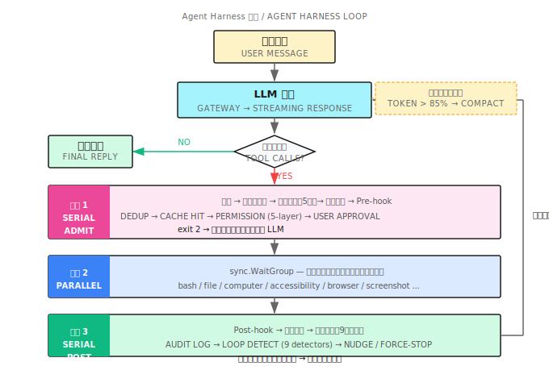

# 第 32 章：OpenClaw 時代

> **ローカル Agent Harness の核心は、ツールがどれだけ強力かではなく——ループがどれだけ信頼できるかだ。Agent がローカルマシンで 100 ステップ崩れずに動き続けられるなら、10 ステップで動いても 11 ステップ目に幻覚を起こすより、はるかに価値がある。**

---

> **⏱️ 5 分で要点掴む**
>
> 1. OpenClaw 時代 = ローカル自律 Agent + コンピュータ制御（Computer Control）+ プログラマブルフック（Hook）
> 2. Agent Harness（エージェントハーネス）= イベント駆動の for ループ：LLM 呼び出し → ツール実行 → コンテキスト追記 → ループ検出（Loop Detection）
> 3. コンピュータ制御（Computer Control）の 2 つの道：アクセシビリティツリー（Accessibility Tree）（意味的に正確）vs 座標クリック（汎用だが脆弱）
> 4. フック（Hook）= 4 つのイベントポイント（PreToolUse/PostToolUse/SessionStart/Stop）、exit 2 で実行を拒否
> 5. 権限エンジン（Permission Engine）5 層：ハードブロック → 設定拒否 → 複合コマンド分解 → 設定許可 → ユーザー承認
> 6. 9 つのループ検出（Loop Detection）器：繰り返し呼び出しから検索エスカレーションまで、Agent が同じ場所でぐるぐるするのを防ぐ
>
> **10 分パス**：32.1 → 32.3 → 32.4 → 32.5 → Shan Lab

---

## 32.1 幕開け：Claude Code が登場したあの日

2024 年末、Anthropic が Claude Code をリリースした。

俺はそのターミナル画面をしばらくじっと見つめた。AI が俺の macOS 上で自律的にファイルを読み、コードを書き換え、テストを走らせている——クラウドのサンドボックスじゃない、俺のローカルマシン上でだ。読んでいるのは本物のプロジェクト、書き換えているのは本物のコード、走らせているのは本物の CI だ。

同じ週、OpenClaw のデモを見た：AI がブラウザを乗っ取り、インターフェースをクリックし、フォームを入力し、スクリーンショットで確認する。

これはリモートで API を叩いているんじゃない。**AI がローカルで動き、ローカルのコンピュータを制御している**。

その瞬間、俺はこれが新しいパラダイムの始まりだと悟った——**OpenClaw 時代**の幕開けだ。

OpenClaw は特定のプロダクトを指しているわけじゃない。一類のアーキテクチャだ：AI Agent がユーザーのローカルマシン上で継続的なループを走らせ、ローカルツール（ファイルシステム、シェル、GUI 制御）を呼び出してタスクを完遂する。全工程が監査可能、中断可能、拡張可能。

この章では、それをどうやって実装するかを語る。

---

## 32.2 OpenClaw 時代とは何か？

### 3 つの代表

2025 年、この種のツールが一気に登場した：

| プロダクト | 開発元 | コア能力 |
|------------|--------|----------|
| Claude Code | Anthropic | ターミナル + コード Agent、ローカルファイル操作 |
| Devin | Cognition | クラウド VM + 完全な開発環境 |
| OpenClaw | オープンソースコミュニティ | ローカルブラウザ + スクリーン制御 Agent |
| shan | Kocoro | ローカル macOS Agent、Shannon エコシステム CLI |

共通点は一つ：**Agent は質問に答えるだけでなく、行動を起こす**。

### ローカルファーストの理由

クラウドサンドボックスと比べると、ローカル Agent には代替不可能な 3 つの利点がある：

**1. ローカル状態へのアクセス**：ログイン済みのアカウント、ローカルデータベース、プライベート証明書、社内 VPN の奥にある内部サービス——クラウド Agent には触れないが、ローカル Agent は直接使える。

**2. GUI ネイティブ制御**：macOS Accessibility API が公開するアプリの状態（ボタンのテキスト、入力フィールドの内容、メニュー階層）は、Web の DOM より正確で、スクリーンショットより信頼できる。座標クリックは最後の手段で、意味論的 API こそが正しいアプローチだ。

**3. ユーザーがリアルタイムで見える**：Agent がスクリーン上で操作する。ユーザーは全工程を観察でき、いつでも中断できる。透明性は信頼の前提条件だ。

### 代償

ローカル Agent には代償もある：**セキュリティ境界が複雑**になる。

クラウドサンドボックスのセキュリティはシンプルだ——コンテナ分離、破棄すれば綺麗になる。ローカル Agent には分離境界がない。`rm -rf ~` 一発で取り返しのつかない損害を与えられる。主体的にアクセス制御を構築する必要がある。

だからこそ良い OpenClaw の実装は、「何ができるか」だけでなく、「何をできないようにするか」も丁寧に設計されている。

---

## 32.3 Agent Harness：ループの骨格

OpenClaw 時代の中核技術は **Agent Harness（エージェントハーネス）**——Agent を継続的に動かし続ける実行フレームワークだ。

本質的にはこういう `for` ループだ：

```
for i := 0; i < maxIter; i++
    ├── LLM を呼び出して応答を得る
    ├── ツール呼び出しがない → 最終テキストを返す
    └── ツール呼び出しがある → ツールを実行 → 結果を追記 → 継続
```

だがこの骨格から本番で使えるものにするには、大量の細部がある。



### 3 フェーズ実行モデル

ツール呼び出しを含む各イテレーションは、3 つのフェーズで処理される：

**フェーズ 1：直列アドミッション**（各ツール呼び出しを順番にチェック）
- 重複排除：同一応答内で同じツール呼び出しが複数あれば一度だけ実行
- クロスイテレーションキャッシュ：前のラウンドで成功した呼び出し結果を直接再利用、再実行しない
- 権限チェック：5 層エンジン（32.5 参照）
- ユーザー承認：承認が必要なツールは一時停止して待機
- Pre-hook：フック（Hook）がここで実行を止められる（32.4 参照）

**フェーズ 2：並列実行**（アドミッションを通過したツールを並行実行）

一つの LLM 応答は複数のツール呼び出しを含む場合がある。アドミッション通過後は `sync.WaitGroup` で並行実行され、互いをブロックしない。

**フェーズ 3：直列後処理**（結果を順番に処理）
- Post-hook を実行
- 監査ログに書き込み
- ループ検出（Loop Detection）（9 つの検出器、32.6 参照）
- ツール結果を会話コンテキストに追記

このモデルの核心設計：**アドミッションを直列にしてセキュリティを保証し、実行を並列にして効率を確保し、後処理を直列にして一貫性を守る**。

### コンテキスト圧縮

長いタスクではコンテキストが膨れ続け、最終的に LLM の制限を超えてしまう。

shan は各 LLM 呼び出し前にトークン推計をチェックする：

```
現在のトークン数 > contextWindow * 0.85 の場合:
    LLM を呼び出して会話の要約を生成
    要約で中間履歴を置き換える
    保持する: 要約 + 直近数ラウンド + 元のタスク説明
```

85% は精確な値ではなく経験値だ——ツール結果と次のラウンドの応答に 15% を残し、切り捨てを避ける。

**重要な細部**：要約自体も LLM 呼び出しであり、失敗するリスクがある。shan は連続失敗回数を追跡し、3 回を超えたら 5 イテレーション分圧縮を一時停止して、コンテキストの自然な消費を待つ。

### 進捗チェックポイント

長いタスクは漂流しやすい——Agent がやっているうちに当初の目標を忘れてしまう。

shan はイテレーション上限の 60% に達したとき、コンテキストに自己点検プロンプトを注入する：

```
現在の進捗チェック：あなたが実行しているタスクは何ですか？
これまでに完了したステップは何ですか？
次のステップは何をすべきですか？
あなたはまだ元の目標に向かって進んでいますか？
```

これは Human-in-the-Loop ではない。**Agent 自身に強制的な内省をさせる**仕組みだ。

### 幻覚防止メカニズム

モデルは「ツールを呼んでいるふりをする」ことがある——実際にツールをトリガーするのではなく、テキスト応答の中にツール呼び出しの形式を書いてしまう。

shan はこのパターンを検出し、モデルに強制修正メッセージを送る：

```
あなたは今、ツール呼び出しをテキストの中に書きましたが、実際に呼び出しませんでした。
本物のツール呼び出しを使って再生成してください。
```

これにより、モデルが「やったふりをする」ことで実際の実行を回避するのを防ぐ。

---

## 32.4 ローカルツール層：コンピュータを制御する 2 つの道

shan はローカルのコンピュータ制御（Computer Control）の方式を 2 種類サポートしており、それぞれ適したシナリオがある。

### ルート 1：アクセシビリティツリー（Accessibility Tree）（推奨）

macOS の Accessibility API（AXUIElement）は各アプリの完全な UI 意味ツリーを公開している：ボタンのテキスト、入力フィールドの内容、チェックボックスの状態、メニュー構造……すべての UI 要素が意味的な識別子を持ち、スクリーン座標に依存しない。

UI ツリーを読み取る大まかな流れ：

```
1. ターゲットアプリの PID を特定（System Events の AppleScript 経由）
2. アプリのルート AXUIElement を取得
3. UI ツリーを再帰的に走査して要素の属性を抽出
4. 参照 ID（例: "e14"）付きの JSON ツリーを返す
5. 後続の操作（click/press/set_value）は参照 ID で要素を指定
```

利点：**意味的に信頼できる。解像度やスケーリングに左右されない**。「送信」ボタンはどの解像度でも、参照 ID が同じボタンを指し続ける。

欠点：**アクセシビリティ権限が必要**で、すべてのアプリが AX ツリーを完全に公開しているわけではない（Electron アプリのサポートはまちまち）。

コード参照：[`accessibility.go`](https://github.com/Kocoro-lab/shan)

### ルート 2：座標制御（フォールバック）

macOS Quartz Event Services API を使ってマウスとキーボードのイベントを送り、スクリーン座標を直接操作する。

```
click(x=450, y=320)
type(text="Hello")
hotkey(keys=["command", "s"])
```

各操作後に自動スクリーンショット（500ms 遅延）を取り、LLM が操作の成否を確認できるようにする。

**Retina スクリーンの処理**：macOS の論理解像度と物理解像度は異なる。shan はスケール係数を自動検出して座標を変換し、クリックのズレを防ぐ。

**テキスト入力**：短いテキスト（20 文字以下）は `osascript keystroke` で入力し、長いテキストはクリップボード経由で注入する（元の内容を保存 → 新しい内容を書き込み → cmd+v で貼り付け → 元の内容を復元）。これでキーボードシミュレーションによる文字抜けを防ぐ。

### スクリーンショットフィードバックループ

GUI 操作は本質的に「結果を見てから次の行動を決める」ことが必要だ。shan のスクリーンショットツール：
- フルスクリーン、指定ウィンドウ（PID 指定）、指定領域の 3 モードに対応
- 最大 1200px 幅に圧縮し、base64 PNG として LLM に送る
- 古いスクリーンショットを自動削除：直近 5 枚だけ保持し、コンテキストの爆発を防ぐ

shan の内部では、GUI 集中型タスク（スクリーンショット、computer、accessibility、ブラウザ）には自動的に高いイテレーション上限が与えられる——GUI 操作自体がより多くのステップを必要とするからだ。

### ブラウザ制御

shan のブラウザツールには 2 つのバックエンドがある：

| バックエンド | 仕組み | 適用シナリオ |
|-------------|--------|-------------|
| Pinchtab | 外部ブラウザサービス HTTP API | 優先使用、より安定 |
| chromedp | 組み込みヘッドレス Chrome | Pinchtab が使えない時のフォールバック |

重要な設計：**独立したブラウザプロファイル**——ユーザー自身のブラウザセッションから完全に分離している。Agent がブラウジングした内容が、ユーザーの cookie や履歴に影響しない。

ブラウザツールの `snapshot` 操作も AX ツリー（参照 ID 付き）を返し、後続の `click`/`type` は座標ではなく参照で操作する。安定性が大幅に上がる。

---

## 32.5 フック（Hooks）：プログラマブルなイベントフック

フック（Hook）は OpenClaw 時代のアーキテクチャを象徴する機能だ——ユーザーが Agent の実行の重要な瞬間にカスタムロジックを注入できる。

第 6 章では Shannon サーバーサイドのフック設計を扱った。ここで語るのは **shan ローカル CLI のフックシステム**——より軽量でユーザーに近い。

### 4 つのイベントポイント

| イベント | トリガータイミング | 実行を止められるか？ |
|---------|-----------------|------------------|
| `PreToolUse` | 権限チェック通過後、ツール実行前 | **可能**（exit 2） |
| `PostToolUse` | ツール実行完了後 | 不可 |
| `SessionStart` | セッション開始時 | 不可 |
| `Stop` | セッション終了時 | 不可 |

### 設定

`.shannon/config.yaml` でフックを設定する：

```yaml
hooks:
  PreToolUse:
    - matcher: "bash"
      command: ".shannon/hooks/check-bash.sh"
  PostToolUse:
    - matcher: "file_edit|file_write"
      command: ".shannon/hooks/post-edit.sh"
  SessionStart:
    - command: ".shannon/hooks/on-start.sh"
  Stop:
    - command: ".shannon/hooks/on-stop.sh"
```

`matcher` は正規表現でツール名にマッチする。空の matcher はすべてのツールにマッチする。

### フックプロトコル

フックスクリプトは stdin で JSON を受け取る：

```json
{
  "event":         "PreToolUse",
  "tool_name":     "bash",
  "tool_input":    {"command": "rm -rf ./tmp"},
  "tool_response": null,
  "session_id":    "sess_abc123"
}
```

終了コードの規約：
- `0` = 許可
- `2` = **拒否**（PreToolUse のみ有効。stderr の内容が拒否理由として LLM に返される）
- その他の非ゼロ = 警告だが、実行は止めない

### 実際の例：本番設定ファイルの削除を防ぐ

```bash
#!/bin/bash
# .shannon/hooks/check-bash.sh

INPUT=$(cat)
COMMAND=$(echo "$INPUT" | python3 -c "import sys,json; d=json.load(sys.stdin); print(d['tool_input']['command'])")

if echo "$COMMAND" | grep -q "prod.*\.env\|\.env\.production"; then
    echo "拒否：本番環境の設定ファイルへの操作は許可されていません" >&2
    exit 2
fi

exit 0
```

LLM が `cat .env.production` を実行しようとすると、このフックが介入し、拒否理由を LLM に返す。LLM は拒否の理由を知っているので、戦略を調整できる。

### セキュリティ制約

フックコマンドには厳格なパス制限がある：
- `./` で始まる相対パス、または `~/.shannon/` 以下の絶対パスを使うこと
- PATH 解決される裸のコマンド名（例：`python`）は拒否——PATH ハイジャック攻撃を防ぐため

フックのタイムアウトは 10 秒、出力は 10KB が上限。タイムアウト時はプロセスグループ全体が強制終了される。

---

## 32.6 権限エンジン（Permission Engine）：5 層の防護

ローカル Agent のセキュリティ境界は権限エンジン（Permission Engine）が維持する。shan の設計は **5 層の直列決定**だ：

```
ツール呼び出しリクエスト
         │
         ▼
層 1：ハードブロック定数
         │ rm -rf /、rm -rf ~、dd if=* of=/dev/*、curl * | sh...
         │ → 永久拒否、上書き不可
         ▼
層 2：設定拒否リスト
         │ permissions.denied_commands: ["git push --force", "*.prod.*"]
         │ → 拒否
         ▼
層 3：複合コマンド分解
         │ cmd1 && cmd2 || cmd3 | cmd4
         │ 各サブコマンドを独立してチェック。一つでも拒否 → 全体拒否
         │ すべて明示的に許可 → 全体許可
         ▼
層 4：設定許可リスト
         │ permissions.allowed_commands: ["go test ./...", "npm run *"]
         │ → 自動許可
         ▼
層 5：ユーザー承認
               → 一時停止してユーザーの y/n を待つ
```

### 安全コマンドのホワイトリスト

一部のコマンドは承認不要とマーク済み：`ls`、`pwd`、`git status`、`git diff`、`git log`、`go build`、`go test`、`make`、`cargo test`……

ただし**絶対に回避できないルールが一つ**ある：シェル演算子（`&&`、`|`、`>`、バックティック、`$(...)`）を含むコマンドは決してホワイトリストに入らない。ユーザー承認か設定許可リストが必須だ。

```
ls -la ./          → 自動許可（安全なコマンド）
ls -la | grep .go  → 承認が必要（パイプを含む）
go test ./...      → 自動許可
go test ./... && rm -rf ./tmp → 承認が必要（複合コマンド）
```

### ツールタイプ別の追加チェック

ツールタイプごとに専用チェックがある：
- **bash**：コマンド内容チェック（上の 5 層）
- **file_read/write/edit**：パスチェック（シンボリックリンク解決、機密ファイルパターンマッチング：`~/.ssh/*`、`*.pem`、`*credentials*`……）
- **http**：ネットワーク出口チェック（localhost は常に許可。外部ドメインは許可リストにあるかユーザー承認が必要）

---

## 32.7 ループ検出（Loop Detection）：9 つの検出器

Agent がループにはまるのは、OpenClaw アーキテクチャで最も扱いにくい問題の一つだ。

モデルは特定の状態で同じことを繰り返し試みる——これはバグではなく、「もう一度試せばうまくいくかも」というモデルの過度な楽観主義だ。ループが手に負えなくなる前に、検出して介入する必要がある。

shan は長さ 20 のツール呼び出しのスライドウィンドウを管理し、9 つの検出器で並行分析する。各検出器は 3 つの結果を返す：`Continue`（正常）、`Nudge`（LLM に警告を送る）、`ForceStop`（ループを強制終了）。

| 検出器 | トリガー条件 | 結果 |
|--------|------------|------|
| ConsecutiveDuplicate | 同じツール+引数が連続 2 回 | Nudge → ForceStop |
| ExactDuplicate | 同じツール+引数がウィンドウ内に 3 回 | Nudge → ForceStop |
| SameToolError | 同じツールが連続 4 回エラー | Nudge → ForceStop |
| FamilyNoProgress | 同種ツールが同じテーマで 3/5/7 回 | Nudge → ForceStop |
| SearchEscalation | 検索系ツールが連続 3 回呼ばれる | Nudge（5 回で ForceStop） |
| NoProgress | 何らかのツールが 8 回以上繰り返される | Nudge → ForceStop |
| ToolModeSwitch | GUI 操作成功直後にビジュアルツールへ切り替え | Nudge |
| SuccessAfterError | ビジュアルツールのエラー後の修復操作 | Nudge |
| Sleep | bash 内で sleep を呼び出す（2/4 回） | Nudge → ForceStop |

### Nudge vs ForceStop

**Nudge（軽いプッシュ）**：会話コンテキストにプロンプトを注入し、LLM が繰り返しにはまっていることを知らせる。LLM には戦略を調整する機会が与えられる。

**ForceStop（強制停止）**：プロンプトを注入した後、ツールなしで最後の LLM 呼び出しを一回行い、モデルに現在の状態をまとめさせてからループを終了する。

Nudge が連続 3 回以上トリガーされると、自動的に ForceStop にエスカレートする。

### なぜこんなに多くの検出器が必要なのか？

ループにはさまざまなパターンがあるからだ。

一番シンプルなのは ConsecutiveDuplicate：Agent が `file_read("config.json")` を繰り返し呼び続ける。

もっと隠れたのは SearchEscalation：Agent が Google で「Python バージョン」を検索し、見つからず、「Python3 バージョン」を検索し、見つからず、「Python latest version」を検索する——発想を変えるべきところを、検索ファミリーの中でぐるぐるし続ける。

FamilyNoProgress が捉えるのは「同種ツールが同じテーマの周りをぐるぐるする」パターン——各回の引数が少し違っていてもだ。

Sleep 検出器は奇妙に見えるが、実際の価値がある：モデルは `sleep 5 && retry` と書くことがあり、これはたいてい永遠に変わらない外部状態を待っていることを意味する。待機ループに陥る前兆だ。

---

## 32.8 全部つなげる：完全なローカル Agent の実行

すべてのコンポーネントを合わせて、完全なローカル Agent の実行を見てみよう：

```
ユーザー：プロジェクトのすべての TODO コメントを issues.md にまとめて

── イテレーション 1 ──────────────────────────────────────
  LLM 呼び出し
  └→ tool: bash, args: {command: "grep -rn 'TODO' ./src"}

  フェーズ 1（アドミッション）:
    重複排除チェック: 初回呼び出し、通過
    権限チェック: 層 4（grep は安全コマンドリスト内）→ 自動許可
    Pre-hook: マッチするフックなし、通過

  フェーズ 2（実行）:
    bash.Run() → 47 行の TODO リストを返す

  フェーズ 3（後処理）:
    Post-hook: マッチなし
    監査ログ: bash 呼び出し記録を書き込み
    ループ検出: 正常、Continue
    結果をコンテキストに追記

── イテレーション 2 ──────────────────────────────────────
  LLM 呼び出し
  └→ tool: file_write, args: {path: "issues.md", content: "..."}

  フェーズ 1（アドミッション）:
    権限チェック: 層 5（file_write は自動許可リスト外）→ ユーザー承認
    ユーザー: y
    Pre-hook: "file_edit|file_write" にマッチ → post-edit.sh を実行
    フック終了コード: 0 → 許可

  フェーズ 2（実行）:
    file_write.Run() → ファイル書き込み成功

  フェーズ 3（後処理）:
    Post-hook: post-edit.sh を実行（変更ファイルを記録）
    監査ログ: file_write 記録を書き込み
    ReadTracker: issues.md が書き込まれたことを記録（後続の読み取りでキャッシュを無効化）

── イテレーション 3 ──────────────────────────────────────
  LLM の応答にツール呼び出しなし
  └→ "47 個の TODO をモジュールごとにグループ化して issues.md にまとめました。"

  チェック: 切り捨てなし、幻覚なし、チェックポイント後続でなし
  最終テキストを返す
```

全体の流れ：3 イテレーション、1 回のユーザー承認、全工程の監査ログ。

---

## 32.9 ローカルファースト、クラウドと協調

shan には単独で語る価値のある設計上の選択がある：**ローカルツール実行 + リモート LLM 推論**。

LLM の呼び出しは Shannon Gateway（クラウド）を経由する。ツールの実行はローカルに留まる。

これは Claude Code のモデルと一致している（モデル呼び出しは Anthropic API 経由、ツールはローカルで実行）。

この分離には 3 つのメリットがある：

1. **コンピュータリソースの分離**：LLM 推論は専用ハードウェアで最も効率的に動き、ローカル実行はユーザーのハードウェアで完全な権限を持って動く
2. **データの境界**：ファイルの内容やコマンドの出力といった機密データは、LLM に送信すると決めた部分だけに制御が及ぶ
3. **オフライン降格**：理論上はローカル LLM（Ollama など）に切り替えられる。ツール層は変更不要

ただし、これは **shan が薄いクライアントである**ことも意味する。コアのオーケストレーションロジック（Agent Harness）はクライアント側にあるが、LLM の推論能力はネットワークに依存する。

ネットワークが不安定なシナリオに対して、shan は指数バックオフリトライを実装しており、リトライが失敗した場合はクラッシュするのではなく現時点での最善の結果で優雅に終了する。

---

## 32.10 OpenClaw 時代の 3 つの設計原則

この章の内容を振り返って、ローカル Agent Harness（エージェントハーネス）を構築するための 3 つのコア原則を抽象化できる：

**原則 1：セキュリティはアーキテクチャの制約であり、機能ではない**

権限エンジン（Permission Engine）はツール呼び出しチェーンの必経路だ。後付けのセキュリティ機能ではない。コンパイラの型チェックと同じで——回避できないし、回避すべきでもない。ハードブロックのコマンドリストは設定不可能だ。これは意図的な設計だ。

**原則 2：ループ検出（Loop Detection）は Agent 信頼性のコアだ**

Agent Harness の品質を評価する最良の指標は「どれだけ複雑なタスクができるか」ではなく、「タスクが失敗したとき優雅に終了できるか」だ。9 つの検出器が守っているのはこの底線——Agent がいつ試みをやめるべきかを知れるようにする。

**原則 3：フック（Hook）は人間のコントロールパネルであり、AI のためではない**

フックの存在は Agent をより強くするためではない。**ユーザー**が自分のビジネスロジックを Agent のフローに注入できるようにするためだ。Agent のコード自体を変えることなく。これは「ユーザー主権」の体現——あなたの Agent は、あなたが決める。

---

## Shan Lab（10 分で始める）

この章は Shannon エコシステムの CLI ツール `shan` に対応している。コードとドキュメントは [https://github.com/Kocoro-lab/shan](https://github.com/Kocoro-lab/shan) にある。

### 必読（2 ファイル）

- [`internal/agent/loop.go`](https://github.com/Kocoro-lab/shan) — Agent Harness（エージェントハーネス）のコア実装。注目点：3 フェーズ実行モデル、コンテキスト圧縮のトリガー条件（85% 閾値）、進捗チェックポイントのロジック、幻覚防止の検出

- [`internal/hooks/hooks.go`](https://github.com/Kocoro-lab/shan) — 4 つのイベントポイントの実装。注目点：フックプロトコル（stdin JSON + 終了コード）、exit 2 の拒否メカニズム、再帰防護（inHook 排他ロック）

### 選読（深掘り用、2 ファイル）

- [`internal/agent/loopdetect.go`](https://github.com/Kocoro-lab/shan) — 9 つのループ検出器（ループ検出）の完全実装。Nudge と ForceStop のトリガー条件とエスカレーションロジックを理解する

- [`internal/permissions/permissions.go`](https://github.com/Kocoro-lab/shan) — 5 層権限エンジン（Permission Engine）。注目点：ハードブロックリスト（設定不可能という設計上の決断）と複合コマンド分解ロジック

---

## 延伸読書

- [Claude Code 設計ドキュメント](https://www.anthropic.com/engineering/claude-code-deep-dive) — Anthropic による Claude Code アーキテクチャの深い解説
- [OpenClaw プロジェクト](https://github.com/opencolaw/opencolaw) — コミュニティによるオープンソースの OpenClaw 実装
- [macOS Accessibility API ガイド](https://developer.apple.com/documentation/appkit/nsaccessibility) — AXUIElement API の公式ドキュメント
- [Anthropic Computer Use ドキュメント](https://docs.anthropic.com/en/docs/build-with-claude/computer-use) — Claude のネイティブなコンピュータ制御（Computer Control）能力

---

## 演習

### 演習 1：最初のフックを設計する

顧客データを処理する Agent を作っている。以下の要件を満たすフック設定を設計せよ：
- Agent が "private" や "secret" を含むファイルを読もうとするのを防ぐ
- bash コマンドの実行ごとにローカルのログファイルに記録する
- セッション終了時にデスクトップ通知を送る

設定 YAML と対応するフックスクリプトのロジックを書け。

### 演習 2：ループ検出器の拡張

9 つの検出器には「ネットワークタイムアウトリトライ」を専門に扱うものがない——http ツールがタイムアウトした後、Agent が同じ URL を繰り返しリトライし続ける場合だ。

10 番目の検出器 `NetworkRetryStorm` を設計せよ：
- トリガー条件は何か？
- Nudge メッセージはどう書くか？
- どういう状況で ForceStop にエスカレートするか？

### 演習 3（発展）：アクセシビリティツリーの走査

macOS の AXUIElement ツリーは非常に深くなる場合があり、再帰的に走査すると LLM のコンテキスト制限を超えやすい。

`accessibility.go` の切り捨てロジックを読んで、以下に答えよ：
1. どの要素を切り捨てるかをどうやって決定しているか？
2. 切り捨て後の出力でも参照 ID 操作はサポートされるか？
3. 深い階層の要素を見つける必要があるとき、どうすればいいか？

---

## まとめ

OpenClaw 時代の核心は：**信頼できる実行インフラを、自律的に動く Agent に渡す**こと。

要点：

1. **Agent Harness（エージェントハーネス）= 3 フェーズループ**：直列アドミッション → 並列実行 → 直列後処理
2. **コンピュータ制御（Computer Control）は AX ツリー優先**：意味的に信頼できる、解像度の変化に左右されない
3. **フック（Hook）はユーザーのコントロールパネル**：exit 2 は最強の一行コード
4. **5 層権限エンジン（Permission Engine）**：セキュリティはアーキテクチャの制約、ハードブロックは回避不能
5. **9 つのループ検出器（ループ検出）**：信頼性のコア、優雅な失敗は無限リトライより価値がある
6. **85% 閾値でコンテキスト圧縮**：長いタスクの命綱

**OpenClaw 時代は止まらない**。ローカル AI モデルが強くなるにつれて、ローカル Agent Harness（エージェントハーネス）はますます重要になる——クラウド LLM を叩く薄いクライアントではなく、あなたのマシン上で本当に自律的に動く AI の同僚として。

次章で会おう。

---

## 次章予告

これがこの本の最後の章の本文だ。

ここまで読み切ったなら——Agent の基礎から OpenClaw 時代まで、全道のりを完走したことになる。おめでとう。

付録 A は本書のコア用語集、付録 B はパターン選択デシジョンツリー、付録 C は 27 の頻出 Q&A だ。

おすすめ：本を閉じて、何か一つ実装してみよう。

どの章に出てきたパターンでも、動くものを一つ作ることの方が、この本をもう一度読むよりずっと価値がある。

またいつか。

---

## Part 9 まとめ

Part 9 では AI エージェントの最先端実践を探った：

| 章 | テーマ | コア能力 |
|----|--------|----------|
| Ch27 | Deep Research | 深い調査 + 多段階推論 |
| Ch28 | Computer Use | 視覚理解 + UI 操作 |
| Ch29 | Agentic Coding | コード生成 + サンドボックス実行 |
| Ch30 | Background Agents | Temporal スケジューリング + 永続化 |
| Ch31 | 階層型モデル戦略 | スマートルーティング + コスト最適化 |
| Ch32 | OpenClaw 時代 | ローカル Agent Harness + セキュリティ + ループ制御 |

これらの能力と企業級インフラ（Part 7-8）を組み合わせることで、完全な本番グレードの AI エージェントプラットフォームが形成される。

単体エージェントから企業規模のマルチエージェントシステムまで、コアの問いは変わらない：**能力、コスト、信頼性をどうバランスさせるか**。OpenClaw 時代のアーキテクチャは、そのバランスの最前線だ——ループの信頼性こそが、何よりも大切なこととして。
