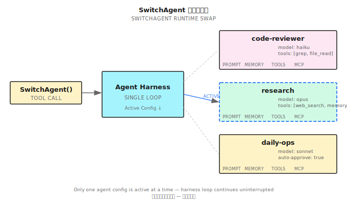
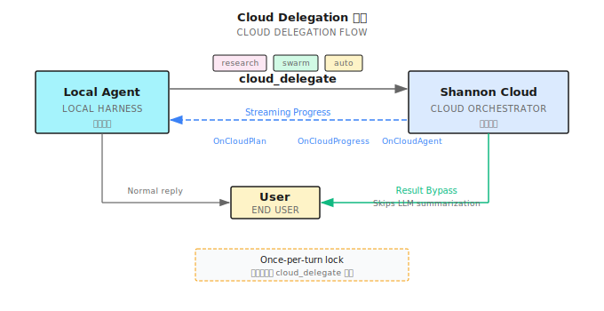

# 第 33 章：Building on the Harness — ShanClaw

> **一つの Agent、一つの Session しか走らせられない Harness はプロトタイプだ。複数の Agent を走らせ、Session をまたいで記憶し、複数のチャネルにサービスを提供できるもの——それがプラットフォームだ。**

---

> **⏱️ 5 分で要点掴む**
>
> 1. ShanClaw = 第 32 章の Harness + プラットフォーム層（Named Agents、Skills、Memory、Daemon、MCP）
> 2. 同心円モデル：誰が動いているか（Agents）→ 何を知っているか（Skills/Memory/Sessions）→ いつどこで動くか（Daemon/Scheduler/Watcher）→ どう接続するか（MCP/Cloud）
> 3. Named Agents = 各 Agent が独立した設定（モデル、ツール、MCP サーバー、Skills、Memory）
> 4. Memory = 有界追記（Bounded Append）+ 自動溢出（Overflow）+ LLM 駆動の GC
> 5. Daemon モード = Agent as a Service、多ソースルーティング（Slack/LINE/webhook）
> 6. MCP = エコシステム相互運用（コンシューマー + プロデューサー）；Cloud Delegation = ローカル↔リモート協調
>
> **10 分パス**：33.1 → 33.2 → 33.4 → 33.6 → Shan Lab

---

## 33.1 Harness からプラットフォームへ

第 32 章では Agent Harness（エージェントハーネス）の骨格を示した：`for` ループが LLM 呼び出し → ツール実行 → コンテキスト追記 → ループ検出を駆動する。このループが動けば、ローカルで自律的にタスクを実行する Agent が手に入る。

だがこの Agent には 3 つのハードリミットがある：

1. **単一人格**：一つのシステムプロンプト、一つのツール設定。コードレビューと文献調査を両方やりたければ、手動で切り替えるしかない。
2. **単一 Session、記憶なし**：毎回起動するたびに白紙。先週の発見も昨日の約束もすべて消える。
3. **単一ユーザー CLI**：ターミナルの前にいる人しかトリガーできない。Slack にメッセージが来ても、Agent は知らない。

問題は：**このループの上に何を構築すれば、本当のプロダクトになるのか？**

答えは 4 層の同心円だ：


- **Ring 1**：Named Agents — 誰が動いているか
- **Ring 2**：Skills / Memory / Sessions — 何を知っているか
- **Ring 3**：Daemon / Scheduler / Watcher — いつどこで動くか
- **Ring 4**：MCP / Cloud — どう外部と接続するか

各層は内側の層を拡張するが、置き換えはしない。Ring 1 の Named Agents は依然として第 32 章の Harness ループを走らせている。Ring 3 の Daemon は依然として Ring 1 の Named Agents を使って各メッセージを処理する。同心円は積み重ねであり、再構築ではない。

本章では ShanClaw（オープンソース）を参照実装として、層ごとに展開していく。すべてのコードは：https://github.com/Kocoro-lab/ShanClaw

---

## 33.2 Named Agents：一つの Harness、複数の人格（Ring 1）

第 32 章の Harness が走らせていたのは匿名の Agent だ——起動時にデフォルト設定を読み込み、終了時に何も残さない。Named Agents（ネームドエージェント）の核心思想は：**一つのバイナリ、複数の人格**。

### ディレクトリ構造

各 Named Agent は独立したファイルディレクトリを持つ：

```
~/.shannon/agents/
├── code-reviewer/
│   ├── AGENT.md            # システムプロンプト（CLAUDE.md 相当）
│   ├── config.yaml         # モデル、ツール、MCP、イテレーション上限
│   ├── MEMORY.md           # 永続記憶
│   ├── commands/           # Agent 専用 Skills
│   │   └── review.md
│   └── _attached.yaml      # 添付ファイルリスト
├── research/
│   ├── AGENT.md
│   ├── config.yaml
│   ├── MEMORY.md
│   └── commands/
│       └── deep-dive.md
└── ops-bot/
    ├── AGENT.md
    ├── config.yaml
    └── MEMORY.md
```

### 設定の差異

Agent ごとの `config.yaml` は大きく異なる：

```yaml
# code-reviewer/config.yaml
model: claude-sonnet-4-20250514
max_iterations: 30
tools:
  allowed: ["bash", "file_read", "file_edit", "grep", "glob"]
  denied: ["file_write", "http"]     # レビュアーはファイル書き込みもHTTPも不要
mcp_servers: []
auto_approve: false

# research/config.yaml
model: claude-opus-4-20250514
max_iterations: 80
tools:
  allowed: ["bash", "http", "file_write", "file_read"]
  denied: ["file_edit"]              # リサーチャーはコードを変更しない
mcp_servers:
  - name: "playwright"
    command: "npx"
    args: ["@anthropic-ai/mcp-playwright"]
auto_approve: true                   # 信頼済みのバックグラウンド Agent
```

同じ Harness ループ、まったく異なる 2 つの頭脳。

主要設定フィールドの説明：
- `model`：Agent が使用する LLM モデル。リサーチ系タスクには高い推論能力のモデル、コードレビューには高速モデル。コストとレイテンシの差は 10 倍に達しうる
- `max_iterations`：Harness ループの最大イテレーション数。GUI 密集型やリサーチ系タスクはより多くのステップが必要
- `tools.allowed / denied`：ツールのホワイトリストとブラックリスト。**最小権限の原則**——Agent は必要なツールだけを手にする
- `auto_approve`：権限エンジン（Permission Engine）の層 5（ユーザー承認プロンプト）をスキップするが、ハードブロックと `denied_commands` は依然有効。完全に信頼できるバックグラウンド Agent にのみ有効化

### SwitchAgent：ランタイム切り替え

`SwitchAgent` はコアオペレーションだ——ランタイムで Harness をある Agent から別の Agent へ切り替える：

```
SwitchAgent("research")
├── research/AGENT.md を読み込み → システムプロンプトを置換
├── research/config.yaml を読み込み → モデル、イテレーション上限を置換
├── research/MEMORY.md を読み込み → 永続記憶を注入
├── ツール登録表を再構築 → allowed リストのツールだけを登録
├── MCP サーバーに接続 → playwright を起動
└── research/commands/ を読み込み → Agent 専用 Skills を登録
```

**同じループ、異なる頭脳。** ループ自体（3 フェーズ実行、権限エンジン、ループ検出）は一切変わらない。



### 隔離の原則

Named Agents 間は厳密に隔離される：

- **Session 隔離**：各 Agent が自分の会話履歴を管理
- **Memory 隔離**：それぞれの MEMORY.md、互いに見えない
- **MCP 隔離**：Agent A の MCP サーバーは Agent B のツールリストに現れない
- **承認隔離**：`auto_approve: true` の Agent が他の Agent の承認ポリシーに影響しない

一つの Harness バイナリが、Named Agents を通じて Agent チームのランタイムになる。

### 設定マージ戦略

Agent の設定は孤立しているわけではない——グローバル設定（`~/.shannon/config.yaml`）とのマージ関係がある：

```
グローバル config.yaml      Agent config.yaml         最終的に有効
├── model: haiku     ←── model: opus          →   opus（Agent が上書き）
├── max_iterations: 50 ← （未指定）            →   50（グローバルを継承）
├── tools.denied: [http] ← tools.denied: []   →   []（Agent が上書き）
└── mcp_servers: [fs]  ← mcp_servers: [pw]    →   [fs(_inherit), pw]
```

ルール：Agent レベルの設定がグローバル設定を上書きするが、`_inherit: true` のグローバル MCP サーバーは常に保持される。これにより管理者はすべての Agent に特定のインフラツールを強制共有できる。

---

## 33.3 Skills：ホットプラグ可能な能力モジュール（Ring 2a）

Skills は Named Agents の能力拡張メカニズムだ。コードにハードコードされた機能ではなく、いつでも追加・削除・差し替えできる Markdown ファイルだ。

### SKILL.md フォーマット

各 Skill は YAML frontmatter 付きの Markdown ファイルだ：

```markdown
---
name: "code-review"
description: "コード変更をレビューし、スタイル・セキュリティ・パフォーマンスの問題をチェック"
allowed_tools: ["bash", "file_read", "grep", "glob"]
metadata:
  category: "development"
  version: "1.0"
---

# Code Review Skill

ユーザーがコードレビューを依頼したら、以下の手順で実行する：

1. `git diff` を実行して変更を確認
2. ファイルごとにレビューし、以下に注目：
   - セキュリティ脆弱性（SQL インジェクション、XSS、ハードコードされたキー）
   - パフォーマンス問題（N+1 クエリ、不要なループ）
   - コードスタイル（命名、構造、コメント）
3. 構造化されたレポートを出力

## 参考スクリプト

`scripts/lint-check.sh` を実行して静的解析結果を取得する。
```

### 3 段階の優先度

Skills は 3 つの場所から読み込まれ、優先度は高い順に：

| レベル | 場所 | 説明 |
|--------|------|------|
| Agent 専用 | `~/.shannon/agents/<name>/commands/*.md` | その Agent のみ利用可能 |
| グローバル共有 | `~/.shannon/skills/*.md` | すべての Agent で共有 |
| 組み込み | バイナリ内蔵 | ShanClaw デフォルトの Skills |

同名の Skill は、高優先度が低優先度を上書きする。

### 公開方法

Skills は 2 つの方法で LLM に見える：

1. **システムプロンプト内の目次**：利用可能な全 Skills の名前と説明が、システムプロンプト末尾に注入される
2. **`use_skill` ツール**：LLM がこのツールを呼び出すと、対応する Skill の完全な内容が会話コンテキストに注入される

この設計の意味：**Skills は事前にすべて読み込まれるわけではない**。LLM が自ら特定の Skill の使用を選択したときだけ、その完全な内容が注入される。これでシステムプロンプトの Token 予算を節約できる。

### Skill とシステムプロンプトの関係

Skills と AGENT.md の違い：AGENT.md は Agent のアイデンティティと汎用的な行動指針を定義する（「あなたはコードレビューの専門家だ」）。Skills は具体的な操作手順を定義する（「コードレビュー時はこの 3 ステップで実行せよ」）。

AGENT.md は Agent 起動時にシステムプロンプトへ注入される。Skills は `use_skill` で呼び出されたときだけ注入される——これが**遅延読み込み（Lazy Loading）**だ。一つの Agent が 20 個の Skills を持っていても、一回の会話で使うのは 2〜3 個。大量の Token を節約できる。

### パス書き換え

Skill ファイル内で参照される相対パス（`scripts/lint-check.sh`、`references/style-guide.md`）は自動的に絶対パスに書き換えられる——Skill ファイルの所在ディレクトリを基準に。これで Skill を自己完結型のディレクトリとしてパッケージし、どこにコピーしても正常に動作する。

---

## 33.4 Memory：Session をまたぐ永続化（Ring 2b）

Memory が解決するのは Agent の「金魚の記憶」問題だ——会話が終わるたびに、すべての発見・決定・好みが消える。

### `memory_append` ツール

Agent が会話中に重要な情報を発見したら（プロジェクトの慣例、ユーザーの好み、重要な決定）、`memory_append` を呼び出して MEMORY.md に書き込める：

```
memory_append(content="ユーザーの好み：Go プロジェクトでは logrus ではなく slog を使う")
```

書き込み操作は `flock` ファイルロックで保護されている——複数の Session が同じ Agent の MEMORY.md に並行して書き込む可能性があるからだ。

### 有界追記（Bounded Append）

MEMORY.md は無限に増え続けるわけではない。ShanClaw は 150 行の上限を設定している：

```
書き込みリクエスト到着
     │
     ▼
現在の行数 + 新しい内容の行数 ≤ 150？
     ├── はい → MEMORY.md の末尾に直接追記
     └── いいえ → 溢出フロー
              ├── 溢出した新しい内容を auto-YYYY-MM-DD-<hex>.md 詳細ファイルに書き込み
              ├── 既存の MEMORY.md 末尾にポインタ行を追記：
              │   "- [2025-03-28] See [auto-2025-03-28-a1b2.md](auto-2025-03-28-a1b2.md) for details"
              └── MEMORY.md 本体はリネームも消去もしない——ポインタ行が蓄積していく
```

溢出ファイルにはタイムスタンプと 6 文字のランダム接尾辞が付き、衝突を回避する。MEMORY.md 末尾のポインタ行は Agent に伝える：**まだ記憶がある、詳細ファイルの中に**。


### Write-Before-Compact（先に保存、後で圧縮）

第 32 章で触れた通り、長いタスクはコンテキスト圧縮をトリガーする——要約で中間履歴を置き換える。だが圧縮はディテールを失う。

ShanClaw は各圧縮の前に、まず小さいモデル（通常は Haiku）で圧縮対象のコンテキストをスキャンし、永続的な事実を抽出する：

```
PersistLearnings フロー：
1. 圧縮対象の会話断片を小さいモデルに送信
2. プロンプト：ユーザーの好み、プロジェクトの慣例、重要な発見、TODO を抽出
3. 小さいモデルが構造化された事実リストを返す
4. memory_append で MEMORY.md に書き込み
5. その後、通常のコンテキスト圧縮を実行
```

これで「忘れる前に先に保存する」ことが保証される——圧縮で失われるディテールのうち、少なくとも重要な部分は永続化済みだ。

なぜ小さいモデルを使うのか？PersistLearnings は圧縮のたびにトリガーされるため、頻度が高い可能性がある。メインモデル（Opus など）でやるとコストもレイテンシも合わない。小さいモデル（Haiku など）は「会話から事実を抽出する」という単純なタスクには十分な性能で、レイテンシもコストも低い。

### ConsolidateMemory（記憶の整理統合）

溢出ファイルは蓄積し続ける。ShanClaw は LLM 駆動の GC（ガベージコレクション）でそれらを整理する：

```
トリガー条件：auto-*.md ファイルが 12 個以上 かつ 前回の整合から 7 日以上経過（.memory_gc マーカーファイルで追跡）

ConsolidateMemory フロー：
1. すべての auto-*.md ファイルを読み込み
2. 現在の MEMORY.md を読み込み
3. LLM を呼び出し：マージ、重複排除、陳腐化した情報を削除
4. ユーザーが手動で書いた記憶エントリ（[user] タグ付き）は削除しない
5. マージ結果を MEMORY.md に書き戻し
6. マージ済みの auto-*.md ファイルを削除
```

これは単純なファイル結合ではない——LLM がセマンティクスを理解し、重複を除去し（「ユーザーは slog を好む」が 5 回出現 → 1 回にマージ）、失効した一時的情報を削除する（「明日会議がある」——日付が過ぎていれば削除）。

### Memory の完全なライフサイクル

上の 3 つのメカニズムを繋げると：

```
会話進行中
├── Agent が重要な情報を発見 → memory_append で MEMORY.md に書き込み
├── コンテキストが一杯に近づく → PersistLearnings で事実を抽出 → memory_append
│                               → その後コンテキストを圧縮
├── MEMORY.md が 150 行超過 → BoundedAppend で auto-*.md に溢出
└── auto-*.md が 12 個以上蓄積かつ前回整合から 7 日以上経過 → ConsolidateMemory でマージ整理

次回の会話起動時
└── MEMORY.md をシステムプロンプトに読み込み → Agent は前回の重要情報を覚えている
```

このサイクルが保証するのは：**短期的な発見がタイムリーに保存され、長期的な記憶が定期的に整理され、毎回の起動がコンテキストを持って始まる**ということだ。

---

## 33.5 Session Search：クエリ可能な履歴（Ring 2c）

Memory が保存するのは精製後のナレッジだ。だが Agent が原始的な会話を検索したいときもある——「先週木曜に頼んだあのパフォーマンス分析、結論は何だった？」

### 永続化フォーマット

各 Session 終了時に、完全な会話が JSON 形式で永続化される：

```json
{
  "session_id": "sess_20250328_a1b2c3",
  "agent": "code-reviewer",
  "started_at": "2025-03-28T10:30:00Z",
  "messages": [...],
  "tool_calls": [...],
  "summary": "auth モジュールの PR #42 をレビュー、3 つのセキュリティ問題を発見"
}
```

### FTS5 インデックス

永続化と同時に、キーフィールドが SQLite FTS5 全文検索エンジンにインデックスされる：

- 会話の要約
- ユーザーメッセージの内容
- Agent の最終回答
- ツール呼び出しのコマンドと出力（合理的な長さに切り詰め）

### `session_search` ツール

Agent は自分の過去の会話を検索できる：

```
session_search(query="パフォーマンス分析 auth モジュール")
```

マッチした会話の要約リストが関連度順に返される。Agent は特定の会話の完全な内容をさらに読み込める。

### なぜ FTS5 であって grep ではないのか？

| 次元 | ファイル grep | SQLite FTS5 |
|------|-------------|-------------|
| 検索速度 | O(n) 全ファイルスキャン | O(log n) 転置インデックス |
| 曖昧マッチ | 正規表現、手動 | 自動分かち書き、前方一致 |
| ファイル横断 | glob + grep の組み合わせが必要 | 単一 SQL クエリ |
| 構造化フィルタ | 困難 | WHERE agent = 'code-reviewer' AND date > '2025-03' |

会話数が数百を超えると、FTS5 の優位性は明確になる。

### スケジュール実行のインデックス

定時タスク（33.7）とハートビートチェック（33.8）の実行結果も Session Search にインデックスされる。つまり Agent は「先週金曜の CI チェックで何が見つかった？」や「最近 3 回のハートビートチェックに異常はあったか？」を検索できる。

自動実行で生まれた Session には `source: schedule` や `source: heartbeat` のタグが付き、ソースでフィルタリングできる。

### 隔離

Session Search は Named Agent の隔離原則に従う：各 Agent は自分の会話履歴しか検索できない。`code-reviewer` は `research` の会話を見られない。

---

## 33.6 Daemon モード：Agent as a Service（Ring 3a）

ここまでの機能はすべて、一つの前提を置いていた：誰かがターミナルの前で `shan` を実行している。Daemon モードはこの前提を壊す——**Agent が常駐サービスになる**。

### アーキテクチャ

```
shan --daemon
     │
     ├── WebSocket サービス (localhost:port)
     │   └── 双方向通信：メッセージ入力 + ストリーミング出力
     ├── HTTP API (localhost:port)
     │   └── RESTful インターフェース：会話作成、メッセージ送信、状態クエリ
     └── SSE EventBus
         └── リアルタイムイベントストリーム：ツール呼び出し、承認リクエスト、状態変更
```


### 多ソースルーティング

Daemon のコア能力は**多ソースルーティング（Multi-Source Routing）**——異なるチャネルからのメッセージを同じ Harness にルーティングする：

```
Slack Bot ──────┐
                │
LINE Webhook ───┤
                ├──→ Daemon ──→ SessionRouter ──→ Harness
Desktop App ────┤         SessionKey = (source, channel, thread_id)
                │
HTTP API ───────┘
```

各メッセージは `SessionKey` を持ち、3 つの部分で構成される：

- **source**：メッセージの発信元（slack/line/desktop/api）
- **channel**：チャネルまたはチャット ID
- **thread_id**：スレッド ID（同一チャネル内の異なる会話）

### SessionCache

Daemon は `SessionCache` を管理し、SessionKey でインデックスする：

ルーティングキーは `ComputeRouteKey()` 関数で計算されるフォーマット済み文字列だ：

```go
// 概念的な疑似コード——実際の実装は internal/daemon/router.go を参照
func ComputeRouteKey(agentName, source, channel string) string {
    if agentName != "" {
        return "agent:" + agentName    // 特定 Agent へのルーティング
    }
    return "default:" + source + ":" + channel  // ソース + チャネルでルーティング
}

type SessionCache struct {
    mu       sync.Mutex
    routes   map[string]*routeEntry   // キーは ComputeRouteKey の戻り値
    managers map[string]*session.Manager
}
```

同じソースとチャネルからの連続メッセージは同じ `routeEntry` にヒットする——会話コンテキストが継続し、毎回最初からやり直さない。

### ApprovalBroker

Agent がユーザー承認を必要とするとき（権限エンジン層 5）、Daemon は CLI のようにターミナル入力をブロッキングで待つわけにはいかない。

`ApprovalBroker` は承認リクエストを WebSocket 経由でクライアント（ShanClaw Desktop、Slack Bot）にプッシュし、非同期レスポンスを待つ：

```
Agent が承認を必要とする
     │
     ▼
ApprovalBroker.Request()
     │
     ├──→ WebSocket で承認リクエストをクライアントにプッシュ
     ├──→ タイムアウトタイマーを設定（デフォルト 5 分）
     └──→ ブロッキング待機
              │
              ├── クライアントが承認 → 実行を継続
              ├── クライアントが拒否 → 拒否理由を LLM に返す
              └── タイムアウト → デフォルト拒否
```

### Sticky Context（粘性コンテキスト）

異なるソースからのメッセージは異なるコンテキストを持つ。Daemon はシステムプロンプトにソースメタデータを注入する：

```
現在の会話ソース：Slack
チャネル：#ops-alerts
ユーザー：@alice
スレッド：本番環境の CPU アラートについて
```

これで Agent は誰と話しているか、どんな状況かを把握する——Slack のアラートへの返信と、デスクトップ端のコードレビューリクエストへの返信では、トーンと戦略が違うべきだ。

### SSE EventBus（リアルタイムイベントストリーム）

Daemon は Server-Sent Events（SSE）を通じて、接続中のすべてのクライアントにリアルタイムイベントをブロードキャストする：

```
EventBus イベントタイプ：
├── tool_call_start   — Agent がツール呼び出しを開始（ツール名、パラメータ要約）
├── tool_call_end     — ツール実行完了（結果要約、所要時間）
├── approval_request  — ユーザー承認が必要
├── approval_response — ユーザーが承認に応答
├── text_delta        — LLM ストリーミングテキスト断片
├── session_start     — 新しい会話開始
├── session_end       — 会話終了
└── error             — エラーイベント
```

クライアント（ShanClaw Desktop、Web UI）が EventBus をサブスクライブすると、Agent の実行プロセスをリアルタイムでレンダリングできる——ユーザーが見るのは「待機中...」ではなく、Agent が何をしているか、どのツールを呼び出したか、結果は何かだ。

これは第 32 章の CLI モードでのターミナル出力と本質的に同じで、トランスポート層が stdout から SSE に変わっただけだ。

---

## 33.7 定時タスク：Agent の Cron（Ring 3b）

Agent は受動的にメッセージに応答するだけでは足りない。定期的に実行すべきタスクがある——毎朝 CI の状態をチェック、毎週コード品質レポートを生成、毎月依存関係の更新を監査。

### 4 つのスケジューリングツール

| ツール | 機能 |
|--------|------|
| `schedule_create` | 定時タスクを作成 |
| `schedule_list` | 全タスクを一覧表示 |
| `schedule_update` | タスク設定を変更 |
| `schedule_remove` | タスクを削除 |

### 設定例

```yaml
# ツール呼び出し経由で作成
schedule_create:
  name: "daily-ci-check"
  cron: "0 9 * * 1-5"        # 平日朝 9 時
  agent: "ops-bot"
  prompt: "すべてのプロジェクトの CI 状態をチェック。失敗したビルドがあれば原因を要約"
```

cron 式は完全な構文をサポート（adhocore/gronx でパース）、5 フィールド標準フォーマット。通知ルーティングは Daemon レイヤーの設定で処理され、個別のスケジュール設定には含まれない。

### macOS 統合

macOS では、定時タスクに crontab は使わない——ShanClaw は `launchd` plist ファイルを生成し、`launchctl` で登録する：

```xml
<!-- ~/Library/LaunchAgents/com.shannon.schedule.daily-ci-check.plist -->
<plist version="1.0">
<dict>
    <key>Label</key>
    <string>com.shannon.schedule.daily-ci-check</string>
    <key>ProgramArguments</key>
    <array>
        <string>/usr/local/bin/shan</string>
        <string>--agent</string>
        <string>ops-bot</string>
        <string>--prompt</string>
        <string>すべてのプロジェクトの CI 状態をチェック...</string>
    </array>
    <key>StartCalendarInterval</key>
    <dict>
        <key>Hour</key><integer>9</integer>
        <key>Minute</key><integer>0</integer>
    </dict>
</dict>
</plist>
```

`launchd` は crontab より信頼性が高い——システムがスリープから復帰した後、逃したタスクを補完実行する。Plist ファイルはアトミック書き込み（一時ファイルに書き込み → rename）で半書き込み状態を防ぐ。

### Cloud 同期

定時タスクの設定は Shannon Cloud に同期できる。つまりローカルマシンがシャットダウンしていても、Cloud 側がタスクを引き継いで実行できる（Agent のタスクがローカル環境に依存しない場合）。同期は一方向：ローカル → Cloud。Cloud がローカルの設定を逆方向に変更することはない。

### 実行ログ

各スケジュール実行で独立したログファイルが生成される。パス形式：

```
~/.shannon/schedules/<name>/logs/YYYY-MM-DD-HHmmss.log
```

完全な Agent の会話記録とツール呼び出しを含み、事後の監査に便利だ。スケジュール実行の Session も Session Search にインデックスされるので、Agent は「先週の毎日の CI チェック結果」を検索できる。

---

## 33.8 ハートビート + ファイル監視：能動的インテリジェンス（Ring 3c）

定時タスクは時間駆動だ。だが別のトリガーメカニズムが必要なシナリオもある。

### Heartbeat（ハートビートチェック）

ハートビートは軽量な周期的ヘルスチェックだ——「完全なタスクを実行する」のではなく、「注意が必要なことがないか見る」もの。

```yaml
# code-reviewer/config.yaml
heartbeat:
  every: "15m"                # 15 分ごと
  prompt_file: "HEARTBEAT.md" # ハートビートプロンプトファイル
  active_hours: "09:00-18:00" # 勤務時間中のみ実行
  overlap_prevention: true    # 前回が未完了ならスキップ
```

`HEARTBEAT.md` はチェックリストだ：

```markdown
# ハートビートチェック

- [ ] `git status` をチェック、未コミットの変更がないか
- [ ] `go build ./...` がコンパイルを通るかチェック
- [ ] `go test ./...` に失敗しているテストがないかチェック

すべて正常なら HEARTBEAT_OK と回答。
問題を発見したら、問題を記述し修正案を提案。
```

**Silent OK プロトコル**：Agent が `HEARTBEAT_OK` と回答した場合、通知は一切発生しない。異常を発見したときだけアラートを出す。「すべて正常」の通知ノイズを回避するためだ。

### File Watcher（ファイル監視）

ファイル監視はイベント駆動だ——特定のファイルが変更されたとき Agent をトリガーする。

```yaml
# code-reviewer/config.yaml
watch:
  - path: "./src"
    glob: "*.go"
    debounce: "5s"           # 5 秒以内の連続変更を 1 回のトリガーにまとめる
    prompt: "ファイル {{.Files}} が変更されました。変更内容をレビューし、明らかな問題がないかチェック。"
  - path: "./config"
    glob: "*.yaml"
    prompt: "設定ファイル {{.Files}} が変更されました。YAML 構文が正しいか検証。"
```

内部では `fsnotify` でディレクトリを再帰的に監視し、デバウンス付きで一度のファイル保存による複数回トリガーを防ぐ。

安全制限：
- 最大 4096 ディレクトリまで監視
- スマートスキップリスト：`.git/`、`node_modules/`、`vendor/`、`.build/`、`__pycache__/`

### 3 つのトリガー方式の比較

| 次元 | Schedule（定時） | Heartbeat（ハートビート） | Watcher（監視） |
|------|------------------|---------------------------|-----------------|
| トリガー方式 | 時間駆動（cron 式） | 周期駆動（固定間隔） | イベント駆動（ファイル変更） |
| 適用シナリオ | 日報、週報、定時巡回 | 継続的ヘルスチェック | コード保存後の自動レビュー |
| 粒度 | 分単位 | 分単位 | 秒単位（デバウンス付き） |
| サイレントモード | なし（常に出力あり） | あり（HEARTBEAT_OK はサイレント） | なし |
| 例 | 毎日 9 時に CI チェック | 15 分ごとにコンパイルチェック | .go ファイル保存後に lint |

3 つの方式でほぼすべての自動化トリガーシナリオをカバーする。

---

## 33.9 MCP 統合：エコシステム相互運用（Ring 4a）

MCP（Model Context Protocol）は Anthropic が推進するオープンプロトコルだ——Agent が外部ツールサーバーに接続でき、また自分のツールを他のシステムに公開することもできる。

ShanClaw は MCP の**コンシューマーモード**と**プロデューサーモード**の両方をサポートする。

### コンシューマーモード（外部ツールへの接続）

Agent は `mcp_servers` 設定で外部 MCP サーバーに接続する：

```yaml
# research/config.yaml
mcp_servers:
  - name: "playwright"
    command: "npx"
    args: ["@anthropic-ai/mcp-playwright"]
  - name: "github"
    command: "npx"
    args: ["@modelcontextprotocol/server-github"]
    env:
      GITHUB_TOKEN: "${GITHUB_TOKEN}"
```

`ClientManager` がすべての MCP 接続を管理する：

```
ClientManager
├── 外部 MCP サーバープロセスを起動
├── JSON-RPC 2.0 (stdio) でサーバーが公開するツールを発見
├── 外部ツールを Agent のツール登録表に登録
└── Supervisor goroutine：接続状態を監視、切断時に自動再接続 + 登録表再構築
```

### Agent スコープ隔離

MCP サーバーは Agent ごとに隔離される。`research` Agent が設定した `playwright` は `code-reviewer` のツールリストには現れない。

ただし一つの例外がある：`_inherit` フラグ。グローバル設定で `_inherit: true` とマークされた MCP サーバーは、すべての Agent に継承される：

```yaml
# ~/.shannon/config.yaml (グローバル)
mcp_servers:
  - name: "filesystem"
    command: "npx"
    args: ["@modelcontextprotocol/server-filesystem"]
    _inherit: true    # すべての Agent が利用可能
```

### Playwright 特殊処理

Playwright MCP サーバーがアクティブ化されると、ShanClaw は内蔵の旧版ブラウザツール（chromedp バックエンド）を自動的に無効化し、2 セットのブラウザ制御ツールの衝突を避ける。この「新ツールのアクティブ化時に旧ツールを自動退役」パターンにより、ツールエコシステムのスムーズなアップグレードが可能になる。

### プロデューサーモード（外部にツールを公開）

```bash
shan --mcp-serve
```

このコマンドで ShanClaw が MCP サーバーモードで起動する——stdio 経由で JSON-RPC 2.0 インターフェースを公開し、ローカルツール登録表を外部の呼び出し元に開放する。

ユースケース：IDE プラグイン、他の Agent フレームワーク、CI/CD パイプラインが、MCP プロトコル経由で ShanClaw のツール（ファイル操作、bash 実行、ブラウザ制御など）を使える。自前で実装する必要がない。


コンシューマーモードで ShanClaw はエコシステムに接続し、プロデューサーモードで ShanClaw はエコシステムの一部になる。

### なぜ MCP が重要なのか？

MCP 以前は、各 Agent フレームワークが自前でツール統合を実装していた——GitHub API のラッパーを書き、ブラウザ制御を書き、ファイルシステム操作を書く。大量の重複作業だ。

MCP はツールを交換可能なモジュールに変えた：一つの MCP サーバー（例えば `@modelcontextprotocol/server-github`）は ShanClaw からも Claude Code からも、MCP をサポートする任意のフレームワークからも使える。逆に、ShanClaw のローカルツールを `--mcp-serve` モードで公開すれば、他のフレームワークから再利用できる。

Unix 哲学と一致している：**一つのことをうまくやり、標準インターフェースで組み合わせる**。MCP は Agent ツールの標準インターフェースだ。

---

## 33.10 Cloud Delegation：ローカルがリモートに出会う（Ring 4b）

一部のタスクはローカル Agent の能力範囲を超える——複数の Agent の協調が必要、長時間の実行が必要、より強力なモデルが必要。`cloud_delegate` ツールはこれらのタスクを Shannon Cloud に委譲する。

### ワークフロー

```
ローカル Agent がタスクがローカルの能力を超えると判断
     │
     ▼
cloud_delegate(
  task: "React、Vue、Svelte の SSR パフォーマンスを比較",
  workflow: "research"
)
     │
     ▼
Shannon Cloud がタスクを受信
├── Agent チームを割り当て（research workflow = マルチ Agent 調査）
├── タスクを実行（数分から数時間かかる可能性あり）
└── 進捗イベントをストリーミングで返す
     │
     ▼
ローカル Agent が結果を受信し、ローカルフローを継続
```



### 3 つのワークフロータイプ

| タイプ | 説明 | 適用シナリオ |
|--------|------|-------------|
| `research` | マルチ Agent 深層調査 | 技術比較、文献レビュー |
| `swarm` | Lead Agent が動的サブ Agent（researcher、coder、analyst）を調整、共有ワークスペース | 複雑な調査、大規模コードマイグレーション |
| `auto` | 固定 DAG プランにルーティング——明確なサブタスク依存関係がある構造化タスク向け | デフォルト選択、どれを使うか不明な場合 |

### セキュリティ制約

- **Once-per-turn ロック**：各 LLM 呼び出しで `cloud_delegate` は最大 1 回まで。Agent の連続委譲による暴走を防ぐ
- **Cloud result バイパス**：Cloud の返却結果はツール結果として直接コンテキストに追加され、権限エンジンを通らない——実行は既に Cloud 側で完了しているから
- **Cloud struggle 検出**：Cloud が連続してエラーまたはタイムアウトを返す場合、ローカル Agent に「Cloud の実行が困難に直面しています。ローカルの代替策を検討してください」とプロンプトが送られる

### ストリーミング進捗

Cloud タスクは数分から数時間かかる場合がある。ローカル Agent はブロッキングで待たない——イベントコールバック経由で進捗更新を受け取る：

```
Cloud 実行中...
├── [00:05] 3 つの Agent を割り当て
├── [00:30] Agent-1 が React SSR ベンチマーク完了
├── [01:15] Agent-2 が Vue SSR ベンチマーク完了
├── [02:00] Agent-3 が Svelte SSR ベンチマーク完了
├── [02:30] 集約 Agent が結果をマージ中
└── [03:00] 完了、最終レポートを返却
```

これらの進捗イベントは EventBus 経由でクライアントにプッシュされ、ユーザーは Cloud 側の実行状態をリアルタイムで確認できる。

Cloud Delegation は「仕事を外に投げる」ことではない。ローカルとリモートの分業協調だ——ローカルがローカル環境を必要とする操作を処理し、Cloud がスケールが必要なタスクを処理する。

---

## 33.11 Shan Lab（10 分で始める）

本章は ShanClaw オープンソースプロジェクトに対応している。コードは [https://github.com/Kocoro-lab/ShanClaw](https://github.com/Kocoro-lab/ShanClaw) にある。

### 必読（3 ファイル）

- [`internal/agent/loop.go`](https://github.com/Kocoro-lab/ShanClaw/blob/main/internal/agent/loop.go) — Agent Harness コアループ、SwitchAgent の実装、Named Agent 設定マージロジック、ツール登録表のスコープ隔離。注目点：Agent 切り替え時に何が置換され、何が保持されるか

- [`internal/context/persist.go`](https://github.com/Kocoro-lab/ShanClaw/blob/main/internal/context/persist.go) — BoundedAppend 溢出ロジック、ConsolidateMemory GC フロー、Write-Before-Compact 呼び出しチェーン。注目点：150 行閾値の判定と flock 並行保護

- [`internal/daemon/server.go`](https://github.com/Kocoro-lab/ShanClaw/blob/main/internal/daemon/server.go) + [`router.go`](https://github.com/Kocoro-lab/ShanClaw/blob/main/internal/daemon/router.go) — 多ソースルーティングの実装、SessionCache/ComputeRouteKey のライフサイクル、ApprovalBroker WebSocket プッシュ。注目点：メッセージ到着から Agent へのルーティングまでの完全なチェーン

### 選読（深掘り用、3 ファイル）

- [`internal/mcp/client.go`](https://github.com/Kocoro-lab/ShanClaw/blob/main/internal/mcp/client.go) — ClientManager の接続管理、Supervisor の切断再接続、Playwright 特殊処理ロジック

- [`internal/schedule/schedule.go`](https://github.com/Kocoro-lab/ShanClaw/blob/main/internal/schedule/schedule.go) — cron 式パース（gronx）、launchd plist 生成、アトミックファイル書き込み

- [`internal/session/index.go`](https://github.com/Kocoro-lab/ShanClaw/blob/main/internal/session/index.go) — FTS5 インデックス構築、検索クエリ最適化、Session 永続化フォーマット

---

## 要点まとめ

Harness からプラットフォームへ、核心は 4 層の同心円の積み重ねだ。

要点：

1. **Named Agents が一つの Harness を複数の人格に変える**——同じループ、異なる頭脳
2. **Skills はホットプラグ可能な能力モジュール**であり、ハードコードされた機能ではない
3. **Memory は有界・自動溢出・自己整理**——「忘れる前に先に保存する」
4. **Daemon モード + 多ソースルーティングが CLI をサービスに変える**
5. **3 つのトリガータイプですべての自動化ニーズをカバー**：定時（schedule）、ヘルスチェック（heartbeat）、イベント駆動（watcher）
6. **MCP で Harness はツールエコシステムのコンシューマーでもプロデューサーでもある**

第 32 章は Harness を示した。この章はプラットフォームを示した。これ以降の付録ではクイックリファレンス資料を提供する。

---

## 次章予告

ここがこの本の最後の章の本文だ。

ここまで読み切ったなら——Agent の基礎から OpenClaw 時代、そしてプラットフォーム構築まで、全行程を走り抜けたことになる。おめでとう。

付録 A は本書のコア用語集、付録 B はパターン選択デシジョンツリー、付録 C は 27 の頻出 Q&A だ。

おすすめ：本を閉じて、何か一つ実装してみよう。

どの章に出てきたパターンでもいい。動くものを一つ作る方が、この本をもう一度読むよりずっと価値がある。

またいつか。

---

## Part 9 まとめ

Part 9 では AI エージェントの最先端実践を探った：

| 章 | テーマ | コア能力 |
|----|--------|----------|
| Ch27 | Deep Research | 深い調査 + 多段階推論 |
| Ch28 | Computer Use | 視覚理解 + UI 操作 |
| Ch29 | Agentic Coding | コード生成 + サンドボックス実行 |
| Ch30 | Background Agents | Temporal スケジューリング + 永続化 |
| Ch31 | 階層型モデル戦略 | スマートルーティング + コスト最適化 |
| Ch32 | OpenClaw 時代 | ローカル Agent Harness + セキュリティ + ループ制御 |
| Ch33 | Building on the Harness | Named Agents + Memory + Daemon + MCP + Cloud |

これらの能力と企業級インフラ（Part 7-8）を組み合わせることで、完全な本番グレードの AI エージェントプラットフォームが形成される。
