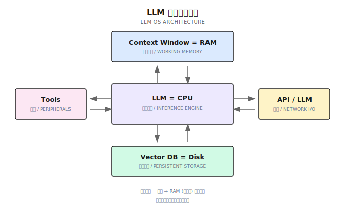
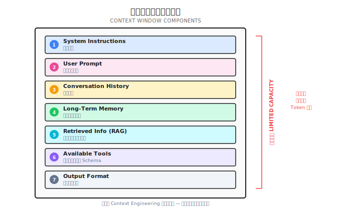
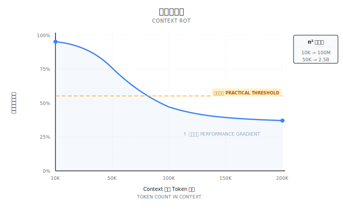
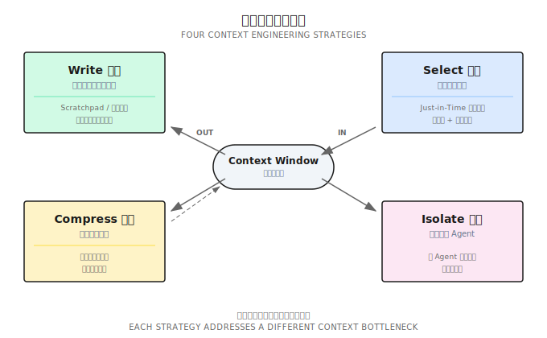
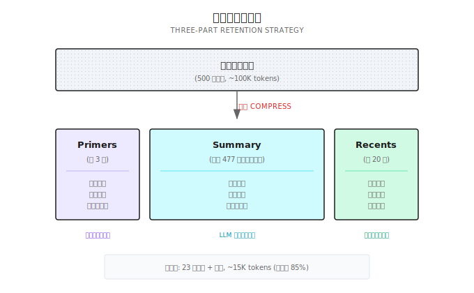
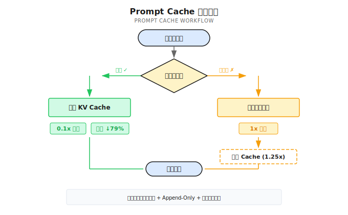

# 第 7 章：上下文工程

> **上下文窗口是 LLM 的 RAM——它决定了 Agent 在任何时刻能"想起"什么。**
> **上下文工程，就是决定"在这块有限的内存里放什么"的艺术与科学。**

---

你让 Agent 帮你调试一个生产问题。

对话进行了 50 轮，它终于定位到是数据库连接池配置不对。

然后你问："刚才你说的连接池配置是什么来着？"

它回答："抱歉，我不记得了。"

**你愣住了。**

50 轮对话，烧了几万 token，结果它把关键信息忘了？

它没有偷懒。它只是把关键信息"忘"了——因为那段对话被挤出了上下文窗口。这不是智力问题，是**记忆管理问题**。

理解为什么这是 Agent 系统中最核心的挑战，需要一个更高层的视角。

---

## 7.1 LLM OS：为什么上下文是一切

Andrej Karpathy 在 2025 年提出了一个极具洞见的类比：**LLM 就像一个操作系统**。

不是比喻——是结构性的相似。



把它和传统计算机对比一下：

| 传统计算机 | LLM OS | 说明 |
|-----------|--------|------|
| CPU | LLM 模型 | 核心推理引擎，执行"计算" |
| RAM | 上下文窗口（Context Window） | 有限的、易失的工作记忆 |
| 硬盘 | 向量数据库 / 文件系统 | 持久化存储，跨会话保留 |
| 外设 | 工具（Tools） | 与外部世界交互的接口 |
| 网络 I/O | API / 其他 LLM | 与外部服务和其他模型通信 |

这个类比的核心洞察是什么？

**上下文窗口就是 RAM。**

它有三个关键特性：有限——不管模型号称支持多大窗口，它终究有上限；易失——对话结束等于断电，RAM 里的内容全部清零；昂贵——每多放一个 token，就多烧一份计算和费用。

就像操作系统要管理 RAM 的分配和换页一样，Agent 系统也需要管理上下文窗口里放什么、不放什么、什么时候换出去、什么时候调回来。

这就是**上下文工程**——Agent 系统中最核心的工程问题。

---

## 7.2 从 Prompt Engineering 到 Context Engineering

你可能听过 Prompt Engineering（提示词工程）——花时间打磨提示词的措辞，让 LLM 给出更好的回答。

但在 2025 年，行业的认知发生了一次关键升级。

Shopify CEO Tobi Lutke 说："Context engineering 比 prompt engineering 更准确地描述了这项核心技能。" Andrej Karpathy 进一步定义："在每一个工业级 LLM 应用中，Context Engineering 是精心填充上下文窗口的精妙艺术与科学——放入恰到好处的信息，以获得最佳的下一步行动。" Anthropic 则把 Context Engineering（上下文工程）称为 Prompt Engineering 的"自然演进"。

一句话定义：**Context Engineering（上下文工程）是设计和构建动态系统的学科，该系统在正确的时间向 LLM 提供正确的信息和正确的工具。**

它和 Prompt Engineering 有什么区别？

| 维度 | Prompt Engineering | Context Engineering |
|------|-------------------|---------------------|
| 范围 | 单次交互，优化措辞 | 系统级，管理整个信息环境 |
| 关注点 | "怎么说"——措辞技巧 | "给什么"——信息选择与编排 |
| 适用场景 | 日常对话、简单任务 | 生产级 Agent 系统 |
| 组件 | 仅 Prompt 文本 | System Prompt + RAG + Memory + Tools + 状态 |
| 失败模式 | 措辞不当导致理解偏差 | 上下文污染、过载或关键信息缺失 |

简单说：Prompt Engineering 关心"如何对模型说话"，Context Engineering 关心"让模型看到什么"。

那么，上下文窗口里到底有什么？



DeepMind 的 Philipp Schmid 总结了上下文的七大组成要素：

1. **System Instructions** — 系统指令，定义角色和行为边界
2. **User Prompt** — 用户的当前请求
3. **Conversation History** — 对话历史
4. **Long-Term Memory** — 跨会话的持久记忆
5. **Retrieved Information (RAG)** — 实时检索的外部知识
6. **Available Tools** — 可用工具的定义和 schema
7. **Output Format** — 输出格式要求

每一项都在争夺上下文窗口这块有限的"RAM"空间。上下文工程的核心挑战，就是在这七个维度之间做出最优分配。

记住这句话：**"Agent 的失败，本质上是上下文的失败，而不是模型的失败。"**

---

## 7.3 上下文的物理限制

上下文窗口不是无限的。理解它的物理约束，是做好上下文工程的前提。

### Token：LLM 的计量单位

Token（令牌）是 LLM 处理文本的最小单位——不是字符，也不是单词，而是模型内部切分文本的"碎片"。不同语言的 token 效率不同：

| 语言 | 平均效率 | 说明 |
|------|---------|------|
| 英文 | ~4 字符/token | 按词根和常见词切分 |
| 中文 | ~1.5 字符/token | 每个汉字约 1-2 token |
| 代码 | ~3 字符/token | 符号和关键字独立切分 |

这意味着同样的语义内容，中文消耗的 token 更多。

> ⚠️ **时效性提示** (2026-01): Token 计数依赖具体 tokenizer，以下换算为约数。实际使用请调用对应 SDK 的 token 计数 API。

精确计算 token 需要调用 tokenizer，太慢了。Shannon 用了一个实测足够准的估算方法：

```go
// 简化版 token 估算
func EstimateTokens(messages []Message) int {
    total := 0
    for _, msg := range messages {
        // 每 4 个字符约 1 个 token
        total += len([]rune(msg.Content)) / 4
        // 每条消息有格式开销（role, content 结构）
        total += 5
    }
    // 加 10% 安全边际
    return int(float64(total) * 1.1)
}
```

| 组成部分 | 估算方式 | 说明 |
|----------|----------|------|
| 普通文本 | 字符数 / 4 | 标准 GPT 估算 |
| 消息格式 | 每条 +5 | role/content 结构开销 |
| 代码 | 字符数 / 3 | 代码 token 密度更高 |
| 安全边际 | +10% | 防止估算偏小 |

这个估算误差在 10-15% 以内，对于预算控制来说够用了。

### Context Rot：为什么更大的窗口不是万能药

你可能想：既然窗口大小是问题，那用更大的窗口不就行了？

没那么简单。Chroma 的研究揭示了一个关键现象——**Context Rot（上下文腐蚀）**：随着上下文中 token 数量增加，模型准确回忆和利用信息的能力会递减。



原因在 Transformer 架构本身。自注意力（Self-Attention）的计算量与 token 数量呈 n² 关系：10K token 需要约 1 亿次注意力计算，50K token 就是约 25 亿次。计算量的暴增创造的不是一个"硬悬崖"，而是一个**性能梯度**——信息检索的准确率随着上下文长度逐渐下滑。

核心结论：**上下文是有限资源，具有递减的边际回报。往里塞更多信息，不一定能让模型表现更好。**

> ⚠️ **时效性提示** (2026-01): 模型上下文窗口和定价频繁变化，以下为示意。请查阅官方文档获取最新信息。

| 模型 | 上下文窗口 | 换算成字数（粗估） |
|------|-----------|------------------|
| GPT-4o | 128K tokens | ~50 万字 |
| Claude Sonnet 4 | 200K tokens | ~80 万字 |
| Gemini 2.5 Pro | 1M tokens | ~400 万字 |
| 常见开源模型 | 8K - 128K | ~3-50 万字 |

窗口看起来很大，但实际场景中的消耗远超想象。上下文管理要解决四个核心问题：

| 问题 | 后果 | 对应策略 |
|------|------|----------|
| **超限** | 请求直接失败 | Compress / Isolate |
| **成本** | 历史越长越贵 | Compress + Prompt Cache |
| **信息丢失** | 关键上下文被压缩掉 | Write + Select |
| **噪音干扰** | 无关信息降低回答质量 | Select + Isolate |

这四个问题互相矛盾。**没有完美的方案，只有取舍。**

下一节的四策略框架，就是帮你系统性地做出这些取舍的工具。

---

## 7.4 上下文工程四策略：Write / Select / Compress / Isolate

LangChain 在 2025 年提出了一个简洁的框架，把上下文工程的所有操作归纳为四种策略。



### 7.4.1 Write — 把信息写到上下文之外

上下文窗口太小？那就别把所有东西都塞进去。

Write 策略的核心是：**让 Agent 把信息主动写出到外部存储**，需要时再读回来。

最典型的实践是 **Scratchpad（便签本）模式**。Agent 在执行复杂任务时，维护一个 `todo.md` 或 `NOTES.md` 文件，把任务目标、已完成步骤、待解决问题写进去。这么做有两个好处：

第一，**避免 "Lost-in-the-Middle" 问题**。研究表明，LLM 对上下文中间位置的信息关注度最低。把关键信息写到文件里，下次需要时读回到上下文末尾——正好落在模型注意力最强的区域。

第二，**文件系统即无限记忆**。上下文窗口是有限的"RAM"，但文件系统是无限的"硬盘"。Agent 学会按需写入和读取文件，本质上是在用硬盘扩展 RAM。

许多 AI 编程助手已经在实践这个策略。它们维护待办列表来跟踪任务进度，使用项目级配置文件来持久化关键上下文——本质上都是 Write 策略的实践：把持久化信息写到上下文外部，腾出窗口空间给真正需要推理的内容。

另一个关键实践是**目标复述**：让 Agent 在上下文的末尾重新复述当前的全局目标和计划。这不是浪费 token——这是在操控模型的注意力机制，确保它始终"记得"自己在干什么。

### 7.4.2 Select — 把相关信息检索回来

Write 把信息写出去了，Select 负责在正确的时刻把正确的信息检索回来。

核心原则是 **Just-in-Time（即时）上下文**——不是把所有信息预加载到上下文里，而是在需要的时候才去取。

实践中最有效的是**混合策略**：预加载关键信息，把最核心的、每次都需要的信息放在 System Prompt 里；按需检索详细内容，具体的代码、文档、数据通过工具（glob、grep、RAG）在需要时才拉入上下文。

现代 AI 编程助手完美体现了这种混合策略：项目配置文件提供预加载的上下文（比如代码规范、架构决策），文件搜索和代码检索工具提供即时检索能力。Agent 不需要"看过所有代码"，只需要知道"在哪里找"。

这背后是一种叫**渐进式披露（Progressive Disclosure）**的设计理念：Agent 通过探索逐步发现上下文，逐层组装理解。文件大小暗示复杂度、命名暗示用途、时间戳暗示相关性——Agent 像侦探一样，从线索出发，逐步拼出全貌。

System Prompt 的设计需要注意 **Goldilocks Zone（适中区间）**。过度具体意味着脆弱——场景稍变就失效。过度模糊意味着信号不足——模型不知道该做什么。最优的 System Prompt 是足够具体以引导行为，又足够灵活以适应变化。

### 7.4.3 Compress — 压缩上下文

当对话越来越长，上下文窗口逐渐被填满时，就需要压缩了。

压缩的核心操作叫 **Compaction（压实）**：用 LLM 把冗长的对话历史压缩成精炼的摘要，然后用摘要替代原始内容，重新初始化上下文窗口。

Shannon 实现了一种经过实战验证的**三段式保留策略**：



- **Primers（前 3 条）**：保留对话开头。用户最初需求、系统设定都在这里建立。如果丢了，Agent 可能给出完全不相关的建议。
- **Summary（中间摘要）**：用 LLM 把中间几百条消息压缩成一段语义摘要。保留关键决策、重要发现和未解决问题。
- **Recents（后 20 条）**：保留最近的对话，维持连贯性。用户说"刚才那个方案"，Agent 能在 Recents 里找到。

Shannon 调用 llm-service 的 `/context/compress` 端点来生成摘要：

```python
# llm-service 侧的压缩实现（概念示例）
async def compress_context(messages: list, target_tokens: int = 400):
    prompt = f"""Compress this conversation into a factual summary.

Focus on:
- Key decisions made
- Important discoveries
- Unresolved questions
- Named entities and their relationships

Keep the summary under {target_tokens} tokens.
Use the SAME LANGUAGE as the conversation.

Conversation:
{format_messages(messages)}
"""

    result = await providers.generate_completion(
        messages=[{"role": "user", "content": prompt}],
        tier=ModelTier.SMALL,  # 用小模型，省钱
        max_tokens=target_tokens,
        temperature=0.2,  # 低温度，保证准确
    )
    return result["output_text"]
```

摘要长这样：

```
Previous context summary:
用户正在调试一个 Kubernetes 网络问题。关键发现：
- Pod 无法访问外部服务
- CoreDNS 配置正常
- NetworkPolicy 存在限制
待解决：确认 NetworkPolicy 规则的具体配置
```

什么时候触发压缩？不是每次都压缩——那样太浪费计算资源。Shannon 的策略是：预算使用率达到约 75% 时触发，目标压到约 37.5%。比如预算是 50K tokens，用到 37.5K 就开始压缩，压到 18.75K 左右。75% 留 25% 余量给当前轮的输入输出，37.5% 压到一半以下给后续对话留空间。

实测压缩效果：

| 场景 | 原始 Token | 压缩后 | 压缩率 | 说明 |
|------|-----------|--------|--------|------|
| 50 条消息 | ~10k | 无压缩 | 0% | 未触发阈值 |
| 100 条消息 | ~25k | ~12k | 52% | 轻度压缩 |
| 500 条消息 | ~125k | ~15k | 88% | 重度压缩 |
| 1000 条消息 | ~250k | ~15k | 94% | 极限压缩 |

摘要生成是压缩中最慢的操作（200-500ms），但只在触发压缩时才跑，不是每次请求都跑。

**压缩是有损的**——这必须承认。那么保留什么、丢弃什么？

优先保留的：架构决策和关键结论、未解决的 bug 和待处理事项、核心实现细节和文件路径。可以丢弃的：冗余的工具输出（大段的 JSON 返回值）、重复的试错消息、确认性寒暄。

其中**工具结果清除**是最安全的压缩形式——一段 5000 token 的 API 返回值，Agent 已经从中提取了有用信息，原始数据就可以清除了。

一个重要原则：**可恢复压缩**。压缩时保留 URL 和文件路径，不做不可逆丢弃。这样即使摘要丢失了细节，Agent 还能重新读取原始源。

还有一个反直觉的实践：**保留错误上下文**。不要清除 Agent 的失败尝试——这些错误是宝贵的学习信号。模型看到之前的失败路径，会隐式更新内部信念，避免重蹈覆辙。擦除失败记录等于擦除了经验。

### 7.4.4 Isolate — 隔离上下文

当一个任务太复杂、一个上下文窗口装不下时，**拆分**。

Isolate 策略的核心是 **Sub-Agent Architecture（子 Agent 架构）**：把任务分解给专门的子 Agent，每个子 Agent 在自己干净的上下文窗口中工作，只把精华结果返回给主 Agent。

这带来了极大的信息压缩比。一个子 Agent 可能在其窗口中探索了数万 token 的信息——读代码、搜文档、试方案——但最终只返回 1000-2000 token 的精华摘要给主 Agent。

三个有效的隔离场景：

1. **上下文隔离**：子任务会产生大量中间数据（比如搜索结果、调试日志），但主任务只需要最终结论。
2. **并行化**：多个子 Agent 同时探索不同方向，各自在独立窗口中工作，互不干扰。
3. **专业化**：当工具定义超过 20 个时，每个工具定义占 200+ token，光工具就吃掉 4000+ token 的上下文。拆分成每个子 Agent 最多 5 个工具，让它们各自专精。

Token 预算在隔离架构中也需要分层管理。Shannon 实现了 **Session → Task → Agent** 三级预算：

```go
func (bm *BudgetManager) CheckBudget(sessionID string, estimatedTokens int) *BudgetCheckResult {
    budget := bm.sessionBudgets[sessionID]
    result := &BudgetCheckResult{CanProceed: true}

    // 检查是否超限
    if budget.TaskTokensUsed + estimatedTokens > budget.TaskBudget {
        if budget.HardLimit {
            result.CanProceed = false
            result.Reason = "Task budget exceeded"
        } else {
            result.RequireApproval = budget.RequireApproval
            result.Warnings = append(result.Warnings, "Will exceed budget")
        }
    }

    // 检查警告阈值（比如 80% 时发警告）
    usagePercent := float64(budget.TaskTokensUsed) / float64(budget.TaskBudget)
    if usagePercent > budget.WarningThreshold {
        bm.emitWarningEvent(sessionID, usagePercent)
    }

    return result
}
```

三种预算执行模式，选哪个取决于你的场景：

| 模式 | 行为 | 适用场景 |
|------|------|----------|
| **硬限制** | 超预算直接拒绝 | 成本敏感、对外 API |
| **软限制** | 超预算发警告，继续执行 | 任务优先、内部工具 |
| **审批模式** | 超预算暂停，等人工确认 | 关键任务需要人工把关 |

当预算压力增大时，Shannon 还实现了**背压机制**——不是突然停止，而是渐进式限流：

```go
func calculateBackpressureDelay(usagePercent float64) time.Duration {
    switch {
    case usagePercent >= 0.95:
        return 1500 * time.Millisecond  // 重度限流
    case usagePercent >= 0.9:
        return 750 * time.Millisecond
    case usagePercent >= 0.85:
        return 300 * time.Millisecond
    case usagePercent >= 0.8:
        return 50 * time.Millisecond    // 轻微限流
    default:
        return 0                         // 正常执行
    }
}
```

背压的好处：响应变慢让用户感知到"预算在消耗"，实现平滑降级而非突然断掉，用量下来后自动恢复正常。

隔离策略和后续的 Multi-Agent 架构密切相关——第 16-19 章会深入展开。

---

## 7.5 Prompt Cache：让上下文工程可负担

上下文工程有一个现实问题：**贵**。

Agent 系统的输入和输出 token 比例可以高达 100:1——每生成一个 token 的回答，可能需要处理 100 个 token 的上下文。这意味着输入成本远远超过输出成本。

**Prompt Cache** 是解决这个问题的关键基础设施。

### 什么是 Prompt Cache？

每次 LLM 处理输入时，都要对 token 序列做前向传播，生成中间计算结果——KV Cache（Key-Value 缓存矩阵）。Prompt Cache 的原理很简单：**把这些中间计算结果缓存起来，下次遇到相同的前缀时直接复用，跳过重复计算。**



关键机制是**前缀匹配**：只要请求的前缀和缓存中的相同，后续计算就可以从缓存继续，不需要从头来过。

### Claude 的实现与定价

以 Claude 为例：

| Token 类型 | 相对费用 | 说明 |
|-----------|---------|------|
| 标准输入 | 1x | 每次都完整计算 |
| Cache 写入（5 分钟 TTL） | 1.25x | 首次写入稍贵 |
| Cache 读取 | 0.1x | **节省 90%** |

Anthropic 官方数据显示：对于 100K token 的缓存对话，成本降低 90%，延迟降低 79%；在多轮对话场景下，成本降低 53%，延迟降低 75%。

对于 Agent 系统来说，这个优化的影响是巨大的——因为 Agent 的每一轮都会发送完整的上下文历史。

### Agent 系统的 Cache 优化原则

要让 Prompt Cache 真正生效，你的上下文需要满足几个条件。

**保持提示前缀稳定**。System Prompt 放在最前面，且内容不要频繁变动。不要在开头放秒级时间戳或随机 ID——这会让每次请求的前缀都不同，Cache 命中率归零。

**上下文只追加（Append-Only）**。新消息追加到末尾，不要修改或重排历史消息。这确保了序列化的确定性——前缀始终一致。

**工具定义保持稳定**。不要在运行时动态增删工具定义。工具定义通常紧跟在 System Prompt 之后，如果变更了，后续所有 KV Cache 都会失效。需要控制工具可用性时，用 logit 掩蔽（在解码时屏蔽某些工具的输出概率）而不是删除工具定义——这样缓存不受影响。

**注意 TTL**。对于高频请求场景，保持请求间隔在 Cache TTL 以内（Claude 是 5 分钟），确保缓存不过期。

---

## 7.6 常见误区与反模式

在实践上下文工程时，有五个常见的坑值得警惕。

**1. 只关注 Prompt 措辞，忽视整个上下文系统**

你精心调了一周的 Prompt 措辞，但上下文里塞满了无关的工具输出和过期的对话历史。"措辞完美但信息错误"的 Prompt 毫无价值。上下文工程关心的是信息环境，不只是那几句提示词。

**2. 压缩过于激进，做不可逆丢弃**

把中间过程全部扔掉，只保留最终结论。问题是：当 Agent 需要重新审视一个决策时，找不到任何上下文了。应该保留恢复路径——URL、文件路径、关键中间步骤。

**3. 工具定义膨胀**

20+ 个工具让 Agent 变得犹豫不决——不是因为模型笨，而是上下文里太多选项造成了决策噪音。策划最小可行工具集。如果需要大量工具，用 Isolate 策略拆分成多个专业子 Agent。

**4. 忽略 Prompt Cache**

每次请求都从头计算整个上下文——在长对话场景下，90% 以上的计算是重复的。确保 append-only + 前缀稳定，让 Cache 为你省钱。

**5. 清除错误上下文**

直觉告诉你：Agent 走了弯路，应该把错误尝试删掉，给它一个"干净的开始"。但这是反模式——保留错误尝试作为学习信号。模型看到之前的失败路径，会避免重复相同的错误。

---

## 7.7 本章要点回顾

1. **LLM OS 类比**：Context Window = RAM，管理它是 Agent 系统的核心工程问题
2. **Context Engineering > Prompt Engineering**：关注整个信息系统，不只是措辞
3. **Context Rot**：上下文越长，信息利用效率越低——更大的窗口不是万能药
4. **四策略框架**：Write（写出去）/ Select（检索回来）/ Compress（压缩）/ Isolate（隔离）
5. **Prompt Cache 是生产环境的成本救星**：可节省 90% 输入成本

核心原则一句话总结：

> **"找到最小的高信号 token 集合，最大化期望结果的可能性。"**

上下文工程解决了"工作记忆"问题——单次对话内的信息管理。但 Agent 如何拥有跨会话的"长期记忆"？下一章我们聊**记忆架构**——如何让 Agent 记住上一次的对话、上一周的决策、上一月的用户偏好。

---

## Shannon Lab（10 分钟上手）

### 必读（1 个文件）

- [`docs/context-window-management.md`](https://github.com/Kocoro-lab/Shannon/blob/main/docs/context-window-management.md) — 重点看 Sliding Window Compression 和 Token Budget Management 部分，理解压缩触发条件和多层预算

### 选读深挖（2 个）

- [`activities/context_compress.go`](https://github.com/Kocoro-lab/Shannon/blob/main/go/orchestrator/internal/activities/context_compress.go) — 看 `CompressAndStoreContext` 函数，理解完整的压缩流程
- [`budget/manager.go`](https://github.com/Kocoro-lab/Shannon/blob/main/go/orchestrator/internal/budget/manager.go) — 看 `CheckBudget` 函数，理解预算检查和分层控制

---

## 延伸阅读

- [Anthropic: Effective Context Engineering for AI Agents (2025)](https://www.anthropic.com/engineering/context-engineering) — 上下文工程最全面的工程视角
- [LangChain: Context Engineering for Agents (2025)](https://blog.langchain.dev/context-engineering-for-agents/) — Write/Select/Compress/Isolate 框架原文
- [Karpathy: Software Is Changing (Again) — AI Startup School (2025)](https://www.youtube.com/watch?v=LpSo_jvJkCE) — LLM OS 类比和 Software 3.0 思想
- [Chroma: Context Rot Research](https://research.trychroma.com/) — 上下文腐蚀的实证研究
- [Anthropic Prompt Caching 文档](https://docs.anthropic.com/en/docs/build-with-claude/prompt-caching) — Cache 机制、定价和最佳实践
- [Philipp Schmid: The New Skill in AI is Context Engineering](https://www.philschmid.de/context-engineering) — 上下文七大组成要素
- [OpenAI Tokenizer](https://platform.openai.com/tokenizer) — 在线体验 token 切分
