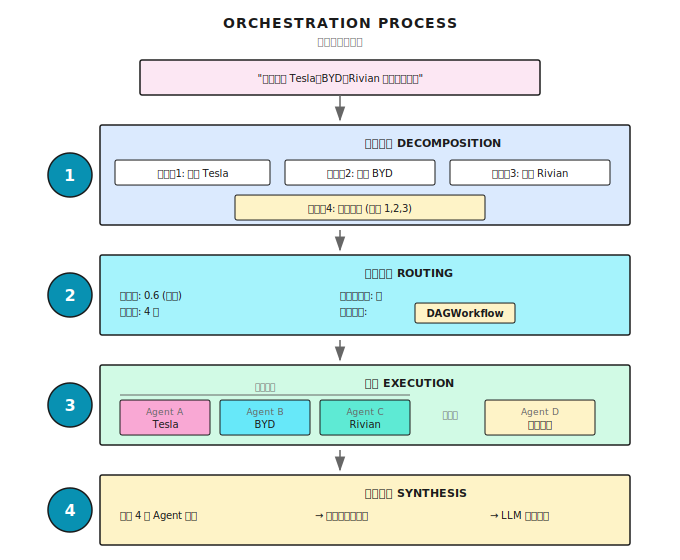

# 第 13 章：编排基础

> **多 Agent 编排不是让一群 Agent 各干各的，而是让它们像交响乐团一样协作——有指挥、有分工、有配合。但指挥再厉害，乐手水平不行也白搭。**

---

> **⏱️ 快速通道**（5 分钟掌握核心）
>
> 1. 单 Agent 有硬伤，但 Multi-Agent 不是银弹——通常消耗 3-10x token
> 2. 三个有效场景：上下文隔离、并行化、专业化
> 3. 编排四要素：Decompose → Dispatch → Coordinate → Synthesize
> 4. 按上下文边界拆分 Agent，不要按角色拆分
> 5. 模型分层路由：简单任务用小模型，复杂推理用大模型
>
> **10 分钟路径**：13.1-13.3 → 13.6 → Shannon Lab

---

## 13.1 为什么单 Agent 不够用？

这章解决一个核心问题：**当单个 Agent 无法高效完成任务时，如何让多个 Agent 协作？**

想象你在管理一个小型研究项目——需要分析三家竞争对手（Tesla、BYD、Rivian）的电动车战略。如果只有你一个人，你会怎么做？

你会串行处理：今天研究 Tesla，明天研究 BYD，后天研究 Rivian。三天后，你终于把所有信息收集完，开始写对比分析。

但如果你有三个助手呢？你会让他们同时开工：Alice 研究 Tesla，Bob 研究 BYD，Carol 研究 Rivian。一天后，三份报告同时到手，你只需要综合对比就行。

效率提升 3 倍。

**单 Agent 就像一个人单打独斗——能完成任务，但效率低、深度浅。多 Agent 编排就是组建团队、分工协作。**

但组建团队不是简单地"多雇几个人"。你需要：分配任务、协调进度、整合结果、处理冲突。编排器（Orchestrator）就是做这件事的。

### 单 Agent 的三大硬伤

先说结论：单 Agent 有三个硬伤。

### 硬伤一：串行执行，效率太低

三家公司的搜索完全独立，没有依赖关系。但单 Agent 只能一个接一个做。如果并行呢？差距明显：


省了 40 秒。任务越多，差距越大。

### 硬伤二：通才做专家的活，深度不够

「设计一个 AI 创业公司的商业计划」，这个任务需要什么？

- 市场分析：行业规模、增长趋势、竞争格局
- 技术架构：技术选型、成本估算、可行性评估
- 财务预测：收入模型、成本结构、盈亏分析
- 营销策略：目标用户、获客渠道、品牌定位

让一个「通才」Agent 同时搞定这四件事？它可能每个都懂一点，但每个都不够深。

更好的方式是：4 个专家 Agent，各司其职。

### 硬伤三：单点故障，没有冗余

一个 Agent 挂了——网络超时、LLM 报错、工具调用失败——整个任务就废了。

多 Agent 系统可以做容错：一个挂了，其他继续；关键任务可以有备份。

### 多 Agent vs 单 Agent

| 能力 | 单 Agent | 多 Agent |
|------|----------|---------|
| **并行能力** | 串行执行 | 并发执行 |
| **专业深度** | 通才，样样懂点 | 专家分工，各有所长 |
| **容错能力** | 单点故障 | 冗余容错 |
| **成本控制** | 统一模型 | 按任务选模型（简单任务用便宜模型） |

> **注意**：多 Agent 不是银弹。Multi-Agent 系统通常消耗比单 Agent 多 **3-10 倍的 token**——跨 Agent 复制上下文、协调消息、结果汇总都在烧钱。
>
> 有研究表明，一些团队花几个月搭精心设计的 Multi-Agent 系统，最后发现优化单 Agent 的 prompt 就能达到同等效果。问题不在 Multi-Agent 本身，而在于**没有对症下药**——拆分不当、协调开销大于实际工作。
>
> **原则：Multi-Agent 是强大的架构选择，但需要用在对的场景。** 下一节我们就来看什么时候该用。

---

## 13.2 何时该用 Multi-Agent？

Multi-Agent 的额外开销是真实的，但在对的场景下，收益远超成本。

实践中发现，Multi-Agent 在三个场景下持续优于单 Agent：

### 场景一：上下文隔离（Context Isolation）

子任务会产生大量中间数据，但主任务只需要其中一小部分。

比如客服 Agent 需要查订单历史来诊断技术问题。单 Agent 的话，2000+ token 的订单详情全部堆进上下文——但诊断技术问题根本不需要这些。上下文被「污染」了，推理质量随之下降。

Multi-Agent 的解法：让一个 sub-agent 在独立上下文中处理订单查找，过滤后只返回 50-100 token 的关键摘要。主 Agent 的上下文保持干净，推理质量不降级。

```python
# 单 Agent：所有信息堆在一起
conversation = [
    # 2000+ token 的订单历史全部塞进上下文
    # 后续推理被无关信息淹没
]

# Multi-Agent：上下文隔离
class OrderLookupAgent:
    def lookup(self, order_id):
        # 独立上下文处理完整订单历史
        # 只返回关键摘要：50-100 token
        return {"status": "已发货", "date": "3月5日"}

class SupportAgent:
    def handle(self, user_message):
        summary = OrderLookupAgent().lookup(order_id)
        # 主 Agent 上下文保持干净
```

**适用信号**：子任务生成超过 1000 token 的中间数据，但主任务只需要一小部分。

### 场景二：并行化（Parallelization）

这个直觉上好理解——多个独立任务同时跑。但有个关键洞察常被忽略：

**并行化的核心价值是更全面（thoroughness），而非更快（speed）。**

并行让你同时探索更大的信息空间。虽然总 token 消耗更高、总执行时间可能更长，但结果覆盖面远超单 Agent。

典型场景：Deep Research —— 分解查询 → 多个 sub-agent 并行探索不同方面 → 综合发现。

### 场景三：专业化（Specialization）

专业化有三个维度：

- **工具集专业化**：当 Agent 拥有 20+ 工具时，选择准确率显著下降。把 40 个工具拆给 4 个专业 Agent（每个 5-10 个），选择困难迎刃而解。
- **系统提示专业化**：不同任务需要冲突的行为模式。客服 Agent 要「共情安抚」又要「严格执行退款规则」——同一个 Agent 人格分裂。
- **领域专业化**：深度领域知识（法律判例、医疗方案）会淹没通用 Agent，专业 Agent 携带聚焦的领域上下文效果更好。

### 决策清单

| 信号 | 建议 |
|------|------|
| 子任务产生大量无关上下文 | ✅ Multi-Agent（上下文隔离） |
| 任务可分解为独立部分并行探索 | ✅ Multi-Agent（并行化） |
| 工具 20+，或需要冲突行为模式 | ✅ Multi-Agent（专业化） |
| 简单任务，优化 prompt 能解决 | ❌ 先用单 Agent |
| 子任务间高度耦合，需频繁同步 | ❌ 拆了反而更慢 |

---

## 13.3 编排器：多 Agent 的指挥家

多 Agent 系统需要一个「指挥家」——Orchestrator（编排器）。

它不亲自干活，但它决定：
- 任务怎么拆
- 谁来做什么
- 什么顺序执行
- 结果怎么整合

### 四大职责


**类比一下**：编排器就像餐厅的主厨。

客人说「我要一份牛排套餐」。主厨不会自己一个人做，他会：
1. **分解**：牛排、配菜、酱汁、甜点
2. **分发**：牛排给烤台、配菜给冷厨、酱汁给酱料师
3. **协调**：牛排好了再淋酱、配菜和牛排同时出
4. **综合**：摆盘，确保温度和卖相

主厨不需要每样都会做，但他要知道：谁擅长什么、什么顺序合理、怎么整合成一道菜。

### 执行流程



---

## 13.4 路由决策：该用什么策略？

不是所有任务都需要多 Agent。编排器的第一个决策是：**这个任务该走什么路径？**

### Shannon 的路由逻辑

Shannon 的 `OrchestratorWorkflow` 是这样判断的：

```go
// 判断是否简单任务
simpleByShape := len(decomp.Subtasks) == 0 ||
                 (len(decomp.Subtasks) == 1 && !needsTools)
isSimple := decomp.ComplexityScore < simpleThreshold && simpleByShape

// 检查是否有依赖关系
hasDeps := false
for _, st := range decomp.Subtasks {
    if len(st.Dependencies) > 0 || len(st.Consumes) > 0 {
        hasDeps = true
        break
    }
}

switch {
case isSimple:
    // 简单任务 → 单 Agent 直接执行
    return SimpleTaskWorkflow(input)

case forceSwarm || needsDynamicCoordination:
    // 复杂协作或显式指定 → Swarm 模式
    return SwarmWorkflow(input)

default:
    // 标准任务 → DAG 工作流
    return DAGWorkflow(input)
}
```

**实现参考 (Shannon)**: [`go/orchestrator/internal/workflows/orchestrator_router.go`](https://github.com/Kocoro-lab/Shannon/blob/main/go/orchestrator/internal/workflows/orchestrator_router.go) - OrchestratorWorkflow 函数

### 决策树

```
任务进入
    │
    ▼
复杂度 < 0.3 且单子任务且无工具? ──是──► SimpleTaskWorkflow
    │                                    (单 Agent 直接执行)
    否
    │
    ▼
force_swarm 或需要动态协作? ──是──► SwarmWorkflow
    │                              (Lead Agent 驱动协作)
    否
    │
    ▼
DAGWorkflow（默认）
(标准多 Agent 并行/串行)
```

### 三种策略对比

| 策略 | 适用场景 | 特点 |
|------|----------|------|
| **SimpleTask** | 简单问答、单步任务 | 最轻量，单 Agent |
| **DAGWorkflow** | 2-5 个子任务，可能有简单依赖 | 并行/串行/混合执行 |
| **Swarm** | 复杂协作，动态调整，需要人工反馈 | Lead 事件循环、Workspace 协作 |

这三个策略后面几章会详细讲。这里先记住：**编排器会根据任务复杂度自动选择策略**。

---

## 13.5 怎么拆分 Agent？

路由决定了「走哪条路」，但还有一个更根本的问题：**怎么把工作分给不同 Agent？**

这是 Multi-Agent 系统成败的关键。拆得好，事半功倍；拆得不好，还不如单 Agent。

### 反模式：按角色拆分（"电话游戏"）

最直觉的拆法：一个 Agent 负责规划，一个负责实现，一个负责测试，一个负责审查。

```
Planner Agent → Implementer Agent → Tester Agent → Reviewer Agent
      ↓ handoff          ↓ handoff          ↓ handoff
   (丢上下文)         (丢上下文)         (丢上下文)
```

听起来很合理，实际上是灾难。每次 handoff 都像「电话游戏」——传一轮丢一点信息。Tester 不知道 Implementer 为什么做了某个设计决策，Reviewer 不了解迭代过程中的取舍。

结果是：**协调上花的 token 比实际干活还多**。

### 正确做法：按上下文边界拆分

处理某功能的 Agent 也应该负责测试这个功能——因为它已经拥有实现上下文。只有在上下文可以**真正隔离**时，才值得拆分。

**好的拆分边界**：

- **独立研究路径**：研究亚洲市场 vs 研究欧洲市场，互不依赖，上下文完全隔离
- **清晰接口的组件**：API 契约明确时，前端和后端可以并行开发
- **黑盒验证**：验证者只需运行测试并报告结果，不需要知道实现细节

**有问题的拆分边界**：

- **同一功能的不同阶段**：规划、实现、测试共享太多上下文，拆了反而效率低
- **紧密耦合的组件**：需要频繁来回沟通的部分，应该放在同一个 Agent 里
- **需要共享状态的工作**：频繁同步理解的 Agent 应该合并

### 验证子 Agent 模式

有一种拆分是跨场景都有效的：**让一个专门的 Agent 只负责验证**。

为什么有效？因为验证天然只需要最少的上下文——验证者不需要知道系统是怎么建的，只需要知道它该满足什么标准，然后跑测试。这完美地避开了「电话游戏」问题。

```python
# 验证子 Agent 只需要：要验证的产物 + 验证标准 + 测试工具
class VerificationAgent:
    def verify(self, artifact, criteria):
        # 黑盒验证：不需要实现上下文
        results = run_tests(artifact)
        return {"passed": all_pass(results), "issues": extract_issues(results)}
```

> **小心 Early Victory**：验证 Agent 最常见的失败模式是跑了一两个测试就宣告通过。prompt 里要明确：「你必须运行完整测试套件，只有全部通过才能标记为 PASSED」。

---

## 13.6 三种执行模式

不管走哪个策略，最终都要执行 Agent。执行方式有三种：

### 模式一：并行执行（Parallel）

适用场景：子任务相互独立，没有依赖关系。


核心是**信号量控制**——限制同时执行的 Agent 数量，防止资源耗尽。

```go
type ParallelConfig struct {
    MaxConcurrency int  // 最大并发数，默认 5
}

func ExecuteParallel(ctx workflow.Context, tasks []ParallelTask, config ParallelConfig) {
    // 信号量控制并发
    semaphore := workflow.NewSemaphore(ctx, int64(config.MaxConcurrency))

    for i, task := range tasks {
        workflow.Go(ctx, func(ctx workflow.Context) {
            // 获取信号量（超过并发数会阻塞）
            semaphore.Acquire(ctx, 1)
            defer semaphore.Release(1)

            // 执行任务
            executeTask(task)
        })
    }
}
```

**实现参考 (Shannon)**: [`go/orchestrator/internal/workflows/patterns/execution/parallel.go`](https://github.com/Kocoro-lab/Shannon/blob/main/go/orchestrator/internal/workflows/patterns/execution/parallel.go) - ExecuteParallel 函数

为什么要限制并发？

假设你有 10 个搜索任务，MaxConcurrency = 3：

```
t0: [Task 1] [Task 2] [Task 3]  ← 3 个同时开始
t1: [1 done] [Task 4 starts]    ← 1 完成，4 立即补位
t2: [2 done] [Task 5 starts]    ← 2 完成，5 补位
...
```

如果不限制，10 个 Agent 同时调用 LLM API，很可能触发限流，反而更慢。

### 模式二：串行执行（Sequential）

适用场景：任务有隐式依赖，后一个需要前一个的结果。


```go
type SequentialConfig struct {
    PassPreviousResults bool  // 是否把前一个结果传给下一个
}

func ExecuteSequential(ctx workflow.Context, tasks []Task, config SequentialConfig) {
    var results []Result

    for i, task := range tasks {
        // 把前序结果注入上下文
        if config.PassPreviousResults && len(results) > 0 {
            task.Context["previous_results"] = results
        }

        result := executeTask(task)
        results = append(results, result)
    }
}
```

关键是 **结果传递**。比如：

```
Task 1: "获取特斯拉股价"
        → Response: "$250"
        ↓
Task 2: "计算相比去年的涨幅"
        Context: {
          previous_results: [
            { response: "$250", numeric_value: 250 }
          ]
        }
        → 可以直接用 250 做计算
```

### 模式三：混合执行（Hybrid/DAG）

适用场景：部分任务可并行，部分任务有依赖。


核心是**依赖等待**——任务只有在所有依赖任务完成后才能开始。

```go
func waitForDependencies(
    ctx workflow.Context,
    dependencies []string,
    completedTasks map[string]bool,
    timeout time.Duration,
) bool {
    startTime := workflow.Now(ctx)
    deadline := startTime.Add(timeout)

    for workflow.Now(ctx).Before(deadline) {
        // 检查所有依赖是否完成
        allDone := true
        for _, depID := range dependencies {
            if !completedTasks[depID] {
                allDone = false
                break
            }
        }
        if allDone {
            return true
        }

        // 等 30 秒再检查
        workflow.AwaitWithTimeout(ctx, 30*time.Second, func() bool {
            // 条件检查
            for _, depID := range dependencies {
                if !completedTasks[depID] {
                    return false
                }
            }
            return true
        })
    }

    return false  // 超时
}
```

**实现参考 (Shannon)**: [`go/orchestrator/internal/workflows/patterns/execution/hybrid.go`](https://github.com/Kocoro-lab/Shannon/blob/main/go/orchestrator/internal/workflows/patterns/execution/hybrid.go) - waitForDependencies 函数

---

## 13.7 结果综合

多个 Agent 跑完了，怎么整合结果？

### 问题

Agent 的原始输出通常是：

1. **冗余的**：不同 Agent 可能给出相似信息
2. **格式不一**：每个 Agent 有自己的输出风格
3. **质量参差**：有的成功，有的失败，有的半吊子

用户期望的是：一个统一、完整、高质量的回答。

### 预处理三步走

综合之前，先做三步预处理：

1. **精确去重**：Hash 比对，移除完全相同的结果
2. **相似去重**：文本相似度超过阈值（如 Jaccard > 0.85）的结果只保留一个
3. **质量过滤**：移除失败结果和无效回答（「unable to retrieve」「未找到」等）

### 综合方式

**简单综合**：直接拼接。适合结果已经很规整的情况。

**LLM 综合**：适合需要统一视角、消除矛盾、生成洞察的情况：

```go
func llmSynthesis(query string, results []AgentResult) string {
    prompt := fmt.Sprintf(`综合以下研究结果，回答问题：%s

要求：
1. 消除重复信息
2. 解决矛盾（如果有）
3. 突出关键洞察
4. 用统一的格式呈现

`, query)

    for i, r := range results {
        prompt += fmt.Sprintf("=== 来源 %d ===\n%s\n\n", i+1, r.Response)
    }

    return callLLM(prompt)
}
```

---

## 13.8 成本控制与模型分层

多 Agent 场景下，成本控制更重要。单 Agent 烧 1000 个 token，多 Agent 可能烧 5000 个。

### 预算分配策略

**简单策略：平均分配**

```go
func allocateBudgetSimple(totalBudget int, numAgents int) int {
    return totalBudget / numAgents
}

// 例：总预算 10000，5 个 Agent → 每个 2000
```

**进阶策略：按复杂度分配**

```go
func allocateBudgetByComplexity(totalBudget int, subtasks []Subtask) map[string]int {
    budgets := make(map[string]int)

    // 计算总复杂度
    totalComplexity := 0.0
    for _, st := range subtasks {
        totalComplexity += st.Complexity
    }

    // 按比例分配
    for _, st := range subtasks {
        budgets[st.ID] = int(float64(totalBudget) * st.Complexity / totalComplexity)
    }

    return budgets
}

// 例：总预算 10000
//     Task A (复杂度 0.5) → 5000
//     Task B (复杂度 0.3) → 3000
//     Task C (复杂度 0.2) → 2000
```

### 模型分层：不是所有任务都需要最贵的模型

比预算分配更有效的省钱方式是**模型分层（Model Tiering）**——不同复杂度的任务用不同档次的模型。

| 层级 | 适用任务 | 特点 |
|------|----------|------|
| **Small** | 翻译、摘要、分类、数据提取 | 模式匹配任务，不需要深度推理链 |
| **Medium** | 分析、生成、多轮对话 | 需要一定推理能力 |
| **Large** | 复杂推理、架构决策、研究分析 | 需要多步推理链、处理模糊需求 |

关键区别不是模型"聪不聪明"，而是任务是否需要**深度推理链**。翻译和分类的答案空间是有限的，用小模型就够了。但「设计一个分布式系统的架构」需要反复权衡、回溯修正——这才需要大模型。

Shannon 的做法：用一个轻量模型快速评估任务复杂度（延迟 <1s，成本 <$0.01），根据评分选择模型层级。大约 50% 的请求由 Small 模型处理，整体成本降低 60% 以上，且无质量损失。

```go
// Shannon 的分层路由（简化版）
func selectModelTier(complexityScore float64) string {
    switch {
    case complexityScore < 0.3:
        return "small"   // 翻译/摘要/分类
    case complexityScore < 0.5:
        return "medium"  // 分析/生成
    default:
        return "large"   // 复杂推理/决策
    }
}
```

---

## 13.9 控制信号

编排过程中，用户可能想要：暂停、恢复、取消。

Shannon 使用 Temporal 的 Signal 机制实现：在编排流程的关键检查点（路由决策前、任务分解后、进入 DAG 前）检查是否有控制信号，收到暂停信号就等待恢复，收到取消信号就终止子工作流。

当编排器启动子工作流时，会注册它们的 ID，这样暂停/取消信号可以级联传递给所有正在执行的子工作流。

具体实现参考 Shannon 的 `ControlSignalHandler`，核心思想是在关键点插入 checkpoint，而不是随时响应中断。

---

## 13.10 完整示例

把前面的内容串起来，看一个完整的多 Agent 研究任务：

```go
func CompanyResearchWorkflow(ctx workflow.Context, query string) (string, error) {
    companies := []string{"Tesla", "BYD", "Rivian"}

    // 1. 构建并行任务
    tasks := make([]ParallelTask, len(companies))
    for i, company := range companies {
        tasks[i] = ParallelTask{
            ID:          fmt.Sprintf("research-%s", strings.ToLower(company)),
            Description: fmt.Sprintf("Research %s's 2024 EV strategy", company),
            SuggestedTools: []string{"web_search"},
            Role:        "researcher",
        }
    }

    // 2. 并行执行
    config := ParallelConfig{
        MaxConcurrency: 3,
        EmitEvents:     true,
    }
    result, err := ExecuteParallel(ctx, tasks, sessionID, history, config, budgetPerAgent, userID, modelTier)
    if err != nil {
        return "", err
    }

    // 3. 预处理结果
    processed := preprocessResults(result.Results)

    // 4. LLM 综合
    synthesis := llmSynthesis(query, processed)

    return synthesis, nil
}
```

执行时间线：

```
0s   ┌─ 编排器启动
     ├─ 任务分解: 3 个研究任务 + 1 个综合任务
     └─ 路由决策: DAGWorkflow

1s   ├─ 并行启动 3 个研究 Agent
     │   ├─ Agent A (Tesla):  搜索中...
     │   ├─ Agent B (BYD):    搜索中...
     │   └─ Agent C (Rivian): 搜索中...

15s  ├─ Agent B 完成
20s  ├─ Agent C 完成
25s  ├─ Agent A 完成 (Tesla 信息最多)

26s  ├─ 开始结果综合
     │   ├─ 去重: 移除 2 条重复信息
     │   ├─ 过滤: 移除 1 条失败结果
     │   └─ LLM 综合分析

45s  └─ 输出最终报告

总耗时: ~45 秒 (串行需要 ~75 秒)
```

---

## 13.11 常见的坑

### 坑 1：按角色拆分 Agent

前面 13.5 讲过的「电话游戏」是最常见的坑。很多人直觉上按职责拆（planner、coder、tester、reviewer），结果每次 handoff 丢上下文，协调开销大于实际工作。

**记住**：按上下文边界拆分，不按角色拆分。

### 坑 2：过度并行

```go
// 危险：并发 100，API 会限流
config := ParallelConfig{MaxConcurrency: 100}

// 合理：根据 API 限制设置
config := ParallelConfig{MaxConcurrency: 5}
```

我见过有人把并发设成 50，结果 LLM API 返回一堆 429 Too Many Requests。还不如串行执行。

### 坑 3：忽略失败任务

```go
// 问题：只处理成功的，失败的被无视
for _, r := range results {
    if r.Success {
        process(r)
    }
}

// 改进：监控成功率
successRate := float64(successCount) / float64(total)
if successRate < 0.7 {
    logger.Warn("Low success rate", "rate", successRate)
    // 可能需要重试或报警
}
```

### 坑 4：结果综合丢信息

简单拼接可能导致：
- 信息重复（两个 Agent 都提到「Tesla 市值 8000 亿」）
- 信息矛盾（一个说增长 15%，一个说增长 12%）
- 缺乏洞察（只是罗列，没有对比分析）

用 LLM 综合时，prompt 要明确要求消除重复、标注矛盾、生成对比分析。

### 坑 5：所有任务用同一个模型

简单的翻译任务和复杂的架构设计用同一个大模型？成本差 100 倍。参考 13.8 的模型分层策略。

---

## 13.12 其他框架的实现

编排是多 Agent 的核心问题，各框架都有自己的方案：

| 框架 | 编排方式 | 特点 |
|------|----------|------|
| **LangGraph** | 图定义 + 节点执行 | 灵活，需要手动定义图 |
| **AutoGen** | GroupChat + Manager | 对话驱动，自动选择发言者 |
| **CrewAI** | Crew + Process | 角色定义清晰，支持顺序/层级 |
| **OpenAI Swarm** | handoff() | 轻量级，Agent 之间直接交接 |

LangGraph 示例：

```python
from langgraph.graph import StateGraph

# 定义状态
class ResearchState(TypedDict):
    query: str
    tesla_data: str
    byd_data: str
    synthesis: str

# 定义图
graph = StateGraph(ResearchState)
graph.add_node("research_tesla", research_tesla_node)
graph.add_node("research_byd", research_byd_node)
graph.add_node("synthesize", synthesize_node)

# 定义边（依赖）
graph.add_edge(START, "research_tesla")
graph.add_edge(START, "research_byd")
graph.add_edge("research_tesla", "synthesize")
graph.add_edge("research_byd", "synthesize")
```

---

## 这章讲完了

核心就一句话：**Orchestrator 是多 Agent 的指挥家——分解任务、分发执行、协调依赖、综合结果**。

## 小结

1. **先问该不该用**：Multi-Agent 消耗 3-10x token，先优化单 Agent
2. **三个有效场景**：上下文隔离、并行化、专业化
3. **Orchestrator 四职责**：Decompose → Dispatch → Coordinate → Synthesize
4. **按上下文拆分**：不按角色拆，避免「电话游戏」
5. **路由决策**：简单任务 SimpleTask，标准任务 DAG，复杂协作 Swarm
6. **模型分层**：简单任务用小模型，复杂推理用大模型，成本降 60%+

---

## Shannon Lab（10 分钟上手）

本节帮你在 10 分钟内把本章概念对应到 Shannon 源码。

### 必读（1 个文件）

- [`orchestrator_router.go`](https://github.com/Kocoro-lab/Shannon/blob/main/go/orchestrator/internal/workflows/orchestrator_router.go)：找 OrchestratorWorkflow 函数的路由 switch 语句，理解怎么判断「简单任务」、「需要 Swarm」、怎么委托给子工作流

### 选读深挖（2 个，按兴趣挑）

- [`execution/parallel.go`](https://github.com/Kocoro-lab/Shannon/blob/main/go/orchestrator/internal/workflows/patterns/execution/parallel.go)：理解信号量控制怎么实现（workflow.NewSemaphore）、为什么用 futuresChan + Selector 收集结果
- [`execution/hybrid.go`](https://github.com/Kocoro-lab/Shannon/blob/main/go/orchestrator/internal/workflows/patterns/execution/hybrid.go)：理解 waitForDependencies 的增量超时检查、为什么用 workflow.AwaitWithTimeout 而不是死等

---

## 练习

### 练习 1：路由决策分析

分析以下任务会走哪个路径：

1. 「今天北京天气怎么样」
2. 「对比 iPhone 和 Android 的市场份额」
3. 「设计一个电商系统的完整架构，包括前端、后端、数据库、缓存、消息队列」

对于每个任务，说明：
- 预期的复杂度评分范围
- 会走哪个工作流（SimpleTask / DAG / Swarm）
- 为什么

### 练习 2：拆分决策

判断以下拆分方案是否合理，并说明理由：

1. 一个 Agent 写代码，一个 Agent 写测试，一个 Agent 做代码审查
2. 一个 Agent 研究亚洲市场，一个 Agent 研究欧洲市场，一个 Agent 综合分析
3. 一个 Agent 负责 CRM 操作（10 个工具），一个 Agent 负责营销自动化（12 个工具）

### 练习 3（进阶）：设计综合 Prompt

为一个「多公司财报对比分析」任务设计 LLM 综合的 prompt。

要求包含：
- 如何处理信息重复
- 如何处理数据矛盾
- 输出格式要求（表格 + 洞察）
- 引用标注要求

---

## 想深入？

- [Temporal Workflows](https://docs.temporal.io/develop/go/foundations) - 理解工作流编排的基础设施
- [LangGraph Multi-Agent](https://python.langchain.com/docs/langgraph) - Python 生态的图编排方案
- [AutoGen GroupChat](https://microsoft.github.io/autogen/) - 微软的对话式多 Agent 框架

---

## 下一章预告

编排器决定了「谁来做」，但「怎么做」还没解决。

当任务之间有复杂的依赖关系——A 等 B，B 等 C，C 又可以和 D 并行——简单的串行或并行都搞不定。

下一章讲 **DAG 工作流**：用有向无环图来建模任务依赖，实现智能调度。

下一章我们继续。
