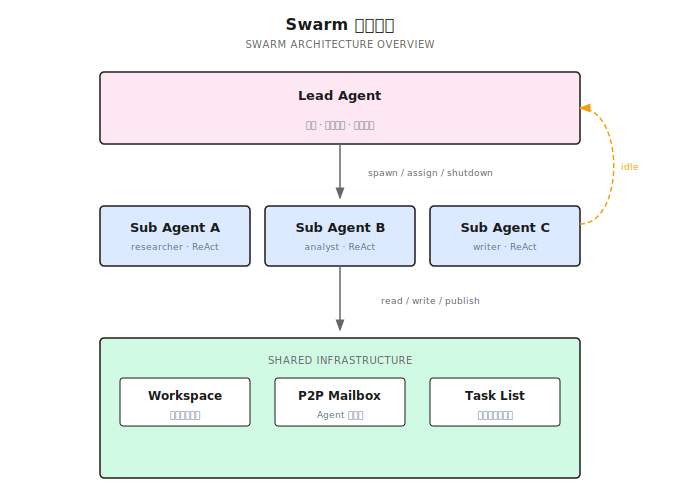
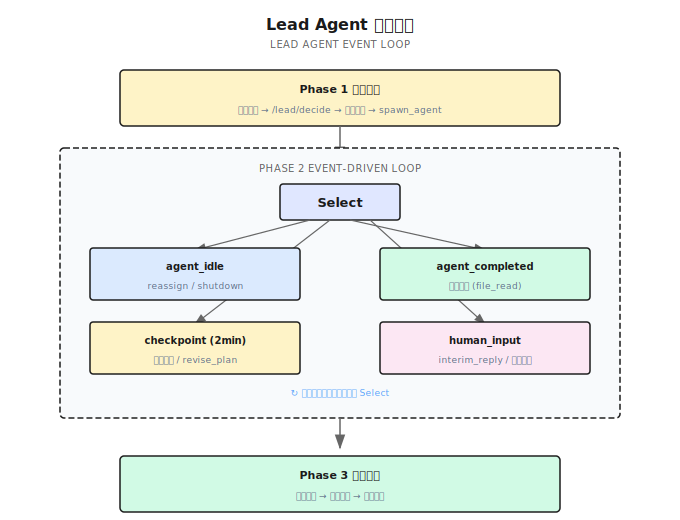
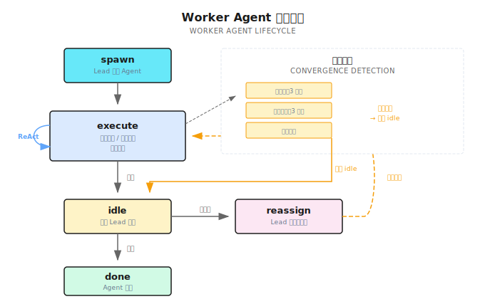

# 第 15 章：Swarm 模式

> **Swarm 是让多个 Agent 像团队一样协作——Lead Agent 规划和协调，Worker Agent 各自独立执行，通过共享 Workspace 和 P2P 消息互通有无。个体遵循简单规则，群体涌现复杂智能。**

---

> **⏱️ 快速通道**（5 分钟掌握核心）
>
> 1. Swarm = Lead Agent（事件驱动） + Worker Agent（独立 ReAct 循环）
> 2. Lead 三阶段：初始规划 → 事件循环（idle/completed/checkpoint/human_input）→ 关闭合成
> 3. Worker 完成任务后进入 idle，Lead 可以 reassign 新任务或 shutdown
> 4. 共享 Workspace + P2P Mailbox 实现 Agent 间协作
> 5. 人类通过 human_input 事件实时参与，不用等流程结束
> 6. 纯去中心化不够好——Anthropic C Compiler 实验证明了这一点
>
> **10 分钟路径**：15.1-15.3 → 15.4 → 15.8 → Shannon Lab

---

## 15.1 开场：竞争分析 Agent 的困境

前一章我们讲了 DAG 工作流——通过依赖图调度任务，该并行的并行，该等待的等待。DAG 很强大，但它有个假设：**任务结构是固定的**。◊
我去年帮一个咨询公司做竞争分析 Agent。开始时需求很明确：分析 5 家竞争对手的产品、定价、市场份额。我用 DAG 设计了 5 个并行的研究任务 + 1 个综合任务，效果不错。

然后客户提了新需求："能不能在分析过程中，如果发现某家公司特别重要，自动深挖它的技术专利？"

这就超出 DAG 的能力了。DAG 的任务是固定的，不能中途"加人"。你无法在执行时说"嘿，这个公司值得深入研究，再派一个专利分析师"。

不只是加人的问题。客户还想在分析过程中随时追问——"能不能多关注一下 XX 公司的定价策略？"这意味着系统需要**在运行时接受人类输入并动态调整**。

DAG 做不到这些。你需要一种更灵活的编排模式——Agent 能自主协作、动态调整、实时响应人类反馈。

这就是 **Swarm 模式**。

---

## 15.2 什么是 Swarm？

### Swarm 的起源：从蚂蚁到 AI

Swarm（群体）这个概念不是 AI 领域发明的，它的根源在自然界。

1989 年，比利时研究员 Marco Dorigo 观察蚂蚁觅食行为，提出了蚁群优化算法（Ant Colony Optimization）。单只蚂蚁几乎没有智能——它只会做三件事：沿着信息素走、找到食物就留下信息素、随机探索。但数千只蚂蚁通过信息素这个"共享介质"协作，能找到巢穴到食物源的最短路径。没有蚂蚁知道全局地图，但群体涌现出了路径优化能力。

这个现象在自然界随处可见：蜂群通过摇摆舞传递蜜源位置，鱼群通过侧线感知邻居动向实现整体避障，鸟群通过三条简单规则（分离、对齐、内聚）形成壮观的 murmuration 飞行编队。

社会学家也在人类组织中发现了类似模式。社会学家 James Surowiecki 在《群体的智慧》（The Wisdom of Crowds, 2004）中论证：**在满足多样性、独立性和去中心化三个条件时，群体决策优于个体专家**。2001 年 Eric Bonabeau 等人在《Swarm Intelligence: From Natural to Artificial Systems》中系统地将这些自然现象抽象为工程方法论。

核心思想始终一致：**个体遵循简单规则 + 通过共享介质通信 = 群体涌现复杂行为**。

到了 AI Agent 时代，这个思想直接映射过来：

| 自然/社会 Swarm | AI Agent Swarm |
|----------------|----------------|
| 蚂蚁 / 蜜蜂 / 团队成员 | Worker Agent |
| 蜂后 / 项目经理 | Lead Agent |
| 信息素 / 摇摆舞 / 看板 | Workspace + P2P 消息 |
| 巢穴 / 蜂巢 / 办公室 | 共享基础设施 |
| 觅食 / 采蜜 / 完成项目 | 执行用户任务 |

### 一句话定义

**Swarm 是 Lead Agent 驱动的事件循环编排模式——Lead 负责规划和协调，Worker Agent 各自执行独立的 ReAct 循环，通过共享 Workspace 和 P2P 消息协作。**

### 与 DAG 的核心区别

| 维度 | DAG（第 14 章） | Swarm（本章） |
|------|----------------|--------------|
| 编排方式 | 静态依赖图 | Lead Agent 事件驱动 |
| Agent 生成 | 固定，分解阶段确定 | 动态，Lead 决策 spawn |
| 任务调整 | 不支持中途修改 | Lead 可 revise_plan |
| Agent 复用 | 完成即退出 | idle → reassign 新任务 |
| 质量把关 | 无 | Lead 零成本 file_read 验证 |
| 人类参与 | 等流程结束 | human_input 事件实时响应 |

### 从 OpenAI Swarm 到 Lead-based Swarm

2024 年 10 月，OpenAI 开源了 Swarm 框架——极简的 Agent + Handoff + Routines 设计。它忠实地实现了"纯去中心化"理念：没有 Lead Agent，没有质量把关，Agent 之间纯靠 Handoff 自组织。概念很优雅，但太简了，2025 年 3 月它被 Agents SDK 取代。

纯去中心化就像一群蚂蚁——在任务天然可分解时效率惊人，但当任务需要全局协调时就力不从心。Anthropic 用 16 个 Agent 写 C 编译器的实验证明了这一点（详见 15.7）：**模块化任务时完美并行，单体任务时互相踩踏**。

自然界的蜂群其实给出了答案——它不是纯去中心化的。蜂后负责全局协调（产卵、分泌信息素控制群体情绪），工蜂各自执行具体任务（采蜜、筑巢、防御）。这是一种**有中心协调的分布式执行**。

Shannon 正是沿用了这个模型：**Lead-based Swarm**。Lead Agent 负责全局规划和质量把关，Worker Agent 保持高度自主。Lead 不干具体活，但它决定谁来干、干得怎么样、下一步干什么。



---

## 15.3 16 个 Agent 写了一个 C 编译器

概念讲完了，看一个真实案例。Anthropic 在 2026 年 2 月发表了一篇文章（"Building a C compiler with a team of parallel Claudes"）：用一组并行的 Claude Agent 编写一个 C 编译器，最终产出 10 万行 Rust 代码，API 费用约 $2 万。

### 完全去中心化的设计

这 16 个 Agent **没有 Lead**。协调机制是：

- **锁文件**：Agent 在修改某个模块前先获取锁
- **Git**：Agent 各自在分支上工作，定期合并
- **共享测试集**：作为质量验证的唯一标准

这和蚂蚁觅食的逻辑一模一样——每个 Agent 只看局部信息（锁文件、测试结果），通过共享介质（Git 仓库）隐式协调。

### 模块化任务时效果惊人

C 语言有很多独立的特性——数组、指针、struct、union、enum……每个特性基本互不干扰。16 个 Agent 分头实现各自的 C 特性，并行推进，效率极高。

这正是去中心化 Swarm 的甜蜜点：**任务天然可分解、模块间低耦合**——就像蚂蚁分头搬运不同的食物碎片。

### 单体任务时崩溃

当任务变成"编译 Linux 内核"时，问题来了。16 个 Agent 撞上同一个 bug——ABI 兼容性问题。每个 Agent 都在尝试修复，各自改出不同的版本，互相覆盖。

这也和自然界一致——蚂蚁搬运一片大叶子时，如果没有协调，就会出现四面八方同时使劲、原地打转的情况。

Anthropic 团队的解决方案：引入 GCC 作为 Oracle（参考编译器），把"让 Linux 内核通过编译"这个单体任务重新分解成可并行的多个子任务（每个 C 特性对比 GCC 输出）。

**本质上，他们补上了 Lead Agent 的空缺**——只是这个 "Lead" 是人类工程师 + GCC 测试套件的组合。

### 三条核心教训

**1. 任务验证器的质量比 Prompt 重要。**

> "Claude will solve whatever problem I give it, so the verifier must be nearly perfect."

Agent 很擅长解决定义清晰的问题。瓶颈不在 Agent 的能力，而在你能否精确定义"做对了"是什么意思。

**2. 环境设计和 Prompt 同等重要。**

测试输出格式、`--fast` 选项（跳过已通过的测试）、进度文档……这些"基础设施"对 Agent 效率的影响不亚于 Prompt 本身。

**3. 对自主写的代码感到"不安"。**

Anthropic 安全团队的一位成员参与了这个项目。他坦言：让 AI 自主写出 10 万行代码的体验让人不安——不是因为代码质量差，而是因为**没有人完全理解这些代码**。

### 从实验到产品：Claude Code 的选择

C Compiler 不只是一个实验——它直接影响了 Anthropic 的产品设计。

Anthropic 后来公开了他们的多 Agent 研究系统架构（"How we built our multi-agent research system"），这套系统最终演化成了 Claude Code 的 agent team 能力。关键的架构决策是：**不再使用纯去中心化**。Claude Code 的多 Agent 模式采用了一个主 Agent 协调多个子 Agent 的结构——主 Agent 负责任务分解、分配和结果整合，子 Agent 各自独立执行。

从 C Compiler 实验到 Claude Code 产品，Anthropic 走过的路径很清晰：

1. **纯去中心化**（C Compiler）→ 模块化时惊艳，协调时崩溃
2. **引入协调层**（Research System）→ Lead Agent + Worker Agent
3. **产品化**（Claude Code agent team）→ 主 Agent 驱动的多 Agent 协作

这和自然界的规律完全吻合——蜂群不是纯去中心化的，蜂后提供全局协调；狼群有 alpha 负责决策；人类团队有项目经理。**有效的群体协作需要某种形式的协调中心**。

Shannon 的设计也沿用了同样的思路：**Lead-based Swarm**——用 Lead Agent 补上协调空缺，同时保持 Worker 的高度自主。

接下来看 Shannon 具体怎么实现。

---

## 15.4 Shannon 的 Swarm 架构

Shannon 的 SwarmWorkflow 分三个阶段：



### 阶段一：Lead 初始规划

Lead Agent 收到用户查询，调用 `/lead/decide` 生成初始计划：

```
用户："分析 AI Agent 市场的 5 家头部公司"

Lead 决策：
  → 创建任务 T1: "调研公司A的产品线和技术栈"
  → 创建任务 T2: "调研公司B的市场策略和融资"
  → 创建任务 T3: "调研公司C的开源生态"
  → spawn_agent: Sub Agent A (researcher, T1)
  → spawn_agent: Sub Agent B (analyst, T2)
  → spawn_agent: Sub Agent C (researcher, T3)
```

Lead 一次可以执行多个 Action。Shannon 定义了 12 种 Action 类型：

| Action | 说明 |
|--------|------|
| `spawn_agent` | 生成新 Worker Agent |
| `assign_task` | 给 idle Agent 分配新任务 |
| `create_task` | 创建新任务（不立即分配） |
| `cancel_task` | 取消某个任务 |
| `file_read` | 直接读取 Agent 写的文件（不调 LLM） |
| `revise_plan` | 动态调整任务计划 |
| `send_message` | 通过 P2P 给 Agent 发消息 |
| `shutdown_agent` | 关闭某个 Agent |
| `interim_reply` | 向用户发送中间回复 |
| `final_reply` | 发送最终回复 |
| `synthesize` | 触发最终合成 |
| `done` | 标记 Lead 流程结束 |

**代码参考**：[`swarm_workflow.go:1676-1760`](https://github.com/Kocoro-lab/Shannon/blob/main/go/orchestrator/internal/workflows/swarm_workflow.go#L1676-L1760) — Lead 初始规划

### 阶段二：事件驱动循环

初始 Agent 启动后，Lead 进入事件循环。用 Go 的 `workflow.Selector` 多路复用监听四类事件：

```go
// 概念简化版
for {
    sel := workflow.NewSelector(ctx)

    sel.AddReceive(agentIdleCh, func(ch workflow.ReceiveChannel, more bool) {
        // Agent 完成任务，报告 idle
        // → Lead 决策：assign_task / shutdown_agent
    })

    sel.AddReceive(agentCompletedCh, func(ch workflow.ReceiveChannel, more bool) {
        // Agent 彻底完成，退出循环
        // → Lead 评估质量：file_read → ACCEPT / RETRY
    })

    sel.AddReceive(checkpointTimer, func(f workflow.Future) {
        // 每 2 分钟触发
        // → Lead 审视全局：revise_plan / interim_reply
    })

    sel.AddReceive(humanInputCh, func(ch workflow.ReceiveChannel, more bool) {
        // 用户发来新指令
        // → Lead 响应：调整任务 + interim_reply
    })

    sel.Select(ctx)

    if allDone { break }
}
```

这是 Swarm 的核心——**Lead 不是轮询，而是事件驱动**。有事件来才处理，没事件就等着。

### 阶段三：关闭合成

所有 Worker Agent 完成后，Lead 进入关闭阶段：

1. 收集所有 Agent 的输出和 Workspace 数据
2. 合成最终回复（质量不达标时用 LLM 重新合成）
3. 返回结果

**代码参考**：[`swarm_closing.go`](https://github.com/Kocoro-lab/Shannon/blob/main/go/orchestrator/internal/workflows/swarm_closing.go) — 关闭总结逻辑

---

## 15.5 Worker Agent 的 ReAct 循环

每个 Worker Agent 运行独立的 AgentLoop——本质是一个增强版的 ReAct 循环。



### 每次迭代的流程

1. **Shutdown 检查**：非阻塞检查是否收到 Lead 的 shutdown 信号
2. **上下文注入**：任务描述 + Team Roster + Running Notes + Task Board + Workspace 数据 + P2P 收件箱
3. **LLM 调用**：返回单一 Action（tool_call / publish_data / send_message / idle / done）
4. **执行 Action**：调用工具、写入 Workspace、发送 P2P 消息
5. **收敛检测**：检查是否陷入循环

### idle 后的 Reassign

Worker 完成当前任务后不是直接退出，而是报告 idle：

```
Sub Agent A:
  "调研完成，公司A的产品线分析已写入 workspace。"
  → signal: agent_idle (附带 summary)

Lead 收到 idle 信号：
  → file_read: 检查 Sub Agent A 写的文件
  → 质量判定: ACCEPT
  → 还有未分配的任务 T4?
    → 是: assign_task(Sub Agent A, T4)  // 继续干
    → 否: shutdown_agent(Sub Agent A)    // 没活了，关掉
```

这个 idle → reassign 循环是 Swarm 的关键优势：**Agent 不是一次性的，而是可复用的**。Sub Agent A 完成调研后可以被分配去做分析，不用重新 spawn 一个新 Agent。Agent 的 Running Notes 和 Workspace 文件都保留，省去了重复的上下文构建。

**代码参考**：[`swarm_workflow.go:1125-1230`](https://github.com/Kocoro-lab/Shannon/blob/main/go/orchestrator/internal/workflows/swarm_workflow.go#L1125-L1230) — idle/reassign 循环

### 收敛检测

Agent 可能陷入循环——连续几轮没有调用工具、反复报错、或者超过迭代上限。Shannon 在三个层面做了检测，一旦触发就强制 Agent 进入 idle，交由 Lead 决定下一步。

---

## 15.6 Workspace 与 P2P 通信

多 Agent 协作需要两样东西：共享数据和直接通信。对应自然界的两种协调方式——蚂蚁的信息素（间接通信）和蜜蜂的摇摆舞（直接通信）。

### Workspace（共享工作区）

Workspace 是所有 Agent 共享的数据层，类似蚂蚁的信息素——Agent 在这里留下数据痕迹，其他 Agent 读取后做出决策。

#### 和 DAG 数据传递的本质区别

上一章讲的 DAG 工作流也有数据传递，但机制完全不同。DAG 是**显式依赖**——任务 A 的输出是任务 B 的输入，你在定义 DAG 时就确定了数据怎么流动。就像传纸条，你写好了收件人，纸条只传给那个人。

Workspace 是**隐式共享**——任何 Agent 发布的数据，所有 Agent 都能看到。更像公司的共享白板：你在白板上写了一条发现，所有路过的同事都能看到并利用。没有预定义的数据流向，信息的消费者在运行时才确定。

这个区别决定了适用场景。DAG 适合"我知道谁需要这个数据"的情况；Workspace 适合"我不知道谁会需要，但这个发现可能对团队有用"的情况。竞争分析场景里，Sub Agent A 发现"公司 X 刚完成一轮融资"，这个信息可能对分析定价的 Agent、分析市场策略的 Agent 都有价值——你没法提前画好依赖线。

#### 读写模型

Agent 通过 `publish_data` Action 写入 Workspace，写入时需要指定一个 **topic**（主题），比如 `market_findings` 或 `pricing_data`。其他 Agent 在每轮 ReAct 迭代开始时，系统会自动检查 Workspace 中是否有新数据，并注入到 Agent 的上下文中。

关键设计：读取是**增量**的。Agent 只拉取上次读取之后的新数据，不会每次都把整个 Workspace 塞进上下文。这一点至关重要——如果 5 个 Agent 各发布了 10 条数据，每个 Agent 每轮都读全量，上下文会迅速爆炸。

来看一个具体的数据流动过程：

```
第 1 轮迭代：
  Sub Agent A（调研）：搜索发现"公司X刚融资5亿"
    → publish_data(topic="market_findings", data="公司X完成5亿融资...")

第 2 轮迭代：
  Sub Agent B（定价分析）：开始新一轮思考
    → 系统自动注入：[Workspace 新数据] market_findings: "公司X完成5亿融资..."
    → Sub Agent B 读到后调整分析："考虑到公司X的新融资，其定价策略可能趋于激进..."
    → publish_data(topic="pricing_data", data="公司X可能发起价格战...")

第 3 轮迭代：
  Sub Agent A：继续调研
    → 系统自动注入：[Workspace 新数据] pricing_data: "公司X可能发起价格战..."
    → Sub Agent A 据此深挖公司X的竞争策略
```

注意这里没有任何 Agent 显式地"发消息给某人"，数据就像信息素一样扩散开来。Sub Agent A 发布时根本不知道 Sub Agent B 会读到——但它确实读到了，并且影响了自己的分析方向。

#### Workspace vs P2P：广播与点对点

这就引出一个自然的问题：既然有 Workspace，为什么还需要下面要讲的 P2P 消息？

因为两者解决不同的问题。Workspace 是**广播**——一对多，适合"我有个发现，可能对所有人有用"。P2P 是**点对点**——一对一，适合"Sub Agent A，我需要你帮我查一个具体问题"。

生活中的类比：Workspace 像 Slack 的公开频道，你发一条消息所有人都能看到；P2P 像私信，只有收件人看到。你不会在公开频道里说"张三帮我查一下那个合同"，也不会用私信发布"重大发现：竞争对手降价了"。两种通信方式互补，缺一不可。

### P2P Mailbox（点对点消息）

Agent 之间的直接通信——类似蜜蜂的摇摆舞，一对一传递精确信息。支持 5 种消息类型：

| 类型 | 用途 |
|------|------|
| Request | "Sub Agent A，帮我查一下公司A的专利数据" |
| Offer | "我这里有公司B的定价数据，你需要吗？" |
| Accept | "好的，请发给我" |
| Delegation | Lead 委派任务 |
| Info | 通知性消息，无需回复 |

消息异步投递，接收方在下一次 ReAct 迭代时读取——不阻塞发送方。

**代码参考**：[`p2p.go`](https://github.com/Kocoro-lab/Shannon/blob/main/go/orchestrator/internal/activities/p2p.go) — WorkspaceAppend / SendAgentMessage

> **与第 16 章的衔接**：本节讲 Swarm 中**为什么需要**这些协作机制，第 16 章将深入**怎么实现** Handoff——Agent 间的任务交接协议。

---

## 15.7 Lead 的质量把关

Lead Agent 不只是分配任务，还负责验证质量。但验证不能太贵——不能每次都调 LLM 来判断。

### 零成本 file_read 验证

Lead 可以直接读取 Worker 写的文件，**不调用 LLM**：

```
Sub Agent A 报告 idle，声称完成了公司A分析。

Lead 决策：
  → file_read: "workspace/company_a_analysis.md"  (0 token)
  → 文件内容覆盖了产品/定价/技术 → ACCEPT
  → file_read: "workspace/company_a_patents.md"    (0 token)
  → 文件只有 3 行 → RETRY，附加指示："专利部分需要更详细"
```

这是 C Compiler 教训的直接体现——验证器的质量决定了系统的质量。file_read 让 Lead 以零 Token 成本完成基础质量检查，发现问题立即打回。

### 防止死循环

两层保护：

- **收敛检测**：Worker 连续多轮没有实质性产出时强制 idle，Lead 决定是重试还是放弃
- **全局终止**：所有 Agent 都 idle 且没有待分配任务时，Lead 自动进入关闭阶段

---

## 15.8 HITL：Swarm 中的人机协作

HITL（Human-in-the-Loop，人在回路中）是指在 AI 系统的运行过程中，让人类实时参与决策、反馈和纠偏，而不是等系统跑完再看结果。

传统编排模式中，人类参与是"事后审批"——Agent 做完了，人看一眼，通过或打回。

Swarm 的 HITL 不一样：**人类是事件循环的一部分**。

### human_input 事件

用户随时可以通过 Signal 向 Lead 发送消息：

```
用户 (t=3min): "多关注一下公司C的开源策略"

Lead 收到 human_input 事件：
  → interim_reply: "收到，我让 Sub Agent C 重点关注开源策略"
  → revise_plan: 给 Sub Agent C 追加任务
  → assign_task(Sub Agent C, "深入分析公司C的开源生态和社区活跃度")
```

不需要暂停、不需要等待当前轮次结束——Lead 在事件循环的下一次 Select 中就能处理。

### 2 分钟 checkpoint

Lead 每 2 分钟自动触发一次 checkpoint，审视全局状态：

- 有没有 Agent 卡住了？→ 发送提示或 reassign
- 进度是否符合预期？→ 向用户汇报
- 需要调整计划吗？→ revise_plan

### SSE 实时流

前端通过 Server-Sent Events 接收实时更新：

| 事件类型 | 内容 |
|---------|------|
| `LEAD_DECISION` | Lead 做了什么决策 |
| `AGENT_STARTED` | 某个 Worker 启动了 |
| `AGENT_COMPLETED` | 某个 Worker 完成了 |
| `INTERIM_REPLY` | Lead 的中间回复 |

用户可以看到 Agent 团队的实时协作过程，随时介入。

### 核心理念

**人类是最终的 Lead Agent。** Shannon 的 Swarm 设计中，Lead Agent 是人类的代理——它代替人类做大部分协调工作，但人类随时可以通过 human_input 覆盖 Lead 的决策。这不是"人工审批"，而是"人机协作"。

---

## 15.9 编排模式光谱

| 维度 | DAG（第 14 章） | Swarm（本章） |
|------|----------------|--------------|
| 编排方式 | 静态依赖图 | Lead 事件驱动循环 |
| Agent 生成 | 固定 | 动态 spawn/reassign |
| 通信机制 | 依赖传递 | Workspace + P2P Mailbox |
| 质量把关 | 无 | Lead file_read 验证 |
| 人类参与 | 事后查看 | 事件循环内实时响应 |
| 适用场景 | 任务结构明确、依赖关系清晰 | 复杂协作、动态调整、需要人工反馈 |

**选择指南**：

- 任务结构完全固定、依赖关系清晰 → **DAG**
- 任务需要动态调整、Agent 需要协作、需要人工反馈 → **Swarm**
- 不确定？从 DAG 开始，发现不够用再升级到 Swarm

---

## 15.10 常见误区

| 误区 | 为什么错 | 正确做法 |
|------|---------|---------|
| Agent 越多越好 | 协调成本指数增长 | 3 个专注的 Agent 好过 5 个分散的 |
| 完全不需要 Lead | C Compiler 实验证伪 | Lead 的全局协调和质量把关不可或缺 |
| 忽略收敛检测 | Agent 可能无限循环 | 多层检测机制，卡住时强制交回 Lead |
| 忽略 Token 预算 | Swarm 的 Token 消耗远超单 Agent | 设置 Agent 数量上限和总 Token 预算 |
| Workspace 当数据库用 | Workspace 是临时协作区 | 持久数据用 Running Notes |
| Lead 事事插手 | Lead 轮次太多浪费 Token | Lead 只在事件触发时介入，Worker 自主执行 |

---

## 15.11 本章要点回顾

1. **Swarm = Lead + Workers**：Lead Agent 事件驱动协调，Worker Agent 独立 ReAct 循环
2. **三阶段**：初始规划 → 事件循环（idle/completed/checkpoint/human_input）→ 关闭合成
3. **idle → reassign**：Worker 完成后不退出，Lead 可以分配新任务
4. **Workspace + P2P**：共享工作区（Redis + 文件系统）+ 点对点消息
5. **零成本验证**：Lead 直接读文件，不调 LLM
6. **HITL**：human_input 事件让人类成为事件循环的一部分
7. **Lead 的必要性**：纯去中心化在协调任务上会失控（C Compiler 教训）

---

## Shannon Lab（10 分钟上手）

### 必读（1 个文件）

- [`swarm_workflow.go`](https://github.com/Kocoro-lab/Shannon/blob/main/go/orchestrator/internal/workflows/swarm_workflow.go) — 整个 Swarm 的核心实现。重点看：Lead 初始规划（行 1676-1760）、AgentLoop 的 idle/reassign 循环（行 1125-1230）、Lead 事件循环的 Select 分支、收敛检测逻辑

### 选读深挖（2 个）

- [`p2p.go`](https://github.com/Kocoro-lab/Shannon/blob/main/go/orchestrator/internal/activities/p2p.go) — Workspace CRUD（`WorkspaceAppend` / `WorkspaceList`）和 P2P 消息（`SendAgentMessage`），理解 Agent 间的协作基础设施
- [`roles/swarm/lead_protocol.py`](https://github.com/Kocoro-lab/Shannon/blob/main/python/llm-service/roles/swarm/lead_protocol.py) — Lead 的 system prompt 和 12 种 Action 定义，理解 Lead Agent 的"能力边界"

---

## 延伸阅读

- [Building a C Compiler with Claude](https://www.anthropic.com/research/building-a-c-compiler-with-claude) — Anthropic 的 16 Agent 实验，纯去中心化 Swarm 的教训
- [How we built our multi-agent research system](https://www.anthropic.com/engineering/built-multi-agent-research-system) — Anthropic 的多 Agent 研究系统架构
- [OpenAI Swarm](https://github.com/openai/swarm) → [Agents SDK](https://openai.github.io/openai-agents-python/) — 从极简 Swarm 到生产级 SDK 的演进
- [`docs/swarm-agents.md`](https://github.com/Kocoro-lab/Shannon/blob/main/docs/swarm-agents.md) — Shannon 的 Swarm 完整设计文档（734 行）

---

## 下一章预告

Swarm 中 Agent 之间通过 Workspace 和 P2P 消息协作。但还有一个更基础的问题：

**当一个 Agent 需要把任务交给另一个 Agent 时，怎么保证交接的完整性？**

- 上下文传递：哪些信息要传、哪些不传？
- 状态保持：接手的 Agent 能理解前因后果吗？
- 协议设计：交接的标准流程是什么？

下一章讲 **Handoff 机制**——Agent 间任务交接的工程实现。
