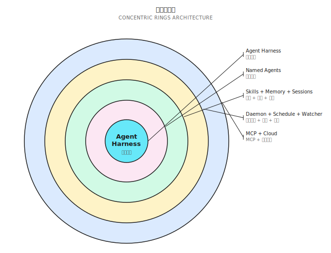
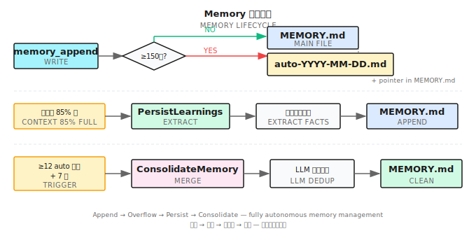

# 第 33 章：Building on the Harness — ShanClaw

> **一个只能跑一个 Agent、一个 Session 的 Harness 是原型。一个能运行多个 Agent、跨 Session 记忆、服务多渠道的，才是平台。**

---

> **⏱️ 快速通道**（5 分钟掌握核心）
>
> 1. ShanClaw = 第 32 章的 Harness + 平台层（Named Agents、Skills、Memory、Daemon、MCP）
> 2. 同心环模型：谁在运行（Agents）→ 它们知道什么（Skills/Memory/Sessions）→ 何时何地运行（Daemon/Scheduler/Watcher）→ 如何连接（MCP/Cloud）
> 3. Named Agents = 每个 Agent 独立配置（模型、工具、MCP 服务器、Skills、Memory）
> 4. Memory = 有界追加 + 自动溢出 + LLM 驱动的 GC
> 5. Daemon 模式 = Agent 即服务，多源路由（Slack/LINE/webhook）
> 6. MCP = 生态互操作（消费者 + 生产者）；Cloud Delegation = 本地↔远程协作
>
> **10 分钟路径**：33.1 → 33.2 → 33.4 → 33.6 → Shan Lab

---

## 33.1 从 Harness 到平台

第 32 章展示了 Agent Harness 的骨架：一个 `for` 循环驱动 LLM 调用 → 工具执行 → 上下文追加 → 循环检测。这个循环跑起来后，你有了一个能自主执行任务的本地 Agent。

但这个 Agent 有三个硬限制：

1. **单人格**：一个系统提示、一套工具配置。要做代码审查和做文献调研，只能手动切换。
2. **单 Session 无记忆**：每次启动都是白纸。上周的发现、昨天的约定，全部丢失。
3. **单用户 CLI**：只有终端前面的人能触发它。Slack 来了一条消息？它不知道。

问题是：**在这个循环之上，需要构建什么才能成为真正的产品？**

答案是四层同心环：



- **Ring 1**：Named Agents — 谁在运行
- **Ring 2**：Skills / Memory / Sessions — 它们知道什么
- **Ring 3**：Daemon / Scheduler / Watcher — 何时何地运行
- **Ring 4**：MCP / Cloud — 如何连接外部

每一层都是对内层的扩展，不替换内层。Ring 1 里的 Named Agents 仍然运行第 32 章的 Harness 循环；Ring 3 里的 Daemon 仍然用 Ring 1 的 Named Agents 来处理每条消息。同心环是叠加，不是重建。

本章用 ShanClaw（开源）作为参考实现，逐层展开。所有代码来自：https://github.com/Kocoro-lab/ShanClaw

---

## 33.2 Named Agents：一个 Harness，多个人格（Ring 1）

第 32 章的 Harness 跑的是一个匿名 Agent——启动时加载默认配置，结束时什么也不留。Named Agents 的核心思想是：**一个二进制文件，多个人格**。

### 目录结构

每个 Named Agent 有独立的文件目录：

```
~/.shannon/agents/
├── code-reviewer/
│   ├── AGENT.md            # 系统提示（等价于 CLAUDE.md）
│   ├── config.yaml         # 模型、工具、MCP、迭代上限
│   ├── MEMORY.md           # 持久记忆
│   ├── commands/           # Agent 专属 Skills
│   │   └── review.md
│   └── _attached.yaml      # 附加文件列表
├── research/
│   ├── AGENT.md
│   ├── config.yaml
│   ├── MEMORY.md
│   └── commands/
│       └── deep-dive.md
└── ops-bot/
    ├── AGENT.md
    ├── config.yaml
    └── MEMORY.md
```

### 配置差异

不同 Agent 的 `config.yaml` 差异巨大：

```yaml
# code-reviewer/config.yaml
model: claude-sonnet-4-20250514
max_iterations: 30
tools:
  allowed: ["bash", "file_read", "file_edit", "grep", "glob"]
  denied: ["file_write", "http"]     # 审查者不需要写文件或发请求
mcp_servers: []
auto_approve: false

# research/config.yaml
model: claude-opus-4-20250514
max_iterations: 80
tools:
  allowed: ["bash", "http", "file_write", "file_read"]
  denied: ["file_edit"]              # 研究者不改代码
mcp_servers:
  - name: "playwright"
    command: "npx"
    args: ["@anthropic-ai/mcp-playwright"]
auto_approve: true                   # 信任的后台 Agent
```

同一个 Harness 循环，两套完全不同的大脑。

关键配置字段说明：
- `model`：Agent 使用的 LLM 模型。研究型任务用高推理能力的模型，代码审查用快速模型，成本和延迟差异可达 10 倍
- `max_iterations`：Harness 循环的最大迭代次数。GUI 密集型和研究型任务需要更多步骤
- `tools.allowed / denied`：工具白名单和黑名单。**最小权限原则**——Agent 只拿到它需要的工具
- `auto_approve`：跳过权限引擎的层 5（用户审批提示），但硬封锁和 `denied_commands` 仍然生效。只给完全信任的后台 Agent 开启

### SwitchAgent：运行时切换

`SwitchAgent` 是核心操作——在运行时将 Harness 从一个 Agent 切换到另一个：

```
SwitchAgent("research")
├── 加载 research/AGENT.md → 替换系统提示
├── 加载 research/config.yaml → 替换模型、迭代上限
├── 加载 research/MEMORY.md → 注入持久记忆
├── 重建工具注册表 → 只注册 allowed 列表中的工具
├── 连接 MCP 服务器 → 启动 playwright
└── 加载 research/commands/ → 注册 Agent 专属 Skills
```

**同一个循环，不同的大脑。** 循环本身（三阶段执行、权限引擎、循环检测）完全不变。


### 隔离原则

Named Agents 之间严格隔离：

- **Session 隔离**：每个 Agent 维护自己的会话历史
- **Memory 隔离**：各自的 MEMORY.md，互不可见
- **MCP 隔离**：Agent A 的 MCP 服务器不会出现在 Agent B 的工具列表
- **审批隔离**：`auto_approve: true` 的 Agent 不会影响其他 Agent 的审批策略

一个 Harness 二进制文件，通过 Named Agents 变成了一个 Agent 团队的运行时。

### 配置合并策略

Agent 配置不是孤立的——它和全局配置（`~/.shannon/config.yaml`）存在合并关系：

```
全局 config.yaml          Agent config.yaml         最终生效
├── model: haiku     ←── model: opus          →   opus（Agent 覆盖）
├── max_iterations: 50 ← （未指定）            →   50（继承全局）
├── tools.denied: [http] ← tools.denied: []   →   []（Agent 覆盖）
└── mcp_servers: [fs]  ← mcp_servers: [pw]    →   [fs(_inherit), pw]
```

规则：Agent 级配置覆盖全局配置，但 `_inherit: true` 的全局 MCP 服务器始终保留。这让管理员可以强制所有 Agent 共享某些基础设施工具。

---

## 33.3 Skills：可热插拔的能力模块（Ring 2a）

Skills 是 Named Agents 的能力扩展机制。不是硬编码在代码里的功能，而是可以随时添加、删除、替换的 Markdown 文件。

### SKILL.md 格式

每个 Skill 是一个带 YAML frontmatter 的 Markdown 文件：

```markdown
---
name: "code-review"
description: "审查代码变更，检查风格、安全和性能问题"
allowed_tools: ["bash", "file_read", "grep", "glob"]
metadata:
  category: "development"
  version: "1.0"
---

# Code Review Skill

当用户要求审查代码时，按以下步骤执行：

1. 运行 `git diff` 查看变更
2. 逐文件审查，关注：
   - 安全漏洞（SQL 注入、XSS、硬编码密钥）
   - 性能问题（N+1 查询、不必要的循环）
   - 代码风格（命名、结构、注释）
3. 输出结构化报告

## 参考脚本

运行 `scripts/lint-check.sh` 获取静态分析结果。
```

### 三级优先级

Skills 从三个位置加载，优先级从高到低：

| 级别 | 位置 | 说明 |
|------|------|------|
| Agent 专属 | `~/.shannon/agents/<name>/commands/*.md` | 只有该 Agent 可用 |
| 全局共享 | `~/.shannon/skills/*.md` | 所有 Agent 共享 |
| 内置 | 二进制内嵌 | ShanClaw 自带的默认 Skills |

同名 Skill，高优先级覆盖低优先级。

### 暴露方式

Skills 以两种方式对 LLM 可见：

1. **系统提示中的目录表**：所有可用 Skills 的名称和描述，注入到系统提示末尾
2. **`use_skill` 工具**：LLM 调用此工具时，对应 Skill 的完整内容被注入到对话上下文

这个设计的意义：**Skills 不是提前全部加载的**。只有 LLM 主动选择使用某个 Skill 时，才注入其完整内容。这节省了系统提示的 Token 预算。

### Skill 与 System Prompt 的关系

Skills 和 AGENT.md 的区别是：AGENT.md 定义 Agent 的身份和通用行为准则（"你是一个代码审查专家"），Skills 定义具体的操作流程（"审查代码时按这 3 步执行"）。

AGENT.md 在 Agent 启动时就注入系统提示。Skills 只在被 `use_skill` 调用时才注入——这是**延迟加载**。一个 Agent 可能配置了 20 个 Skills，但单次会话只用到 2-3 个，节省了大量 Token。

### 路径重写

Skill 文件里引用的相对路径（`scripts/lint-check.sh`、`references/style-guide.md`）会被自动重写为绝对路径——基于 Skill 文件所在目录。这让 Skill 可以打包为自包含的目录，复制到任何位置都能正常工作。

---

## 33.4 Memory：跨 Session 持久化（Ring 2b）

Memory 解决的是 Agent 的"金鱼记忆"问题——每次会话结束，所有发现、决策、偏好都消失。

### `memory_append` 工具

Agent 在会话中发现了重要信息（项目约定、用户偏好、关键决策），可以调用 `memory_append` 写入 MEMORY.md：

```
memory_append(content="用户偏好：Go 项目使用 slog 而非 logrus")
```

写入操作用 `flock` 文件锁保护——多个 Session 可能并发写入同一个 Agent 的 MEMORY.md。

### 有界追加（Bounded Append）

MEMORY.md 不是无限增长的。ShanClaw 设定了 150 行上限：

```
写入请求到达
     │
     ▼
当前行数 + 新内容行数 ≤ 150？
     ├── 是 → 直接追加到 MEMORY.md 尾部
     └── 否 → 溢出流程
              ├── 将溢出的新内容写入 auto-YYYY-MM-DD-<hex>.md 详情文件
              ├── 在现有 MEMORY.md 尾部追加指针行：
              │   "- [2025-03-28] See [auto-2025-03-28-a1b2.md](auto-2025-03-28-a1b2.md) for details"
              └── MEMORY.md 本体不重命名、不清空，持续积累指针行
```

溢出文件带时间戳和 6 字符随机后缀，避免冲突。MEMORY.md 尾部的指针行告诉 Agent：**还有更多记忆，在详情文件里**。



### Write-Before-Compact（先保存再压缩）

第 32 章提到，长任务会触发上下文压缩——用摘要替换中间历史。但压缩会丢失细节。

ShanClaw 在每次压缩之前，先用一个小模型（通常是 Haiku）扫描即将被压缩的上下文，提取持久性事实：

```
PersistLearnings 流程：
1. 将即将被压缩的对话片段发送给小模型
2. 提示：提取用户偏好、项目约定、关键发现、待办事项
3. 小模型返回结构化事实列表
4. 调用 memory_append 写入 MEMORY.md
5. 然后执行正常的上下文压缩
```

这确保了"忘记之前先保存"——压缩丢失的细节，至少关键部分已经持久化了。

为什么用小模型？因为 PersistLearnings 在每次压缩时都会触发，频率可能很高。用主模型（如 Opus）做这件事，成本和延迟都不合理。小模型（如 Haiku）在"从对话中提取事实"这类简单任务上表现足够好，且延迟低、成本低。

### ConsolidateMemory（记忆整合）

溢出文件会不断积累。ShanClaw 用 LLM 驱动的 GC（垃圾回收）来整理它们：

```
触发条件：auto-*.md 文件 ≥ 12 个 且 距上次整合 ≥ 7 天（通过 .memory_gc 标记文件追踪）

ConsolidateMemory 流程：
1. 读取所有 auto-*.md 文件
2. 读取当前 MEMORY.md
3. 调用 LLM：合并、去重、删除过时信息
4. 保留用户手动编写的记忆条目（带 [user] 标记的不删除）
5. 将合并结果写回 MEMORY.md
6. 删除已合并的 auto-*.md 文件
```

这不是简单的文件拼接——LLM 会理解语义，去除重复（"用户偏好 slog"出现 5 次，合并为 1 次），删除已失效的临时信息（"明天要开会"——如果日期已过，删除）。

### Memory 的完整生命周期

把上面三个机制串起来：

```
会话进行中
├── Agent 发现重要信息 → memory_append 写入 MEMORY.md
├── 上下文快满了 → PersistLearnings 提取事实 → memory_append
│                   → 然后压缩上下文
├── MEMORY.md 超 150 行 → BoundedAppend 溢出到 auto-*.md
└── auto-*.md 积累 ≥12 个且 ≥7 天 → ConsolidateMemory 合并整理

下次会话启动
└── 加载 MEMORY.md 到系统提示 → Agent 记得上次的关键信息
```

这个循环确保了：**短期发现被及时保存，长期记忆被定期整理，每次启动都带着上下文**。

---

## 33.5 Session Search：可查询的历史（Ring 2c）

Memory 保存的是提炼后的知识。但有时 Agent 需要查的是原始对话——"上周四我让你分析那个性能问题，结论是什么？"

### 持久化格式

每个 Session 结束时，完整对话以 JSON 格式持久化：

```json
{
  "session_id": "sess_20250328_a1b2c3",
  "agent": "code-reviewer",
  "started_at": "2025-03-28T10:30:00Z",
  "messages": [...],
  "tool_calls": [...],
  "summary": "审查了 auth 模块的 PR #42，发现 3 个安全问题"
}
```

### FTS5 索引

持久化的同时，关键字段被索引到 SQLite FTS5 全文搜索引擎：

- 会话摘要
- 用户消息内容
- Agent 最终回复
- 工具调用的命令和输出（截断到合理长度）

### `session_search` 工具

Agent 可以搜索自己的历史会话：

```
session_search(query="性能分析 auth 模块")
```

返回匹配的会话摘要列表，按相关度排序。Agent 可以进一步读取特定会话的完整内容。

### 为什么是 FTS5 而不是 grep？

| 维度 | 文件 grep | SQLite FTS5 |
|------|-----------|-------------|
| 搜索速度 | O(n) 全文件扫描 | O(log n) 倒排索引 |
| 模糊匹配 | 正则，手动 | 自动分词、前缀匹配 |
| 跨文件 | 需要 glob + grep 组合 | 单条 SQL 查询 |
| 结构化过滤 | 困难 | WHERE agent = 'code-reviewer' AND date > '2025-03' |

当会话数量超过几百个，FTS5 的优势变得明显。

### 调度执行索引

定时任务（33.7）和心跳检查（33.8）的执行结果也被索引到 Session Search。这意味着 Agent 可以查询"上周五的 CI 检查发现了什么"或"最近 3 次心跳检查有没有异常"。

自动化执行产生的会话标记了 `source: schedule` 或 `source: heartbeat`，可以按来源过滤。

### 隔离

Session Search 遵循 Named Agent 隔离原则：每个 Agent 只能搜索自己的会话历史。`code-reviewer` 看不到 `research` 的会话。

---

## 33.6 Daemon 模式：Agent 即服务（Ring 3a）

到目前为止，所有功能都假设一个前提：有人在终端前面运行 `shan`。Daemon 模式打破这个假设——**Agent 变成一个长驻服务**。

### 架构

```
shan --daemon
     │
     ├── WebSocket 服务 (localhost:port)
     │   └── 双向通信：消息输入 + 流式输出
     ├── HTTP API (localhost:port)
     │   └── RESTful 接口：创建会话、发送消息、查询状态
     └── SSE EventBus
         └── 实时事件流：工具调用、审批请求、状态变更
```


### 多源路由

Daemon 的核心能力是**多源路由**——来自不同渠道的消息路由到同一个 Harness：

```
Slack Bot ──────┐
                │
LINE Webhook ───┤
                ├──→ Daemon ──→ SessionRouter ──→ Harness
Desktop App ────┤         SessionKey = (source, channel, thread_id)
                │
HTTP API ───────┘
```

每条消息携带一个 `SessionKey`，由三部分组成：

- **source**：消息来源（slack/line/desktop/api）
- **channel**：频道或聊天 ID
- **thread_id**：线程 ID（同一频道的不同对话）

### SessionCache

Daemon 维护一个 `SessionCache`，按 SessionKey 索引：

路由键是一个格式化字符串，由 `ComputeRouteKey()` 函数计算：

```go
// 概念性伪代码——实际实现见 internal/daemon/router.go
func ComputeRouteKey(agentName, source, channel string) string {
    if agentName != "" {
        return "agent:" + agentName    // 指定 Agent 的路由
    }
    return "default:" + source + ":" + channel  // 按来源+频道路由
}

type SessionCache struct {
    mu       sync.Mutex
    routes   map[string]*routeEntry   // 键是 ComputeRouteKey 的返回值
    managers map[string]*session.Manager
}
```

同一个来源和频道的连续消息，命中同一个 `routeEntry`——对话上下文连续，不会每次都从头开始。

### ApprovalBroker

当 Agent 需要用户审批时（权限引擎层 5），Daemon 不能像 CLI 那样阻塞等待终端输入。

`ApprovalBroker` 将审批请求通过 WebSocket 推送给客户端（ShanClaw Desktop、Slack Bot），等待异步响应：

```
Agent 需要审批
     │
     ▼
ApprovalBroker.Request()
     │
     ├──→ WebSocket 推送审批请求到客户端
     ├──→ 设置超时计时器（默认 5 分钟）
     └──→ 阻塞等待
              │
              ├── 客户端批准 → 继续执行
              ├── 客户端拒绝 → 拒绝原因传回 LLM
              └── 超时 → 默认拒绝
```

### Sticky Context（粘性上下文）

不同来源的消息有不同的上下文。Daemon 在系统提示中注入来源元数据：

```
当前对话来源：Slack
频道：#ops-alerts
用户：@alice
线程：关于生产环境 CPU 告警
```

这让 Agent 知道它在和谁对话、在什么场景下——回复 Slack 告警和回复桌面端的代码审查请求，语气和策略应该不同。

### SSE EventBus（实时事件流）

Daemon 通过 Server-Sent Events（SSE）向所有连接的客户端广播实时事件：

```
EventBus 事件类型：
├── tool_call_start   — Agent 开始调用工具（工具名、参数摘要）
├── tool_call_end     — 工具执行完成（结果摘要、耗时）
├── approval_request  — 需要用户审批
├── approval_response — 用户已响应审批
├── text_delta        — LLM 流式文本片段
├── session_start     — 新会话开始
├── session_end       — 会话结束
└── error             — 错误事件
```

客户端（ShanClaw Desktop、Web UI）订阅 EventBus 后，可以实时渲染 Agent 的执行过程——用户看到的不是"等待中..."，而是 Agent 正在做什么、调用了哪个工具、结果是什么。

这和第 32 章 CLI 模式下的终端输出本质相同，只是传输层从 stdout 变成了 SSE。

---

## 33.7 定时任务：Agent 的 Cron（Ring 3b）

Agent 不只需要被动响应消息。有些任务需要定期执行——每天早上检查 CI 状态、每周生成代码质量报告、每月审查依赖更新。

### 4 个调度工具

| 工具 | 功能 |
|------|------|
| `schedule_create` | 创建定时任务 |
| `schedule_list` | 列出所有任务 |
| `schedule_update` | 修改任务配置 |
| `schedule_remove` | 删除任务 |

### 配置示例

```yaml
# 通过工具调用创建
schedule_create:
  name: "daily-ci-check"
  cron: "0 9 * * 1-5"        # 工作日早 9 点
  agent: "ops-bot"
  prompt: "检查所有项目的 CI 状态，如果有失败的构建，总结失败原因"
```

Cron 表达式使用完整语法（通过 adhocore/gronx 解析），支持 5 字段标准格式。通知路由由 Daemon 层配置处理，不在单个任务中指定。

### macOS 集成

在 macOS 上，定时任务不用 crontab——ShanClaw 生成 `launchd` plist 文件并通过 `launchctl` 注册：

```xml
<!-- ~/Library/LaunchAgents/com.shannon.schedule.daily-ci-check.plist -->
<plist version="1.0">
<dict>
    <key>Label</key>
    <string>com.shannon.schedule.daily-ci-check</string>
    <key>ProgramArguments</key>
    <array>
        <string>/usr/local/bin/shan</string>
        <string>--agent</string>
        <string>ops-bot</string>
        <string>--prompt</string>
        <string>检查所有项目的 CI 状态...</string>
    </array>
    <key>StartCalendarInterval</key>
    <dict>
        <key>Hour</key><integer>9</integer>
        <key>Minute</key><integer>0</integer>
    </dict>
</dict>
</plist>
```

`launchd` 比 crontab 更可靠——系统休眠唤醒后会补执行错过的任务。Plist 文件使用原子写入（写入临时文件 → rename）确保不会出现半写状态。

### Cloud 同步

定时任务配置可以同步到 Shannon Cloud。这意味着即使本地机器关机，Cloud 端可以接管执行（如果 Agent 的任务不依赖本地环境）。同步是单向的：本地 → Cloud。Cloud 不会反向修改本地配置。

### 执行日志

每次调度执行产生独立的日志文件，路径格式：

```
~/.shannon/schedules/<name>/logs/YYYY-MM-DD-HHmmss.log
```

包含完整的 Agent 对话记录和工具调用，方便事后审计。调度执行的 Session 也会被索引到 Session Search，Agent 可以查询"上周每天的 CI 检查结果"。

---

## 33.8 心跳 + 文件监听：主动式智能（Ring 3c）

定时任务是时间驱动的。但有些场景需要不同的触发机制。

### Heartbeat（心跳检查）

心跳是轻量级的周期性健康检查——不是"执行一个完整任务"，而是"看看有没有需要关注的事情"。

```yaml
# code-reviewer/config.yaml
heartbeat:
  every: "15m"                # 每 15 分钟
  prompt_file: "HEARTBEAT.md" # 心跳提示文件
  active_hours: "09:00-18:00" # 只在工作时间运行
  overlap_prevention: true    # 上一次未完成，跳过本次
```

`HEARTBEAT.md` 是一个检查清单：

```markdown
# 心跳检查

- [ ] 检查 `git status`，是否有未提交的变更
- [ ] 检查 `go build ./...` 是否能通过编译
- [ ] 检查 `go test ./...` 是否有失败的测试

如果一切正常，回复 HEARTBEAT_OK。
如果发现问题，描述问题并建议修复方案。
```

**Silent OK 协议**：当 Agent 回复 `HEARTBEAT_OK` 时，不产生任何通知。只有发现异常时才告警。这避免了"一切正常"的通知噪音。

### File Watcher（文件监听）

文件监听是事件驱动的——当特定文件发生变化时触发 Agent。

```yaml
# code-reviewer/config.yaml
watch:
  - path: "./src"
    glob: "*.go"
    debounce: "5s"           # 5 秒内的连续变更合并为一次触发
    prompt: "文件 {{.Files}} 发生了变更。审查变更内容，检查是否有明显问题。"
  - path: "./config"
    glob: "*.yaml"
    prompt: "配置文件 {{.Files}} 被修改。验证 YAML 语法是否正确。"
```

底层使用 `fsnotify` 递归监听目录变化，带去抖动（debounce）防止保存一次文件触发多次。

安全限制：
- 最大监听 4096 个目录
- 智能跳过列表：`.git/`、`node_modules/`、`vendor/`、`.build/`、`__pycache__/`

### 三种触发方式对比

| 维度 | Schedule（定时） | Heartbeat（心跳） | Watcher（监听） |
|------|-------------------|---------------------|-------------------|
| 触发方式 | 时间驱动（cron 表达式） | 周期驱动（固定间隔） | 事件驱动（文件变更） |
| 适用场景 | 日报、周报、定时巡检 | 持续健康检查 | 代码保存后自动审查 |
| 粒度 | 分钟级 | 分钟级 | 秒级（带去抖动） |
| 静默模式 | 否（总有输出） | 是（HEARTBEAT_OK 静默）| 否 |
| 示例 | 每天 9 点检查 CI | 每 15 分钟检查编译 | .go 文件保存后 lint |

三种方式覆盖了几乎所有自动化触发场景。

---

## 33.9 MCP 集成：生态互操作（Ring 4a）

MCP（Model Context Protocol）是 Anthropic 推动的开放协议——让 Agent 可以连接外部工具服务器，也可以把自己的工具暴露给其他系统。

ShanClaw 同时支持 MCP 的**消费者模式**和**生产者模式**。

### 消费者模式（连接外部工具）

Agent 通过 `mcp_servers` 配置连接外部 MCP 服务器：

```yaml
# research/config.yaml
mcp_servers:
  - name: "playwright"
    command: "npx"
    args: ["@anthropic-ai/mcp-playwright"]
  - name: "github"
    command: "npx"
    args: ["@modelcontextprotocol/server-github"]
    env:
      GITHUB_TOKEN: "${GITHUB_TOKEN}"
```

`ClientManager` 负责管理所有 MCP 连接：

```
ClientManager
├── 启动外部 MCP 服务器进程
├── 通过 JSON-RPC 2.0 (stdio) 发现服务器暴露的工具
├── 将外部工具注册到 Agent 的工具注册表
└── Supervisor 协程：监控连接状态，断线自动重连 + 注册表重建
```

### Agent 作用域隔离

MCP 服务器按 Agent 隔离。`research` Agent 配置的 `playwright` 不会出现在 `code-reviewer` 的工具列表中。

但有一个例外：`_inherit` 标志。全局配置中标记 `_inherit: true` 的 MCP 服务器，会被所有 Agent 继承：

```yaml
# ~/.shannon/config.yaml (全局)
mcp_servers:
  - name: "filesystem"
    command: "npx"
    args: ["@modelcontextprotocol/server-filesystem"]
    _inherit: true    # 所有 Agent 都能用
```

### Playwright 特殊处理

当 Playwright MCP 服务器被激活时，ShanClaw 自动禁用内置的旧版浏览器工具（chromedp 后端），避免两套浏览器控制工具冲突。这种"新工具激活时自动退役旧工具"的模式，让工具生态可以平滑升级。

### 生产者模式（暴露工具给外部）

```bash
shan --mcp-serve
```

这条命令让 ShanClaw 以 MCP 服务器模式启动——通过 stdio 暴露 JSON-RPC 2.0 接口，将本地工具注册表开放给外部调用者。

用例：IDE 插件、其他 Agent 框架、CI/CD 流水线，都可以通过 MCP 协议使用 ShanClaw 的工具（文件操作、bash 执行、浏览器控制等），无需自己实现。


消费者模式让 ShanClaw 接入生态；生产者模式让 ShanClaw 成为生态的一部分。

### 为什么 MCP 重要？

没有 MCP 之前，每个 Agent 框架都要自己实现工具集成——写 GitHub API 封装、写浏览器控制、写文件系统操作。这是大量重复工作。

MCP 把工具变成了可互换的模块：一个 MCP 服务器（比如 `@modelcontextprotocol/server-github`）可以被 ShanClaw、Claude Code、或任何支持 MCP 的框架使用。反过来，ShanClaw 的本地工具通过 `--mcp-serve` 模式暴露后，也可以被其他框架复用。

这和 Unix 哲学一致：**做好一件事，通过标准接口组合**。MCP 就是 Agent 工具的标准接口。

---

## 33.10 Cloud Delegation：本地遇上远程（Ring 4b）

有些任务超出本地 Agent 的能力范围——需要多个 Agent 协作、需要长时间运行、需要更强的模型。`cloud_delegate` 工具把这些任务委派给 Shannon Cloud。

### 工作流程

```
本地 Agent 判断任务超出本地能力
     │
     ▼
cloud_delegate(
  task: "对比 React、Vue、Svelte 的 SSR 性能",
  workflow: "research"
)
     │
     ▼
Shannon Cloud 接收任务
├── 分配 Agent 团队（research workflow = 多 Agent 调研）
├── 执行任务（可能跑数分钟到数小时）
└── 流式返回进度事件
     │
     ▼
本地 Agent 接收结果，继续本地流程
```


### 三种工作流类型

| 类型 | 说明 | 适用场景 |
|------|------|----------|
| `research` | 多 Agent 深度调研 | 技术对比、文献综述 |
| `swarm` | Lead Agent 协调动态子 Agent（researcher、coder、analyst），共享工作区 | 复杂调研、大规模代码迁移 |
| `auto` | 路由到固定 DAG 计划，适合有明确子任务依赖的结构化任务 | 默认选项，不确定用哪种时 |

### 安全约束

- **Once-per-turn lock**：每轮 LLM 调用最多触发一次 `cloud_delegate`，防止 Agent 连续委派导致失控
- **Cloud result bypass**：Cloud 返回的结果直接作为工具结果追加到上下文，不经过权限引擎——因为执行已经在 Cloud 端完成
- **Cloud struggle detection**：如果 Cloud 连续返回错误或超时，本地 Agent 收到提示"Cloud 执行遇到困难，请考虑本地替代方案"

### 流式进度

Cloud 任务可能运行数分钟甚至数小时。本地 Agent 不会阻塞等待——它通过事件回调接收进度更新：

```
Cloud 执行中...
├── [00:05] 已分配 3 个 Agent
├── [00:30] Agent-1 完成 React SSR 基准测试
├── [01:15] Agent-2 完成 Vue SSR 基准测试
├── [02:00] Agent-3 完成 Svelte SSR 基准测试
├── [02:30] 汇总 Agent 正在合并结果
└── [03:00] 完成，返回最终报告
```

这些进度事件通过 EventBus 推送给客户端，用户能实时看到 Cloud 端的执行状态。

Cloud Delegation 不是"把活儿甩出去"。它是本地和远程的分工协作——本地处理需要本地环境的操作，Cloud 处理需要规模化的任务。

---

## Shan Lab（10 分钟上手）

本章对应 ShanClaw 开源项目。代码在 [https://github.com/Kocoro-lab/ShanClaw](https://github.com/Kocoro-lab/ShanClaw)。

### 必读（3 个文件）

- [`internal/agent/loop.go`](https://github.com/Kocoro-lab/ShanClaw/blob/main/internal/agent/loop.go) — Agent Harness 核心循环、SwitchAgent 实现、Named Agent 配置合并逻辑、工具注册表作用域隔离。重点看：Agent 切换时哪些状态被替换、哪些被保留

- [`internal/context/persist.go`](https://github.com/Kocoro-lab/ShanClaw/blob/main/internal/context/persist.go) — BoundedAppend 溢出逻辑、ConsolidateMemory GC 流程、Write-Before-Compact 调用链。重点看：150 行阈值判断和 flock 并发保护

- [`internal/daemon/server.go`](https://github.com/Kocoro-lab/ShanClaw/blob/main/internal/daemon/server.go) + [`router.go`](https://github.com/Kocoro-lab/ShanClaw/blob/main/internal/daemon/router.go) — 多源路由实现、SessionCache/ComputeRouteKey 生命周期、ApprovalBroker WebSocket 推送。重点看：消息从到达到路由到 Agent 的完整链路

### 选读深挖（3 个文件）

- [`internal/mcp/client.go`](https://github.com/Kocoro-lab/ShanClaw/blob/main/internal/mcp/client.go) — ClientManager 连接管理、Supervisor 断线重连、Playwright 特殊处理逻辑

- [`internal/schedule/schedule.go`](https://github.com/Kocoro-lab/ShanClaw/blob/main/internal/schedule/schedule.go) — cron 表达式解析（gronx）、launchd plist 生成、原子文件写入

- [`internal/session/index.go`](https://github.com/Kocoro-lab/ShanClaw/blob/main/internal/session/index.go) — FTS5 索引构建、搜索查询优化、Session 持久化格式

---

## 划重点

从 Harness 到平台，核心是四层同心环的叠加。

要点：

1. **Named Agents 让一个 Harness 变成多个人格**——同一循环，不同大脑
2. **Skills 是可热插拔的能力模块**，而不是硬编码的功能
3. **Memory 有界、自动溢出、自我整合**——"忘记之前先保存"
4. **Daemon 模式 + 多源路由把 CLI 变成服务**
5. **三种触发类型覆盖所有自动化需求**：定时（schedule）、健康检查（heartbeat）、事件驱动（watcher）
6. **MCP 让 Harness 既是工具生态的消费者，也是生产者**

第 32 章展示了 Harness。这一章展示了平台。接下来的附录提供快速参考资料。
